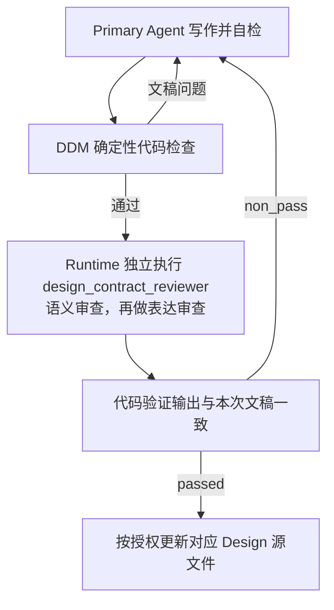

# Design 文档编写

## 0. AI-facing Authoring Rules

<!-- embedded-resource:soul:bestpractice_ai_facing_writing:start -->
## 核心原则

### 原则一：先明确结果要求，再确定必要方法（结果确定性优先于过程确定性）

AI 开始写作前，应明确文稿要完成什么、服务什么读者，以及怎样判断内容已经正确、充分、可用。依据这些结果要求，确定需要交代的内容和采用的写作方法。

写作任务至少应明确四件事：

1. **目标**：文稿用于什么，读者需要从中获得什么理解、判断或执行能力。
2. **验收依据**：哪些要求决定文稿是否正确、充分并符合用途，如何核对这些要求。
3. **依据与方法**：使用哪些材料、知识和工具，哪些步骤或先后关系会影响结果。
4. **交付要求**：文稿需要达到什么深度，采用什么形式；已有明确的格式、路径或 schema 要求时，遵守相应要求。

凡步骤、顺序、工具或执行身份会影响正确性、授权边界或证据有效性的要求，应明确规定。例如，独立审核需要针对准确候选执行，审核结论需要与该候选对应。

其余方法由 AI 根据任务选择。步骤式指导、例子和经验，只要能帮助完成任务，就可以保留；避免强制执行与结果无关的过程，也避免只给目标而缺少必要方法。

### 原则二：支持 AI 自主判断，排斥 SOP

AI 具备推理能力。它的上下文容量有限。写入的内容应帮助它完成任务，减少无效的注意力消耗。

方法指导应提供建议和约束，保留 AI 选择执行路径的空间。避免将指导写成固定的标准操作流程（SOP）。

例如，市场分析可以按行业板块组织。如果当天的市场变化主要由一个宏观冲击驱动，AI 应能够选择全局分析。

已知陷阱应当写清楚。AI 可能无法仅凭当前上下文识别这些问题。真实的失败经验通常比泛泛的建议更有用。

保留一段内容前，检查两点：

1. 删除它是否会降低任务质量或成功率。
2. 它是在说明预期结果，还是在规定操作方法。

**优先保留预期结果的说明。操作方法只有在确实能提高任务成功率时才保留。**

---

### 原则三：先写清 AI-facing 文档的契约，再压缩表达

Skill 是 AI 执行任务时使用的契约文档。写作应先保证执行所需的信息完整，再优化篇幅和版面。

这条原则适用于主要供 AI 使用的稳定文档，包括顶层设计文档、路由文档、规则、公理和入口文档，如 `CLAUDE.md`、`AGENTS.md`。

#### 必须回答的六个问题

编写或评审任何 AI-facing 文档时，先确保文档能直接回答以下问题：

1. **这一层负责什么？** 说明这一层的用途。
2. **什么时候进入这一层？** 说明进入条件和触发信号。
3. **进入后先读什么？** 明确应优先遵循的权威依据（first authority），以及承载当前事实的来源（truth surface）。
4. **应该产出什么？** 说明输出形式，以及读者读完后应能理解、判断或完成什么（reader-end-state）。
5. **怎样与相邻层交接？** 说明上游期望什么、下游使用什么，以及失败时如何回退。
6. **哪些相邻概念容易混淆？** 说明它们的区别，以及什么时候应使用其他概念或入口。

**六个问题都写清后，再考虑如何缩短和整理文档。**

#### 契约完整优先于视觉简洁

文档应让 AI 在执行时找到完整的契约。压缩篇幅或调整版面时，必须保留关键边界。

避免以下四类写法：

- **合并不同的任务主线。** 不要为了减少路由表的行数，合并不同的重复性任务主线。实际产出形式不同的主线，应各占一行。
- **混淆层级。** 明确区分任务主线（task mainline）、Skill 层、写作网关层（writer gateway layer），以及确定性构建器与数据包层（deterministic builder / package layer）。名称相近的层尤其容易被误用。
- **只靠名称表达职责。** 名称可能有多种含义。例如，`manager` 可能指角色，也可能指模块。文档应直接说明对象负责什么、不负责什么。
- **先写摘要，后补契约。** 先写清详细契约，再写摘要。

#### 检查删去一段是否影响执行

写完一段后，检查：删去这段，AI 还能完成文档规定的读者目标任务吗？

- 能完成：这段是多余内容，应删除。
- 不能完成：这段属于契约，应保留。

这项检查与 FP4（删除不影响判断的信息）及 `bestpractice_prose_without_editorial_meta.md` 中的检查互为补充。它们删除无助于判断的句子，避免无效扩写；本项检查保留执行所需的契约，避免删减造成含义不清。AI-facing 文档应同时满足这两项要求。

---

### 原则四：固定不变量，保留实现选择

结果确定性优先于过程确定性。写作时还应区分：哪些结果要求必须保持一致，哪些实现选择应留给 AI。

约束所有细节会限制 AI 自主判断。缺少必要约束，会使系统反复改变同一对象的定义和做法，失去连贯性。

**必须固定的不变量**包括：

- 产物的规范路径与命名。
- 产物的身份字段，如 `report_date`、`asset_id`、`theme_id`。
- 上游依赖的身份与新鲜度契约。
- 产出此节点的唯一规范构建器（canonical builder）。不允许第二条产出路径。
- 与相邻 Skill、构建器和写作器的接口形式。

**应留给 AI 选择的内容**包括：

- 正文的具体写法。
- 判断路径与取舍。
- 中间过程的组织方式。
- 哪些证据需要重点展开，哪些只需简述。

写作时应明确区分这两类要求。固定不变量，使系统保持连贯，产物可以追踪，并能跨任务复用。保留实现选择，使 AI 能根据当前上下文作出合适判断。

如果文档只规定正文结构和写作步骤，却没有写清不变量，就会同时限制 AI 的判断空间，并允许产物偏离约定。

检查每条要求：

- 它属于不变量，还是实现细节？
- 如果属于实现细节，能否写成建议和失败信号，保留 AI 的选择空间？
- 不变量是否足以防止系统偏移，同时数量少到 AI 能记住和使用？

### 原则五：同时写清禁止事项和违规特征

仅写“不要做什么”，依赖 AI 主动注意并遵守禁令。AI 绕过禁令后，产物仍可能看似合格，禁令本身无法帮助它发现问题。

每条关键边界都应同时说明两件事：

- **禁止事项**：哪些行为或结果不被允许。
- **违规特征**：发生违规后，可以观察到什么。

例如，数据更新边界可以写成：

- **禁止事项**：数据更新完成前，不得编写投资经理（PM）报告。
- **违规特征**：已经产出报告，却没有确认 `daily_update_status.json` 中的 `blocking == false`。报告本身可能看不出问题，但上游数据的新鲜度要求尚未满足，需要通过后续复盘发现。

主题补充分析的边界可以写成：

- **禁止事项**：主题补充分析（theme overlay）不得替代任务的首要依据（first authority）。
- **违规特征**：报告的核心论述采用主题的一般结论，取代了对当前股票或当前市场的分析。读者据此判断主题，判断对象偏离了当前股票或市场。

描述违规特征时，尽量做到：

- 给出 AI 能在产出后检查的可观察特征。
- 指出缺少哪类证据或使用了哪个错误的依据来源（truth surface），不要只说“读起来不对”。
- 如果问题只能在后续环节发现，明确指出哪个环节能够发现。

这样，AI 在自主选择路径后，仍能检查自己是否越过边界。可观察的违规特征有助于发现仅凭禁令容易遗漏的偏差。

### 原则六：按陌生读者的理解顺序组织概念

执行者通常没有参与作者当时的讨论。写作顺序必须从读者已有的知识出发，使每个新概念只依赖读者已经知道、或前文已经说明的对象、任务与边界。

先明确读者的起点和目标：

- **读者起点**：进入时已经知道哪些对象、字段、工具和上游事实。
- **读者目标状态**：读完后能判断何时进入、应优先信任什么、需要产出什么、何时完成，以及何时停止或提交给有权处理的人。

引入新概念时，优先按以下顺序说明：

1. 当前对象、任务或可观察问题是什么。
2. 它与相邻对象、正常路径或读者已有认知有何关键差异。
3. 这项差异会改变什么执行、判断或交接。
4. 最后给出需要长期复用的正式名称。

Schema、协议对象或法律术语可以先定义，以保证精确。定义首次出现时，应同时说明其通俗含义、适用任务或操作影响，让读者能够理解这个名称的作用。

解释性段落应让陌生读者理解三件事：正在描述什么、为什么需要这样规定、会改变什么。纯字段表、枚举、代码块和引用块无需逐项回答这三个问题，但前后必须有足够的用途说明。

交付前统一检查是否存在缺陷。以下任一问题回答“是”，都必须修改或记录为审核发现（finding）：

- 是否在说明任务或对象前引入抽象术语，迫使读者暂存尚未理解的名称？
- 是否有解释性段落无法让读者理解正在说什么、为什么需要，以及会改变什么？
- 是否存在机械编号、教科书式口吻或不自然的概念堆叠？
- 是否在过短的篇幅内引入过多独立概念？
- 是否存在段落间的契约缺口或推理断层？
- 改写是否改变了权威来源中的数字、身份、权限、因果方向、不确定性、兼容性或停止条件？

最后一项检查保护原意。作者只能改善表达的可理解性。若更自然的措辞会改变权威来源的含义，应保留原意，或交由该内容的负责人决定；不得借润色重写契约。

---

<!-- embedded-resource:soul:bestpractice_ai_facing_writing:end -->

## 1. Task

Primary Agent 使用本 Skill，编写或修订一份 Charter、T0、T1 或 T2 正式设计文档，使读者能够理解
本层要建设或改变的功能、承担动作的主体及交付结果，作出判断并继续实施。输入是已授权的文稿编写或修订请求，也可以是现有计划中的文档
编写步骤。复杂工作需要拆分或确定依赖时使用 System Change；范围、负责人和文稿目标已经明确时，
直接开始写作。

本 Skill Package 携带独立 `design_contract_reviewer` 的 prompt、schema、fixtures 和 registration source。
它是 Design 语义审查的指定 Runtime Module。Primary Agent 负责写作、自检和组织调用；Reviewer 以
独立执行身份判断文稿。写作结束、独立审查和更新源文件是明确的工作步骤，不是文档生命周期状态。

## 2. Reader Gain

读完后，Primary Agent 能判断应在哪一层表达设计，找到需要遵守的依据，写清目标、职责、输入输出
和完成条件；能调用适用的代码检查与指定 Reviewer，并根据证据修订，最后更新正确的 Design 源文件。
读者不必从聊天历史猜测方法，也不必为普通设计写作先建立治理数据库。

## 3. Entry and Exit

进入时明确本次文稿目标、修改范围、目标层级、负责人，以及要编辑的准确源文件。已有文档的修订还需
取得当前内容和需要保留的含义。输入不够时指出缺什么；职责或产品取舍未定时交给用户或相应负责人。
可先讨论和形成建议，但不能把未决定的取舍写成已确认的要求。

请求若实际是在改 Skill、Reviewer prompt、代码或 Runtime 配置，转给对应方法。Design 文件名、
目录或附近代码只帮助定位，不能替代对工作目标的判断。

Primary Agent 在开始写作时按授权目标、用途和处理对象识别具体项目的解决方案 T1 与技术 T2。属于这两类时，读取 `designDoc/the_project_documentation.md`，使用 `project-documentation-authoring` 完成项目内容的写作、自检和独立 `project_documentation_reviewer`，然后回到本 Skill 完成 DDM 检查和 `design_contract_reviewer`。两个方法围绕同一份正文工作。Charter、所有 T0 的新增与修订、通用治理设计及其他用途的 Design 继续本 Skill 原路径，不自动追加项目文档审核。新方法或审核入口不可用时保留文稿，并按对应方法返回缺失的资源或执行负责人，不以本 Skill 的自检替代专用独立结果。

成功退出时，交付完整文稿、适用检查和独立审查结果，以及准确的源文件更新。更新 Portable T0 源与
部署到安装投影或其他项目分开；本 Skill 不因更新源文件就宣称消费环境已经更新。

## 4. Execution Contract

### 4.1 Inputs and Authority

- 本次授权目标、范围和已有计划（如有）；计划中的当前步骤、完成条件、相关排除项与后续边界随文稿送审，不为可直接开始的请求额外要求计划。
- `designDoc/the_design_doc_management.md`：Design 结构、层级和审查规则。
- 目标文档及判断本次修改所需的父级、同级或依赖文档。改变职责划分时比较完整受影响集合；普通修订
  不自动加载全部 T0 或全部同级文档。
- 实际实现、schema 或测试结果，仅在判断实现事实或兼容性确有需要时取得。
- 当前环境的 DDM 校验入口、`design_contract_reviewer` 的 Runtime 调用入口，以及需要重新判断的历史 finding。

用户授权决定本次目标和范围，所属 Design 决定具体含义，DDM 决定文档表达规则。代码说明实际实现，
不会因为现有实现方便就取得设计权。纯工作路径与规则的修改，不要求虚构 Registry、状态或哈希字段。
校验或 Reviewer 调用入口缺失时明确报告哪条路径不可用，不能靠相似工具冒充已完成检查或独立审核。

### 4.2 Output and Completion

产出必须让目标读者理解 User Intent、Reader Gain、本层职责、必要输入输出与完成条件，并保留
适用 Flowmap。使用 DDM 的结构要求；程序实际消费的字段遵守对应 schema，机器生成的数据交给代码。

适用项目文档方法时，先取得其专用审核的准确结果，再执行本段的 Design 审核；任一后续修订改变项目内容的重要含义时，按 Project Documentation 重新取得适用结果。保留全部含义的编辑仍使用所属合同的保真检查，不重复要求独立审批。

重要设计含义改变时，代码检查通过后必须取得 `design_contract_reviewer` 对本次完整文稿的独立结果。
Primary Agent 核对证据、处理实际缺陷，在既有授权内把通过审查的内容写回准确源文件。纯编辑修正与
未改内容的机械复制按 DDM 的对应范围处理，不冒充本轮取得了新的语义审查。

提供给 Reviewer 的结果包括完整文稿、授权目标、修改范围、必要背景和实际确定性检查证据。候选与
背景明确分开。哈希与调用元数据由代码记录；本 Skill 不手工填造。

## 5. Boundaries

| 边界 | 可观察的越界 |
| --- | --- |
| 所属 Design 决定目标，Skill 提供写作方法 | 作者从现有代码或 Reviewer 建议反推新产品要求 |
| 内容保持在本层 | Charter 承载操作流程，T0 复制下层实现，或 T2 接管其他领域职责 |
| 合理下层选择由下一层决定 | 为了声称“完整”而补入本层没有需要的状态、接口或错误码 |
| 自检与独立审查分开 | 作者自行写 `passed`，或者只读 Reviewer prompt 就声称完成外审 |
| 源文件更新与部署分开 | 手改安装投影，或把源文件更新说成其他项目已部署 |
| 问题按证据处理 | 因 note 增加未授权机制，或忽略有证据的实际缺陷 |

Reviewer source 存放在本包不产生作者自审。独立调用使用 `design_contract_reviewer`；若它不可用，
返回 Runtime 调用路径的负责人处理。Reviewer prompt 的修改另用 `the-review-authoring`，不混入普通
Design 编写；Runtime registration 和部署也不由本 Skill 顺带完成。

## 6. Method

### 6.1 按层级确定内容

<!-- embedded-resource:t0:design_layer_semantics:start -->
所有 Design Doc 都明确 `User Intent` 和 `Reader Gain`。前者说明为什么需要这份设计，后者说明谁读完
后能作出什么判断或完成什么工作。正文以中文为主体；已有标识符、代码符号和引用保留准确名称。

设计围绕本层实际要建设、维护或改变的对象展开。每项主要功能或职责应使读者识别：哪个主体，在什么
情境下，对哪个对象执行什么动作，产生什么结果，以及谁使用这个结果。设计对象是所讨论的系统、组件
或能力；执行主体是承担动作的组件、服务、Agent 或人，文档负责人不自动等于执行主体。主体与对象的
精度应足以区分本层实际涉及的职责，沿用已有名称；新增对象应说明其用途，不能仅靠命名补足设计。

交付结果可以是可用功能、对象的改变、判断或供指定读者使用的材料，不要求另建文件或运行记录。
职责边界说明具体动作由谁完成，以及何种结果交给谁继续处理；仅列领域名称、负责人或“协调、治理、
支持、维护”等职责词，不代表功能已经定义。上述内容可以在连贯正文中表达，无需新增固定句式或表格。

| Layer | 本层必须决定什么 | 留给下一层或其他负责人什么 |
| --- | --- | --- |
| Charter | 项目目的、产品范围、人类决策权与宪制边界 | 日常操作、具体接口、运行配置和当前清单 |
| T0 | 多个独立下层共同遵守的规则，明确适用主体、对象、条件及对动作和交接的影响 | 项目流程、具体实现、运行记录和其他 T0 的内部规定 |
| T1 | 一个领域或独立子系统的主要使用情境与功能，承担功能的组成部分，以及它们如何协作交付结果 | 有界能力的内部实现，以及同级领域内部事务 |
| T2 | 一项有界能力中，主体如何处理输入对象、产生输出或改变，关键条件、必要接口及与 code truth 的交界 | 不影响已定行为的内部算法和类组织、其他领域的决定和重复维护的当前代码清单 |

各层先写明确结果，再写实现该结果真正需要的规则。State、transaction、replay、rollback、Schema、
Registry 和 Validator 按实际能力使用；没有需要时无需创造机制或填写占位合同。
下一层可以自行作出的合理设计选择，不构成上一层的缺陷。完整性要求本层已决定足以支持当前结果的
功能、工作方式与必要取舍，不要求同时交付下一层设计、实现或部署。读者可以继续选择内部实现，
但不应重新猜测本层要提供什么功能、谁处理什么对象或交付什么结果。项目提案说明选定的改动对象、
方案和理由；交付设计说明改后功能、承担动作的组成部分及验收结果。它们按实际请求提供，不成为每份
Design 必备的额外产物。本层尚未决定且会使下游无法继续的缺口仍需解决；缺少授权取舍时明确提出建议，
交有权决定的人处理，不能把假设写成已确认要求。

设计实际涉及时间含义时读取 `the_timestamp_semantic.md`；涉及机器标识或引用含义时读取
`the_identifier_and_reference_semantics.md`。仅在普通文字中提及日期或 ID 不触发额外设计要求。
<!-- embedded-resource:t0:design_layer_semantics:end -->

本段提到的 T0 文档从当前环境 `designDoc/` 中的对应文件读取。

具体标题与顺序使用 DDM §6.2 的结构表，必要时由当前 DDM schema 和 validator 提供机械检查。
每个标题内写它真正负责的内容，避免在 Capsule、正文、边界表中重复一整套描述。

### 6.2 从场景推导本层设计

围绕本次实际要建设、维护或改变的对象形成设计，再用第 6.1 节确定需要写到的精度。职责划分来自
完成这些功能所需的动作，不能用一组领域名称代替具体设计。

1. **还原对象和使用情境。** 从请求指出的系统、组件或能力开始，结合现有 Design 和实际依据，
   说明谁遇到了什么问题、希望该对象提供什么功能。修订时分清已有能力、需要保留和需要改变的
   部分；新建时说明拟建功能，不能假称已存在。直接相关的父级约束与相邻能力用于判断方案，
   不先编一份角色分类再把需求塞入其中。
2. **作出本层功能和交付决定。** 沿具体情境说明哪个主体对什么对象做什么、依据什么条件作出
   关键选择、产生什么可用结果。涉及多个部分时说明如何协作完成该功能，以及交接后接收方继续
   什么工作。对会改变结果的输入不足或失败说明相应动作。修订既有系统时说明所选改动及理由；
   请求需要项目提案或交付设计时，把它写成针对该对象的方案和可验收功能，而不只列下一步名称。
   必须由用户决定的产品取舍按第 3 节提出明确建议，不能默认为已批准。
3. **用文稿检验交付是否明确。** 不依赖聊天，沿相同情境推导下游应做的动作和取得的结果。
   如果“维护、支持、协调”仍可能被解释成实质不同的功能，补明主体、对象或动作；若分歧仅在
   已允许下层决定的内部算法、类或实现方式，保留选择空间。核对 Flowmap 与正文中的主体、
   动作、结果一致，合并散落的同一功能说明。走读用于判断文稿，不要求提前实现、部署或逐例运行。

例如，设计一个已存在的日报生成系统时，“维护 Agent 负责报告可用性”仍不能说明工作。更具体的
设计可以规定：维护 Agent 核对失败的日报任务及输入；输入已齐且属于获准重跑的任务时，调用现有
生成入口并回读报告，将恢复结果交给报告使用者；需要改变生成功能时，提出针对生成组件的修改方案，
说明新功能与验收结果。实际文稿应使用材料中可核实的组件和产物名称。这个例子说明所需精度，不为
其他系统增加重跑授权、维护角色或报告流程。

场景用于澄清主要功能和真实歧义，数量由任务决定。主体、对象、动作和结果可在连贯正文中说明，
无需每段套用固定句式、增加字段表或另建对象。也不能为显得具体而编造接口、路径或未授权的新机制。

实际软件接口直接定义输入、输出和影响；程序需要根据失败选择处理时，使用接口已有或明确设计的
error code。文稿修订、补充资料、审查和采用可以直接表达，不必注册成软件接口。

### 6.3 Author Self-Check

<!-- embedded-resource:t0:skill_author_self_check:start -->
调用外部 Reviewer 前，author 必须直接消费本 Skill 声明的、由 subject authority 拥有的 canonical checklist，不能手抄第二份 checklist。每次调用只形成临时结果表：

| `check_id` | `exact evidence` | `local result` | `unresolved finding` |
| --- | --- | --- | --- |

每个 required `check_id` 恰好出现一次，并绑定当前 exact candidate 的证据。依据本次授权目标、适用计划步骤、完成条件与排除项判断当前必要性；历史 `prior_findings` 在当前候选上重新核对，不能继承旧 verdict。经核对成立且影响本步完成的必修问题列为 unresolved finding，先在本 Skill 内修订；note 不列入该栏，也不自动实施。对证据错误或越界的历史意见，在 exact evidence 中说明理由并交回独立 Reviewer 重判，不能自行改写原结论。只有没有已知未解决的必修问题时，才冻结候选并调用独立 Reviewer。

Author Self-Check 只防止作者把自己已经看见的缺口交给 Reviewer。它不产生 `passed`、approval、admission 或任何可替代独立审核的结果，也不创建持久化 record、Registry 或跨系统 schema。
<!-- embedded-resource:t0:skill_author_self_check:end -->

以下 checklist 由 DDM 通过代码提供。自检逐项核对具体证据，不把填完表当作设计正确的证明。

<!-- embedded-resource:t0:design_contract_review_checklist:start -->

| 顺序 | `check_id` | 必须确定的结果 | `finding_class` |
| --- | --- | --- | --- |
| 1 | `intent_and_reader_result` | 设计实现本次授权目标与适用计划步骤的结果；User Intent 与 Reader Gain 清楚，不把自行新增的承诺或后续工作当成当前要求 | `intent_gap` |
| 2 | `layer_owner_and_parent` | 所属层级、负责人和必要父级清楚，本次结果实际涉及的职责集合没有重叠或缺口，不为检查完整而重整全部邻接系统 | `layer_or_owner_defect` |
| 3 | `layer_content_fit` | 内容属于本层，机制按实际需要使用，没有为填满模板增加下层设计 | `layer_content_misfit` |
| 4 | `peer_authority_and_inheritance` | 遵守适用上游规则，与直接相关 peer 的交接一致；实际涉及时间或机器引用时使用对应 T0 | `peer_or_inheritance_conflict` |
| 5 | `boundary_coherence` | 各主要职责落实到可识别的执行主体、处理对象和动作；交接说明传递什么结果、谁接收并继续什么工作，文档负责人不替代执行主体，不以职责区分创造多余管理角色 | `boundary_ambiguity` |
| 6 | `design_and_code_truth_separation` | 目标与实际实现可区分，当前事实有代码依据，不额外要求无消费需求的机器对象 | `code_truth_leakage` |
| 7 | `flow_interface_and_error_closure` | Flowmap、正文与实际需要的输入输出和失败处理一致，文档交接不被误写成软件接口 | `flow_or_interface_closure_gap` |
| 8 | `failure_completion_and_rollback` | 完成、信息不足与真实失败的后果清楚；恢复或回滚仅在实际影响需要时定义 | `failure_or_completion_gap` |
| 9 | `implementability_without_redesign` | 具体情境中的主要功能、选定工作方式和交付结果已由本层说明，下一层无需重新猜测；功能或交付的实质歧义是设计缺口，不降为文字建议；合理下层实现选择和不影响本步的后续工作仍被保留 | `implementability_gap` |
| 10 | `review_approval_and_admission` | 审查、实际实现与采用结果的证据不被混淆，所需授权明确，不强制额外状态或重复审批 | `review_or_admission_conflict` |
| 11 | `prose_and_meaning_preservation` | 语义检查通过后，冷读者能准确理解设计；表达修正保持事实、职责和条件 | `prose_or_communication_defect` |

<!-- embedded-resource:t0:design_contract_review_checklist:end -->

### 6.4 独立审核与更新

在项目根目录，使用当前项目的 Python 运行随包 DDM 检查工具：

```sh
python -B 09_soul/governance/t0/validation/artifact_contracts/design_artifact_contract.py \
  --layer T0 path/to/candidate.md
```

将 layer 和路径换成本次目标；支持 `Charter`、`T0`、`T1`、`T2`。工具只读文件，返回实际结构问题或
检查结果；`--json` 提供机器可读输出，`--help` 说明参数。此结果不替代独立 Reviewer 的语义判断。

独立审核使用同包 `design_review.py`，或环境中指向它的已配置命令：

```sh
python -B 09_soul/governance/t0/validation/artifact_contracts/design_review.py \
  --candidate path/to/candidate.md \
  --goal "本次要达到的结果" --change "本次修改范围与要点" \
  --context peer_contract=path/to/relevant_peer.md \
  --output path/to/new_review_result.json --root path/to/runtime_root
```

背景只提供本次需要的文件；没有该类背景时省略 `--context`。新建文档加 `--new`；已有 finding 可用
`--prior-findings` 传入。代码加载 DDM 和固定 checklist、记录受审内容、调用现成执行入口并核验输出；
不得覆盖文稿或既有结果文件。结构、输入或执行失败不表示 Reviewer 已给出 verdict。

审核经随包 `runtime_review.py` 调用 Agent Runtime Test Run 运行已注册的 `design_contract_reviewer`；
`--root` 必填，定义来源与执行参数见 Portable README“独立审核的执行”。Reviewer 未注册或 Runtime 不可用
时返回环境维护者，不能临时写替代执行器。
查看 `--help` 和所在环境的使用说明即可取得参数，不从历史聊天复制运行脚本。



Primary Agent 对每条必修意见核对依据、范围、当前后果与本步必要性，再修正成立的设计缺陷。
缺少资料或外部决定时找到提供方；调用或校验失败返回相应负责人。note 默认不实施，错误或越界
意见附理由交回独立 Reviewer 重判，不能由作者改写未通过结论。多轮保持本次目标与完成条件；
重新打开已处理问题须有新证据、候选变化或原处理失败，范围约束不豁免实际回归。

完成源文件更新后说明本次改了什么、哪些检查与审核已经完成。部署需要单独执行；尚未部署时，
如实说明安装环境仍使用哪个版本。
