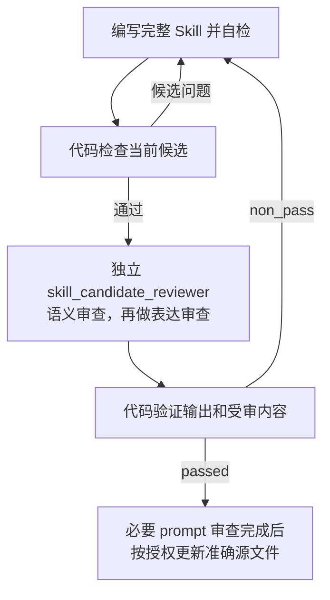

# Skill 编写

## 0. AI-facing Authoring Rules

<!-- embedded-resource:soul:bestpractice_ai_facing_writing:start -->
## 核心原则

### 原则一：先明确结果要求，再确定必要方法（结果确定性优先于过程确定性）

AI 开始写作前，应明确文稿要完成什么、服务什么读者，以及怎样判断内容已经正确、充分、可用。依据这些结果要求，确定需要交代的内容和采用的写作方法。

写作任务至少应明确四件事：

1. **目标**：文稿用于什么，读者需要从中获得什么理解、判断或执行能力。
2. **验收依据**：哪些要求决定文稿是否正确、充分并符合用途，如何核对这些要求。
3. **依据与方法**：使用哪些材料、知识和工具，哪些步骤或先后关系会影响结果。
4. **交付要求**：文稿需要达到什么深度，采用什么形式；已有明确的格式、路径或 schema 要求时，遵守相应要求。

凡步骤、顺序、工具或执行身份会影响正确性、授权边界或证据有效性的要求，应明确规定。例如，独立审核需要针对准确候选执行，审核结论需要与该候选对应。

其余方法由 AI 根据任务选择。步骤式指导、例子和经验，只要能帮助完成任务，就可以保留；避免强制执行与结果无关的过程，也避免只给目标而缺少必要方法。

### 原则二：支持 AI 自主判断，排斥 SOP

AI 具备推理能力。它的上下文容量有限。写入的内容应帮助它完成任务，减少无效的注意力消耗。

方法指导应提供建议和约束，保留 AI 选择执行路径的空间。避免将指导写成固定的标准操作流程（SOP）。

例如，市场分析可以按行业板块组织。如果当天的市场变化主要由一个宏观冲击驱动，AI 应能够选择全局分析。

已知陷阱应当写清楚。AI 可能无法仅凭当前上下文识别这些问题。真实的失败经验通常比泛泛的建议更有用。

保留一段内容前，检查两点：

1. 删除它是否会降低任务质量或成功率。
2. 它是在说明预期结果，还是在规定操作方法。

**优先保留预期结果的说明。操作方法只有在确实能提高任务成功率时才保留。**

---

### 原则三：先写清 AI-facing 文档的契约，再压缩表达

Skill 是 AI 执行任务时使用的契约文档。写作应先保证执行所需的信息完整，再优化篇幅和版面。

这条原则适用于主要供 AI 使用的稳定文档，包括顶层设计文档、路由文档、规则、公理和入口文档，如 `CLAUDE.md`、`AGENTS.md`。

#### 必须回答的六个问题

编写或评审任何 AI-facing 文档时，先确保文档能直接回答以下问题：

1. **这一层负责什么？** 说明这一层的用途。
2. **什么时候进入这一层？** 说明进入条件和触发信号。
3. **进入后先读什么？** 明确应优先遵循的权威依据（first authority），以及承载当前事实的来源（truth surface）。
4. **应该产出什么？** 说明输出形式，以及读者读完后应能理解、判断或完成什么（reader-end-state）。
5. **怎样与相邻层交接？** 说明上游期望什么、下游使用什么，以及失败时如何回退。
6. **哪些相邻概念容易混淆？** 说明它们的区别，以及什么时候应使用其他概念或入口。

**六个问题都写清后，再考虑如何缩短和整理文档。**

#### 契约完整优先于视觉简洁

文档应让 AI 在执行时找到完整的契约。压缩篇幅或调整版面时，必须保留关键边界。

避免以下四类写法：

- **合并不同的任务主线。** 不要为了减少路由表的行数，合并不同的重复性任务主线。实际产出形式不同的主线，应各占一行。
- **混淆层级。** 明确区分任务主线（task mainline）、Skill 层、写作网关层（writer gateway layer），以及确定性构建器与数据包层（deterministic builder / package layer）。名称相近的层尤其容易被误用。
- **只靠名称表达职责。** 名称可能有多种含义。例如，`manager` 可能指角色，也可能指模块。文档应直接说明对象负责什么、不负责什么。
- **先写摘要，后补契约。** 先写清详细契约，再写摘要。

#### 检查删去一段是否影响执行

写完一段后，检查：删去这段，AI 还能完成文档规定的读者目标任务吗？

- 能完成：这段是多余内容，应删除。
- 不能完成：这段属于契约，应保留。

这项检查与 FP4（删除不影响判断的信息）及 `bestpractice_prose_without_editorial_meta.md` 中的检查互为补充。它们删除无助于判断的句子，避免无效扩写；本项检查保留执行所需的契约，避免删减造成含义不清。AI-facing 文档应同时满足这两项要求。

---

### 原则四：固定不变量，保留实现选择

结果确定性优先于过程确定性。写作时还应区分：哪些结果要求必须保持一致，哪些实现选择应留给 AI。

约束所有细节会限制 AI 自主判断。缺少必要约束，会使系统反复改变同一对象的定义和做法，失去连贯性。

**必须固定的不变量**包括：

- 产物的规范路径与命名。
- 产物的身份字段，如 `report_date`、`asset_id`、`theme_id`。
- 上游依赖的身份与新鲜度契约。
- 产出此节点的唯一规范构建器（canonical builder）。不允许第二条产出路径。
- 与相邻 Skill、构建器和写作器的接口形式。

**应留给 AI 选择的内容**包括：

- 正文的具体写法。
- 判断路径与取舍。
- 中间过程的组织方式。
- 哪些证据需要重点展开，哪些只需简述。

写作时应明确区分这两类要求。固定不变量，使系统保持连贯，产物可以追踪，并能跨任务复用。保留实现选择，使 AI 能根据当前上下文作出合适判断。

如果文档只规定正文结构和写作步骤，却没有写清不变量，就会同时限制 AI 的判断空间，并允许产物偏离约定。

检查每条要求：

- 它属于不变量，还是实现细节？
- 如果属于实现细节，能否写成建议和失败信号，保留 AI 的选择空间？
- 不变量是否足以防止系统偏移，同时数量少到 AI 能记住和使用？

### 原则五：同时写清禁止事项和违规特征

仅写“不要做什么”，依赖 AI 主动注意并遵守禁令。AI 绕过禁令后，产物仍可能看似合格，禁令本身无法帮助它发现问题。

每条关键边界都应同时说明两件事：

- **禁止事项**：哪些行为或结果不被允许。
- **违规特征**：发生违规后，可以观察到什么。

例如，数据更新边界可以写成：

- **禁止事项**：数据更新完成前，不得编写投资经理（PM）报告。
- **违规特征**：已经产出报告，却没有确认 `daily_update_status.json` 中的 `blocking == false`。报告本身可能看不出问题，但上游数据的新鲜度要求尚未满足，需要通过后续复盘发现。

主题补充分析的边界可以写成：

- **禁止事项**：主题补充分析（theme overlay）不得替代任务的首要依据（first authority）。
- **违规特征**：报告的核心论述采用主题的一般结论，取代了对当前股票或当前市场的分析。读者据此判断主题，判断对象偏离了当前股票或市场。

描述违规特征时，尽量做到：

- 给出 AI 能在产出后检查的可观察特征。
- 指出缺少哪类证据或使用了哪个错误的依据来源（truth surface），不要只说“读起来不对”。
- 如果问题只能在后续环节发现，明确指出哪个环节能够发现。

这样，AI 在自主选择路径后，仍能检查自己是否越过边界。可观察的违规特征有助于发现仅凭禁令容易遗漏的偏差。

### 原则六：按陌生读者的理解顺序组织概念

执行者通常没有参与作者当时的讨论。写作顺序必须从读者已有的知识出发，使每个新概念只依赖读者已经知道、或前文已经说明的对象、任务与边界。

先明确读者的起点和目标：

- **读者起点**：进入时已经知道哪些对象、字段、工具和上游事实。
- **读者目标状态**：读完后能判断何时进入、应优先信任什么、需要产出什么、何时完成，以及何时停止或提交给有权处理的人。

引入新概念时，优先按以下顺序说明：

1. 当前对象、任务或可观察问题是什么。
2. 它与相邻对象、正常路径或读者已有认知有何关键差异。
3. 这项差异会改变什么执行、判断或交接。
4. 最后给出需要长期复用的正式名称。

Schema、协议对象或法律术语可以先定义，以保证精确。定义首次出现时，应同时说明其通俗含义、适用任务或操作影响，让读者能够理解这个名称的作用。

解释性段落应让陌生读者理解三件事：正在描述什么、为什么需要这样规定、会改变什么。纯字段表、枚举、代码块和引用块无需逐项回答这三个问题，但前后必须有足够的用途说明。

交付前统一检查是否存在缺陷。以下任一问题回答“是”，都必须修改或记录为审核发现（finding）：

- 是否在说明任务或对象前引入抽象术语，迫使读者暂存尚未理解的名称？
- 是否有解释性段落无法让读者理解正在说什么、为什么需要，以及会改变什么？
- 是否存在机械编号、教科书式口吻或不自然的概念堆叠？
- 是否在过短的篇幅内引入过多独立概念？
- 是否存在段落间的契约缺口或推理断层？
- 改写是否改变了权威来源中的数字、身份、权限、因果方向、不确定性、兼容性或停止条件？

最后一项检查保护原意。作者只能改善表达的可理解性。若更自然的措辞会改变权威来源的含义，应保留原意，或交由该内容的负责人决定；不得借润色重写契约。

---

<!-- embedded-resource:soul:bestpractice_ai_facing_writing:end -->

## 1. Task

Primary Agent 使用本 Skill，把一项明确的重复任务写成其他 Agent 可以找到、理解并使用的完整方法。
输入可以是已授权的 Skill 新增或修改请求，也可以是已有计划中的 Skill 步骤。需要拆分工作或确定
依赖时使用 System Change；范围、任务负责人和所需结果明确时直接开始。

本包携带独立 `skill_candidate_reviewer` 的 prompt、schema、fixtures 和 registration source。
Primary Agent 负责写作、自检、组织独立审核和按授权更新源文件；Reviewer 以独立执行身份作判断。
Runtime registration 和安装部署另行处理。

## 2. Reader Gain

Primary Agent 能找到已有方法，判断应修改哪份 Skill，写清任务、输入输出、完成条件、边界及真实
资源入口；能组织代码检查和指定 Reviewer，根据证据修订，最终更新正确的 Skill 源文件。
目标 Agent 读完所产出的 Skill，就能在明确提供的输入和资源范围内工作，无需原始聊天。

## 3. Entry and Exit

进入时明确本次任务、修改范围、所属 Design 和准确源文件。修改已有 Skill 时取得当前内容及需要
保留的含义；新建时先查现有 Skill 目录或索引，避免重复定义同一方法。改变职责划分时比较完整受影响
集合；局部修改只读取判断该变化所需的相关 Skill。

任务含义、权限或职责尚未决定时，说明缺什么及其负责人，不自行补成既定规则。请求实际属于 Design、
Reviewer prompt、代码、Runtime 配置、部署或整体删除时，交给对应方法；不会因为出现 `SKILL.md`
或 prompt 就自动扩大本 Skill 的职责。

成功退出时交付完整 Skill、需要时的完整 prompt、适用检查和独立审核结果，以及已授权的源文件更新。
输入不足、工具不可用或存在待决定事项时，如实说明未完成部分；不生成新的状态分类或把自检当成通过。

## 4. Execution Contract

### 4.1 Inputs and Authority

- 本次授权目标、范围和已有计划（如有）；已有计划提供当前步骤、完成条件、相关排除项与后续边界，直接授权的普通任务不额外增加计划。
- `designDoc/the_skill_management.md`：完整 Skill、发现方式和独立审核要求。
- 提供任务含义的 Design；当前 Skill 与直接相关 Skill 的 Task、入口、产出和边界。
- 实际使用的文件、工具、schema 和宿主接口要求，仅在完成该任务需要时读取。
- 当前环境的 Skill 检查入口、`skill_candidate_reviewer` 调用入口和需要重新判断的历史 finding。

授权请求决定本次改什么，所属 Design 决定任务含义，Skill Management 决定如何写成完整 Skill。
代码说明实际能力；旧实现、文件名或 Reviewer 建议不能替代上游决定。资源应给出准确位置及用途，
不要求复制全部正文，也不能让执行者从未声明的聊天或仓库内容猜测。

<!-- embedded-resource:t0:skill_authority_input_guard:start -->
Skill 只有在实际承载对应 machine-facing meaning 时才增加下列 authority input：定义 time-bearing field、
clock、calendar、freshness 或 time comparison 时，先读取 `designDoc/the_timestamp_semantic.md`；定义 schema
或 machine boundary 中的 Identifier、Reference、version、content hash、pointer 或 locator 时，先读取
`designDoc/the_identifier_and_reference_semantics.md`。只是在示例、普通 prose
或路径中出现 date、ID、ref 等词，不构成适用条件。未触及这些语义时不加载对应 T0，也不增加字段、
占位章节或空引用；触及时只继承适用规则，不复制 peer contract。
<!-- embedded-resource:t0:skill_authority_input_guard:end -->

### 4.2 Output and Completion

输出是可直接阅读的完整 `SKILL.md`，以及任务确需独立执行时的完整 prompt。它应让目标 Agent 知道
何时进入、依据什么、做出什么、何时完成，以及信息不足或真实失败时如何处理。

Skill 新增或执行含义改变时，代码检查通过后，取得 `skill_candidate_reviewer` 对本次候选的独立结果。
Primary Agent 核对意见并在已有授权内更新准确源文件。纯文法、格式或未改变含义的机械同步，使用
适用检查和保真自检，不假称取得新的语义审核。

Reviewer prompt 的新增或含义变化另按 `the-review-authoring` 编写，再由 `reviewer_reviewer` 独立审核。
普通 Skill 修改不自动重审未变 prompt；继续使用旧证据时确认内容、适用规则和相关依据都未改变。
新审查只证明当前内容，源更新不表示 Runtime 已注册或其他环境已部署。

## 5. Boundaries

| 边界 | 可观察的越界 |
| --- | --- |
| Design 决定任务，Skill 提供方法 | 从旧代码或 Reviewer 偏好推导新的产品要求 |
| 相关 Skill 保持职责清楚 | 仅因名字不同就新建平行 Skill，或修改后留下无人负责的交接 |
| 代码处理机械事实 | 作者手填 hash、修改生成投影，或用文字宣称没有运行的检查通过 |
| 作者组织工作，Reviewer 独立判断 | 作者自行返回 `passed`，或只读同包 Reviewer prompt 就声称完成独立审核 |
| 稳定方法与本次执行分开 | Skill 固化具体任务数据、凭据、当前授权或模型配置 |
| 源更新与下游操作分开 | 因写好 prompt 就声称 Module 已注册，或把源文件修改当作部署完成 |

Skill 需要的操作权限仍由授权与数据负责人决定。这里只说明实际相关的边界，不为每份 Skill 列出
全部邻接系统。Reviewer 不可用时返回执行入口的负责人，不能改用作者自审或相似 Reviewer 代替。

## 6. Method

### 6.1 确定任务和已有方法

先说明目标 Agent 最终应做成什么，再用现有目录或索引找到可能相关的 Skill，阅读其任务、入口与产出。
已有 Skill 负责同一结果时优先修改它；确有新责任时再新增。流程和步骤只固定真实依赖，其余方法给
Agent 留出判断空间。停止条件应对应缺失信息、权限或实际失败，不为普通写作增加计划和注册前置。

### 6.2 使用固定结构

Frontmatter 提供 `name`、能区分任务的 `description` 和现有 metadata，不增加重复 `Identity` 正文章节。
沿用 Skill Management 的 `skill_class` 含义；修改既有 Skill 时保留仍然适用的身份字段，不新增分类。

`description` 用一两句自然语言说明适用的任务场景、处理对象和主要结果，使 Agent 在读取正文前能够
选择方法。将本 Skill 与直接相关方法的描述放在一起比较，以正向能力区分各自的任务。确实影响入口
判断的适用条件放在描述中，具体步骤、授权、审核和失败处理在正文展开。描述与 Task、Entry and Exit
保持一致；用目标不同而用词相近的请求检查入口是否可区分。若实际任务仍有重叠或缺口，回到第 6.1 节
核对职责，再形成文案。

| 固定章节 | 必须写清的内容 |
| --- | --- |
| `1. Task` | 稳定任务与使用理由 |
| `2. Reader Gain` | 目标 Agent 新增的判断或执行能力 |
| `3. Entry and Exit` | 进入、信息不足及请求不适用时的处理 |
| `4. Execution Contract` | `4.1 Inputs and Authority` 与 `4.2 Output and Completion` |
| `5. Boundaries` | 实际相关的职责边界及可观察越界 |
| `6. Method` | 必要方法、可用资源与高概率陷阱 |

一级章节使用 `## <序号>. <标题>`，子章节使用 `### <父序号>.<子序号> <标题>`，同级连续编号。
确有独立内容需要时从第 7 章继续增加；不要为了填满结构创造机制、空表或无关要求。

实际编写稳定产物的 Skill，在六章之前保留完整 `0. AI-facing Authoring Rules`，由代码注入
`soul:bestpractice_ai_facing_writing` 的登记片段。产物随后需要独立 Reviewer 时，再在 Method 中
包含 Author Self-Check。两者分别按 Task 和产出判断适用性，不加 metadata tag，也不按名称猜。

### 6.3 从实际任务提炼可复用方法

按“还原任务、提炼判断、换输入走读”把已定任务要求转成执行方法。各项使用前面取得的依据，
发现缺口时返回对应判断；具体材料、方案和合法工具选择由执行 Agent 根据输入决定。

1. **还原实际任务。** 对照所属 Design、现有工作流程与真实工具，说明 Agent 接手时拿到什么、
   需要交付什么，以及已有入口能够完成哪些工作。分清代码提供的确定性事实与 Agent 必须作出的
   判断。实际能力不足时指出缺失入口或依据，交给对应方法处理；任务含义未定时返回 Design，
   不靠新增指令假定能力或产品要求已经存在。
2. **提炼关键判断过程。** 沿一个真实任务或明确给定的典型情境走读，找出会改变结果的判断点：
   先读取什么依据，利用它回答什么问题，该判断怎样决定下一步。将这些依据与先后关系写进
   Method，使 Agent 知道如何开始、如何继续以及信息不足时怎样处理。“分析充分、边界清晰、
   结果完整”等要求应转成该任务具体要作出的判断，不只重复 Design 的完成标准。固定影响结果
   的关键依据和依赖，保留具体分析、表达与方案选择；例子和陷阱只保留有依据且影响判断的内容。
3. **换一个输入检验复用性。** 在文稿层面换一组仍属于同一任务的输入，检查方法能否继续指导
   工作，是否依赖原始聊天，是否把单次任务的数据、文件或方案写成固定要求。契约规定的路径与
   工具入口保留，具体任务材料由输入提供。发现只能适用于原 case 的步骤时，明确其适用条件，
   或提炼成共同判断；无法合理共用时返回第 6.1 节核对任务边界。这里是方法走读，不自动要求
   执行任务、调用模型或创建新的测试流程。

例如，Design 要求 SystemChangePlan 范围准确、步骤可执行，Skill 方法可以写出如何核对设计
含义、推导 Skill 与 Code 的实际改动、再从输入关系确定先后。换一个系统修改请求时，参与对象
与方案随输入变化，判断方法仍可使用。该例只说明从任务要求提炼方法，不成为其他 Skill 的流程。

用中文说明真实资源、判断依据、产出位置和完成条件。每个概念在一处定义，删除重复治理解释和
过程复盘，同时保留不读就会误用的边界。

需要独立执行时，普通 prompt 应配合明确的任务输入与资源，完整承载该角色的指令，不隐式依赖读取
所属 Skill 或聊天历史。Reviewer prompt 使用 `the-review-authoring`，代码注入其通用规则与目标
Design checklist；本 Skill 说明它与任务的关系，不改写其他负责人的审查标准。

### 6.4 Author Self-Check

<!-- embedded-resource:t0:skill_author_self_check:start -->
调用外部 Reviewer 前，author 必须直接消费本 Skill 声明的、由 subject authority 拥有的 canonical checklist，不能手抄第二份 checklist。每次调用只形成临时结果表：

| `check_id` | `exact evidence` | `local result` | `unresolved finding` |
| --- | --- | --- | --- |

每个 required `check_id` 恰好出现一次，并绑定当前 exact candidate 的证据。依据本次授权目标、适用计划步骤、完成条件与排除项判断当前必要性；历史 `prior_findings` 在当前候选上重新核对，不能继承旧 verdict。经核对成立且影响本步完成的必修问题列为 unresolved finding，先在本 Skill 内修订；note 不列入该栏，也不自动实施。对证据错误或越界的历史意见，在 exact evidence 中说明理由并交回独立 Reviewer 重判，不能自行改写原结论。只有没有已知未解决的必修问题时，才冻结候选并调用独立 Reviewer。

Author Self-Check 只防止作者把自己已经看见的缺口交给 Reviewer。它不产生 `passed`、approval、admission 或任何可替代独立审核的结果，也不创建持久化 record、Registry 或跨系统 schema。
<!-- embedded-resource:t0:skill_author_self_check:end -->

本 Skill 的 canonical checklist 由 Skill Management 提供并机械注入。自检逐项核对当前候选；
只有已经发现且影响要求成立的问题需要先解决，可选 note 不自动成为必做工作。

<!-- embedded-resource:t0:skill_candidate_review_checklist:start -->
以下 11 项是完整 hard-gated checklist。Reviewer 按顺序逐项形成结果，完成全部检查后再给 verdict，并在
同一次调用中返回全部 actionable findings；不能命中首项后停止，也不能设置固定 finding 数量。一个根因
影响多项时保留逐项 assessment，但不复制 finding：

1. `identity_discovery_class_and_source`：名称、description 和使用方式是否能使 Agent 正确找到本 Skill；负责人是否与任务一致；共同首章和 Author Self-Check 是否适用。字段合法性与源路径唯一性消费代码结果。
2. `task_and_reader_gain`：Task 是否明确重复任务，Reader Gain 是否说明读者新增的判断或执行能力，且与实际产出一致。
3. `entry_exit_and_routing`：Agent 是否知道何时进入、缺少什么时补充或停止、请求不适用时交给谁；与实际相关 Skill 的职责没有重叠或空缺。
4. `inputs_authority_freshness_and_conflicts`：任务所需输入和依据是否足够、资源入口是否明确，缺失或冲突有合理处理；确实涉及时间或机器标识含义时使用相应 T0，不强加无关要求。
5. `outputs_completion_failure_and_handoff`：Agent 能否判断本次产出、完成条件、真实失败处理和下一步负责人；本步所需决定没有缺口，合理留给下游且不影响当前结果的选择仍被保留。
6. `boundaries_and_observable_violations`：本任务实际涉及的权限、数据写入及邻接职责是否清楚；关键越界能从行为或结果中被识别，不要求列出所有无关系统。
7. `method_result_certainty_and_agent_freedom`：方法是否足以指导任务，又保留合理判断空间；没有把过程偏好写成必经程序。适用的自检使用正确 checklist，先处理成立且影响当前结果的必修问题，note 不自动实施，争议交回独立判断。
8. `design_and_revision_fidelity`：候选是否符合本次授权目标、适用计划步骤与所属 Design，保留需要保留的含义；必修意见能证明当前必要性，旧实现、未来收益或 Reviewer 偏好不增加产品要求，本次实际回归仍须处理。
9. `prompt_boundary_hygiene`：稳定指令是否与具体任务数据、凭据、实际授权及运行配置分开，避免把本次执行内容固化为长期要求。
10. `skill_agent_workflow_tool_separation`：Skill、代码工具、Workflow 和独立 Module 是否各自承担合适工作；Primary Agent 可以组织检查与独立审核，但不会把自检或同包 source 当作独立 verdict。
11. `runtime_ready_prompt_closure_if_declared`：声明的普通 prompt 是否配合明确输入与资源完整承载执行任务；携带 Reviewer source 时是否说明具体 Module、独立调用与不可用时的处理，且与 Skill 任务和交接一致。Reviewer prompt 的专用指令由 reviewer_reviewer 审，不在此重复；未声明 prompt 时使用 not_applicable，不要求另造一个。

每个 `check_results` entry 包含非空 `assessment`，引用当前候选或声明背景中足以支持判断的证据。
前十项只返回 `passed` 或 `finding`；第 11 项只有在没有 declared prompt 时可以返回 `not_applicable`。
共同表达项 `prose_and_meaning_preservation` 置于这十一项之后；语义未通过时为 `not_run`，通过后再检查表达。
`finding` 必须关联至少一项 `block` 或 `fix`；`note` 可以关联 `passed` 项，不使检查失败。
<!-- embedded-resource:t0:skill_candidate_review_checklist:end -->

### 6.5 代码检查与独立审核

在项目根目录，用当前项目的 Python 运行随包工具。检查命令同时核对结构与声明资源，并可生成临时
自检表；hash 和完整 check_id 由代码填写：

```sh
python -B 09_soul/governance/t0/validation/artifact_contracts/skill_review.py \
  --candidate path/to/SKILL.md --check-only \
  --self-check-template path/to/new_self_check.json
```

作者填写每项 `exact_evidence`、`local_result` 和 `unresolved_finding`。没有未解决问题时最后一项为
`null`；空表、遗漏项、未关闭问题或候选变化不能送审。只查看检查结果时省略模板参数。

```sh
python -B 09_soul/governance/t0/validation/artifact_contracts/skill_review.py \
  --candidate path/to/SKILL.md --goal "本次授权目标" --change "修改范围" \
  --self-check path/to/completed_self_check.json \
  --design path/to/owning_design.md --output path/to/new_review_result.json --root path/to/runtime_root
```

按需要用 `--context skill=PATH` 提供相关 Skill，`--prompt prompt_id=PATH` 提供候选声明的完整
prompt。新 Skill 需要自有 checklist 时，用 `--checklist-resource resource_id` 明确指定，额外原文
可用 `--resource resource_id=PATH` 提供；不能覆盖随包已登记资源。未涉及这些资源时省略相应参数。

审核经随包 `runtime_review.py` 调用 Agent Runtime Test Run 运行已注册的 `skill_candidate_reviewer`。
工具使用本包 `runtime_modules/skill_candidate_reviewer/` 的 input/output schema，载入本次目标、范围和
明确文件，记录受审内容并验证返回结果。`--root` 必填，定义来源与执行参数见 Portable README“独立审核
的执行”；Reviewer 未注册或 Runtime 不可用时返回环境维护者。日常审核不临时注册 Module 或自建
Reviewer 调用脚本。

底层仍使用 `skill_artifact_contract.py` 的结构与自检 API，以及同包 Governance 资源校验代码；
需要 API 接入时直接复用它们。检查结果不代替独立审核，`--help` 提供命令参数；候选与已有输出文件
不会被覆盖。



Primary Agent 核对 finding 的证据、范围、当前后果和本步必要性，修订成立的必修问题后再审；note
默认不实施。错误或越界意见附理由交回独立 Reviewer 按同一依据重判，原 non_pass 不由作者改写。
真实依赖或外部决定交给提供方，调用或校验失败交给相应负责人，不因意见增加授权。涉及 Reviewer prompt 变更时，
Skill 审查通过后完成其独立 `reviewer_reviewer` 审查；若修订影响 Skill，受影响内容重新审查。
完成后说明准确源文件及已执行的检查与审核，部署另行报告。
