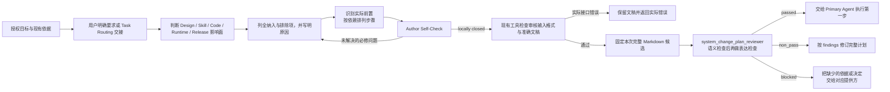

# 系统变更计划编写

## 0. AI-facing Authoring Rules

<!-- embedded-resource:soul:bestpractice_ai_facing_writing:start -->
## 核心原则

### 原则一：先明确结果要求，再确定必要方法（结果确定性优先于过程确定性）

AI 开始写作前，应明确文稿要完成什么、服务什么读者，以及怎样判断内容已经正确、充分、可用。依据这些结果要求，确定需要交代的内容和采用的写作方法。

写作任务至少应明确四件事：

1. **目标**：文稿用于什么，读者需要从中获得什么理解、判断或执行能力。
2. **验收依据**：哪些要求决定文稿是否正确、充分并符合用途，如何核对这些要求。
3. **依据与方法**：使用哪些材料、知识和工具，哪些步骤或先后关系会影响结果。
4. **交付要求**：文稿需要达到什么深度，采用什么形式；已有明确的格式、路径或 schema 要求时，遵守相应要求。

凡步骤、顺序、工具或执行身份会影响正确性、授权边界或证据有效性的要求，应明确规定。例如，独立审核需要针对准确候选执行，审核结论需要与该候选对应。

其余方法由 AI 根据任务选择。步骤式指导、例子和经验，只要能帮助完成任务，就可以保留；避免强制执行与结果无关的过程，也避免只给目标而缺少必要方法。

### 原则二：支持 AI 自主判断，排斥 SOP

AI 具备推理能力。它的上下文容量有限。写入的内容应帮助它完成任务，减少无效的注意力消耗。

方法指导应提供建议和约束，保留 AI 选择执行路径的空间。避免将指导写成固定的标准操作流程（SOP）。

例如，市场分析可以按行业板块组织。如果当天的市场变化主要由一个宏观冲击驱动，AI 应能够选择全局分析。

已知陷阱应当写清楚。AI 可能无法仅凭当前上下文识别这些问题。真实的失败经验通常比泛泛的建议更有用。

保留一段内容前，检查两点：

1. 删除它是否会降低任务质量或成功率。
2. 它是在说明预期结果，还是在规定操作方法。

**优先保留预期结果的说明。操作方法只有在确实能提高任务成功率时才保留。**

---

### 原则三：先写清 AI-facing 文档的契约，再压缩表达

Skill 是 AI 执行任务时使用的契约文档。写作应先保证执行所需的信息完整，再优化篇幅和版面。

这条原则适用于主要供 AI 使用的稳定文档，包括顶层设计文档、路由文档、规则、公理和入口文档，如 `CLAUDE.md`、`AGENTS.md`。

#### 必须回答的六个问题

编写或评审任何 AI-facing 文档时，先确保文档能直接回答以下问题：

1. **这一层负责什么？** 说明这一层的用途。
2. **什么时候进入这一层？** 说明进入条件和触发信号。
3. **进入后先读什么？** 明确应优先遵循的权威依据（first authority），以及承载当前事实的来源（truth surface）。
4. **应该产出什么？** 说明输出形式，以及读者读完后应能理解、判断或完成什么（reader-end-state）。
5. **怎样与相邻层交接？** 说明上游期望什么、下游使用什么，以及失败时如何回退。
6. **哪些相邻概念容易混淆？** 说明它们的区别，以及什么时候应使用其他概念或入口。

**六个问题都写清后，再考虑如何缩短和整理文档。**

#### 契约完整优先于视觉简洁

文档应让 AI 在执行时找到完整的契约。压缩篇幅或调整版面时，必须保留关键边界。

避免以下四类写法：

- **合并不同的任务主线。** 不要为了减少路由表的行数，合并不同的重复性任务主线。实际产出形式不同的主线，应各占一行。
- **混淆层级。** 明确区分任务主线（task mainline）、Skill 层、写作网关层（writer gateway layer），以及确定性构建器与数据包层（deterministic builder / package layer）。名称相近的层尤其容易被误用。
- **只靠名称表达职责。** 名称可能有多种含义。例如，`manager` 可能指角色，也可能指模块。文档应直接说明对象负责什么、不负责什么。
- **先写摘要，后补契约。** 先写清详细契约，再写摘要。

#### 检查删去一段是否影响执行

写完一段后，检查：删去这段，AI 还能完成文档规定的读者目标任务吗？

- 能完成：这段是多余内容，应删除。
- 不能完成：这段属于契约，应保留。

这项检查与 FP4（删除不影响判断的信息）及 `bestpractice_prose_without_editorial_meta.md` 中的检查互为补充。它们删除无助于判断的句子，避免无效扩写；本项检查保留执行所需的契约，避免删减造成含义不清。AI-facing 文档应同时满足这两项要求。

---

### 原则四：固定不变量，保留实现选择

结果确定性优先于过程确定性。写作时还应区分：哪些结果要求必须保持一致，哪些实现选择应留给 AI。

约束所有细节会限制 AI 自主判断。缺少必要约束，会使系统反复改变同一对象的定义和做法，失去连贯性。

**必须固定的不变量**包括：

- 产物的规范路径与命名。
- 产物的身份字段，如 `report_date`、`asset_id`、`theme_id`。
- 上游依赖的身份与新鲜度契约。
- 产出此节点的唯一规范构建器（canonical builder）。不允许第二条产出路径。
- 与相邻 Skill、构建器和写作器的接口形式。

**应留给 AI 选择的内容**包括：

- 正文的具体写法。
- 判断路径与取舍。
- 中间过程的组织方式。
- 哪些证据需要重点展开，哪些只需简述。

写作时应明确区分这两类要求。固定不变量，使系统保持连贯，产物可以追踪，并能跨任务复用。保留实现选择，使 AI 能根据当前上下文作出合适判断。

如果文档只规定正文结构和写作步骤，却没有写清不变量，就会同时限制 AI 的判断空间，并允许产物偏离约定。

检查每条要求：

- 它属于不变量，还是实现细节？
- 如果属于实现细节，能否写成建议和失败信号，保留 AI 的选择空间？
- 不变量是否足以防止系统偏移，同时数量少到 AI 能记住和使用？

### 原则五：同时写清禁止事项和违规特征

仅写“不要做什么”，依赖 AI 主动注意并遵守禁令。AI 绕过禁令后，产物仍可能看似合格，禁令本身无法帮助它发现问题。

每条关键边界都应同时说明两件事：

- **禁止事项**：哪些行为或结果不被允许。
- **违规特征**：发生违规后，可以观察到什么。

例如，数据更新边界可以写成：

- **禁止事项**：数据更新完成前，不得编写投资经理（PM）报告。
- **违规特征**：已经产出报告，却没有确认 `daily_update_status.json` 中的 `blocking == false`。报告本身可能看不出问题，但上游数据的新鲜度要求尚未满足，需要通过后续复盘发现。

主题补充分析的边界可以写成：

- **禁止事项**：主题补充分析（theme overlay）不得替代任务的首要依据（first authority）。
- **违规特征**：报告的核心论述采用主题的一般结论，取代了对当前股票或当前市场的分析。读者据此判断主题，判断对象偏离了当前股票或市场。

描述违规特征时，尽量做到：

- 给出 AI 能在产出后检查的可观察特征。
- 指出缺少哪类证据或使用了哪个错误的依据来源（truth surface），不要只说“读起来不对”。
- 如果问题只能在后续环节发现，明确指出哪个环节能够发现。

这样，AI 在自主选择路径后，仍能检查自己是否越过边界。可观察的违规特征有助于发现仅凭禁令容易遗漏的偏差。

### 原则六：按陌生读者的理解顺序组织概念

执行者通常没有参与作者当时的讨论。写作顺序必须从读者已有的知识出发，使每个新概念只依赖读者已经知道、或前文已经说明的对象、任务与边界。

先明确读者的起点和目标：

- **读者起点**：进入时已经知道哪些对象、字段、工具和上游事实。
- **读者目标状态**：读完后能判断何时进入、应优先信任什么、需要产出什么、何时完成，以及何时停止或提交给有权处理的人。

引入新概念时，优先按以下顺序说明：

1. 当前对象、任务或可观察问题是什么。
2. 它与相邻对象、正常路径或读者已有认知有何关键差异。
3. 这项差异会改变什么执行、判断或交接。
4. 最后给出需要长期复用的正式名称。

Schema、协议对象或法律术语可以先定义，以保证精确。定义首次出现时，应同时说明其通俗含义、适用任务或操作影响，让读者能够理解这个名称的作用。

解释性段落应让陌生读者理解三件事：正在描述什么、为什么需要这样规定、会改变什么。纯字段表、枚举、代码块和引用块无需逐项回答这三个问题，但前后必须有足够的用途说明。

交付前统一检查是否存在缺陷。以下任一问题回答“是”，都必须修改或记录为审核发现（finding）：

- 是否在说明任务或对象前引入抽象术语，迫使读者暂存尚未理解的名称？
- 是否有解释性段落无法让读者理解正在说什么、为什么需要，以及会改变什么？
- 是否存在机械编号、教科书式口吻或不自然的概念堆叠？
- 是否在过短的篇幅内引入过多独立概念？
- 是否存在段落间的契约缺口或推理断层？
- 改写是否改变了权威来源中的数字、身份、权限、因果方向、不确定性、兼容性或停止条件？

最后一项检查保护原意。作者只能改善表达的可理解性。若更自然的措辞会改变权威来源的含义，应保留原意，或交由该内容的负责人决定；不得借润色重写契约。

---

<!-- embedded-resource:soul:bestpractice_ai_facing_writing:end -->

## 1. Task

本 Skill 接收授权目标和现有依据，编写一份完整、顺序正确且可执行的普通 Markdown 变更计划，
沿用 `SystemChangePlan` 名称。计划是本 Skill 的产出，不是进入它的前提。它只负责规划和路由，不编写、审核、批准、准入、执行或跟踪
Design、Skill、Code、Runtime、Data 和 Release 的下游工作。

System Change Governance 拥有计划含义。本 Skill folder 同时保存独立
`system_change_plan_reviewer` 的 Prompt、Schema、Fixture 和注册源，但计划作者不会加载该
Reviewer 自审。Reviewer 由独立执行身份运行，并直接返回 System Change Governance 定义的
审核结果。冻结计划必须使用已注册的 `system_change_plan_reviewer` Runtime Module；Module
route 不可用时返回 `blocked_binding` 和 Runtime owner evidence，Primary Agent 不直审也不换用相似 Reviewer。

## 2. Reader Gain

Primary Agent 使用本 Skill 后可以一次判断：

- 哪些文件或受治理面需要修改，哪些明确不改，以及各自原因；
- 每项修改属于 Design、Skill、Code、Runtime 还是 Release；
- 每项工作真正需要的前置结果，以及满足这些依赖的执行顺序；
- 每步的唯一责任人、authoring 或 implementation method、产出对象类型、审核门和完成条件；
- 何时可以执行计划，何时必须把待决事项或错误路由返回真实所有者。

## 3. Entry and Exit

### 3.1 Entry

用户明确要求统一规划，或没有指定起点且修改需要跨层统筹范围、职责和依赖时进入。
Task Routing 可以把该请求交为 `system_change_intake`，它是交接名称，不要求先调用机器路由器。
用户指定从文档、Skill 或代码开始时，使用对应方法，不要求先通过本 Skill。

起点是变更目标、已有授权和现有依据。先查项目入口、相关 Design、当前源文件和实际工具说明，
确认本次需要哪些材料。没有父计划、计划 Schema、构建器或 Registry 不妨碍起草；缺少真实目标、
产品决定或必要依据时，说明具体缺件和提供方，保留已形成的草稿。

### 3.2 Exit

- `ready_for_execution`：计划没有阻止执行的待决事项，完成适用检查并通过
  `system_change_plan_reviewer`，交给 Primary Agent 执行第一步。
- `revision_required`：确定性检查或有效审核结果指出计划未闭合，返回计划作者；或计划包含
  `unresolved_decisions`，把每项待决事项返回该项声明的 accountable decision owner。当前调用随后
  停止，相关事项解决后重新进入本 Skill。
- `blocked_owner_or_layer`：无法确定本次目标、负责人或层级时，说明依据冲突或缺少的决定，返回
  用户或有权决定的 Design owner；不把缺少项目 Registry 当成缺少产品决定。
- `blocked_binding`：现有 Reviewer 或审核接口不可用，返回实际接口或执行负责人；保留文稿，
  不要求先建立计划基础设施。
- `blocked_review`：Reviewer 已返回有效 `blocked` disposition，但 blocker 不属于上述两类；把 exact
  blocker 返回 Reviewer output 指定的 accountable owner。

上述名称用于说明交接结果，不要求新增状态记录。执行失败或无效输出不是 Reviewer verdict。
本 Skill 在交出结果后结束。它不维护 Case、`ScopeAssessment`、`WorkPackage`、
`CandidateSet`、`ClosureRecord`、执行状态、生命周期或进度页面。

## 4. Execution Contract

### 4.1 Inputs and Authority

按以下 authority 形成计划：

1. 已授权的目标结果；
2. Task Routing 的交接或用户明确的规划请求；
3. 当前文件、代码、索引与工具给出的对象、负责人、层级及依赖依据；
4. Project Charter、本 T0 和实际涉及的 Design；
5. 所属 authority 提供的编写方法、产出类型、Reviewer 与检查入口。

从项目入口和已有索引定位当前 Portable T0 与相关项目 Design、工程架构、公开接口和来源关系，
阅读实际相关正文，再按第 6.1 节推导改动。本次已完整读过且未变化的依据可以复用。索引用于定位，
不能用摘要或文件名代替正文判断；不存在索引时直接核对准确文件，不为写计划先造一个 Registry。
读取范围不等于修改范围，各合同义务按本次变更的适用条件判断。

前序 finding 只作为证据。文件名、失败测试、模型、模型提供方、附近 Skill、旧计划或当前实现
都不能覆盖上述 authority，也不能代替 owner 或 layer 判断。

### 4.2 Output and Completion

计划使用普通 Markdown，内容可以组织成自然段或表格，不要求使用下列名称作为字段或固定标题：

- `requested_result`：目标、授权范围和现有依据；
- `affected_surfaces`：本次有限授权结果实际需要的完整受影响范围；其中需要修改的文件或受治理面带有 subject kind、layer、
  owner 和 required change；
- `excluded_surfaces`：从完整受影响范围中明确不改的面及其原因；
- `ordered_steps`：每步对象、唯一最终负责人、所需输入、编写或实施方法、产出、检查或审核、完成条件与依赖提供路径；交接时连同该步目标、相关排除项与后续边界提供，不另建范围记录；
- 验收：哪些实际检查、独立审核或操作结果能证明整个授权目标成立；
- `unresolved_decisions`：使计划暂时不能执行的待决事项；每项都写明 decision 和 accountable
  decision owner。

没有阻止执行的待决事项、适用检查完成，且同一份准确文稿取得独立 `system_change_plan_reviewer`
的有效 `passed` 时，计划才完成。冻结表示审核输入中保留准确正文，不要求作者创建计划 ID、版本、
时间字段或 Registry。审核接口已有的请求标识与内容校验由现有工具处理。
`passed` 只支持在既有授权内使用计划，不批准下游候选，也不增加授权。

自检发现内容缺口时先修订；有效 `non_pass` 按 findings 修订，`blocked` 返回具体依据或决定的提供方。
接口、执行、输入输出格式或候选对应关系出错时，报告工具实际错误并保留材料，不伪装成 Reviewer
结论；不要求作者为这些情况先搭建计划服务或编造错误码。

下游发现真实依赖缺失、负责人错误、适用规则冲突，或新证据、原处理失败影响计划成立时，先说明
当前后果并返回真实负责人重新判断；确需改计划时再冻结完整新计划。建议和未来收益本身不使旧计划
失效，也不授予扩展工作权限；本 Skill 不修改已冻结计划或接管执行。

## 5. Boundaries

| Boundary | 本 Skill 保留的职责 | Observable violation |
| --- | --- | --- |
| 计划与执行 | 只形成可执行计划和路由 | 输出包含候选产物状态、执行进度、准入汇总或闭包状态 |
| 完整范围 | 本次结果必需的受影响面纳入，相关排除项说明原因 | 漏掉使当前结果不能成立的依赖，或为完整性要求整理全部邻接系统 |
| 单步路由 | 每步的负责人、方法、产出、检查或审核与完成条件清楚 | 步骤缺少上述含义、存在并列最终负责人，或要求执行者自行补决定 |
| 实际依赖 | 依据每步所需输入、决定、检查和授权安排顺序 | 必需前置未具备就启动，或仅按产物类别要求无依赖的工作互相等待 |
| Authoring authority | 只指定下游 authoring method | 计划直接编写 Design、Skill、Code、Runtime 注册或 Release 内容 |
| Reviewer routing | subject kind 是路由键，owning Design 登记该路由 | 文件名、T0 名、provider、model 或附近 Skill 决定 Reviewer |
| Reviewer independence | 计划作者与 Reviewer 使用不同的执行身份 | 审核证据缺少独立执行身份，或显示计划作者执行了自己的 Reviewer |
| Input provenance | 引用准确的当前依据，区分目标规则、代码能力和真实检查结果 | 从目录相似性猜 owner，或把格式通过、调用成功当作计划内容已检查 |
| 生命周期 | 交接后结束 | Skill 继续维护 WorkPackage、candidate、lifecycle 或进度记录 |

## 6. Method

### 6.1 从设计含义推导具体改动

先理解当前项目怎样工作，再把同一条变更要求映射到 Design、Skill 和 Code。以下三项判断依次
使用前面取得的依据；发现缺口时返回对应判断，具体对象与顺序由每次请求推导。

1. **核对设计含义。** 对照 Portable T0 与项目 Design，判断请求是否改变已有职责、行为或交付
   要求。需要改变时，指出哪份 Design 的哪项含义需要修订，并使用 DDM 所规定的 Design 编写
   方法；已有设计足够时直接引用。纵向核对 T0、项目 Design 与工程实现分别决定什么，横向核对
   DDM、Skill、Code 及本次涉及的审核、Runtime、Release 怎样交接。合同与实现有差异时分别
   记录目标和当前状态；无法确定适用含义时返回对应 authority，不把冲突版本合成新规则。
2. **翻译成各处的具体改动。** 对同一条要求分别判断：Agent 需要改变哪个判断或动作，由哪份
   Skill 的哪段方法承载；确定性代码与公开接口是否已经支持，实际缺的是哪项实现或校验；沿
   已声明的来源和消费关系，哪些对象确实需要跟随变化。文件格式不决定职责，JSON 中的指令
   文字与字段或 validator 行为分别按改变的含义判断。Reviewer、生成投影与注册也按实际影响
   和授权范围处理，不能因同包或相邻而自动安排改动。计划写出各项具体任务，专业候选由相应
   authoring 方法形成。
3. **按真实输入安排工作。** 逐项说明这步需要已审的设计含义、准确的指令材料，还是可调用的
   接口或已注册版本；已有输入直接引用，缺失输入指出由哪项前置工作提供。依此排列步骤，再
   按执行顺序走读：接手方能否找到对象、开始本步，并将结果交给下一方。将“完善、对齐、闭合”
   展开为对准确对象的具体修改和可判断结果；实现细节留给已明确任务的后续 Design 或 Code
   Design。第 6.2 节处理实际依赖，类别本身不构成固定阶段。

例如，一次请求只增强 System Change 的计划推导方法，先核对其职权与输出要求是否变化；保持原有
设计含义时，将改动落在 `the-system-change` 的 Method。现有入口能否提供方法所需的架构依据，
决定是否存在需要另行处理的工程缺口。这个例子说明判断过程，其对象和处理路径不固化为其他请求
的必经步骤。

### 6.2 Dependency Order

对每一步说明它使用什么输入、需要谁先作决定，以及开始前必须具备哪些检查结果与授权。
Design、Skill、Code、Runtime 和 Release 用于找负责人及方法，不规定所有任务的时间顺序。
`ordered_steps` 给出一种满足依赖的可执行安排；相邻步骤不自动互为前置。按用户要求逐项处理即可，
没有依赖不代表必须并行或已获得并行操作权限。

目标、职责与接口含义须先明确。已有 Design 足以规定工具行为时，可以先按工程方法准备并验证工具，
再把实际接口用于 Skill 或 prompt；代码计划外审和其他所属方法的必要检查仍保留。
只有当前步骤确实需要的材料才构成前置，不等待无关产物完成，也不把投入运行的全部条件提前要求于起草。

出现循环依赖时，核对哪些是真实输入，哪些只是按类别添加的等待。所属规则确实冲突或缺少必要决定时，
返回相应 authority；不能用占位材料或未经审核的结果解除前置。结构决定仍归适用的上级 authority，
本 Skill 不拥有 `StructureChangeProposal` 或 `structure_change_reviewer`。复用既有依据时准确引用，
不为无需修改的对象制造空候选。

### 6.3 Author Self-Check

<!-- embedded-resource:t0:skill_author_self_check:start -->
调用外部 Reviewer 前，author 必须直接消费本 Skill 声明的、由 subject authority 拥有的 canonical checklist，不能手抄第二份 checklist。每次调用只形成临时结果表：

| `check_id` | `exact evidence` | `local result` | `unresolved finding` |
| --- | --- | --- | --- |

每个 required `check_id` 恰好出现一次，并绑定当前 exact candidate 的证据。依据本次授权目标、适用计划步骤、完成条件与排除项判断当前必要性；历史 `prior_findings` 在当前候选上重新核对，不能继承旧 verdict。经核对成立且影响本步完成的必修问题列为 unresolved finding，先在本 Skill 内修订；note 不列入该栏，也不自动实施。对证据错误或越界的历史意见，在 exact evidence 中说明理由并交回独立 Reviewer 重判，不能自行改写原结论。只有没有已知未解决的必修问题时，才冻结候选并调用独立 Reviewer。

Author Self-Check 只防止作者把自己已经看见的缺口交给 Reviewer。它不产生 `passed`、approval、admission 或任何可替代独立审核的结果，也不创建持久化 record、Registry 或跨系统 schema。
<!-- embedded-resource:t0:skill_author_self_check:end -->

Canonical subject checklist：

<!-- embedded-resource:t0:system_change_plan_review_checklist:start -->
目标特定 checklist 按以下顺序且完整包含八项：

1. 本次有限授权结果实际需要的受影响文件或受治理面都已纳入或被明确排除；排除项不会使当前结果无法成立，且不存在会让计划暂时无法执行的 `unresolved_decisions`；
2. 每个受影响面都被正确归入 Design、Skill、Code、Runtime 或 Release；
3. 每项修改的目标结果、原因和本次必要性清楚，不把邻接改进或未来收益自动纳入当前工作；
4. 每一步的实际依赖与提供路径明确，顺序能够满足依赖且没有循环；所属方法要求的检查与授权保留，不按 Design、Skill、Code、Runtime 或 Release 类别强制排队；
5. 每个步骤都有一个最终问责负责人、一个编写方法、一个产出对象类型、一个审核门和一个完成条件，并能连同相关排除项与后续边界交给下游；
6. 实际复用的既有依据准确引用且仍然适用，不为无需修改的对象制造空候选；
7. Reviewer 路由由产出对象类型决定，不能由文件名、所属 T0 名称、模型、provider 或附近 Skill 决定；
8. 计划在规划和路由处结束，不包含执行状态、生命周期、`CandidateSet`、闭包、批准或准入汇总。
<!-- embedded-resource:t0:system_change_plan_review_checklist:end -->

### 6.4 Deterministic and Independent Review

作者按第 6.3 节自检范围、负责人、方法和实际依赖。现有工具检查审核输入 Schema、明确引用和
准确文稿；项目有其他可用检查时报告实际执行结果。格式通过不证明计划充分，调用成功也不证明
做过范围、负责人或依赖检查。

独立执行身份调用 `system_change_plan_reviewer`。Reviewer 只审同一份 exact frozen
plan：先逐项判断 System Change Governance 的八项语义检查，再在语义全部通过后做 prose check。
Review Contract 提供通用审核规则、共同结果结构与标签含义。System Change Governance 拥有专用
checklist、专用校验和计划交接的完成语义；Agent Runtime 提供共同格式及机械校验，并独立执行 Module，
不取得专业判断的语义所有权。

现有输入入口是本包 `runtime_modules/system_change_plan_reviewer/schemas/input.schema.json`：
`system_change_plan` 中的 `body` 放完整 Markdown，`document_id`、`owner_ref`、`title` 标识本次
受审文稿；`governing_contract_closure` 提供授权目标和必要依据，`required_check_ids` 从同一 Schema
读取，`prior_findings` 在首次审核时为空。该接口没有父计划或计划构建器字段。
准备好的输入经随包 `09_soul/governance/t0/validation/runtime_review.py` 送审（`--input`、新的 `--output`
与 `--root`，参数见 Portable README“独立审核的执行”）。该入口经 Agent Runtime Test Run 执行，核对返回记录的
Module 身份与本次输入，并用 `09_soul/governance/t0/validation/system_change/model_output_validation.py` 的
`validate_system_change_review_output` 校验输出。注册缺失交给 `agent-runtime-registration`，不在写计划时手动拼装 Module。

### 6.5 Findings

Reviewer 不编辑计划。作者先核对 evidence、owner、scope、intended result 和本步必要性，再修订
成立的必修问题；note 默认不实施。对证据错误或越界意见写明理由，保留原结果并交回独立 Reviewer
按同一依据重判，不能自己把 non_pass 改成 passed。实际修订形成完整新计划，由代码生成新 hash，
重新检查和独立审核。多轮保持相同授权目标与完成条件，重开已处理问题说明新依据；真实遗漏仍须处理。

### 6.6 Fixed Authoring Instructions

第 0 节和本节以下的文字属于本 Primary Agent Skill 的固定静态指令面。它不授予独立 Module 身份或执行
权责。它消费两段 registered canonical instruction：

- `soul:communication_authoring_prose`，从父来源 `soul:communication` 选取，范围从
  `## 语言风格` 起，到 `## 冷读者与语义保护契约` 末尾；
- `soul:bestpractice_ai_facing_writing`，从父来源 `soul:bestpractice_skill_writing` 选取，
  范围从 `## 核心原则` 起，到 `### 原则六：按冷读者的理解顺序组织概念` 末尾。

`soul:communication_authoring_prose` 的源文件继续拥有其沟通规则。Skill Management 拥有
`soul:bestpractice_ai_facing_writing` 作为 authoring Skill 共同规则的语义、适用范围、登记的 exact
bytes 和变更决定；父来源文件不形成平行 authority。该 selection 或登记字节的变化先作为
Skill Management change 处理，再通过受影响 Skill 的新 candidate 进入。Manifest 和 candidate hash
固定当前所选字节，不会静默修改已接受 Skill。

在本 Skill 中，这两段文字只约束 `SystemChangePlan` 的沟通、结果闭包、冷读者可执行性和含义
保持。其中以 Skill writing 为对象的例子只提供 AI-facing 写作方法，不要求计划增加 Skill 字段、
路径、Schema、资源或 Runtime 产物，也不能扩大 System Change Governance 的 authority。

<!-- embedded-resource:soul:communication_authoring_prose:start -->
## 语言风格

Applicability: `always_on_surface`

务实、理性、克制。用思考深度体现专业，不堆砌宏大词藻，不用文学性比喻。

- 不用华丽辞藻，不用"惊喜"这类营销词汇
- 不说废话，不说客套话，直奔主题
- 用数据和逻辑说话，不靠形容词
- 不要用破折号（——/—/--）。能拆成两句的，拆开写；能用冒号或分句表达的，用冒号或分句。「主句——插入——主句」这种结构尤其要避免 <!-- prose-lint-ignore E1 -->
- 避免「长出来 / 长出了」用于系统或抽象事物的演化。用「逐步发展」「逐步形成」「演化为」等替代
- 避免否定句式，改用正向陈述。与其说 X 不是 Y，不如直接说 X 是什么
- **任何编号标签每条回复内首次出现都必须 inline 注明它讲什么；下一条回复再出现时必须再次注明**。涵盖 axiom（a17 / R07 / T10 / FP6 等）/ rule（M1 / S2 / N1 / D3 等 review 编号）/ method（M1-M6 distillation method）/ baseline（B0-B4）/ experiment（b1_language_delta 等）/ phase（Phase 3）/ gate（G1-G5）/ task（card_001）等所有 letter+digit identifier。`<label>（一句话讲什么）` 或 `<label>: 一句话讲什么` 都行，关键是读者每条回复都不需要 mental dictionary lookup。**没有 "上一条已经说过所以省略" 这种豁免**，因为用户可能从某条中间回复读起，每条必须 self-contained。同一回复内同标签反复出现，第二次起可省略

标签注解的例子：
- ❌ "M1 / S2 / N1 已 close"
- ✅ "M1（b6 概念错位）/ S2（version bump 规则）/ N1（serves_persona_decision 字段）已 close"
- ❌ "按 a17 axiom + R07 boundary，T10 也 cover 了"
- ✅ "按 a20（Reader Persona Primacy）+ R07（KB / AP boundary），T10（Index First）也 cover 了"
- ❌ "B3 在 G3 fail，要走 D2 default"
- ✅ "B3（M3 Hansen-McMahon 两轴 baseline）在 G3（toy validation gate）fail，要走 D2（每组合跑 1 次的默认配置）"

否定改正向的例子：
- `you're not a user of the tool` 改为 `you end up serving as a component of the tool`
- `it doesn't know your config` 改为 `it goes in blind: config unknown`
- `this isn't just faster` 改为 `this is a categorical shift`
- `not just coding` 改为 `brainstorming, drafting, planning, everything`

这一原则适用于中英文，在 slide 文案和 speaker notes 中需严格执行。

## 把句子说完整

Applicability: `always_on_surface`

读者是人。写作为阅读优化，不为压缩优化：读者的效率是理解速度，不是字数。机器格式（JSON 字段、代码、表格列）要求紧凑；给人读的散文遵守本节。

- **每句话有完整的主语和谓语**。电报体、名词短语堆叠、自造行话动词都算病句。"方向判断挂周期叙事"这种写法要求读者自己解压；应写成"方向判断什么时候允许修改，取决于周期叙事有没有触发登记的阈值"。
- **括号最多一层，只放次要补充**。条件、结论、出处这类主干信息写进正句。括号强迫读者把主句挂起、读完插入语再接回来；主句十五个字、括号六十个字，是典型病句。
- **散文里禁用符号连接词**：斜杠串、加号串、箭头链、等号都属于笔记压缩符号，不是给人读的语言。用"和""或""先……然后……""也就是说"把关系说出来。上一节的破折号禁令与本条同族。
- **句子要有节奏**。重点句配过渡句，长短错落；每句都满载，等于全文没有重点。允许一句话只说一件小事。
- **代号第一次出现时带一句人话**，隔远了再重述一次。这条是上一节编号标签规则的推广，覆盖仓内一切代号（阈值编号、行权价简称、财务缩写）。中文能表达的意思用中文，系统字段名需要引用原文时除外。
- **产品、架构和设计文档优先使用企业通行术语**。先写行业内普遍理解的名称，再在括号内标注内部 interface、字段或兼容角色名。确实需要自造术语时，第一次出现就用一句人话说明它负责什么、不负责什么。不要要求读者先学习一套内部词典。
- **技术架构合同以英文为 canonical language**。Taxonomy、interface、schema、diagram、comparison table 和 machine-auditable contract 使用英文，避免中文翻译压平 `authority`、`ownership`、`responsibility`、`control` 和 `system of record` 等不同概念。中文只作为 PM-facing explanation，不建立第二套合同词汇。
- **复杂结构先声明分类轴**。同一张表或同一级列表只比较同类对象。文档同时涉及角色、决策权、运行服务、数据记录或部署实现中的两个以上视图时，先用 Structure Index 或 Mermaid 图标明各视图和层级，再分别展开。禁止把不同层级对象放进一张平铺清单，让读者自行猜关系。
- **Mermaid 用于跨对象关系和过程变化**。Architecture dependency、cross-layer flow、stepwise workflow、state transition 或三个以上对象的交互优先用最小可用 Mermaid；同层比较继续用 table，单一事实继续用 prose。Diagram 必须增加关系、方向、顺序或状态信息，不能只是把相邻段落重新画一遍。
- 适用面：对话回复、doc 条款、框架与档案 JSON 里的散文字段、报告、review。
- 执行面由各项目在自己的 `PROJECT_ADAPTER.md`、validator registry 和测试中绑定。可确定判断的格式规则应由项目代码硬拦；缺少项目级 validator 时，本节仍是作者与 Reviewer 的交付门，但不得虚构已经存在的机器执法。

## 冷读者与语义保护契约

Applicability: `always_on_surface`, `artifact_gate`

多段的人类可读正文统一用**缺陷极性**审查：finding 表示缺陷存在，无 finding 表示通过。不得在同一 verdict 中混用“读者是否能理解”这类正向问法和“是否存在教材声”这类负向问法。

交付前检查六类缺陷：

1. 新术语是否早于它命名的现象、动作、身份或后果出现。正式市场、政策、法律、schema 或协议定义在精度需要时可以先到，但首次出现必须同时说明普通语言角色或分析后果。
2. 是否存在某一段，使冷读者无法回答“发生了什么、为什么重要、意味着什么”。
3. 是否存在翻译腔、教科书口吻、机械编号式展开或不自然的概念堆叠。
4. 新概念进入速度是否超过读者无需回读即可维持的认知负荷。
5. 相邻段落是否没有形成连续推理，只是互不相干的判断列表。
6. 清晰度修改是否可能改变数字、来源归属、因果方向、不确定性、置信边界、场景条件、时间口径或其他 governing semantics。

前五类回写作层修改。第六类回事实、分析或 contract owner；prose reviewer 只能报告风险，不能借润色改变含义。完整执行路径见 [`writing_workflows.md`](../skills/writing_workflows.md) 与 [`bestpractice_doc_self_review.md`](../skills/bestpractice_doc_self_review.md)。

<!-- embedded-resource:soul:communication_authoring_prose:end -->
