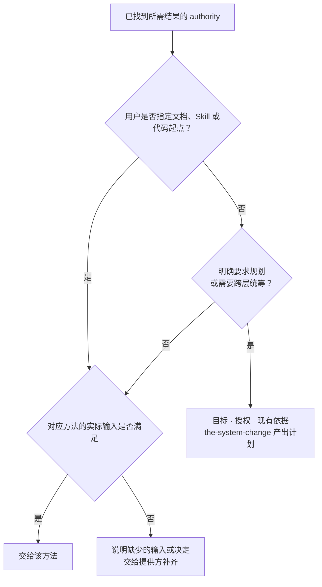

# 任务路由

## 1. Task

帮助 Primary Agent 从当前请求找到工作入口。先判断用户要取得的结果，再读取对应 authority 的进入
条件并交接。本 Skill 由 Primary Agent 直接使用，不需要独立 Runtime Module，也不要求项目 Registry。

## 2. Reader Gain

Primary Agent 能判断该继续现有工作、进入所属方法、先用 System Change 做计划，还是先问清问题；
能找到下一步的准确依据，不凭文件名选 Skill，也不把每一次 Design 修改都转成计划任务。

## 3. Entry and Exit

### 3.1 Entry

新请求或目标、范围发生实质变化时判断入口。若已有明确路径且正在继续同一任务，直接按原路径
继续，不把“继续”、本地修订或一次工具失败当作新的顶层请求。

输入至少要能说明当前想取得什么结果及已有授权。先用 `designDoc/the_task_routing.md` 找到所需
authority；具体业务入口读取项目 Charter 指明的工作导航。只有当前判断需要的背景才继续加载。

### 3.2 Exit

交接时让 Primary Agent 知道：本次要取得什么结果、由哪个 authority 负责、先读哪里或进入哪个方法，
以及为什么。可以直接用一段工作说明表达，不手写 request ID、hash 或 Registry release。

无法确定结果、负责人或入口时，指出具体缺口并提出足以继续的问题。没有现成入口不能靠创建 Registry
或选择相近 Skill 掩盖；该问题交给相应负责人或用户决定。本 Skill 完成交接后结束。

## 4. Execution Contract

### 4.1 Inputs and Authority

- 当前请求、明确授权、已有工作或计划（如有）。
- `designDoc/the_task_routing.md`：Portable 意图导航和 peer 交接边界。
- 所需结果对应的 Design authority：决定本方法的进入条件、工作要求和完成标准。
- 项目 Charter 指明的工作导航及其指向的领域依据：仅在定位项目业务或本地工作流时读取。

实际入口以当前环境中可解析的文件和已提供的工具说明为准。缺少文件、彼此冲突或未满足前提时
说明实际问题，不从聊天历史或目录相似性补一份 authority。

### 4.2 Output and Completion

完成条件是下一步入口和所需依据明确，或尚不能选择的原因已具体说明。路由判断不证明下游已经
执行、不授予权限，也不证明 Reviewer、Runtime 或数据库已经可用。

用户指定文档、Skill 或代码起点时直接进入对应方法；所属方法保留实际输入、检查和独立审核，
不额外追加 SystemChangePlan。未指定起点且需要跨层统筹，或明确要求统一规划时，交给 System Change。
工具不可用返回工具负责人，不因此改选逻辑主线。

## 5. Boundaries

| 边界 | 可观察的越界 |
| --- | --- |
| 根据所需结果选择入口 | 因为提到一个文件或模型，就选择名字相似的 Skill |
| 按指定起点交接 | 用户指定从文档、Skill 或代码开始，仍因没有 Registry 或已审 SystemChangePlan 而拒绝 |
| System Change 负责确有需要的拆分和顺序 | Routing 自己编写完整修改计划，或无条件把所有文件修改变成计划任务 |
| 各方法保留自己的实际输入与完成标准 | 把直接进入理解为可以跳过工程方案、权限或独立审核 |
| 项目工作导航负责具体本地路由 | 在 Portable Skill 中加入某个项目的业务清单或强制统一 Registry 实现 |
| Primary Agent 继续下游工作 | 路由结果声称候选已审、Module 已注册或项目已部署 |

## 6. Method

### 6.1 按结果找到所属依据

先用 Task Routing 文档第 1.1 节的导航找到 authority，再读取该方法。关键关系是：

- Design 编写：DDM → `the-design-authoring`。
- 稳定 Agent 方法的编写或修改：Skill Management → `the-skill-authoring`。
- Reviewer prompt 编写：Review Contract → `the-review-authoring`。
- 代码、schema、migration 或发布工作：Software Delivery → 其规定的工程或操作方法。
- Module、Workflow 注册或执行：Agent Runtime → 当前随包 client 文档和 runbook。
- 需要规划修改范围和依赖：System Change Governance → `the-system-change`。
- 只读审查：被审对象所属 authority → 其指定 Reviewer；不把 Review Contract 当作通用审核服务。

这里只定位已有方法，不重写它们的输入、审核标准或执行指令。实际项目业务交给项目 Charter 指明的工作导航。

### 6.2 判断是否需要先做计划

先判断用户是否指定起点。例如“先改这份 doc”“先修改这个 Skill”“从代码修起”，分别进入
对应方法，处理当前已授权的部分，说明后续层的依赖。请求整体涉及多层也不撤销指定起点；需要
扩大范围或改变顺序时提出具体问题，不自动退回统一规划。

没有指定起点且修改需要跨层统筹范围、职责或依赖时，或用户明确要求计划时，使用 System Change。
它从目标、授权和现有依据开始编写计划，不要求先有 SystemChangePlan、计划 Schema 或构建器。
目标本身或有权负责人尚未决定的取舍不清楚时，只请求影响当前工作的具体决定。

直接进入不免除所属方法的要求：文稿和 Skill 仍检查并独立审核；代码实现仍先完成适用的工程方案
与审核。不能把工程方法自身的 CodeDesignBasis 误当成必须另有 SystemChangePlan。

### 6.3 交接与继续

计划已审核时，Primary Agent 按当前步骤取得负责人、方法、输入和完成要求，在本 Skill 外继续。
候选缺陷返回作者；计划缺项返回 System Change；工具或 Reviewer 不可用返回其真实负责人。
只有用户需要的新结果或真实的归属变化才需要重新判断入口，不在失败后盲试邻近 Skill。
