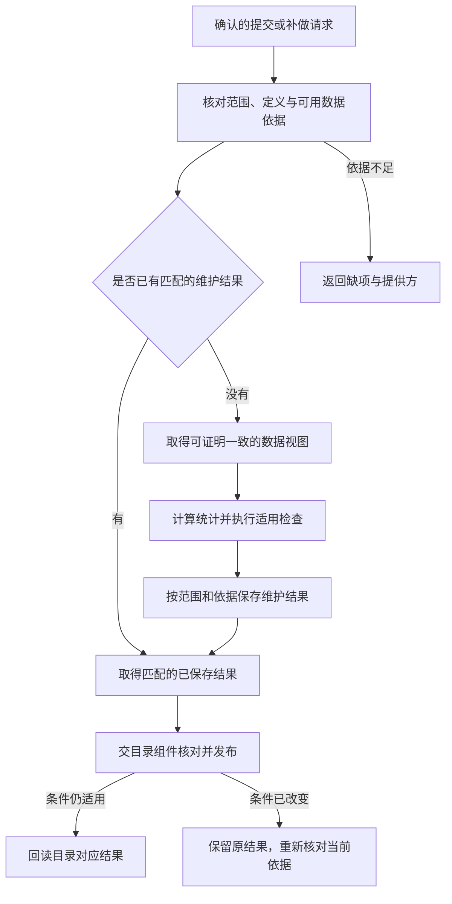

# 提交后目录维护：如何补齐信息而不重复写入业务数据

本文是写作示例，描述拟定逻辑，不表示目标项目已经实现这些入口。实际采用须绑定所属领域设计、正式接口和当前实现依据。示例不建立独立产品 authority，frontmatter 的 `parent: null` 表示该演示文件没有作为正式领域子设计采用。

## 0. Intent Capsule

本能力在 writer 确认提交后，整理对应数据的统计、覆盖与质量结果，并请求目录发布。它也处理维护重跑和遗漏补做。输入来自准确提交及项目定义，输出为已保存的维护结果、目录交接结果或明确缺项。

writer 保留数据修改和验收责任；目录组件保留关联与发布责任。维护操作不重新提交业务数据。

## 1. Primary System Flow

通知用于及时启动，可靠提交记录用于发现漏项。若项目还没有可核对的提交依据，本能力应报告该前提缺失，不能承诺已经具备无漏项恢复。

## 2. User Intent

使用者希望已提交数据的目录信息可解释且能恢复。维护失败不应使数据提交事实消失，重复通知也不应导致重新写入或重复累计。

## 3. Reader Gain

实现人员能区分数据写入与目录维护，明确同一依据下可以复用什么、何时需要重新计算，以及部分失败后从哪里继续。验证人员能用提交后修订、重复处理和通知遗漏检查这些行为。

## 4. Capability and Operation

### 4.1 输入与前提

维护接收业务数据集、提交依据、影响范围及适用定义。调用者须能通过项目的受控入口证明提交已经发生，并取得允许读取的数据视图。项目 owner 提供版本判等、因果顺序和当前可读选择的含义；通知到达时间不代替这些含义。

统计、覆盖和质量结果必须说明各自对应的范围及依据。批次质量只能支持该批次的结论；对全数据集的统计不能借用一批局部质量结果声称全部通过。

### 4.2 复用、计算与交接

先查找与本次数据依据、范围和定义一致的已有维护结果。符合条件时复用；不足部分在项目可提供的一致数据视图中取得。无法再次读取过去状态时，说明结果来自当前视图或匹配的已保存证据，不能追认成原提交时的状态。

新计算的结果先按其数据依据、范围和定义保存；确认保存后，再将满足组合条件的结果交目录组件。目录组件负责核对当前选择与适用条件；条件已变化时，保留有依据的历史结果并重新核对，避免旧维护结果覆盖当前目录。

### 4.3 修订与补做

同一条 bar 的内容修订通过既有 writer 的准确修改依据进入维护。最大 bar 时间不变不会使本次维护自动跳过。重复处理同一依据复用已保存结果；需要刷新整个数据集统计时重新计算相应视图，不把批次行数累加成全量业务对象数量。

补做从最早缺失的维护结果继续：已有统计但目录未对应时只补目录交接；统计也缺失时先补统计。业务数据的 writer 不在恢复路径中重复执行。

## 5. Public Interface and Effects

下表定义需要绑定的逻辑操作，未指定实际 CLI、API 名称或存储表。

| Operation | Input | Observable result and effect |
| --- | --- | --- |
| Request maintenance | 已确认提交、影响范围、定义及可用数据依据 | 保存匹配的维护结果，交目录组件发布；不修改业务数据 |
| Inspect maintenance | 明确范围与需要核对的提交依据 | 返回已完成、缺失和无法核对的部分；纯读取 |
| Resume maintenance | 原依据与已完成部分 | 只补未完成工作，保留原提交及适用结果 |

公开错误形式使用采用项目的接口约定。调用者必须能分辨“数据依据不足”“统计或检查未完成”“目录发布未完成”和“适用条件已改变”，具体错误码由实现接口 owner 定义。

## 6. Completion, Failure, and Recovery

单次维护完成，表示对应范围的必要维护结果已保存、目录交接已确认，并且最终核对仍支持所声称的对应关系。质量失败可以是一个完整保存的维护结果，不能被改写为业务数据可用。

统计失败时保留提交依据和未完成项。发布结果未知时先回查目录对应关系，再决定是否补交；避免把未知直接解释为失败并重复执行。恢复后再次核对当前定义、范围和选择，旧结果只有仍适用时才能复用。

## 7. Dependencies and Verification

本能力依赖项目的提交核对、受控读取、业务定义与目录发布。版本、权限和检查规则由相应 owner 提供；内部计算算法与保存方式由 Code Design 选择，但必须满足已定义行为。

验收应覆盖同一请求重跑、同一 bar 修订但时间上界不变、统计成功而发布失败、通知遗漏、处理期间当前选择变化，以及无法重读历史状态。每个用例分别观察业务写入次数、维护结果依据与目录最终对应范围。

本示例只说明需要验证什么，未执行数据库检查，也不提供生产阈值。

## 8. References

- [同一试点的业务项目说明](meta_de_project.md)
- [样例用途与范围](README.md)
