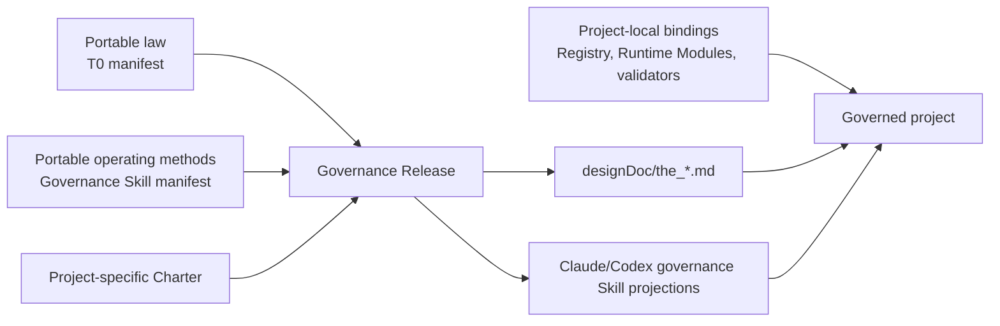

# Hoveath Governance Foundation

`09_soul/governance/` is the portable upstream for the complete T0 governance
system that Hoveath installs into a project. It carries reusable governance
intent, scaffolds, and deterministic release rules. The Charter is instantiated
for the target project during deployment; Hoveath does not impose one product's
Charter on another project.

## Portable 的复制与更新

Portable 只维护一份源内容。目标项目中的文件是这份内容的安装副本，由安装和更新工具复制，
不在各项目分别修改。安装与更新采用相同的复制范围：

| 来源 | 目标位置 | 复制内容 |
| --- | --- | --- |
| 选定来源的 `09_soul/governance/` | 目标 root 下的同名目录 | T0、Skill、Reviewer prompt、schema、校验工具和现有 manifest |
| manifest 声明的 Soul 依赖 | 目标 root 下的对应相对路径 | 该份 Portable 内容所需的共享资源 |
| manifest 声明的投影来源 | 目标 root 下的 `designDoc/`、`.claude/skills/`、`.agents/skills/` 中的声明路径 | 由现有投影工具生成的使用副本 |

复制以选定来源的完整内容为单位，源文件与随包 manifest 应一致。更新只替换 Portable 管理的文件，
保留目标项目的 Charter、`governance_bindings/`、业务代码和凭据；已有项目附加内容按现有投影规则保留。
Portable 内容需要修改时回到源文件，再复制到目标，避免只改某个项目的安装副本。

更新完成时，核对目标文件是否对应本次选定来源及其 manifest。目标旧副本与目标旧 manifest 一致，
只能证明旧安装内部一致，不能证明本次更新完成。文件复制与投影检查由代码执行，不逐份重新做语义审核。

Agent Runtime 是独立安装的软件包。注册或运行随包 Reviewer 时使用当前 Runtime 的现有公共接口；
Portable 文件复制不包含 Runtime 注册、数据库配置或模型调用，也不以这些操作为完成前提。

## 一键安装到新目录

从可信的本地源目录安装完整 Portable Governance，普通工作区与测试工作区使用同一入口：

```sh
python -B 09_soul/governance/t0/validation/install.py \
  --source-root /path/to/source-workspace \
  --target-root /path/to/new-workspace
```

源目录包含 `09_soul/governance/` 及 manifest 声明的 Soul 依赖。目标必须尚不存在，父目录须已存在。
命令复制源字节和依赖，按现有 manifest 生成 `designDoc` 与 Skill 投影，并提供 CLAUDE/AGENTS 入口。
AGENTS.md 指向 CLAUDE.md。
它不修改来源、补写 manifest hash、修复共享指令、覆盖已有目录或复制业务项目的 Charter、代码、凭据。

输出 JSON 包含 `source_sha256`、文件数量、T0/Skill 检查与 `project_requirements`。`source_sha256`
证明本次捕获的相对路径及文件内容一致，不表示正式发布或审核批准。相同源可以装入多个独立目录；
安装后继续修改来源，不会改变已有副本。Python、Runtime 执行配置等工具环境单独提供，不由该命令注册。

退出 `0` 表示复制和 Portable 检查通过；`1` 表示复制完成但包有问题；`2` 表示结构、路径或 IO 失败。
失败时目标若已创建会保留，供检查和恢复，不自动删除。`installed: true` 只表示文件已写入，不能替代
`package_checks_passed`。项目尚未提供 Charter 时单列为项目后续要求，不把它当成 Portable 文件生成。

## 更新已有目录

同一安装入口使用 `--update` 更新已有项目，复制范围与上文一致：

```sh
python -B 09_soul/governance/t0/validation/install.py \
  --source-root /path/to/source-workspace \
  --target-root /path/to/existing-workspace --update
```

目标须为已有真实目录。命令保留目标的 `CLAUDE.md`、`AGENTS.md`、Charter、配置和其他非 Portable
文件，使用现有 Skill 投影工具组合目标的本地附加说明。未加 `--update` 时仍拒绝已有目录。
因此更新不会补入新安装才有的默认编排导航；已有项目需要这段入口时，由项目一次性写入自己的入口文件。
原有 `--apply` 只刷新已安装源的投影；跨目录复制更新使用这里的安装命令。

更新前检查声明写入路径；复制中的 I/O 或投影失败可能留下部分更新，返回 `2` 并保留问题供诊断。
修正明确的来源或目标问题后，用同一来源重新运行即可补齐。复制完成但包检查未通过返回 `1`；
只有复制和检查都通过才返回 `0`。旧文件不自动删除，清单摘要不自动修复，重复更新保持相同内容。

## Deployment model



The reusable governance rules are reviewed when they change in Hoveath. A
project installation does not reclassify every T0 as product-specific and does
not create an aggregate governance-bundle review or announcement.
Project deployment generates the project Charter and performs deterministic
compatibility, projection, and enforcement checks.

Each released `the_*.md` file is portable law only. It may name logical
Registry, validator, inspection, and enforcement surfaces, but it must not
embed a consuming project's `src/`, test, temporary-review, repository, or
deployment paths. Project-local implementation truth stays in code-owned
registries and generated inspections. The project Charter states which parts
of the portable law are product-owned, externally enforced, or inapplicable.

## Boundary

Hoveath owns:

- reusable top-level governance intent;
- the complete reusable T0 baseline and scaffold used to instantiate a
  project's T0 system;
- projection and drift-checking rules shared across projects;
- portable authoring and review methods for design, code, Skill, data, Runtime,
  and software-delivery changes.

Each project owns:

- its product Charter;
- its instantiated T0 release as governed by that Charter;
- local T0 Registry bindings and Code Projections;
- product and domain specializations;
- implementation, deployment, and current operational state.

This is the Design Intent / Code Projection split at T0: Hoveath fixes the
portable law; local code and generated inspection fix the current facts. A
project does not edit portable law to make its present implementation look
complete.

## Release rule

Deploy `09_soul` first. Then the project adapter generates or supplies the
project-specific Charter before the release tool projects the full project T0
system from the installed Hoveath governance foundation. The portable release
tool validates and projects; it never authors the Charter.
A portable governance change is corrected upstream and re-projected; it is not
independently rewritten inside every consuming project.

Hash and compatibility checks prevent drift. They are mechanical deployment
checks, not a second semantic approval system.

Fresh-install order is fixed: the project adapter supplies the Charter, the T0
release applies and validates `designDoc/the_*.md`, then the Skill release
applies and validates host projections whose `first_authority_ref` now resolves.

### Governance 部署与工作入口

部署与使用是两件事。部署提供固定版本的文件和投影；使用时由 Primary Agent 根据当前请求，
读取 Task Routing 和所属 authority 的进入条件：

```text
部署 Portable Governance
  → 复制选定 Portable 内容及声明依赖
  → 提供 project-specific Charter
  → 投影并校验 Portable T0
  → 投影并校验 Governance Skills
  → Portable 文件部署完成

部署后收到请求
  → Task Routing 判断所需结果，找到所属 authority
  → 满足该方法的进入条件：直接进入
  → 需要拆分、确定依赖或该方法要求计划：System Change
  → 目标或负责人无法确定：提出具体问题
```

部署不调用 `the-system-change`，Portable 意图导航也不要求先建立项目 Task Routing Registry。
例如 DDM 允许目标、范围和负责人明确的授权 Design 请求直接进入 `the-design-authoring`，随后
仍按 DDM 完成检查、适用独立审核和源文件更新。其他方法按各自 authority 的现行要求进入。

项目业务的具体路由由项目 Charter 指明的工作导航提供。项目自己使用的 Registry、业务工具以及独立 Reviewer
的执行配置属于各自的实际依赖；缺少时如实报告，不把“文件已部署”说成“全部工作已经可执行”。
具体入口见 [Task Routing](t0/the_task_routing.md)，本说明不另立一套工作规则。

入口确定后的执行分工见 Task Routing §6.4：Primary Agent 负责目标、沟通、协调与验收；
执行方式按用户授权和当前宿主能力选择，不由安装的 Skill 默认指定外部执行宿主。

Universal leakage guards reject user paths, temporary Design paths,
implementation source and test paths, and virtual-environment paths. Each
project adapter may add product or repository identities through
`governance_bindings/governance_release_policy.json`; portable release code
does not hard-code one consuming project's name.

## DDM 文档检查

在项目根目录使用当前项目的 Python 运行随包 validator，无需另写检查脚本：

```sh
python -B 09_soul/governance/t0/validation/artifact_contracts/design_artifact_contract.py \
  --layer T0 designDoc/the_design_doc_management.md
```

把文件路径换成本次待检查文稿；`--layer` 支持 `Charter`、`T0`、`T1`、`T2`，同层文件可一次传入多个。
加 `--json` 返回机器可读结果，`--help` 查看完整参数。命令只读文件；全部结构检查通过退出 `0`，
检查失败退出 `1`，参数错误退出 `2`。它直接复用 DDM 的结构规则，不代表独立语义审核已经通过。

## 独立审核的执行

七类随包审核都经同一个 `t0/validation/runtime_review.py`，调用 Agent Runtime 的
`run_local_workflow_test`。各对象入口只负责准备、冻结材料和用所属 validator 校验结果；参数拼写和
映射在所有入口一致，由 Runtime 自己校验定义来源、资源文件、执行参数和能力：

| 参数 | 含义 |
| --- | --- |
| `--root ROOT` | 必填。Runtime 的 setup、注册定义与执行参数文件所在 root；不是模型读取许可 |
| `--workflow ID`、`--version V` | 本地定义；省略 `--workflow` 时取该 Reviewer 的 ID，省略 `--version` 取最近注册的版本 |
| `--workflow-ref`、`--workflow-sha256`、`--release-database-url-env`、`--release-schema` | PostgreSQL 中的准确定义，只读；DSN 只存在所给环境变量里，由 Runtime 读取 |
| `--transport`、`--model`、`--effort` | 本次执行参数；省略的项依次取 root 下 Workflow 参数文件、workspace 参数文件和 Runtime 默认 |
| `--run-timeout-seconds N` | 单次同步工作预算，原样交给支持该参数的 Runtime；省略时由 Runtime 按四层取值，受管理子调用仍受父级剩余期限约束 |
| `--resources FILE`、`--cli-path PATH` | 资源文件与 Provider 程序，原样交给 Runtime；工程审核入口自行生成资源文件，不接受 `--resources` |

时间参数需要支持该接口的 Runtime 版本和已采用当前编码的 Module；缺少支持时保留 Runtime 原错误，
不回退到本地计时器、修改 Reviewer 定义或另拼执行器。

Reviewer 由输入按其注册 schema 的版本确定，并作为 `expected_module_id` 交 Runtime 在调用模型前核对；
返回的记录必须来自该 Reviewer，且绑定同一份冻结输入。结果写入新的 `--output` 文件，不覆盖已有文件。
`--check-only` 和安装检查不需要 Runtime、凭据或 Provider。旧的 `--executor MODULE:FUNCTION` 与
`*_REVIEW_EXECUTOR` 环境变量已经退役，参数解析会拒绝前者，后者不再被读取。

已按注册 schema 准备好的输入可直接送审，例如 System Change、Reviewer prompt 或 Project Documentation：

```sh
python -B 09_soul/governance/t0/validation/runtime_review.py \
  --input path/to/prepared_input.json --output path/to/new_review_result.json --root path/to/runtime_root
```

它按 Reviewer 选用所属 validator；`passed` 退出 `0`，有效非通过或校验失败退出 `1`，参数、输入或执行
异常退出 `2`。执行失败不会形成 verdict。

`t0/validation/tests` 中凡经过 Runtime 的用例都是真实运行（`real_run`）：把本检出安装到临时 host、注册全部
随包 Reviewer，再经 Agent Runtime Test Run 和真实 Provider CLI 审核，不替换 Runtime、Provider 或定义存储。
运行它们需要 `PORTABLE_REVIEW_REAL_RUN=1` 和可导入的 Agent Runtime。Claude 用例需要已登录的 Claude CLI。
单次预算透传用例需要 `AGENT_RUNTIME_CODEX_BIN` 指向可执行且已登录的 Codex CLI，并以 Codex 执行；未设置时该用例显示为
skipped，即未验证。已设置但路径无效或不可执行时用例明确失败，登录或执行失败也按真实运行失败报告。
PostgreSQL 用例另需 `AGENT_RUNTIME_TEST_DATABASE_URL` 指向测试库；未设置时显示为 skipped，即未验证。

## DDM 独立文档审核

随包入口是 `t0/validation/artifact_contracts/design_review.py`。它接收明确的候选、目标、修改范围和
背景文件，经“独立审核的执行”运行已注册的 `design_contract_reviewer`，然后核验同一份受审内容与 Reviewer 输出：

```sh
python -B 09_soul/governance/t0/validation/artifact_contracts/design_review.py \
  --candidate path/to/candidate.md \
  --goal "本次需要达到的结果" --change "本次修改范围与要点" \
  --context peer_contract=path/to/relevant_peer.md \
  --output path/to/new_review_result.json --root path/to/runtime_root
```

Portable DDM 不导入项目配置或发行 Runtime release；数据库、Profile 和执行授权不需要 Primary Agent
在每次文档修改时重建。

文档检查不需要执行配置。独立审核缺少 `--root` 时会明确停止。输出仅在执行、完整 schema、结果一致性
和输入稳定性都通过后给出有效 verdict；`passed` 退出 `0`，其他情况退出非零。审核不会修改文稿、
注册 Module、设置 active pointer 或覆盖已有结果文件。`--help` 列出当前参数。

## Skill 检查与独立审核

随包 `t0/validation/artifact_contracts/skill_review.py` 使用现有 Skill schema、资源选择器和
`skill_candidate_reviewer` 输入输出合同。先检查候选，并按需生成临时自检表：

```sh
python -B 09_soul/governance/t0/validation/artifact_contracts/skill_review.py \
  --candidate path/to/SKILL.md --check-only \
  --self-check-template path/to/new_self_check.json
```

代码填入候选 hash 和完整 check_id。作者填写每行的 `exact_evidence`、`local_result`，以及尚未解决的
`unresolved_finding`；没有未解决问题时该值为 `null`。空表、遗漏项、未关闭问题或候选变化均不能送审。
自检是临时输入，不产生独立通过结论。只需查看检查结果时省略 `--self-check-template`。

```sh
python -B 09_soul/governance/t0/validation/artifact_contracts/skill_review.py \
  --candidate path/to/SKILL.md --goal "本次授权目标" --change "修改范围" \
  --self-check path/to/completed_self_check.json \
  --design path/to/owning_design.md --output path/to/new_review_result.json --root path/to/runtime_root
```

审核经“独立审核的执行”运行已注册的 `skill_candidate_reviewer`。Portable 工具不注册 Module、连接业务
数据库或回退到作者自审；缺少 `--root` 时明确停止。

`--context document_kind=PATH` 添加明确背景，`--prompt prompt_id=PATH` 添加本次声明的完整 prompt。
新 Skill 若需要自己的 checklist，可用 `--checklist-resource resource_id` 指定；必要的项目自有原文
用 `--resource resource_id=PATH` 提供，无需修改冻结 Portable manifest。补充资源不能覆盖随包已登记
资源，代码验证声明、读取字节和嵌入内容一致；来源选择是否符合任务仍由 Reviewer 判断。

检查输出和 Reviewer 输出分开；`passed` 只在执行、完整 schema、检查覆盖、结论及受审内容一致时
成立。工具不覆盖候选或已有结果；检查成功或审查 `passed` 退出 `0`，有效非通过结果或执行 record
校验失败退出 `1`，参数、输入、资源或执行异常退出 `2`。`--help` 查看参数。

## 实验方案检查与独立审核

[Agent 实验设计](t0/the_agent_experiment_design.md) 规定实验内容和实际结果的评价方法；
[experiment-authoring](skills/experiment-authoring/SKILL.md) 提供编写方法及独立 `experiment_reviewer` source。
随包检查入口为 `t0/validation/experiment_design/review.py`：

```sh
python -B 09_soul/governance/t0/validation/experiment_design/review.py \
  --candidate path/to/plan.md --design designDoc/the_agent_experiment_design.md --check-only
```

独立审核使用相同入口，提供 `--goal`、`--change`、新的 `--output` 和“独立审核的执行”中的 Runtime 参数；
完整参数见 `--help`。
它审核实验方案，不运行被测任务或给实际运行打分。准备者使用项目提供的 Runtime 使用说明，
不为每次审核重写执行器。

## 工程计划与实现审核

按 [Software Delivery](t0/the_software_delivery.md)，改交付代码前先用
`engineering-code-design` 编写 CodeDesignBasis/plan doc，并完成独立计划外审；实施后再审核
准确 commit。两者由 `engineering-change-review` 组织，使用同一个独立 `engineering_change_reviewer`。
计划通过不代表代码通过或授权部署。

在项目根目录使用当前 Python，随包入口支持两种审核目的：

```sh
python -B 09_soul/governance/t0/validation/software_delivery/engineering_review.py --help
```

计划审核提供 `--plan`、`--goal`、`--change`、`--criterion`、必要的 `--context` 与新 `--output`。
实现审核另加 `--repository`、`--commit`、对应的 `--plan-review` 和需复现的 `--commands`。工具从 Git 对象冻结
受审代码（变更文件两侧版本与准确 diff，另加 `--read` 指定的未变更文件或目录），并把 `--commands` 同时作为 Runtime
命令，`cwd` 为 `source/commit/...` 或 `scratch`；额外只读依赖用 `--dependency`。这一入口不接受 `--resources`。
当前材料支持 Git 普通文件（100644）和可执行文件（100755）。选中的变更两侧或 `--read` 范围含符号链接、
子模块等其他类型时，入口在写材料和调用模型前明确拒绝；不会将链接改写为文本或静默省略子模块。
完整用法在 [Engineering Review Skill](skills/engineering-change-review/SKILL.md)；执行参数见“独立审核的执行”。
`--check-only` 不调用模型，也不需要 Runtime。该工具不内置数据库、模型或 Runtime 注册；缺少 `--root` 时停止，
不能把检查通过说成外审通过。

## Three governed dimensions

The Governance Release keeps three dimensions distinct:

1. **Portable law**: `governance_t0_manifest.json` releases the reusable T0
   Design Intent into the project's `designDoc/the_*.md` authority surface.
2. **Portable operating methods**: `governance_skill_manifest.json` releases
   the Primary Agent methods used to route, design, author, and review governed
   changes. These Skills implement the law but do not become a second authority.
3. **Project-local bindings**: local Registries, validators, Runtime Modules,
   provider profiles, Skill binding addenda, and generated inspections state
   how the project currently enforces the installed law and methods.

One dimension may refer to another through typed IDs and hashes. They are never
flattened into one peer list: a Design Contract is not a Skill, a Skill is not
a Runtime Module, and a current implementation binding is not portable law.

The portable governance method release contains:

| Skill | Entry role | Responsibility |
| --- | --- | --- |
| `the-task-routing` | routing | Select one authorized semantic mainline |
| `the-system-change` | authoring | 从授权目标和现有依据编写普通 Markdown 统一计划，明确范围、负责人、依赖与验收，并组织独立审核 |
| `the-design-authoring` | authoring | Author one Charter, T0, T1, or T2 Design Intent candidate for independent review |
| `project-documentation-authoring` | authoring | Write concrete business, project, solution and technical documents; apply source-derived writing methods and independent project-document review |
| `the-skill-authoring` | authoring | 编写完整 Skill、组织独立审核并按授权更新源文件 |
| `the-review-authoring` | authoring | Author one complete Reviewer prompt source for its owning Design authority and independent execution |
| `engineering-code-design` | authoring | 编写工程计划、组织独立计划外审，再交给实现负责人 |
| `engineering-change-review` | review | 组织工程计划或 exact commit 的独立审核，核对准确对象与结果 |
| `experiment-authoring` | authoring | 编写实验方案及结果评价方法，组织独立 experiment_reviewer 审核 |
| `agent-work-coordination` | operator | Use native Orca CLI to coordinate explicitly delegated interactive Claude code and document work, bounded observation, handoff and acceptance |

`agent-work-coordination` is an optional host operation method. Its single Skill file contains native CLI recipes; using it requires an available Orca/Claude installation, but distributing the Skill does not install tools, enable hooks, select models, or make delegation mandatory.

`agent-runtime-registration` remains an Agent Runtime operator capability, and
`support-session-handoff` remains a session-support capability. Software
release, deployment, rollback, roll-forward, retirement admission, and their
terminal evidence remain a project-supplied Software Delivery capability.
Written-subject Reviewer Modules perform prose and communication review only
after semantic review passes; their registered output records `passed` or
`not_run` without introducing a separate Review authority.
These capabilities are not silently promoted into this governance method
release merely because the current project routes to them. The consuming project
must provide and verify a capability before a plan step actually uses it, not
before an author can draft the plan.

The method map for planned work is:

| Work kind | Portable method or declared external capability |
| --- | --- |
| Charter amendment | `the-design-authoring`, then the registered Design reviewer, plus the accountable Charter decision |
| Design Intent | `the-design-authoring`, then the registered Design reviewer |
| Skill | `the-skill-authoring`, then its registered independent reviewer |
| Engineering implementation | `engineering-code-design` followed by the implementation owner |
| Independent Engineering Review | `engineering-change-review` and its registered Runtime Module |
| Structural Design change | `the-design-authoring`, then `design_contract_reviewer` with the accountable parent and complete peer context |
| Governance Release install or upgrade | project adapter operator action: run T0 apply, then Skill apply, then inspect and remove only the exact reported retired roots; no portable authoring Skill |
| Agency Platform, Product Authorization, Data, Timestamp, or Audit policy | `the-design-authoring`; add Engineering methods only when code, schema, migration, or tests change |
| Runtime registration | project-supplied Agent Runtime registration capability |
| Release, deployment, rollback, roll-forward, or retirement | project-supplied Software Delivery capability |

The complete `09_soul` distribution is installed before the Governance
Release. Governance Skills may depend on stable Soul resources such as A14,
A21, `COMMUNICATION`, and `bestpractice_skill_writing`. When a Skill or Reviewer
must carry selected model-facing instructions by value, the Skill manifest
declares one read-only `instruction_resources` selector and the consuming
`package_files[]` row names it through `embedded_resource_ids`. The release
compiler replaces only the declared marker body and checks byte-exact parity;
it does not create another authority source. Project-specific communication
detail belongs in the project adapter rather than a second governance
contract.

## Module boundary

```text
09_soul/governance/
  governance_t0_manifest.json       portable T0 source/target/hash declarations
  governance_skill_manifest.json    portable governance Skill declarations
  t0/                               portable T0 Design Intent sources
    validation/
      t0_release.py                 stdlib-only T0 check and projection module
      skill_release.py              stdlib-only Skill projection and drift check
      artifact_contracts/           T0-owned Design and Skill artifact validators
      tests/                        portable T0 validation tests
  skills/                            portable Primary Agent governance methods

<project>/
  designDoc/the_charter.md          project-specific Charter
  designDoc/the_*.md                released T0 Design Intent projections
  governance_bindings/              hash-bound project Skill binding addenda
  .claude/skills/                   Claude governance Skill projections
  .agents/skills/                   Codex governance Skill projections
  <project code>                    local Registry, Code Projection and enforcement
```

`t0/validation/t0_release.py` owns only the portable T0 release mechanics:

1. parse and validate the portable manifest;
2. reject missing, hash-drifted, absolute, escaping, or duplicate paths;
3. reject a portable source that embeds project-local implementation paths and
   check whether a project's T0 law projections equal their Hoveath sources;
4. validate active and retired T0 reference closure in portable sources and the
   project Charter;
5. report undeclared, retired, missing, or drifted source and target members;
6. write exact projections when explicitly run in apply mode.

It does not author a Charter, run project-specific validators, edit a Registry,
select T0 meaning, or announce a release. The consuming project's adapter owns
those local actions and must supply a project-specific Charter before treating
the released files as a complete local T0 system.

`t0/validation/skill_release.py` validates Skill identity, role, subject, T0
dependency closure, instruction-resource selectors and hashes, every declared
package-file hash, embedded marker closure, host target, and exact projection
bytes. `SKILL.md` projects to both Primary Agent hosts. Ordinary package files
outside `runtime_modules/` project to the hosts their manifest row declares;
files that `SKILL.md` links by relative path should be declared for both hosts.
A portable governance Runtime Module may additionally release its fixed prompt,
semantic schemas, and provider-neutral Module registration under the canonical
Claude Skill Package surface only; those files remain part of the same portable package,
not project-local copies. A project may declare a hash-bound addendum in
`governance_bindings/governance_skill_binding_manifest.json`; the release
mechanically composes the portable method followed by that project binding.
This keeps a local Runtime Module ID or workflow entry out of portable Hoveath
while leaving both host projections reproducible. The addendum may explain
reachability and binding; it cannot duplicate the model-ready prompt or grant
execution authority. A new or materially changed addendum enters a Skill Work
Package and receives the registered `skill_candidate_reviewer` judgment before
its hash enters the binding manifest; an approved bootstrap review records its
limitation and successor cross-review obligation.

`governance_bindings/governance_release_policy.json` uses
`governance_release_policy_v3`. Every project policy supplies three arrays:
`forbidden_source_fragments`, `retired_t0_targets`, and
`project_specific_t0_targets`. The last array explicitly registers project-owned
`designDoc/the_*.md` surfaces that remain discoverable without becoming portable
T0 projections. Existing installations add the field with an empty array when
they have no project-specific target.

Shared-instruction projection follows one fixed flow:

```text
canonical source
  → selector + selected-byte hash validation
  → pure package-file composition (no write)
  → Skill authoring/review/acceptance outside the compiler
  → accepted full-file hash + embedded parity validation
  → check report or declared host-projection apply
```

`--check` reports `governance_skill_embedded_block_drift` for an accepted
consumer whose embedded bytes differ from its canonical selection, and reports
`governance_skill_projection_drift` when a host projection differs from the
validated projection payload. `--apply` fails before writing any projection if
embedded parity is not already satisfied. It writes only declared host
projections; it never rewrites portable Skill sources or the manifest.

Selector or selected-hash failures return
`GOVERNANCE_SKILL_INSTRUCTION_RESOURCE_INVALID`. Invalid or overlapping target
markers, undeclared resources, dependency-closure violations, and apply-time
embedded drift return `GOVERNANCE_SKILL_EMBEDDED_RESOURCE_INVALID`. Existing
source-closure and atomic projection-write failures retain their existing
stable error codes.

The release module does not register product Skills, admit Runtime releases,
choose a provider, or copy project-local business instructions into Hoveath.
Workflow topology, authorization, Execution Profiles, release versions, Code
Projections, and data-store admission remain consuming-project bindings.

In a Module registration, `skill_package_owner_contract_path` names the
contract that owns the Skill entry and subject lifecycle;
`module_owner_contract_path` names the contract that owns the Module's
semantic method. They may differ. Each Reviewer Module lives in the Skill
Package that belongs to its target Design authority: Design review under
`the-design-authoring`, Skill review under `the-skill-authoring`, System Change
Plan review under `the-system-change`, and Engineering review under
`engineering-change-review`. Review Contract's own prompt reviewer lives under
`the-review-authoring` as `reviewer_reviewer`. Review Contract supplies only the byte-exact
universal Reviewer rules and Reviewer-prompt authoring contract; it does not
take ownership of those subject-specific review methods.

A Governance Release is mechanically clean only when both release modules
report clean. Their manifests remain separate because law and operating method
are separate governed objects.

The Skill release apply mode is intentionally non-destructive: it writes only
declared projections. The project adapter handles findings by code:

- `governance_skill_retired_projection_present` and
  `governance_skill_undeclared_package_member` require inspection and removal of
  only the exact reported obsolete path;
- `governance_skill_retired_projection_reference` identifies an active,
  project-owned Skill that still names a retired identity. It returns to that
  Skill's owner through a Skill Work Package for reference migration. The
  adapter must not delete the referencing Skill;
- `governance_skill_undeclared_source_member` and
  `governance_skill_undeclared_source_directory` identify drift inside the
  installed portable source package. They return to the Governance Release
  owner for source/manifest correction rather than project-owned path deletion.

This separation prevents an automatic projector from deleting user-owned files
merely because a manifest or referenced identity changed.

Independent release review evaluates the project Charter, complete portable T0
set, complete portable governance Skill set, both manifests, release tools,
and deterministic evidence as one layered package. T0 contracts remain peers;
Skills remain operating-method projections and never enter the T0 peer table.

The manifest carries every reusable peer T0 contract; the project-specific
Charter remains outside it.
