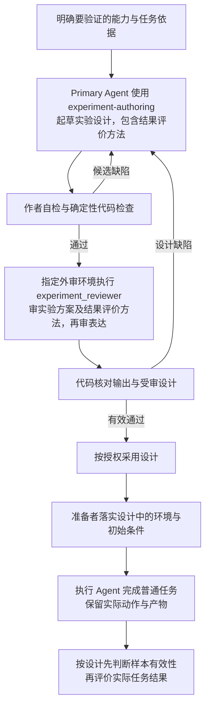

# Agent 实验设计

实验设计说明要验证 Agent 的什么能力、让它完成什么任务，以及怎样根据实际行为和结果作出判断。
本 T0 固定共同要求；具体任务、运行配置和检查实现由项目提供。

## 0. Intent Capsule

输入是明确的验证目标、真实任务依据和可用环境。输出是一份包含任务、实验条件、预期动作、证据与
结果评价方法的完整实验设计，经独立 `experiment_reviewer` 审查后交给实验准备者使用。

## 1. Primary System Flow

实验起草与独立实验审查是两段工作。设计中写明如何评价执行结果，Reviewer 审查这套方法是否
足以支持判断；设计通过不表示实验已运行，也不表示 Agent 已完成任务。实际运行与评价按通过的设计进行。

## 2. User Intent

用可复核的任务证据判断 Agent 是否能正确找到工作入口、使用允许的能力并完成任务，而非根据演示、
自述或一个审核通过标签推断能力。不同任务与模型使用一致的比较依据，能够区分方法、环境与执行问题。

## 3. Reader Gain

读者能够在运行前判断实验将产生什么证据，在运行后判断这些证据支持多大范围的结论。

- 实验作者能把“Agent 能不能独立完成工作”落实为需要观察的动作与结果，区分任务所需的合理输入
  和会泄露答案的提示，判断完成标准是否真正检验了目标能力。
- 实验准备者能分清目标项目规则、共享软件和模型执行配置的作用，依据实际上下文判断环境是否符合
  实验前提；遇到缺件时，知道应补齐环境还是澄清任务，不把准备工作转交给被测 Agent。
- 实验审查者能判断每个预期动作是否有可取得的证据，评价方法能否区分完成、部分完成和未观察到，
  从而发现正文齐全却无法支持结论的方案，指出影响判断的具体缺口。
- 结果评价者能把实际行为、最终产物和产物审核分别核对；在证据充分时区分实验前提不符、工具失败
  和 Agent 未完成，并识别哪些差异可归于单一变化，哪些只能解释为配置组合的差异。证据不足时保留未知。

## 4. Owned System Object

本 T0 拥有 Agent 实验设计的共同内容、有效性条件和结果评价要求。实验设计包括执行后的评价方法，
但不等同于某次运行记录或评价结果。

## 5. Authority

本 T0 决定实验在运行前必须讲清哪些条件，哪些证据能够支持任务评价，以及何时可以比较或归因。
项目与领域负责人决定具体任务的正确结果和允许动作；代码验证可计算事实；独立评价判断内容与行为。

实验写作使用 `experiment-authoring`，完整方案由独立 `experiment_reviewer` 审核。本 T0 拥有实验方案
的内容结构和专用检查项；Reviewer source 由 `experiment-authoring` Skill Package 保存。Review Contract
提供通用规则，Runtime 提供共同返回格式、独立执行、工具限制和记录能力。

本 T0 文档自身按 DDM 审查，authoring Skill 自身按 Skill Management 审查。具体实验方案使用本文的
实验结构与检查项，不因名称含“设计”就套用架构合同层级或 DDM 的专用 checklist。

## 6. 实验设计的内容

### 6.1 先明确任务与可观察结果

完整实验方案按下表六部分组织，标题连续编号；只有比较实验才展开适用的对照与统计内容。
用例和输入材料可独立引用，主方案应足以确定如何执行与评价，不为每一部分建立额外记录类型。

| 固定部分 | 必须填写的内容 | 这一部分决定什么 |
| --- | --- | --- |
| 1. 验证目标与任务 | 能力问题；执行者收到的完整任务原文；任务正确性的依据；本次不检验或不改变的范围 | 到底测什么，哪些结果能够回答这个问题 |
| 2. 输入与初始条件 | 输入材料及准确位置；目标文件或对象；修改前基线；有意缺失的信息与缺失理由 | 执行者实际拿到什么，从什么状态开始 |
| 3. 环境与独立性 | 按第 6.2 节填写项目规则、模型配置、工具能力、权限、平台通用条件及启动证据 | 在哪些条件下测，怎样确认这些条件真实成立 |
| 4. 预期动作与完成 | 按“动作、作用对象、必要前提、预期结果、验证证据”列出需要观察的行为；写明最终产物和完成条件 | 什么行为必须发生，什么结果算完成，哪些等价方法可以接受 |
| 5. 证据与评价 | 原始证据的取得方式与位置；代码检查项；独立评价内容；各评分条件；失败、越权和证据不足的处理 | 每项结论凭什么成立，代码与评价者分别判断什么 |
| 6. 复测与比较 | 单次探索或比较的选择；重复安排与任务集合；固定及变化条件；基线恢复方式；排除、平局和未知结果的处理 | 结果可以比较和推广到哪里，怎样重复取得可比证据 |

任务和预期来自明确要求。固定必要结果与依赖，不把某个命令、措辞或阅读顺序设成唯一答案。
每个要求都对应可以取得的证据；任务本身缺少必要决定时，提出具体问题可以是完整结果。

### 6.2 环境、指令与审核入口

每份实验方案在“3. 环境与独立性”下使用以下六个小节。T0 固定必须填写的内容；具体项目路径、选择和
实际值填在实验方案中。可从代码或配置取得的值直接引用其输出，不再手抄一份当前清单。

| 实验方案的小节 | 必须填写什么 | 从哪里取得 | 这一部分规定什么 |
| --- | --- | --- | --- |
| `3.1 项目与规则` | 目标项目根目录；实际入口文件路径；入口要求加载的规则、Design 和 Skill 来源；采用的治理包版本或准确内容快照 | 目标项目自己的 `AGENTS.md`、`CLAUDE.md` 或等价入口，以及其指向的文件与安装信息 | 哪个项目的规则约束执行者，哪些其他项目规则不能进入上下文 |
| `3.2 模型与运行配置` | Runtime、SDK 或 CLI 版本；选定 Profile 或配置文件；Provider、模型及适用的推理档位、上下文和执行预算 | 已安装 Runtime 的公开配置与宿主实际使用的运行配置 | 本次使用什么模型条件，哪些条件固定、哪些是要比较的变量 |
| `3.3 工具与审核入口` | 执行者可用的实际工具或工具集引用；所需功能；调用的检查与 review function；各 Reviewer 的执行入口及其工具能力 | 目标项目工具说明、已配置函数，以及 Runtime 的 Module/Profile binding | 哪些能力可被调用、哪些检查由代码完成、独立审核交给谁；不要求作者临时拼接调用 |
| `3.4 权限与副作用` | 允许读取和修改的文件或目录；涉及的数据库或外部服务范围；网络、命令、提交、发布等动作是否获准；授权来源与实际限制方式 | 本次用户授权、项目访问规则和宿主权限配置；数据库访问另取对应权限与数据绑定 | 可用工具在本次任务中能对哪些对象做什么；区分文字约束与代码或系统强制限制，不记录凭据正文 |
| `3.5 平台通用条件` | 平台自动加入的通用指令及其来源；全局规则、Skill 发现、插件、hooks、记忆和会话继承的启用情况；不可查看的部分及其影响 | 执行平台和宿主的公共配置、启动说明及可取得的实际初始化信息 | 哪些上下文是平台固定提供的，哪些来自目标项目；共享软件的安装目录不因此取得项目规则权威 |
| `3.6 启动与核验依据` | 实际启动命令或 API；进程目录与项目根的设置；新建、续接或子任务的选择；初始上下文、指令来源和工具权限的核验证据位置 | 准备者使用已选启动入口取得的实际配置、初始化与执行记录 | 设计声明的条件怎样与实际生效条件核对，缺少证据或发现不一致时由谁处理 |

填写时给出准确值，或能唯一解析到这些值的配置引用。不能只写“用默认模型”“沿用现有权限”或“环境
已经隔离”。不适用的项写明理由；尚未确定或无法观察的项写明缺口及其对实验结论的限制。设计提出的
条件与已经验证的条件分开，必要条件未落实时由准备者补齐，不能直接当作有效运行。

基础文稿 Reviewer 依据已提供材料完成判断，不要求它使用额外工具。确有附加工具时，在 `3.3` 和
`3.4` 写明用途与权限；工具名称可见不表示已使用，也不代替实际能力核验。

实验实际包含的被测执行者、实验方案 Reviewer、任务内产物 Reviewer 和结果评价者如使用不同配置，分别填写对应项；
相同配置可以共同引用，不重复抄表。完整治理包保留在目标项目中；其他项目规则、父会话及评分答案
不得因启动方式或软件依赖自动混入。新会话或 Shell 目录本身不构成独立性证据。

准备者与环境维护者负责上述配置及其核验。执行 Agent 按所属方法使用现成代码检查、独立审核和返回
校验，不另开 Provider CLI 重做底层验收；遇到实际错误或越界迹象时保留证据并交相应负责人。

### 6.3 在设计中写清怎样评价实际结果

先确定样本是否符合声明的环境、输入和初始条件，再判断任务表现。上下文混入、评分答案泄露、错误
基线或准备者中途改变条件，使样本不能支持原定的独立能力结论。缺少证据时明确未知，不默认有效。
符合条件时发生的真实任务失败仍应保留并计入结果，不只汇总成功样本。

评价同时检查最终产物和必要动作。读取了文件不证明理解，Reviewer 返回通过不证明源文件已经采用，
执行记录存在也不证明内容正确。每项判断引用输入、工具返回、差异或运行记录；不索取隐藏推理。

代码先核对结构、参数、引用、内容一致性及其他可计算事实。内容保真、任务完成质量和合理工具选择
由独立评价判断；执行者的自述只是辅助证据。评价者采用原任务和目标项目规则，不追加自己所在环境的要求。

同一批执行意图基准共用三项评分，并在运行前固定具体适用解释：

| 项目 | 2 分 | 1 分 | 0 分 |
| --- | --- | --- | --- |
| 路径正确 | 初次进入正确主线并自行找到依据与方法 | 曾偏离，但能自行纠正 | 留在错误主线，或必须人工指路才能继续 |
| 工具合适 | 使用允许的现成能力，参数与副作用合适 | 无越权，但有无必要的装配或重复探测 | 越权、擅自扩建工具，或绕过规定入口 |
| 任务完成 | 指定结果完整正确，必要动作与最终更新有证据 | 部分正确，仍有未完成要求 | 核心结果未实现、错误，或违反关键授权及采用前提 |

没有证据的项目写明未观察到，不猜分。三项分别报告，关键越权、编造和实际失败单独说明，不用平均分
掩盖。领域质量、耗时、费用等额外指标须事先定义来源、计量方式及缺失处理；它们不改变上述共同含义。

### 6.4 六类能力按任务使用

| 能力 | 实验设计应作出的安排 |
| --- | --- |
| 确定性验证 | 把代码能够判定的检查交给代码，保留命令、结果和适用范围 |
| 依据与编造检查 | 明确待核验陈述及来源；需要统计时定义分母和证据不足的处理，不以模型自信代替支持 |
| 执行轨迹评价 | 检查影响结果的必要动作、依赖与副作用，不要求固定推理或操作次数 |
| 独立模型评价 | 评价者与执行者分开，使用同一标准和证据；明确样例校准与人工复核方式 |
| 模型或配置比较 | 固定任务与非比较条件，通过 Runtime 执行选定配置；条件同时变化时只报告组合比较 |
| 回归使用 | 将稳定任务和预期用于后续回归，明确覆盖范围；实际 CI 和发布阻断由 Software Delivery 实现 |

比较实验事先说明重复次数、任务集合、评价配置和胜负或平局的依据。报告可比样本数、排除原因和
证据不足情况，不静默丢弃失败。少量样本用于发现问题，不自动支持普遍稳定性或模型优劣结论。
输入、规则或被测实现改变后形成新的比较条件，旧结果不改写成新条件下的通过。

## 7. 审查与完成

### 7.1 确定性检查

代码先按第 6.1 节的六部分和第 6.2 节的填写项，检查适用的结构、必要值与资源引用；对实际机器输入
使用对应格式检查，固定受审内容并核对返回。
实际实验中的版本、路径、记录匹配和评分汇总等机械事实也由代码处理。具体检查实现与当前状态由
项目工具提供；文稿不会因列出要求就证明检查已经实现或运行。

### 7.2 语义审查

独立 `experiment_reviewer` 审查完整实验方案，判断实验能否支持其声明的能力结论，包括执行结果怎样
评价。它不执行实验或给某次运行评分，也不把方案当成架构合同审层级。核心输入是当前方案、授权目标、
必要任务依据、本 T0 和实际代码检查结果；背景只用于判断，不成为新的修改对象。

以下是实验专用 checklist 的唯一语义来源，由代码原文提供给 authoring Skill 和 Reviewer prompt：

<!-- experiment-review-checklist:start -->
| check_id | 必须判断的实验内容 |
| --- | --- |
| `experiment_goal` | 任务与测量是否真正回答授权的能力问题，拟得结论是否与实验覆盖相称 |
| `task_and_expected_actions` | 普通任务、真实输入、预期动作与完成条件是否一致，是否存在未说明的必要决定或评分侧暗加要求 |
| `environment_and_independence` | 项目规则、平台通用条件与启动方式能否构成所需独立环境，核验依据能否支持条件成立，是否防止其他项目指令或答案混入 |
| `execution_and_permissions` | 所填模型、工具与权限是否满足实验目标和授权，准备与执行分工、现成审核入口、必要依赖及副作用是否一致 |
| `evidence_and_measurement` | 是否能收集支持判断的原始证据，代码检查与语义评价是否分工正确，是否会用自述或通过标签代替实际行为 |
| `evaluation_and_attribution` | 实际结果怎样评分是否明确，能否区分样本前提不符、任务失败、部分完成、正确停止、越权与证据不足 |
| `comparison_and_repetition` | 重复、基线和比较条件是否与目标相称，变量变化、样本选择及胜负解释是否公平，是否避免超出证据的归因 |
| `failure_and_recovery` | 中断、真实错误、条件漂移与复测如何处理是否明确，是否保留失败并保护初始资料、其他工作和原始结果 |
| `prose_and_meaning_preservation` | 前八项成立后，正文是否清楚、精简并保持任务、权限、测量、评分与结论边界 |
<!-- experiment-review-checklist:end -->

前八项逐项判断各自适用的要求，不能因采用单次探索就强制增加对照组或统计服务；此时检查结论是否
保持在该实验能支持的范围。每项给出 assessment 和相关 finding；前八项通过后才做共同表达检查。
Review Contract 的通用规则和 Runtime 的共同结果结构保持不变，不复制 DDM 的检查项身份或另造结果格式。

### 7.3 表达审查

语义通过后由同一独立 Reviewer 检查中文表达、层次、重复和语义保真。正文写稳定要求与判断依据，
任务实例和原始记录单独保存。表达修改不改变样本条件、权限、评分含义或失败后果。

### 7.4 完成条件

实验设计完整、适用代码检查通过，并取得指定外审环境中独立 `experiment_reviewer` 对准确候选的
有效结果后，作者才按授权采用设计。不能自行把父会话 Sub Agent、作者自检或另一 Reviewer 的意见
改称这份独立外审。入口不可用时报告真实问题，不静默换通道。

`passed`、`non_pass`、`blocked` 及 `fix`、`block`、`note` 使用 Review Contract 的共同含义；
代码验证共同结果与本次候选一致。设计通过只表示设计可用，实际实验仍须落实并验证其条件。

## 8. System-wide Invariants

1. 实验在运行前明确任务、预期动作和实际结果的评价方法，运行后不改答案以迁就结果。
2. 独立性以实际项目上下文和输入来源为依据，不以会话名称、命令目录或模型自述代替。
3. 准备者提供可用环境；执行者使用现成能力并处理实际故障，不承担未声明的基础设施验收。
4. 代码检查可计算事实，独立评价判断行为和意义；任何一种通过都不替代另一种结果。
5. 样本有效性、任务表现和产物审核分别判断；失败与证据不足保留真实状态，不回写成成功。
6. 起草与指定独立外审分开，审核通过与运行、注册及发布授权分开。

## 9. Peer Boundaries

| 对方 | 本 T0 提供 | 对方保留 |
| --- | --- | --- |
| 项目与领域负责人 | 实验定义和可信评价的共同要求 | 具体任务含义、正确结果、输入和允许动作 |
| DDM | 本 T0 的目标与职责声明 | 本 T0 等架构合同的文档结构与 Design 审查，不接管实验方案的专用检查项 |
| Skill Management | `experiment-authoring` 的任务含义 | Skill 的结构、发现、编写和独立 Skill 审查 |
| Review Contract | 需要审核的实验设计及其判断依据 | 通用审核规则、结果含义与 Reviewer prompt 纪律 |
| Agent Runtime | 明确的执行上下文、输入、工具要求和选定比较条件 | Module 执行、隔离、格式校验、真实记录与模型配置 |
| Software Delivery | 可复用实验和预先定义的回归判断 | 测试代码、运行工具、CI、发布与部署 |

## 10. References

- Design Doc Management：`the_design_doc_management.md`
- Skill Management：`the_skill_management.md`
- Review Contract：`the_review_contract.md`
- Agent Runtime：`the_agent_runtime.md`
- Software Delivery：`the_software_delivery.md`
