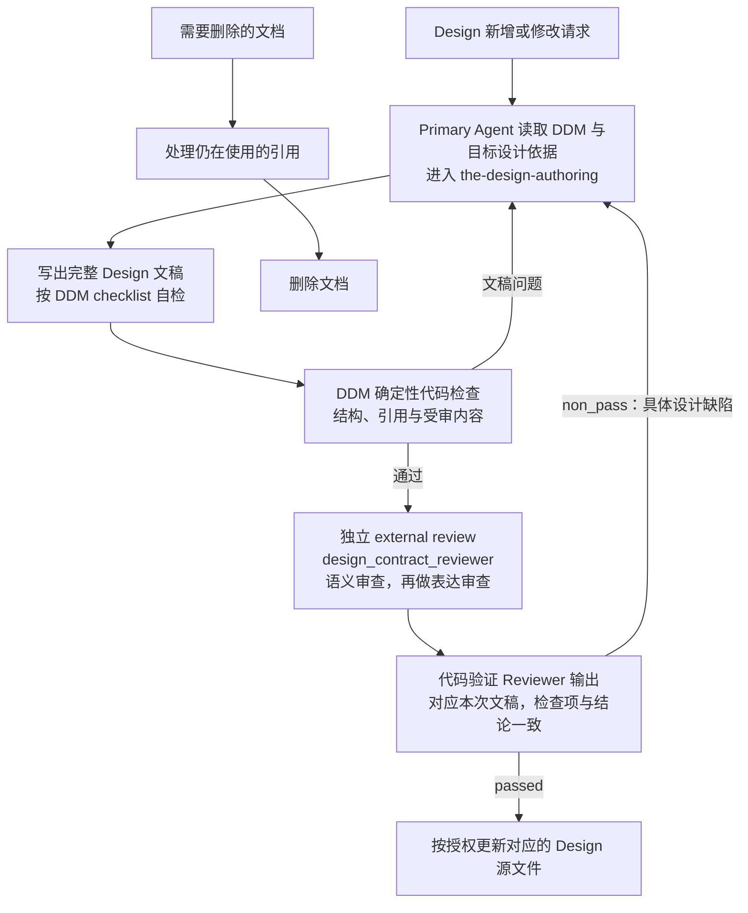

# 设计文档管理（Design Doc Management）

Design Doc 使读者知道要建设或改变什么，哪个主体对什么对象执行什么动作、交付什么结果，以及怎样判断结果成立。
DDM 规定这种文档怎样写、怎样被找到和审查。文档内容由各自负责人决定；代码说明实际实现。

## 0. Intent Capsule

```yaml
layer: T0
```

本 T0 管理 Charter、T0、T1 和 T2 Design Intent 的表达与采用。输入是明确的设计请求、适用的上游
规则和已有文档；输出是可供读者理解、实施或作决定的设计，以及适用的独立审查结果。
正式文档有一个确定来源；当前采用内容和修改历史由版本控制及发布工具记录。

## 1. Primary System Flow



输入必须使作者明确本次要改变的结果和范围；输出必须使下一位读者完成本文对应层级的判断。
流程图表达职责与必要依赖，不要求每个节点有独立接口、记录或批准状态。涉及新的产品或架构取舍时，
由用户或其明确委派的负责人决定；已授权范围内的写作、自检与修订由 Primary Agent 连续完成。
检查发现问题时修正文档，缺少信息时补齐依据。它们是本次工作的处理结果，不是文档的使用状态。

Design 写作由 `the-design-authoring` 承担，独立外审固定使用 DDM 所属的
`design_contract_reviewer`，由 Agent Runtime 以独立 Reviewer 身份执行。Review Contract 向它提供
通用规则，DDM 提供 Design checklist。Primary Agent 组织调用并核对意见，不能用自己的自检代替外审。

`non_pass` 中的设计缺陷返回作者修订；`blocked` 说明缺少的必要依据，由 Primary Agent 找到提供方补齐。
Reviewer 调用失败或输出验证失败，返回 Runtime 或相应校验代码的负责人处理，再对同一文稿重试；
这类失败不要求作者改设计。修订文稿后重新检查和外审；纯编辑或机械更新的适用范围见第 8 节。

最后一步是把通过审查的内容写回对应 Design 源文件。Portable T0 更新其 portable source，项目 Design
更新其所属源文件。将更新后的版本同步到安装投影或其他项目属于部署，单独按部署授权执行；它不属于
本图的 Design 更新路径，也不是本次文稿审查通过的条件。

## 2. User Intent

在开始实现或复用设计前，让人和 Agent 理解同一份目标与职责边界。写作方法应能从当前文档入口找到，
无需重建历史聊天，也无需先维护一套文档生命周期或项目治理数据库。

## 3. Reader Gain

- Primary Agent 能找到适用文档和写作 Skill，判断本次该写在哪一层。
- Design Owner 能判断设计是否达到授权目标、是否侵入相邻职责，以及哪些决定仍需自己作出。
- Implementation Owner 能取得本层已经决定的要求，并继续选择下一层允许自行决定的实现方式。
- Architecture Reviewer 能基于目标、证据和边界发现缺陷，而不是要求每份文档采用同一种运行机制。

## 4. Owned System Object

DDM 拥有 Design Intent 的表达、发现和审查规则，包括各层应回答的问题、必要文档结构，以及
`design_contract_reviewer` 的目标专用判断标准。每份文档的业务或系统含义仍由其所属负责人拥有。

## 5. Authority

DDM 决定 Design Doc 必须让读者理解什么、何种修改需要独立 Design review、审查完成后怎样使用结果。
它不选择业务行为、代码实现、Runtime 配置或部署方式。

Primary Agent 使用 `the-design-authoring` 写作和自检，并在需要时调用独立 Reviewer。负责组织工作
不等于代替 Reviewer 判断，也不需要为这些动作分别创建管理角色。

## 6. 设计生产

### 6.1 层级与内容

<!-- design-layer-semantics:start -->
所有 Design Doc 都明确 `User Intent` 和 `Reader Gain`。前者说明为什么需要这份设计，后者说明谁读完
后能作出什么判断或完成什么工作。正文以中文为主体；已有标识符、代码符号和引用保留准确名称。

设计围绕本层实际要建设、维护或改变的对象展开。每项主要功能或职责应使读者识别：哪个主体，在什么
情境下，对哪个对象执行什么动作，产生什么结果，以及谁使用这个结果。设计对象是所讨论的系统、组件
或能力；执行主体是承担动作的组件、服务、Agent 或人，文档负责人不自动等于执行主体。主体与对象的
精度应足以区分本层实际涉及的职责，沿用已有名称；新增对象应说明其用途，不能仅靠命名补足设计。

交付结果可以是可用功能、对象的改变、判断或供指定读者使用的材料，不要求另建文件或运行记录。
职责边界说明具体动作由谁完成，以及何种结果交给谁继续处理；仅列领域名称、负责人或“协调、治理、
支持、维护”等职责词，不代表功能已经定义。上述内容可以在连贯正文中表达，无需新增固定句式或表格。

| Layer | 本层必须决定什么 | 留给下一层或其他负责人什么 |
| --- | --- | --- |
| Charter | 项目目的、产品范围、人类决策权与宪制边界 | 日常操作、具体接口、运行配置和当前清单 |
| T0 | 多个独立下层共同遵守的规则，明确适用主体、对象、条件及对动作和交接的影响 | 项目流程、具体实现、运行记录和其他 T0 的内部规定 |
| T1 | 一个领域或独立子系统的主要使用情境与功能，承担功能的组成部分，以及它们如何协作交付结果 | 有界能力的内部实现，以及同级领域内部事务 |
| T2 | 一项有界能力中，主体如何处理输入对象、产生输出或改变，关键条件、必要接口及与 code truth 的交界 | 不影响已定行为的内部算法和类组织、其他领域的决定和重复维护的当前代码清单 |

各层先写明确结果，再写实现该结果真正需要的规则。State、transaction、replay、rollback、Schema、
Registry 和 Validator 按实际能力使用；没有需要时无需创造机制或填写占位合同。
下一层可以自行作出的合理设计选择，不构成上一层的缺陷。完整性要求本层已决定足以支持当前结果的
功能、工作方式与必要取舍，不要求同时交付下一层设计、实现或部署。读者可以继续选择内部实现，
但不应重新猜测本层要提供什么功能、谁处理什么对象或交付什么结果。项目提案说明选定的改动对象、
方案和理由；交付设计说明改后功能、承担动作的组成部分及验收结果。它们按实际请求提供，不成为每份
Design 必备的额外产物。本层尚未决定且会使下游无法继续的缺口仍需解决；缺少授权取舍时明确提出建议，
交有权决定的人处理，不能把假设写成已确认要求。

设计实际涉及时间含义时读取 `the_timestamp_semantic.md`；涉及机器标识或引用含义时读取
`the_identifier_and_reference_semantics.md`。仅在普通文字中提及日期或 ID 不触发额外设计要求。
<!-- design-layer-semantics:end -->

### 6.2 文档结构

Design source 的 frontmatter 帮助读者和工具定位文档、层级及设计关系。DDM 统一定义以下五个字段；
作者填写这些字段，`the-design-authoring` 和文档工具直接消费同一份定义。

| 字段 | 含义与取值 |
| --- | --- |
| `title` | 非空文档标题，供读者发现与辨认 |
| `layer` | 本文承担的设计层级，取 `Charter`、`T0`、`T1` 或 `T2` |
| `canonical_owner` | 本文的准确来源文档引用；投影副本指向其 Portable source，不填写人的姓名或临时候选路径 |
| `parent` | 本文直接继承的设计引用；没有直接父级时填写 YAML `null` |
| `owned_system_object` | 本文负责的对象或决定的简短说明，与正文中的职责一致 |

`canonical_owner` 和 `parent` 都是 canonical references，不是自由文本。它们的引用语义和解析根遵守
`the_identifier_and_reference_semantics.md` 及所属 project resolver；DDM 保留 source 中的 exact reference，
validator 只按该规则交给 resolver 判断可解析性。Portable projection 继续指向 upstream source reference，
不把它改写为安装副本或临时候选文件的路径。父级关系由实际设计继承确定，文件名中的编号不能代替该判断。
现有消费者需要的 `t0_layer_id` 可作为 T0 的兼容字段保留，其存在不向其他层级增加字段要求。正文展开目标
读者、职责和设计理由；frontmatter 保留定位所需内容，不加入 `status`、读者清单、审核结论、模型配置或
部署信息。

DDM 拥有 metadata 的 schema、parser、validator 和 review adapter。Schema 定义字段、类型与兼容范围；
parser 将 YAML `null` 传为真正的空值；validator 检查 source 与正文的一致性。Review adapter 由 DDM 所属
Portable Governance 代码维护，负责把 DDM metadata 和完整候选转换为 Reviewer input。`the-design-authoring`
Skill Package 提供 Reviewer prompt、Reviewer schema 与 fixtures；Agent Runtime 提供独立 Module 执行、
共同结果格式、机械输出校验、输入隔离和执行证据。所有消费者复用 DDM 的唯一解析结果，不另写字段表或解析规则。


保留可预测的导航：章节连续编号；同一概念在一处定义，其他位置引用。T0 的六个固定内容标题是
`User Intent`、`Reader Gain`、`Owned System Object`、`Authority`、`System-wide Invariants` 和
`Peer Boundaries`。`Owned System Object` 说明所管理的事情，不要求为它创建运行对象。

各层沿用以下结构；自有内容放在指定位置。标题中的 Lifecycle、Effects 或 Recovery 只要求说明适用
含义，不要求创建相应机制。简单能力可在该节一句话说明边界，无需附加空表或逐项声明所有未使用机制。

| Layer | 固定章节顺序 |
| --- | --- |
| Charter | `Intent Capsule` → `Constitutional Authority Map` → `User Intent` → `Reader Gain` → `Product Identity and Scope` → `Human Authority` → 自有宪制内容 → `Constitutional Invariants` → `Design and Code Boundary` → `Amendment Authority` → `T0 Topology Reference` → `References` |
| T0 | `Intent Capsule` → `Primary System Flow` → `User Intent` → `Reader Gain` → `Owned System Object` → `Authority` → 自有内容 → `System-wide Invariants` → `Peer Boundaries` → `References` |
| T1 | `Intent Capsule` → `Primary System Flow` → `User Intent` → `Reader Gain` → `Domain Outcome and Owned Objects` → 自有内容 → `Architecture and Lifecycle` → `Public Boundaries and Quality Rules` → `T2 Partition and Dependencies` → `Completion and Failure` → `References` |
| T2 | `Intent Capsule` → `Primary System Flow` → `User Intent` → `Reader Gain` → `Capability and Operation` → 自有内容 → `Public Interface and Effects` → `Completion, Failure, and Recovery` → `Dependencies and Verification` → `References` |

`Intent Capsule` 是简短的范围、输入和输出说明，允许直接使用正文；不要求重复 frontmatter 或维护
runtime trigger、ledger、lifecycle 等统一字段。程序实际消费的身份和引用留在唯一的 code-owned schema，
由工具检查。结构规则应帮助读者定位信息，不能代替对内容含义的审查。

### 6.3 Flowmap、输入输出与失败

Charter 用职责图说明权力和范围。T0 的 Flowmap 说明职责与交接；T1 说明领域组成和工作关系；T2
说明能力的实际路径。图中主体、动作和对象应与正文可相互定位，交接应说明传递的结果及接收方继续的
工作。图上保留会改变读者判断的依赖、分支和结果，避免只连接领域标签或把文档管理动作充作系统行为。

实际接口直接说明输入、输出和可观察影响。程序确实需要根据失败选择不同处理时，使用该接口已有或
明确设计的稳定 error code。错误码由拥有接口的代码合同定义一次，文档引用其含义。
补充信息、修订候选、接受或拒绝建议等沟通结果可以直接表达，无需新增 error code 或接口表。

图、正文和适用接口必须一致。Peer 交接只说明所需结果和负责人，不复制对方内部流程或错误清单。

### 6.4 使用已有依据

作者从目标所指向的具体对象、使用情境、现有设计及直接相关依据开始，再确定实现功能所需的职责。
修订现有系统时，核对哪些能力已有、哪些需要改变；新建系统时说明拟建功能与依据，不虚构当前实现。
新建或改变职责划分时比较完整受影响集合；
局部修订只增加判断该修订所需的背景，不因文件同属一层就自动扩大到全部文档。

范围、目标和负责人已明确时，可直接依据授权请求开始。需要拆分工作或确定依赖时，使用
System Change 提供的计划。已有计划时，写作和审核一并使用当前步骤、完成条件、相关排除项与后续
边界。本文不要求每个设计请求携带注册计划、request ID、hash 或审批状态。

## 7. 代码与文档事实

文档说明目标和约束，代码及 schema 说明实际接口与实现，测试说明哪些行为已经验证。当前版本、文件
清单和检查结果由代码生成；无需为每份 Design 额外建立 `Code Projection` 与 `Current Inspection` 对象。
已有生成视图可继续用于展示事实，且必须能追溯到对应代码或发布内容。

代码先验证能够确定判断的事项：身份与链接可解析、必要章节存在、实际机器字段符合 schema、
共同指令投影一致、受审内容与返回结果相符。DDM 拥有 Design artifact schema 和 checklist 的意义；
具体 schema、validator、hash 和投影实现在 Portable Governance 代码中维护。

代码不能证明文档目标合理、未知影响面没有遗漏，或一段 evidence 真正支持结论。Reviewer 承担这些
语义判断；格式通过不能表述为设计通过。

需要软件实现时，Design 交付已经确定的目标、职责、约束和最小必要接口要求。Software Delivery
决定如何开展 Code Design、实现和工程验证。设计本身不要求额外的 Registry、数据库或运行状态机。

## 8. 修改与采用

职责、行为、公开接口、接受标准或其他重要含义改变时，使用独立 `design_contract_reviewer`。
仅修正文法、链接或机械投影且保留全部含义时，运行适用代码检查和作者保真自检即可。

文档只有正在使用和删除两种处理。使用入口指向当前采用的内容；修改完成后更新该内容，不再需要时
处理引用并删除。版本控制记录修改差异和历史，发布工具确定安装内容；无需额外的状态字段或状态机。
独立审核绑定本次待审内容，修改后不能继续引用旧内容的通过结论。审核期间，现行文档仍按原内容使用。

T0 更新与部署是两回事：更新改变其准确源文件；部署把选定版本送到消费环境。源文件更新完成时，应
如实说明哪些环境已部署、哪些仍使用原版本，不能把源文件修改表述为所有消费环境都已更新。

删除或替换文档前检查仍被使用的引用，为读者留下有效入口；有多个受影响面时先确定依赖和责任。
历史保存在版本控制中，不要求为删除另建生命周期对象。安装未改语义的同一份 portable 内容，只验证
引用与投影一致性。发布到其他环境仍依照该操作的实际授权。

## 9. 审查与完成

需要定义产物审查要求的 Design Doc，使用 `确定性检查`、`语义审查`、`表达审查`、`完成条件` 四个
连续子章节；本章放在该层自有内容末尾。DDM 固定结构，同级 T0 `the_review_contract.md` 定义共同含义，
各文档填入自己实际需要的要求。其他文档无须仅为形式完整增加本章。

### 9.1 确定性检查

代码运行第 7 节中适用于候选的检查并记录实际结果。失败信息直接说明问题、文件或输入，以及下一步；
Reviewer 不重复计算 hash、解析 schema 或验证投影。不存在的检查不能由文字宣称已经执行。

### 9.2 语义审查

`design_contract_reviewer` 的固定 prompt、schema 和 fixtures 保存在 `the-design-authoring` Skill Package。
DDM 拥有下面的 checklist；Review Contract 提供共同指令和结果结构；Runtime 独立执行 Reviewer。

受审输入包含完整候选、本次授权目标、修改范围和足够的相关设计背景。背景不自动成为修改目标。
本次明确授权改变的旧规则是比较依据，不能成为保留该旧规则的循环理由。

<!-- design-contract-review-checklist:start -->
| 顺序 | `check_id` | 必须确定的结果 | `finding_class` |
| --- | --- | --- | --- |
| 1 | `intent_and_reader_result` | 设计实现本次授权目标与适用计划步骤的结果；User Intent 与 Reader Gain 清楚，不把自行新增的承诺或后续工作当成当前要求 | `intent_gap` |
| 2 | `layer_owner_and_parent` | 所属层级、负责人和必要父级清楚，本次结果实际涉及的职责集合没有重叠或缺口，不为检查完整而重整全部邻接系统 | `layer_or_owner_defect` |
| 3 | `layer_content_fit` | 内容属于本层，机制按实际需要使用，没有为填满模板增加下层设计 | `layer_content_misfit` |
| 4 | `peer_authority_and_inheritance` | 遵守适用上游规则，与直接相关 peer 的交接一致；实际涉及时间或机器引用时使用对应 T0 | `peer_or_inheritance_conflict` |
| 5 | `boundary_coherence` | 各主要职责落实到可识别的执行主体、处理对象和动作；交接说明传递什么结果、谁接收并继续什么工作，文档负责人不替代执行主体，不以职责区分创造多余管理角色 | `boundary_ambiguity` |
| 6 | `design_and_code_truth_separation` | 目标与实际实现可区分，当前事实有代码依据，不额外要求无消费需求的机器对象 | `code_truth_leakage` |
| 7 | `flow_interface_and_error_closure` | Flowmap、正文与实际需要的输入输出和失败处理一致，文档交接不被误写成软件接口 | `flow_or_interface_closure_gap` |
| 8 | `failure_completion_and_rollback` | 完成、信息不足与真实失败的后果清楚；恢复或回滚仅在实际影响需要时定义 | `failure_or_completion_gap` |
| 9 | `implementability_without_redesign` | 具体情境中的主要功能、选定工作方式和交付结果已由本层说明，下一层无需重新猜测；功能或交付的实质歧义是设计缺口，不降为文字建议；合理下层实现选择和不影响本步的后续工作仍被保留 | `implementability_gap` |
| 10 | `review_approval_and_admission` | 审查、实际实现与采用结果的证据不被混淆，所需授权明确，不强制额外状态或重复审批 | `review_or_admission_conflict` |
| 11 | `prose_and_meaning_preservation` | 语义检查通过后，冷读者能准确理解设计；表达修正保持事实、职责和条件 | `prose_or_communication_defect` |
<!-- design-contract-review-checklist:end -->

前十项用于语义判断，第十一项用于表达检查。Code 把这份 checklist 机械注入 Reviewer；不手工维护
第二份标准。同一根因只生成一条 finding，选最直接的判断项归类；其他受影响项引用同一问题。
职责与可实施性检查沿候选适用的情境判断：不了解聊天背景的读者，是否会对主要功能、动作主体、处理
对象或交付结果形成实质不同的解释。发现歧义时指出具体条款及其导致的不同动作或结果；允许下层选择
的算法、类组织等差异不构成缺陷。无需新增情境数量、统一字段或实际运行的前置要求。
独立 Reviewer 对必修意见说明具体证据、实际适用要求、不修对本步的后果及为什么必须现在处理。
Primary Agent 核对 finding 后修订成立的问题；对事实错误、越界要求或纯偏好说明理由并交回独立重判。
多轮保持同一授权目标与完成标准，重开已处理问题说明新的依据；范围约束不豁免本次实际回归。

### 9.3 表达审查

语义判断成立后检查同一份内容是否容易理解、是否存在歧义或重复。表达修正必须保持事实、职责、
因果、不确定性和停止条件；该检查由同一个独立 Reviewer 完成，无需新增角色。

### 9.4 完成条件

代码检查通过，内容达到所需结果，重要含义变更已获得绑定当前候选的独立审查，且采用动作处于已有
授权内，便可交付或采用。新的重大取舍返回用户或其委派负责人决定；一般修订不重复申请同一授权。
note 默认不进入本轮；争议中的必修意见在取得纠正后的有效独立结论前，不能由作者自行宣布通过。
真实依赖缺口须说明为何影响当前结果，交给真实负责人，不自动扩大文稿、实现或部署范围。

Reviewer 返回 `passed`、`non_pass` 或 `blocked`：分别表示没有阻止当前结果的缺陷、存在可修订的
具体缺陷、缺少必要依据而无法判断。`fix` 表示需要修订，`block` 表示当前无法继续，`note` 表示建议；
建议不能使已满足要求的结果失败。输出遵守 Review Contract §6.4 的共同含义，使用 Runtime 提供的
Reviewer 共同格式及机械校验，并通过 DDM 的
检查覆盖、候选范围与结果一致性校验；Design artifact 自身的 schema 继续由 DDM 拥有。

## 10. System-wide Invariants

1. 每份 Design 有明确来源、层级和负责人；User Intent 与 Reader Gain 可直接找到。
2. 文档规定目标与边界，代码证明实现事实；二者冲突时指出差异并修正真实来源。
3. 只固定本层必须决定的事情；接口、错误码、状态与记录按实际需要定义。
4. 重要语义改变由独立 Reviewer 判断；作者可以组织审核，但不能把自检当独立结论。
5. 每次审核绑定本次候选；旧结论不能证明已改变的内容。
6. 检查服务于结果和职责边界；形式通过不证明设计正确，完成流程也不增加授权。
7. Portable 内容在来源处修改，安装与共同指令由代码同步；普通项目工作无需反复审核未变内容。

## 11. Peer Boundaries

| 交接方 | DDM 保留的职责 | 对方保留的职责 |
| --- | --- | --- |
| Project Charter 与各 Design owner | 文档表达与 Design review | 项目范围、人类决策权和各自设计含义 |
| Task Routing 与 System Change | Design 方法和结果要求 | 意图导航，以及需要拆分时的范围与依赖计划 |
| Skill Management | Design authoring 和 Design Reviewer 的目标语义 | 完整 Skill、可发现性及 Skill review |
| Review Contract | Design 专用 checklist 与结果判断 | 共同审核纪律、结果结构、prompt 布局及 prompt review |
| Agent Runtime | 解释 Design review 的结论 | Reviewer 共同格式及机械校验、独立 Module 执行、输入隔离和执行证据 |
| Software Delivery | 交付设计要求 | Code Design、实现、测试与实际软件发布 |

## 12. References

- [Task Routing](the_task_routing.md)
- [System Change Governance](the_system_change_governance.md)
- [Skill Management](the_skill_management.md)
- [Review Contract](the_review_contract.md)
- [Agent Runtime](the_agent_runtime.md)
- [Software Delivery](the_software_delivery.md)
- [Timestamp and Clock Semantics](the_timestamp_semantic.md)
- [Identifier and Reference Semantics](the_identifier_and_reference_semantics.md)
