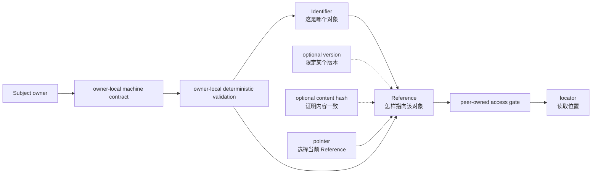

# 标识符与引用语义合同（Identifier and Reference Semantics Contract）

本文统一两个概念：`Identifier` 说明这是哪个对象，`Reference` 说明另一处怎样指向这个对象。
`version`、`content hash`、`pointer` 和 `locator` 只补充引用的精确程度、当前选择或读取位置，
不形成新的通用对象体系。

## 0. Intent Capsule

```yaml
layer: T0
t0_layer_id: the_identifier_and_reference_semantics
status: candidate
canonical_owner: designDoc/the_identifier_and_reference_semantics.md
owned_system_object: machine-facing identifier and reference semantics
scope:
  - Identifier 与 Reference 的稳定含义和边界
  - version 与 content hash 作为可选精确限定信息的含义
  - pointer 作为可变选择、locator 作为物理位置的边界
  - 命名、比较、冲突和非破坏性迁移规则
non_goals:
  - 统一所有业务对象的 ID 格式或 reference scheme
  - 建立中央 identifier Registry、统一 resolver 或通用 validation service
  - 要求每个 class、DTO 或 nested record 注册新的 identification object
  - 定义业务对象、Principal、Workflow、Module、Skill、Design 或 Data Asset 的含义
  - 定义 authentication、permission、Entitlement、credential、timestamp 或 lifecycle
  - 选择 database、repository、URL、object store、provider 或 transport
inputs:
  - 授权的新建或修改 system-wide identifier and reference semantics 目标与现有依据；已有已审计划时附对应步骤
outputs:
  - Identifier 与 Reference 的通用语义边界
  - version、content hash、pointer 与 locator 的从属角色
  - subject owner 必须在自己的 machine contract 和 code 中闭合的最低要求
truth_surfaces:
  - designDoc/the_identifier_and_reference_semantics.md
runtime_triggers: []
downstream_consumers:
  - 包含 identifier、reference、version、content hash、pointer 或 locator 的 Design、schema、API、event、Artifact 与 Runtime record
open_decisions:
  - existing projects 的 adoption order 和 compatibility window
review_gate: Design Doc Management 所属 design_contract_reviewer 对 exact candidate 的独立 Design review；Identifier and Reference Semantics owner 单独作出 owner decision
runtime_surface_ledger: current field、schema、binding、pointer、locator 和 migration truth 由各 subject owner 的 code、persistent state 与 generated inspection 保存
verification_hooks:
  - 每个 machine-facing Identifier 和 Reference 都能解析到唯一 subject meaning 和 owner
  - version、content hash、pointer 与 locator 不被误当成 stable identity
```

## 1. Primary System Flow



`Identifier` 和 `Reference` 是本 T0 统一的概念。对象 owner 决定具体字段、格式和验证方式。
`version` 与 `content hash` 在需要精确锁定内容时使用；`pointer` 只负责当前选择；`locator` 只回答
内容在哪里。权限检查、解析实现和读取行为仍由对应 peer 或 subject owner 负责。

| Owner-local public operation | Disposition |
| --- | --- |
| none | 本 T0 定义语义；各 subject owner 的 code 提供自己的 validation、resolution 和 update operation。 |

| Caller-visible error | Disposition |
| --- | --- |
| none | 各 owner-local interface 保留自己的 stable error code 和 caller action；本 T0 不复制或统一这些错误。 |

## 2. User Intent

平台里的 `id`、`version`、`ref` 和 `hash` 不能继续依赖字段名习惯、字符串 prefix、当前目录或调用
位置猜含义。调用方应能直接判断：这是哪个对象、另一处指向哪个对象、是否锁定了某个版本、是否带有
内容一致性证据，以及最后去哪里读取。

统一的是这些词的关系，不是所有对象的 ID 格式。Company、Source、Module、Workflow 和 Data Asset
仍由各自 owner 定义。

## 3. Reader Gain

- Domain Architect 能继续定义业务对象，同时明确对象的 stable Identifier 和 Reference boundary。
- Schema Owner 能判断一个字段是在标识对象、引用对象、限定版本、证明内容，还是保存物理位置。
- Runtime Maintainer 能一致处理 Module、Workflow 和 release 的 Identifier 与 Reference，而不复制一套
  局部术语。
- Distributed Systems Engineer 能判断 equality、current selection 和跨系统引用是否安全，并把失败返回
  实际拥有该 interface 的 owner。

## 4. Owned System Object

本 T0 只拥有 `machine-facing identifier and reference semantics`。

| 核心概念 | 含义 |
| --- | --- |
| `Identifier` | 在声明的 object kind 和 scope 内，稳定说明“这是哪个对象” |
| `Reference` | 在另一个 machine boundary 中，明确说明“这里指向哪个对象” |

以下信息不成为新的通用对象：

| 信息或角色 | 与 Reference 的关系 |
| --- | --- |
| `version` | 可选；当调用方需要锁定对象的某个版本时，限定 Reference |
| `content hash` | 可选；内容指纹，例如 SHA-256，用于证明指定内容保持一致，不证明业务对象是谁 |
| `pointer` | 一个 owner-controlled mutable selection，选择当前使用的 Reference |
| `locator` | Reference 经过权限检查和解析后得到的物理读取位置 |

业务 owner 决定对象含义、具体 Identifier、Reference format、version rule、是否需要 content hash，
以及 pointer 和 locator 是否存在。本 T0 不保存 current inventory。

## 5. Authority

只有 Identifier and Reference Semantics 可以定义：

1. `Identifier` 与 `Reference` 不能互相替代；
2. `version` 和 `content hash` 只在需要时增加引用精度，不自动成为 stable identity；
3. `pointer` 的可变选择与被选择对象的 identity 分离；
4. `locator` 的变化不改变或证明对象 identity；
5. machine-facing 字段必须让调用方确定 subject、meaning 和 owner；
6. existing Identifier 或 Reference 不得原地改义。

本 T0 不决定具体对象是否存在、如何编码、由谁创建、当前选择哪个版本、存放在哪里、谁有权限，
也不决定其 lifecycle。下游 owner 可以定义自己的 ID、version、Reference 和 validation，但必须保持上述
语义边界。

## 6. 标识符与引用语义（Identifier and Reference Semantics）

### 6.1 Identifier

`Identifier` 必须结合对象种类和适用 scope，使调用方能够唯一判断它标识哪个逻辑对象。具体对象可以
使用一个字段或组合字段；本 T0 不规定统一字符串格式，也不要求所有系统增加 `kind + scope + id`
envelope。

Version、status、environment、storage path 和 content hash 不自动进入 stable Identifier。某个业务对象
确实把其中一项作为 identity 的组成部分时，其 owner 必须在自己的 contract 中明确说明，而不能由字段名
或本 T0 推断。

### 6.2 Reference 与精确程度

`Reference` 可以指向一个稳定逻辑对象，也可以锁定该对象的某个版本或某份不可变内容。Reference 必须
让接收方知道 target subject 和所需精确程度。

- 只需要指向逻辑对象时，Reference 可以只携带该对象的 Identifier。
- 需要锁定某个版本时，Reference 增加适用的 `version`。
- 需要证明内容完全一致时，Reference 可以再携带 `content hash`。

`content hash` 是内容指纹。它只在 algorithm 和 coverage 相同的情况下可比较。它不能单独证明业务对象
identity，也不是所有 Reference 或 immutable record 的必填字段。

### 6.3 Pointer 与 Locator

`pointer` 只表示 owner 当前选择哪个 Reference。它可以改变，但 pointer 的变化不重写目标对象，也不改变
目标 Identifier。是否需要 compare-and-set、revision 或 rollback，由拥有该 pointer update interface 的
owner 定义和验证。

`locator` 只表示目标目前存在哪里，例如 repository path、database key、URL 或 object-store key。
Locator 可以变化，而不改变 Identifier 或 Reference。Reference 也不授予读取、写入或执行权限；实际
访问继续通过对应 owner 的 authorization 和 data-access boundary。

### 6.4 命名与比较

Public machine boundary 的字段名称或 enclosing typed class 必须让调用方确定 subject 和 meaning。
`module_id`、`module_release_version`、`module_release_ref`、`module_release_sha256` 和
`module_store_locator` 是一种可读写法，但不是所有对象必须复制的字段模板。

两个 Identifier 只有在 subject kind、scope 和 owner-defined identity fields 都相同时才相等。两个
Reference 只有在 target meaning 和全部适用限定信息都相同时才相等。Locator equality 不产生 identity
或 Reference equality。具体 comparison、normalization 和 encoding 由 subject owner 的 code 定义。

### 6.5 Machine Contract 与 Code

凡是把 Identifier 或 Reference 写入 persistence、public DTO、event 或跨系统 boundary 的 subject owner，
必须在自己的 machine contract 中说明适用字段的 subject、meaning、scope、encoding 和 target。只有实际
使用的 `version`、`content hash`、`pointer` 或 `locator` 才需要相应规则。

任何 contract 都不要求使用完整集合。未使用的概念不需要字段、占位值或空 contract；一旦实际使用，
才必须遵守本 T0 对该概念的结构和语义要求。

各 owner 的 code 负责确定性验证自己的 machine contract，并返回 owner-local error。本 T0 不建立中央
Registry、统一 validation service、通用 resolver、通用 pointer interface 或统一 error taxonomy。

### 6.6 Compatibility and Migration

本 T0 成为 Current 不会原地改写既有 ID、version、Reference 或 content hash。每个 consuming project
先检查现有 surface，再由真实 owner 决定保留、临时兼容、生成 successor 或退役。

能够从 exact context 唯一恢复含义的 legacy field 可以临时保留 compatibility mapping；无法消除歧义的
字段使用新名称或新 Reference。具体 persistence migration、backfill、cutover、rollback 和 retirement
仍由 domain owner、Data Governance 与 Software Delivery 决定。

## 7. 审查与完成

### 7.1 确定性检查

进入 `design_contract_reviewer` 前，Design Doc Management-owned validator 验证 required sections、
identity、owner、exact bytes、schema、hash 和完整 same-level peer context。未来 implementation 由各
subject owner 的 code 验证自己的 Identifier 和 Reference contract；这些 machine failures 不交给
semantic Reviewer 重新判断。

### 7.2 语义审查

`design_contract_reviewer` 只审 exact frozen T0 candidate 及其 Charter、完整 peer set、授权目标
和适用的 frozen current-state evidence；已有已审 `SystemChangePlan` 时附对应步骤，直接授权请求
不要求前置计划。它判断两个核心概念是否足以消除
ID、Reference、version、content hash 和 locator 混用，是否可以直接指导下一层，以及是否侵入业务对象、
authorization、data、time、Runtime execution 或 delivery authority。

### 7.3 表达审查

全部 Design semantic checks 通过后，Reviewer 对同一 candidate bytes 判断冷读者能否准确复述
Identifier、Reference 及四类从属信息的关系。表达修改不能改变 authority、compatibility 或 migration
meaning。

### 7.4 完成条件

Material T0 candidate 只有在 DDM-owned schema 和 semantic validator 接受 exact
`design_contract_reviewer` output、registered verdict 为 `passed`，且 Identifier and Reference Semantics
owner 作出明确 Design decision 后，才能进入 Charter amendment、peer migration、implementation 或
portable release。Review、owner decision、Design admission、implementation authorization 与 Software
Delivery admission 保持为不同结果。

## 8. System-wide Invariants

1. 业务 owner 定义对象含义；本 T0 只定义对象进入 machine boundary 后的 Identifier 和 Reference 关系。
2. `Identifier` 稳定说明这是哪个对象；`Reference` 明确说明这里指向哪个对象。
3. Reference 可以只指向逻辑对象，也可以按需要增加 version 或 content hash 以锁定具体内容。
4. Version 与 content hash 都是可选限定信息，不自动成为 stable identity。
5. 未使用的概念不需要字段、占位值或空 contract；实际使用的概念必须由所属 owner 明确定义并验证。
6. Pointer 只选择当前 Reference；pointer update 不重写目标对象。
7. Locator 只回答在哪里读取；locator change 或 equality 都不改变或证明 identity。
8. Reference、authorization、target access、business acceptance 和 pointer update 是不同决定。
9. 无法确定字段的 subject、meaning、scope 或 target 时 fail closed，不靠 prefix、目录或 caller-local
   猜测继续。
10. Existing Identifier 和 Reference 不原地改义；compatibility 和 successor 保留明确 mapping。
11. Current schema、binding、pointer、locator 和 migration truth 只来自各 owner 的 code、persistent state
    与 generated inspection。

## 9. Peer Boundaries

Project Charter 决定本 authority 是否进入 project T0 topology。各 peer 继续拥有自己的对象和决定；本 T0
只向其 machine-facing Identifier 与 Reference 提供共同语义。

| Peer T0 | Boundary |
| --- | --- |
| Agency Platform | 使用共同语义表示 product、service、session 和 workload；继续拥有 host、composition、placement 与 authentication |
| Agent Runtime | 使用共同语义表示 Module、Workflow、Execution、Artifact 和 release；继续拥有 Runtime admission、execution 与 recovery |
| Product Authorization | 使用共同语义表示 Principal、permission assignment 与 decision；继续拥有 Entitlement、allow/deny 与 revocation |
| Task Routing | 使用共同语义表示 request、logical owner 与 RoutingDecision；继续拥有 requested-result classification 与 owner selection |
| System Change Governance | 使用共同语义表示 plan、step 和 candidate；继续拥有 affected scope、dependency order 与 SystemChangePlan meaning |
| Data Governance | 使用共同语义表示 Data Asset、physical binding 与 migration Reference；继续拥有 data meaning、placement、retention 与 migration |
| Timestamp and Clock Semantics | Timestamp 不代替 Identifier 或 Reference；继续拥有 time role、clock、calendar 与 comparison meaning |
| Design Doc Management | 使用共同语义表示 Design candidate、parent 与 dependency；继续拥有 Design Intent、layer、review 与 lifecycle |
| Skill Management | 使用共同语义表示 Skill、prompt source 与 Module export；继续拥有 Skill Definition、review 与 delivery |
| Review Contract | 使用共同语义表示 subject、context、finding 与 Reviewer source；继续拥有 universal review instruction 与 finding discipline |
| Software Delivery | 使用共同语义表示 software asset、commit、release 与 deployment record；继续拥有 implementation 与 release admission |

任何 peer 的完整 Flowmap、field inventory、error table 或 implementation binding 都不复制进本 T0。

## 10. References

- [Project Charter](the_charter.md)
- [Agency Platform](the_agency_platform.md)
- [Agent Runtime](the_agent_runtime.md)
- [Product Authorization](the_product_authorization.md)
- [Task Routing](the_task_routing.md)
- [System Change Governance](the_system_change_governance.md)
- [Data Governance](the_data_governance.md)
- [Timestamp and Clock Semantics](the_timestamp_semantic.md)
- [Design Doc Management](the_design_doc_management.md)
- [Skill Management](the_skill_management.md)
- [Review Contract](the_review_contract.md)
- [Software Delivery](the_software_delivery.md)
