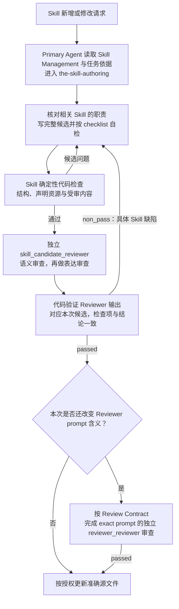

# Skill 管理（Skill Management）

Skill 把一项重复任务的方法写成 Agent 可以找到、理解并使用的完整指令。Skill Management 规定
这种指令应具备什么内容、怎样保持职责清楚，以及怎样独立审核；任务本身的含义由所属 Design 决定。

## 0. Intent Capsule

```yaml
layer: T0
```

输入是明确的 Skill 新增或修改请求、任务依据和现有相关 Skill；输出是完整 Skill、适用的独立审核
结果，以及确有需要时供后续 Runtime registration 使用的完整 prompt。Primary Agent 使用
`the-skill-authoring` 完成写作、自检和审核组织，在授权内更新准确源文件。

## 1. Primary System Flow



范围、负责人和所需结果明确时，可直接开始。需要拆分工作或确定依赖时，先使用 System Change
提供的计划。新建或改变职责划分时比较完整受影响集合；局部修改只加载判断该修改所需的相关 Skill。

Primary Agent 可以运行代码检查、组织独立 Reviewer 调用和处理意见。独立性要求 Reviewer 以不同
执行身份判断候选，不禁止作者组织这些工作。输入不足时补齐依据；`blocked` 返回缺少的决定及其
负责人；调用或输出校验失败由对应执行或代码负责人处理。这些是本次工作的结果，不是 Skill 生命周期。

需要编写 Reviewer prompt 时使用 `the-review-authoring`；Skill 审查完成后，再完成该 prompt 的独立
审查。普通 Skill 修改不自动重审未变 prompt；只有其内容、适用规则和所依赖的相关依据均未改变时，
已有准确对应的审核证据才可继续使用。Prompt 发现问题时返回其负责人修订；若修订影响 Skill 的任务
或交接，受影响的 Skill 也重新检查和审查。

最后一步更新本次已授权的源文件。把内容同步到安装投影或其他项目属于部署；注册和执行 Runtime
Module 属于下游工作。这些动作单独处理，源文件更新不表示已部署或已注册。

## 2. User Intent

用户希望固定一项重复做法时，Primary Agent 能找到已有方法，决定修改哪里，并写出其他 Agent
不依赖原始聊天就能使用的 Skill。规则应提高任务完成质量，减少重复 Skill 和职责混淆。

## 3. Reader Gain

- Primary Agent 能判断是否需要 Skill、已有哪份 Skill 负责，以及本次应修改什么。
- Skill 作者能写清输入、依据、方法、产出、完成条件和真实工具入口，使冷启动 Agent 可以继续工作。
- Skill Reviewer 能依据目标与边界发现会影响使用的缺陷，不要求每个 Skill 配齐所有邻接系统的机制。
- 下游负责人能取得完整 Skill 和需要时的完整 prompt，并区分内容已审核与 Runtime 已注册、已执行。

## 4. Owned System Object

Skill Management 拥有 `Skill Definition`：一份可重复 Agent 方法的内容、发现方式和完整性要求。
这个名称不要求额外建立运行对象或管理记录。

每份 Skill 的任务含义由一个明确的所属 Design 负责。Skill 是对该任务的可执行指导，不取得所属
Design 的决策权，也不因包含工具用法而取得额外操作权限。

## 5. Authority

Skill Management 决定完整 Skill 必须使 Agent 理解什么、如何避免方法重复，以及 Skill 的独立
审查标准。它提供 `the-skill-authoring` 的方法要求和 `skill_candidate_reviewer` 的专用 checklist。

所属 Design 决定任务本身；Review Contract 定义共同审查规则和结果结构；Runtime 独立执行 Reviewer。
Primary Agent 在已有授权内组织工作，不为写作、自检、审核和交付分别创建新的管理角色。

## 6. Skill 编写与使用

### 6.1 完整 Skill 的内容

每份 Skill 必须让目标 Agent 直接理解以下内容。正文以中文为主，代码符号和已有标识符保留准确名称。

| 固定章节 | 必须让 Agent 知道什么 |
| --- | --- |
| `Task` | 要完成的稳定任务，以及何时有必要使用这项方法 |
| `Reader Gain` | 读完后新增什么可靠判断或执行能力 |
| `Entry and Exit` | 何时进入，缺少依据或请求不适用时怎样处理 |
| `Execution Contract` | 需要哪些输入和权限，产出什么，什么结果算完成 |
| `Boundaries` | 与实际相关的 Design、Skill、工具或下游职责怎样区分 |
| `Method` | 必要判断方法、可直接使用的资源和真实高概率陷阱 |

`the-skill-authoring` 提供六个章节的编号、写作方法与固定工具用法；代码提供结构 schema 和校验。
补充章节只在帮助完成任务时增加，并保持连续编号。Frontmatter 负责身份和发现，不在正文再写一份
身份清单。方法要足以指导工作，同时保留不改变结果的推理、表达和工具选择空间。

### 6.2 发现与职责

从当前 Skill 目录或代码生成的索引找到可能相关的方法，再阅读其 Task、入口和产出。已有 Skill
负责同一结果时优先修改它；名字不同不构成新建平行 Skill 的理由。影响职责划分时，检查完整受影响
集合是否重叠或留下缺口；普通内容修改不要求加载所有 Skill。

Skill 有一个稳定名称、明确负责人和准确源路径。现有 `skill_class` 用于区分主要使用方式：
`primary_agent_development` 由 Primary Agent 在工作区使用，`product_agentic` 用于受管理的 Agent
执行，`product_hybrid` 同时包含代码与 Agent 工作，`projection_only` 提供发现入口。它们不增加
业务权限、审核步骤或生命周期；实际字段合法性由现有代码检查。

整体删除由 System Change 确定受影响内容与顺序，再交各负责人处理；不要求先生成一份待删 Skill
或调用 `the-skill-authoring` 来批准删除。

### 6.3 依据、资源与方法

输入包括本次授权目标、所属 Design、当前 Skill 和必要的相关方法。确实需要代码、schema 或当前
运行事实时，通过其准确来源取得；它们说明实际能力，不替作者增加产品要求。

Skill 必须给出完成任务所需的可用文件、工具或执行入口及其用途。已声明资源可以按需读取，不要求
把所有材料复制进正文，也不能依赖未声明的聊天背景。入口缺失时说明所缺能力及其提供方，不临时
拼出另一个执行路径后声称正式完成。

<!-- skill-authority-input-guard:start -->
Skill 只有在实际承载对应 machine-facing meaning 时才增加下列 authority input：定义 time-bearing field、
clock、calendar、freshness 或 time comparison 时，先读取 `designDoc/the_timestamp_semantic.md`；定义 schema
或 machine boundary 中的 Identifier、Reference、version、content hash、pointer 或 locator 时，先读取
`designDoc/the_identifier_and_reference_semantics.md`。只是在示例、普通 prose
或路径中出现 date、ID、ref 等词，不构成适用条件。未触及这些语义时不加载对应 T0，也不增加字段、
占位章节或空引用；触及时只继承适用规则，不复制 peer contract。
<!-- skill-authority-input-guard:end -->

### 6.4 需要独立执行时的完整 prompt

只有任务需要独立 managed execution 时才交付对应 prompt。Prompt 配合明确提供的任务输入和
可用资源，必须完整说明该执行角色的任务、输入输出、完成条件、方法及操作边界；不能隐式依赖读取
所属 `SKILL.md` 或历史聊天来补指令。动态任务数据、凭据、实际授权、模型配置和运行记录由调用时提供。

普通执行 prompt 随 Skill 方法编写。Reviewer prompt 由 `the-review-authoring` 编写专用部分，
代码注入 Review Contract 的通用规则与所属 Design 的 checklist。`skill_candidate_reviewer` 判断
该 prompt 与 Skill 任务、交接的关系；`reviewer_reviewer` 判断 Reviewer prompt 自身的指令含义。

携带 Reviewer source 的 Skill 必须说明具体 `module_id`、何时调用及不可用时交给谁处理。
Source 与作者方法同包不等于作者自审，Reviewer 仍由 Runtime 以独立身份执行。Skill Management
交付完整内容；Module 注册、配置与执行方式由下游负责人决定。

### 6.5 Authoring Skill 的共同首章

实际任务是编写稳定产物的 Skill，正文首先包含 `## 0. AI-facing Authoring Rules`。该章完整使用
`soul:bestpractice_ai_facing_writing` 指向的 canonical selection，即 `bestpractice_skill_writing`
中适用于所有 AI-facing 文档的通用片段。代码按登记来源注入并检查一致性，作者不手抄或概括第二份。

适用性由 Task 和实际产出判断，不新增 metadata tag，也不按名称猜测。Skill Management 决定共同
片段的适用范围和要求；各 Skill 保留自己的任务与方法。首次编写的 Skill 同样可以接受来源检查，
不要求先注册成已发布对象。共同片段变化时明确受影响内容，再按各自修改范围更新和审查。

### 6.6 Author Self-Check

Primary Agent 使用某份 Skill 编写产物，且该产物随后需要独立 Reviewer 时，这份 Skill 在 Method
中包含 `Author Self-Check`。作者直接使用所属 Design 的 canonical checklist，不手写第二份标准。

每次自检形成临时表，逐项记录 `check_id`、当前候选中的具体证据、本地判断和未解决问题。所有
required check_id 都应覆盖；历史 finding 在当前内容上重新判断。已发现且经核对影响本次完成条件的必修问题先
在本地解决，再固定候选并调用独立 Reviewer。可选 note 不列为未解决必修问题；对证据错误或越界的
历史意见写明理由并交回独立 Reviewer 重判，不因自检判断而改写原独立结论。

自检帮助作者发现遗漏，不产生 `passed` 或独立批准，也不要求建立持久记录、Registry 或新 schema。
纯操作、只读查询、确定性构建及 Reviewer 自己的执行不因属于 Skill 就增加这个章节。

## 7. 代码与文档事实

文档定义完整 Skill 的含义，代码检查可以确定判断的事实：结构、身份和路径、声明资源、共同指令
投影、受审内容及 Reviewer 输出的一致性。Skill Management 拥有 Skill artifact schema 和专用
checklist 的含义；具体 schema、validator、hash 和投影实现在 Portable Governance 代码中维护。

编写候选时检查该候选及其实际声明的资源。安装投影和 Runtime release 的检查留在对应部署、注册
操作中；不能因为新 Skill 还未注册，就拒绝审查它是否写得完整。

第 8.2 节是 Skill checklist 的唯一语义来源。共同代码将其机械同步到 Skill 与 Reviewer prompt，
并记录版本和内容对应关系；作者不手填 hash，不维护另一套 release 机制。未同步或未运行的检查
如实报告，不以文字代替成功证据。

代码不能证明任务合理、相关职责没有遗漏，或自检 evidence 真正支持结论。这些由作者与独立
Reviewer 判断。工具说明应让 Primary Agent 能直接调用已有检查与审核入口，不为每次写作临时编程。

## 8. 审查与完成

Skill 新增或改变任务、依据、方法、边界、输出及其他执行含义时，使用独立 `skill_candidate_reviewer`。
纯文法、格式或未改含义的机械同步，运行适用代码检查并核对保真，不假称取得新的语义审核。

### 8.1 确定性检查

代码先检查本次候选的必要结构、实际使用的 schema、资源引用和指令投影，并记录受审内容。适用
Author Self-Check 时，核对检查项覆盖、候选一致和声明的未解决问题，不判断证据是否真的成立。
候选有问题时返回作者修订；工具或环境缺件交回相应负责人，不能靠 Reviewer 推理补出检查成功。

Reviewer 返回后，代码验证完整 output schema、检查覆盖、finding 引用及结论一致性，并确认结果
对应本次候选。执行或输出校验失败没有有效 Reviewer verdict。

### 8.2 语义审查

`skill_candidate_reviewer` 的 prompt、schema、fixtures 和 registration source 位于
`the-skill-authoring` Skill Package。以下十一项保留现有 check_id，由代码机械注入；Reviewer
逐项判断，一次报告当前能确定的全部问题，同一根因只报告一次。检查本次完整候选与授权修改范围，
背景不成为新的修改对象；代码已经验证的格式和内容对应关系无需由 Reviewer 重算。
完整性按本 Skill 的任务、本次授权结果和交付阶段判断。已有计划时一并使用当前步骤、完成条件、
相关排除项和后续边界；合理下层选择及未影响当前结果的后续工作，不成为本轮必修项。

1. `identity_discovery_class_and_source`：名称、description 和使用方式是否能使 Agent 正确找到本 Skill；负责人是否与任务一致；共同首章和 Author Self-Check 是否适用。字段合法性与源路径唯一性消费代码结果。
2. `task_and_reader_gain`：Task 是否明确重复任务，Reader Gain 是否说明读者新增的判断或执行能力，且与实际产出一致。
3. `entry_exit_and_routing`：Agent 是否知道何时进入、缺少什么时补充或停止、请求不适用时交给谁；与实际相关 Skill 的职责没有重叠或空缺。
4. `inputs_authority_freshness_and_conflicts`：任务所需输入和依据是否足够、资源入口是否明确，缺失或冲突有合理处理；确实涉及时间或机器标识含义时使用相应 T0，不强加无关要求。
5. `outputs_completion_failure_and_handoff`：Agent 能否判断本次产出、完成条件、真实失败处理和下一步负责人；本步所需决定没有缺口，合理留给下游且不影响当前结果的选择仍被保留。
6. `boundaries_and_observable_violations`：本任务实际涉及的权限、数据写入及邻接职责是否清楚；关键越界能从行为或结果中被识别，不要求列出所有无关系统。
7. `method_result_certainty_and_agent_freedom`：方法是否足以指导任务，又保留合理判断空间；没有把过程偏好写成必经程序。适用的自检使用正确 checklist，先处理成立且影响当前结果的必修问题，note 不自动实施，争议交回独立判断。
8. `design_and_revision_fidelity`：候选是否符合本次授权目标、适用计划步骤与所属 Design，保留需要保留的含义；必修意见能证明当前必要性，旧实现、未来收益或 Reviewer 偏好不增加产品要求，本次实际回归仍须处理。
9. `prompt_boundary_hygiene`：稳定指令是否与具体任务数据、凭据、实际授权及运行配置分开，避免把本次执行内容固化为长期要求。
10. `skill_agent_workflow_tool_separation`：Skill、代码工具、Workflow 和独立 Module 是否各自承担合适工作；Primary Agent 可以组织检查与独立审核，但不会把自检或同包 source 当作独立 verdict。
11. `runtime_ready_prompt_closure_if_declared`：声明的普通 prompt 是否配合明确输入与资源完整承载执行任务；携带 Reviewer source 时是否说明具体 Module、独立调用与不可用时的处理，且与 Skill 任务和交接一致。Reviewer prompt 的专用指令由 reviewer_reviewer 审，不在此重复；未声明 prompt 时使用 not_applicable，不要求另造一个。

每项给出能追溯到当前内容的判断。前十项返回 `passed` 或 `finding`；第十一项没有声明 prompt 时可
返回 `not_applicable`。具体缺陷或缺少必要依据关联 finding；可选 note 不使检查失败。返回形式遵守
Review Contract §6.4 的共同含义，使用 Runtime 提供的 Reviewer 共同格式及机械校验；
本 T0 的专用校验检查上述适用条件，
不能把填完检查表当作任务已经达到要求。

### 8.3 表达审查

语义检查通过后，同一个独立 Reviewer 检查中文是否清楚、概念是否容易理解、段落是否重复或歧义。
表达修改保持事实、职责、因果、不确定性和停止条件。通用含义由同级 T0 `the_review_contract.md`
定义，使用共同结果末项 `prose_and_meaning_preservation` 记录；上述十一项是 Skill 语义检查，
不因增加共同表达结果而改写其含义或 check_id。语义未通过时，表达项标记 `not_run`。

### 8.4 完成条件

必要代码检查通过，候选达到本次目标，适用独立审核对应当前内容，且更新动作在已有授权内，即可
交付并更新源文件。含 Reviewer prompt 变更时，还需第 1 节所述的 prompt 审查；纯 Skill 修改不扩大
成未改 prompt 或其他 Design 的重新审核。

`passed` 表示规定审查完成且没有必须修复的问题；`non_pass` 表示存在具体缺陷，应修订再审；
`blocked` 表示缺少必要依据或决定，需先找到提供方。`fix`、`block`、`note` 使用 Review Contract
的共同含义。Primary Agent 核对证据、范围和当前后果后处理，不照单全收，也不忽略实际缺陷。
note 默认不进入本轮；对不成立或越界的必修意见说明理由，保留原结果并请求按同一依据重判，不能
自行把 non_pass 改成 passed。真实依赖或规则冲突返回负责人决定是否调整计划，不借意见扩大授权。

版本控制保留内容差异和历史，发布工具确定安装内容。无需为普通 Skill 写作另建状态机、批准记录
或平行 Registry；本次更新与其他环境部署的实际完成情况分别说明。

## 9. System-wide Invariants

1. Skill 有可发现的入口、明确任务负责人和准确来源；内容足以让目标 Agent 理解并执行任务。
2. 任务含义由所属 Design 决定，Skill 提供方法；新建方法前核对相关职责，避免平行实现与责任缺口。
3. 重要含义更新接受独立 skill_candidate_reviewer 审查；作者可组织调用，不能自己产生独立结论。
4. 代码保证机械一致性，Reviewer 判断任务、边界和结果；形式通过不证明 Skill 正确。
5. 适用 authoring Skill 保留共同首章和 Author Self-Check；两者的来源明确，自检不取代独立审查。
6. Prompt 按实际需要提供完整指令；动态数据与运行配置由调用时提供，内容交付不取得 Runtime 权限。
7. 检查和审核对应准确内容；修改后不继承旧内容的通过结论，未改背景也不自动成为新受审对象。
8. 源文件更新、Runtime registration、安装部署及整体删除各有明确责任，不因完成其中一步就宣称全部完成。

## 10. Peer Boundaries

| 交接方 | Skill Management 保留的职责 | 对方保留的职责 |
| --- | --- | --- |
| 所属 Design 与 DDM | 完整 Skill、发现方式和 Skill 审查 | 任务本身的含义、Design 层级与文档审查 |
| Task Routing 与 System Change | Skill 编写入口和结果要求 | 意图导航；确有需要时的拆分、依赖计划及整体删除路由 |
| Review Contract | Skill 专用 checklist、适用条件和结果判断 | 共同审查规则与结果结构、Reviewer prompt 编写方法及 prompt 审查 |
| Agent Runtime | 交付需要独立执行的完整 prompt，解释 Skill 审查结论 | Reviewer 共同格式及机械校验、Module 注册、执行配置、隔离运行及执行证据 |
| Agency Platform 与部署负责人 | 交付可使用的 Skill source | 宿主组合、发现入口安装和跨环境部署 |
| Product Authorization 与数据负责人 | 说明任务需要的操作和输入 | 实际授权与数据访问决定 |
| Software Delivery | 交付 Skill 工具所需的目标和约束 | Code Design、实现、测试和软件发布 |

## 11. References

- [Design Doc Management](the_design_doc_management.md)
- [Task Routing](the_task_routing.md)
- [System Change Governance](the_system_change_governance.md)
- [Review Contract](the_review_contract.md)
- [Agent Runtime](the_agent_runtime.md)
- [Agency Platform](the_agency_platform.md)
- [Product Authorization](the_product_authorization.md)
- [Software Delivery](the_software_delivery.md)
