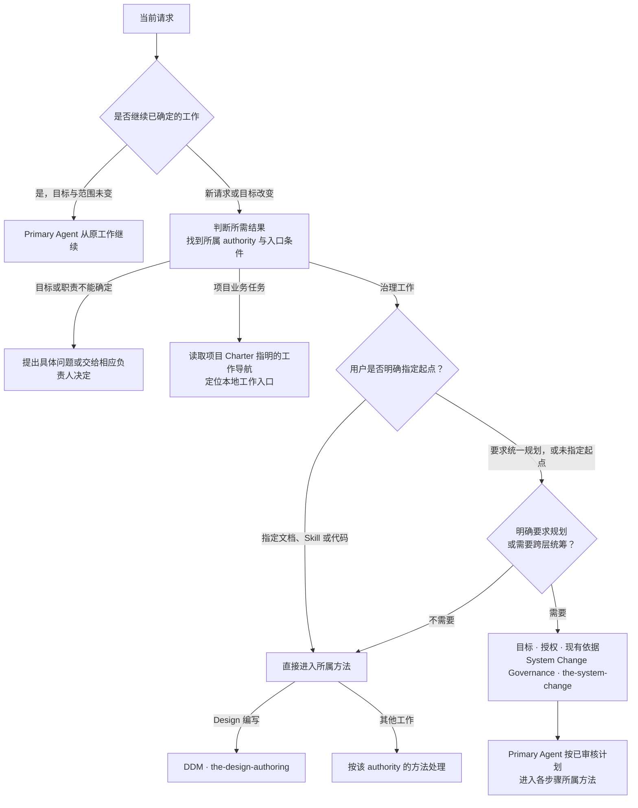

# 任务路由（Task Routing）

Task Routing 帮助 Primary Agent 从用户要取得的结果找到下一步：该读哪份依据、使用哪个现有方法，
或者先问清哪个问题。它提供 Portable T0 的意图导航；具体项目工作流和本地入口由项目自己的工作导航
提供，项目 Charter 指明它的位置。路由本身不执行任务，也不要求先建立 Registry 或运行记录。

## 0. Intent Capsule

```yaml
layer: T0
```

输入是当前请求、已有授权和判断所需的相关依据。输出是一段明确说明：所需结果、负责的 authority、
下一步入口及理由；不能确定时说明缺少什么。`RoutingDecision` 是这一判断的名称，不要求创建持久对象、
固定 schema、request ID、hash 或审批状态。

## 1. Primary System Flow



路由判断从当前请求和依据出发，不依赖前一轮对话才能成立。“继续”且任务没有改变时沿用已经明确的
工作；新证据改变目标、范围或负责人时再判断入口，不凭一个相同文件名强行沿用原路径。进入入口之后，
执行可以由 Primary Agent 自己完成，也可以交给受委派的执行会话，双方的分工见第 6.4 节。

### 1.1 从 Portable T0 找到工作方法

下面是各 authority 已声明的入口导航。先读取对应 Design，再使用其中的方法；表格不替代该方法的
进入条件、检查要求或独立审核。

| 用户要取得的结果 | 先读的 authority | 从哪里开始 |
| --- | --- | --- |
| 确定一次修改涉及什么、由谁处理、按什么顺序完成 | [System Change Governance](the_system_change_governance.md) | `the-system-change` 形成计划；计划使用 `system_change_plan_reviewer` 审核后，由 Primary Agent 按步骤推进 |
| 编写或修改 Design Doc | [Design Doc Management](the_design_doc_management.md) | `the-design-authoring`；目标、范围、负责人已明确的授权请求可直接开始，重要含义变更仍须 `design_contract_reviewer` |
| 编写或修改可重复使用的 Skill | [Skill Management](the_skill_management.md) | `the-skill-authoring`；按该 authority 的现行进入条件准备输入，独立审核使用 `skill_candidate_reviewer` |
| 编写或修改 Reviewer prompt | [Review Contract](the_review_contract.md) | `the-review-authoring`；通用规则、目标指令与 checklist 按其要求组成候选，独立审核使用 `reviewer_reviewer` |
| 设计或实现代码、schema、migration，或处理发布部署 | [Software Delivery](the_software_delivery.md) | 从其规定的 Code Design、实现或操作方法进入；工程审核使用 `engineering_change_reviewer` |
| 注册或执行已有 Module、Workflow | [Agent Runtime](the_agent_runtime.md) | 读取当前 Runtime 的随包 client 文档和 runbook，按已有授权使用公开入口 |
| 审查一份已有候选 | 被审对象所属 authority | 使用该对象的指定 Reviewer；Review Contract 只提供共同规则，不是通用审核入口 |
| 执行项目业务、查询或项目工作流 | 项目 Charter 指明的工作导航及其指向的领域依据 | 使用项目已有入口，不在 Portable T0 维护业务路由表 |

`system_change_intake` 表示把目标、授权和现有依据交给 System Change，不要求先有计划或调用机器路由器。
计划通过后，Primary Agent 从每一步取得负责人、方法、输入依赖、审核要求和完成条件；不为每一步
重新做顶层路由。目标方法缺少的实际输入或执行配置由其负责人提供，不靠换一个相似方法绕过。

## 2. User Intent

让 Primary Agent 收到任务就知道下一步从哪里开始。用户说清楚的 Design 修改不应因为缺少项目 Registry
而无法动笔；确需规划或尚未作出的责任决定，也不能被“直接写作”掩盖。执行交给其他会话时，用户仍能
确定由谁对目标、沟通和最终结果负责。

## 3. Reader Gain

- Primary Agent 能分清是继续现有工作、直接使用所属方法、先形成计划，还是先提出问题。
- Primary Agent 能从第 1.1 节找到 Design、Skill、Reviewer、工程和 Runtime 的依据及入口，不从附近文件猜。
- Primary Agent 能分清把执行交给其他会话后自己仍要完成的工作，受委派的执行会话能知道自己直接执行、不再委派。
- Principal Manager 和 Product Architect 能确认路由没有增加授权、改写审核标准或接管项目流程。
- Routing Maintainer 能区分 Portable 意图导航与项目工作导航中的本地工作流、路径和依赖清单。

## 4. Owned System Object

Task Routing 拥有任务入口判断，即 `RoutingDecision`。它只回答当前要取得什么结果、由谁负责，以及
下一步读哪里或进入什么方法。判断可以直接写在当前工作说明里，不要求单独存储、编号或版本管理。

## 5. Authority

Task Routing 按所需结果与用户指定起点识别入口，并引用各 authority 的实际输入、检查和审核要求。
用户指定从文档、Skill 或代码开始时，不追加 SystemChangePlan 前置；这不取消所属方法自己的
设计依据、授权或独立审核，也不自动授权后续其他层的修改。

System Change 决定需要规划的修改如何拆分和排序；DDM 等 subject authority 决定自己的写作、检查、
独立 Reviewer 和完成要求。具体产品取舍留给用户或其明确委派的负责人。导航到一个入口不授予执行权限。

## 6. 入口判断与交接

### 6.1 按指定起点或实际统筹需求进入

用户指定“先改文档”“先改 Skill”或“先改代码”时，直接进入对应方法，先处理该项已授权工作。
请求整体涉及其他层，不会撤销已经指定的起点；说明后续依赖，在需要扩大范围、改变顺序或补足
实际产品决定时提出具体问题，不自动退回“必须先有 SystemChangePlan”。

用户明确要求统一规划，或没有指定起点且修改需要跨层统筹范围、职责与依赖时，使用
`the-system-change`。输入是目标、授权和现有依据；计划由该方法产生，不是进入它的条件。
未指定起点且无需这种统筹时，直接使用负责所需结果的方法。

直接进入仍须满足实际工作条件。例如文档需要明确的修订目标，Skill 需要明确的重复任务，代码
实现保留 Software Delivery 的 Code Design 与工程审核。缺少这些材料时说明具体缺件；不能把
该方法的工程方案要求解释为必须另有一份 System Change 计划。

### 6.2 找不到或出现冲突时

请求不足以区分不同结果时，问清会改变选择的具体问题。没有可用入口、引用缺失或 authority 相互冲突时，
指出所缺内容及负责方；不能擅自建立 Registry、创造新角色或用名字相近的 Skill 顶替。

已选方法中的候选缺陷返回作者；已有计划漏项或依赖变化返回 System Change；Reviewer、工具或执行配置
不可用则返回对应负责人。执行失败本身不改变任务的逻辑归属，也不意味着设计内容需要改写。

### 6.3 项目自己的路由

项目自己的工作导航提供具体工作流、文件、产物和本地入口，项目 Charter 指明它在哪里、由谁负责。它可以是
文档、索引或 Registry；项目若使用 Registry 或 resolver，其 schema、存储、当前版本和调用方式由项目自己的
设计与代码负责。Charter 未指明工作导航时，按 6.2 说明缺少的入口，交项目 Charter 负责人补齐。本 T0 不要求所有项目采用相同机器路由实现，
也不把项目 Registry 的可用性作为读取 Portable T0 或使用其写作方法的前提。

### 6.4 路由之后的执行分工

入口确定后，直接承接用户请求的 Primary Agent 继续对这项请求负责：确认目标与完成标准，与用户沟通并
取得需要用户作出的决定，协调各步骤，并按所属 authority 的要求核对实际结果和独立审核后向用户交付。
具体执行可以由它自己完成，也可以按项目入口文件（会话启动时读取的项目说明）或宿主提供的委派方法
交给受委派的执行会话。委派不转移上述责任，不改变任务的逻辑归属，也不减免所属方法的进入条件、检查和
独立审核。

受委派的执行会话接到的是入口已经确定的具体工作。它在交给它的授权范围内直接使用所属方法完成，遇到
缺件、冲突或授权不足时回报委派它的 Primary Agent；它不对同一工作重新做顶层路由，也不把这项工作再
委派给其他会话。按所属方法调用独立 Reviewer 是该方法的审核要求，不属于再委派。

是否委派、采用哪个委派方法，以及执行会话使用的 provider、模型和观察方式，由项目入口文件或宿主指定的
委派方法、该方法的参数和用户当次指示决定。Routing 不作这些选择，也不因为委派而维护下游执行状态。

## 7. System-wide Invariants

1. 以用户要取得的结果判断入口；文件名、模型名和现成工具不能替代对任务的理解。
2. 尊重用户指定起点，不强制前置 SystemChangePlan；所属方法的实际输入、授权、检查和独立审核仍须满足。
3. 不确定时说明具体缺口，不猜测负责人、不增加未授权的机制。
4. 路由不授予权限，不选择模型、provider 或 Runtime 配置。
5. 独立审查由被审对象所属 authority 指定的 Reviewer 完成，不能用路由判断替代。
6. 完成入口交接后，由 Primary Agent 和目标负责人继续工作；执行交给受委派会话时，直接承接请求的
   Primary Agent 保留目标、用户沟通、协调与验收责任，受委派会话不再委派同一工作；Routing 不维护下游状态。
7. Portable 导航与项目本地路由分开；文档更新与安装部署分开。

## 8. Peer Boundaries

| 交接方 | Task Routing 提供 | 对方保留 |
| --- | --- | --- |
| System Change Governance | 需要规划的请求及已知目标 | 修改范围、步骤、依赖顺序和计划审核 |
| Design Doc Management | Design 请求及已有依据 | 进入写作的条件、Design 结构、检查、独立审核和源文件更新 |
| Skill Management | 稳定 Agent 方法的编写或修改请求 | Skill 进入条件、完整性、边界及 Skill Reviewer |
| Review Contract | Reviewer prompt 编写或修改请求 | 通用审核规则、prompt 布局与 prompt Reviewer；不接管其他对象的审核 |
| Software Delivery | 工程或发布操作所需结果 | Code Design、实现、测试、工程审核和发布部署 |
| Agent Runtime | 已明确的 Module 或 Workflow 使用需求 | 注册、执行配置、独立执行与证据 |
| Product Authorization | 下游确需数据库访问时找到其规则入口 | `user_key` 的数据库访问权限；不决定意图路由 |

项目 Charter 提供项目范围和人类决策权，并指明项目工作导航；项目工作导航提供本地入口。两者都不是本 T0
生成的 Portable 业务清单。本文不复制 peer 内部流程、接口、错误码或运行记录。

## 9. References

- [System Change Governance](the_system_change_governance.md)
- [Design Doc Management](the_design_doc_management.md)
- [Skill Management](the_skill_management.md)
- [Review Contract](the_review_contract.md)
- [Software Delivery](the_software_delivery.md)
- [Agent Runtime](the_agent_runtime.md)
- [Product Authorization](the_product_authorization.md)
