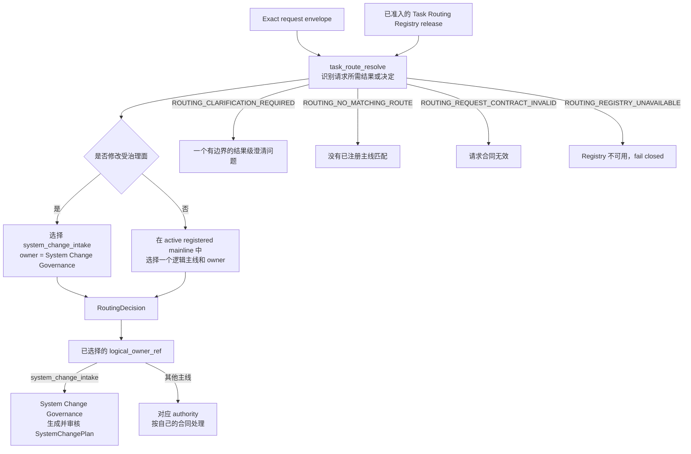

# 任务路由（Task Routing）

Task Routing 只负责在已准入的逻辑主线中，判断一个请求所需的结果或决定归哪个稳定逻辑负责人，
并形成一个 `RoutingDecision`。它不选择编写方法、Reviewer Module、模型、provider、Execution
Profile、Runtime binding、数据库、进程或用户界面，也不授予任何产品或数据权限。

## 0. Intent Capsule

```yaml
layer: T0
t0_layer_id: the_task_routing
status: candidate
canonical_owner: designDoc/the_task_routing.md
owned_system_object: RoutingDecision
scope:
  - 在已准入的逻辑主线中识别请求所需的结果或决定
  - 选择一个已注册的逻辑主线和一个稳定逻辑负责人
  - 定义 routed、clarification_required、no_matching_route、request_contract_invalid 和 routing_registry_unavailable 的边界
  - 把每项受治理的系统修改统一路由到 system_change_intake
non_goals:
  - 授予产品、数据、工具、网络、文件系统或执行权限
  - 判断系统修改会影响哪些层、文件、Skill、代码、Runtime 或 Release
  - 编写、审核或执行 SystemChangePlan
  - 选择 Design、Skill、Code、Runtime 或 Release 的编写与审核方法
  - 选择 Workflow、Module、模型、provider、Execution Profile、adapter、进程或界面
  - 拥有领域工作流、执行、审核、准入、发布、恢复或产物生命周期
inputs:
  - exact request envelope
  - exact admitted Task Routing Registry release
outputs:
  - one immutable RoutingDecision or one bounded routing outcome
truth_surfaces:
  - designDoc/the_task_routing.md
  - logical:task_routing_registry
runtime_triggers:
  - 需要解析 logical owner 的新请求
  - 绑定新请求或新 Registry release 的显式重新路由请求
downstream_consumers:
  - System Change Governance
  - 已选中的产品、领域、Design、Skill 或工程负责人
  - downstream workflow and execution control surfaces
open_decisions:
  - T1/T2 的 Registry schema、分类器、持久化、回放和运行检查设计
review_gate: Design Doc Management 所属 design_contract_reviewer 对本 T0 exact candidate 的独立 Design review；Task Routing owner 单独作出 owner decision
runtime_surface_ledger: code-owned generated routing inspection；本 T0 不拥有运行账本
verification_hooks:
  - admitted-registry-only classification
  - one-mainline and one-owner routing
  - governed-mutation-to-system_change_intake
  - ambiguity and denial-safe behavior
  - no review-method or execution selection
```

## 1. Primary System Flow



Task Routing 只在 exact admitted Registry release 的 active mainline 中分类。一个逻辑主线和逻辑
负责人只有同时出现在该 release 的同一条有效 row 中，才可能进入 `RoutingDecision`。该结果只说明
谁拥有所需结果，不授予访问、database operation、execution 或 release 权限。

| `interface_id` | 所有者 | 输入 | 成功输出 | 产生的影响 | 错误码 |
| --- | --- | --- | --- | --- | --- |
| `task_route_resolve` | Task Routing | exact request envelope、exact Task Routing Registry release | 一个不可变的 `RoutingDecision` | 只决定逻辑主线和逻辑负责人；不选择下游编写、审核或执行方法，也不授权该负责人执行 | `ROUTING_CLARIFICATION_REQUIRED`、`ROUTING_NO_MATCHING_ROUTE`、`ROUTING_REQUEST_CONTRACT_INVALID`、`ROUTING_REGISTRY_UNAVAILABLE` |

| `error_code` | 所有者 | 触发条件 | 含义 | 调用方动作 |
| --- | --- | --- | --- | --- |
| `ROUTING_CLARIFICATION_REQUIRED` | Task Routing | 两个或以上 active 候选会产生实质不同的结果，请求无法区分 | 当前不能确定唯一逻辑负责人 | 只询问一个结果级问题，并且只展示足以区分这些候选的结果差异 |
| `ROUTING_NO_MATCHING_ROUTE` | Task Routing | 没有 active registered mainline 匹配 requested result | 当前没有可返回的逻辑路由 | 返回无匹配结果；不得选择相近主线或执行入口 |
| `ROUTING_REQUEST_CONTRACT_INVALID` | Task Routing | request envelope 的必要结构缺失或无效 | 分类输入不成立 | 在分类前拒绝，并把输入缺口返回 request owner |
| `ROUTING_REGISTRY_UNAVAILABLE` | Task Routing | 固定 Registry release 缺失、无效、冲突、owner 不可解析或无法验证 | 当前没有可依赖的路由事实 | fail closed，并把缺口返回 Task Routing Registry T1/T2 owner；不得使用文档表格、对话或附近 Skill 替代 |

## 2. User Intent

Primary Agent 收到的请求经常同时提到公司、Theme、Source、文件、Skill、Reviewer、模型或界面，
但这些名词不一定是用户要取得的结果。Task Routing 必须先识别请求希望取得的结果或决定，再从
active registered mainline 中选择真正拥有该结果的逻辑主线。

凡是会修改受治理的 Design、Skill、Module source、代码、结构定义、迁移规则、数据写入规则、
Runtime 注册、Release、部署、回滚或退役面的请求，都先路由到 `system_change_intake`。后续具体改
哪些层、采用什么 authoring method 和 reviewer，由已审核的 `SystemChangePlan` 决定；Task Routing
不提前拆分计划。

## 3. Reader Gain

- Principal Manager 能确认逻辑 owner 的选择没有同时夹带 permission、review method 或 execution binding。
- Primary Agent 能判断什么时候进入 `system_change_intake`，什么时候直接交给某个产品、领域、
  Design、Skill 或工程主线。
- Product Architect 能区分资格过滤、语义路由、系统变更计划和执行选择。
- Routing Maintainer 能判断候选实现是否只返回逻辑负责人，而没有偷偷选择 Reviewer、模型、
  Runtime、Skill projection 或物理入口。
- 下游负责人能从 `RoutingDecision` 取得精确请求、requested-result meaning、logical owner 和
  Registry release 的绑定，无需重建对话历史或猜测文件名。

## 4. Owned System Object

Task Routing 只拥有 `RoutingDecision`。它表达：对一个精确请求，在一个精确的 Task Routing
Registry release 下，哪一个已注册逻辑主线和逻辑负责人拥有所需结果，以及该判断使用的有边界理由。

成功的 `RoutingDecision` 至少绑定：

- exact request ref 与 hash；
- exact Registry release ref 与 hash；
- 一个 `matched_mainline_id`；
- 一个 `logical_owner_ref`；
- 已注册的 requested-result meaning；
- 有边界的 `reason_code` 与解释；
- Registry row 允许的可选 context refs。

当请求修改受治理面时，`matched_mainline_id` 必须是 `system_change_intake`，`logical_owner_ref` 必须
是同一条已准入 Registry row 所声明的 System Change Governance owner。字段名称、序列化、标识符、
时间、存储和索引由下层机器合同拥有。本 T0 只规定这些语义可重建，并且 `RoutingDecision` 不得包含
Reviewer Module、模型、provider、Execution Profile、Runtime release、adapter、worker、CLI、SDK、
Skill projection path 或物理地址。

## 5. Authority

只有 Task Routing 可以定义：

1. 什么是语义任务主线和稳定逻辑负责人；
2. 如何以请求所需的结果或决定，而不是附近名词，作为分类依据；
3. 路由只能在 exact admitted Registry release 的 active mainline 中发生；
4. 何时返回 routed、clarification、no-matching-route、invalid-request 或 unavailable-registry；
5. 所有受治理的系统修改都先进入 `system_change_intake`；
6. `RoutingDecision` 可以表达什么，以及不得夹带什么 authoring、review 或 execution 选择。

System Change Governance 决定一次系统修改涉及哪些层、文件、负责人、authoring method、review gate
和依赖顺序。各 subject authority 决定自己的结果语义与 Reviewer；Product Authorization 决定
`user_key` 的 database permission；Workflow 和 Runtime owner 决定如何执行。Task Routing 不取得这些权力。

## 6. 路由语义与 T1 委派

### 6.1 分类依据

路由从 requested result 开始，不从请求中出现的名词开始。Ticker、Theme、account、Source、文件、
Design 标题、Skill ID、Reviewer 名称、模型、framework 或 UI surface 可以是 context，但不能靠字面
相似决定 owner。一个 writer 只有在 writing 本身就是已注册 requested result 时才是主线；workflow
engine 永远不是业务或治理主线。

只读的 review 请求按被审 subject 与所需 review result 路由到该 subject authority 所拥有的已注册
review mainline。Review Contract 只提供 Reviewer 共用规则，不是通用 review service，也不选择
subject route。任何需要修改 Design、Skill、Reviewer source 或 code 的请求仍先进入
`system_change_intake`，由 `SystemChangePlan` 决定后续 authoring 与 review 路径。

### 6.2 Code-owned Registry

具体 mainline 属于 code-owned Task Routing Registry，不写入本 Design Doc。每个 active row 至少声明
稳定 `mainline_id`、一个 logical owner、requested-result meaning、positive match、explicit non-match、
conflict/clarification boundary、allowed context class、lifecycle 与 supersession meaning。Registry row
不得包含 provider、model、Runtime target、Execution Profile、host projection 或 UI location。

项目 T1/T2 Design 和代码拥有 Registry schema、分类器、冲突与澄清规则、immutable release、decision
store、持久化、回放、privacy protection、Routing Gap、评测和 generated inspection。它们必须证明：

- 只在 exact admitted Registry release 的 active row 中分类；
- 每个成功结果只有一个 active mainline 和一个可解析 logical owner；
- 每个受治理修改都由 `system_change_intake` 覆盖；
- positive、negative、ambiguity、wrong-owner 与 downstream-rejection 用例可重复验证；
- 决策绑定 exact request 和 Registry release，可重放且不会被静默改写。

具体 schema field、数据库、缓存、重试、监控、指标和界面都属于下层实现。下游 authority 拒绝一个
不适用的 routed request 时，调用方把 wrong-owner evidence 返回 Task Routing Registry T1/T2 owner；
它不能继续执行同一方法，也不能静默尝试附近主线。既有 `RoutingDecision` 不被改写；需要重新路由时
必须绑定新请求或新 Registry release。

## 7. System-wide Invariants

1. Task Routing 只在 exact admitted Registry release 的 active mainline 中分类；手工表格、对话、
   current directory 或 execution availability 不能扩展候选集合。
2. 路由先判断 requested result。公司、Ticker、Theme、Source、文件、Design、T0、Skill、Reviewer、
   目录、模型、framework 或界面名称只能作为定位证据，不能靠字面相似决定主线。
3. 成功结果恰好包含一个已注册逻辑主线和一个 logical owner。存在实质不同的 active 候选且无法区分
   时必须澄清，不能猜测。
4. 受治理修改先路由到 `system_change_intake`；Task Routing 不选择 `SystemChangePlan` 内的 Design、
   Skill、Code、Runtime 或 Release 步骤。
5. 只读 review 路由到 subject authority 所拥有的 review mainline；Review Contract 不成为通用审核路由。
6. 执行 binding 是否存在或可用，不改变 logical owner。Workflow、authorization、Runtime、model 或
   provider failure 保留其真实 owner，不能促使 router 改选相近主线。
7. 具体 mainline 只来自 exact admitted Registry release。Design Doc、对话、手工表格、Agent
   instruction、Skill projection 和 UI 都不能形成第二份路由事实。
8. Task Routing 完成后不拥有下游 candidate、review、execution、release、recovery 或 lifecycle。
9. 重新路由必须绑定新请求或新 Registry release；不得静默改写既有 `RoutingDecision`。

## 8. Peer Boundaries

Project Charter 是 constitutional parent，不是 peer T0。它只提供项目范围和 constitutional constraint；
当前 Task Routing identity、owner binding、dependency 与 Registry fact 不由 Charter 维护。

| Peer authority | 向 Task Routing 提供 | Task Routing 返回 | Peer authority 继续拥有 |
| --- | --- | --- | --- |
| Product Authorization | 不提供 routing candidate 或 route identity | 已选 logical owner 后，只有确需 database access 的 caller 才提交独立 authorization request | `user_key` 的 database visibility 与 read/write permission；不推断 request intent |
| System Change Governance | `system_change_intake` 的稳定 requested-result meaning 和 logical owner | 受治理修改的 `RoutingDecision` | `SystemChangePlan` 的 scope、layer、owner、order、authoring method 与 reviewer |
| Design Doc Management | Design-owned result 与 Design review result 的 meaning | 只读 Design 请求可指向已注册 Design mainline；Design 修改只返回 `system_change_intake` | Design Intent、layer law、Design Reviewer 与 owner decision |
| Skill Management | Skill-owned result 与 Skill review result 的 meaning | 只读 Skill 请求可指向已注册 Skill mainline；Skill/Module source 修改与 retirement 请求只返回 `system_change_intake` | Skill definition、candidate、Reviewer source 与 Skill Reviewer；System Change Governance 拥有 retirement/整体删除 disposition 与 owner routing |
| Software Delivery | Code/Schema/Release-owned result 与 Engineering review result 的 meaning | 只读 engineering 请求可指向已注册 owner；production change 只返回 `system_change_intake` | Code Design、implementation、deterministic gate、Engineering Reviewer 与 release lifecycle |
| Review Contract | 不提供 subject route；只约束各 authority 的 Reviewer 共用规则 | none | universal review instruction 与 Reviewer prompt layout |
| Agent Runtime | 不参与 semantic route selection | 已路由请求后续所需的 logical entry | Module、Workflow、Execution Profile、Attempt、execution 与 Ledger evidence |
| Agency Platform | 不参与 semantic route selection | 已路由请求所需的 logical service entry | service hosting、composition 与 project-specific implementation |

Task Routing 只消费或返回上表声明的 owner-qualified meaning，不复制 peer 的 Flowmap、interface、error、
Reviewer prompt、schema、state 或 execution path。

## 9. References

- [Project Charter](the_charter.md)
- [Product Authorization](the_product_authorization.md)
- [System Change Governance](the_system_change_governance.md)
- [Design Doc Management](the_design_doc_management.md)
- [Skill Management](the_skill_management.md)
- [Software Delivery](the_software_delivery.md)
- [Review Contract](the_review_contract.md)
- [Agent Runtime](the_agent_runtime.md)
- [Agency Platform](the_agency_platform.md)
