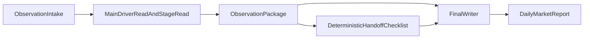

# Daily Market Report Depth Upgrade

**Status:** idea / pre-implementation design  
**Date:** 2026-04-03  
**Purpose:** 先定义一个真正详细、足够有盘面味道、并且真正 `actionable` 的 `daily market report` 契约，再反推 `judgment`、`package`、`handoff checklist` 各自必须提供什么信息。

## 1. 为什么要做这次升级

当前 repo 的 `research-current-market-reporter` 已经能产出：

- 当前主线
- 主驱动链条
- 确认 / 未确认
- 下一步关注点

但它还不够像真正的 `daily market data report`。

现在最明显的问题不是“长度不够”，而是“对象不够对”：

- 更像一篇有判断的 macro memo
- 还不像一篇把盘面拆清楚的 daily report

用户真正要看的不是泛泛的结论，而是：

- 关键资产今天具体走到了哪一步
- 这几天是怎么演化过来的
- 哪些价位已经被测试、跌破、收复、失败反抽
- 盘面到底在交易哪条链
- 哪些资产在确认这条链，哪些资产没有确认

## 2. 目标成品长什么样

升级后的最终 report 不应该只是“更会写”。
它必须让读者快速回答这 6 个问题：

1. 今天盘面最核心在交易什么
2. 今天相对过去几天，推进到了哪一步
3. 最重要的 3-6 个资产现在分别处于什么价格状态
4. 哪些资产确认了主线
5. 哪些资产没有确认，因而让判断还不能完全坐实
6. 下一交易日最该盯哪几个 trigger / levels

这 6 个问题仍然不够完整。

如果把 daily report 看成一个 `PM 认知界面`，它还必须额外做到两件事：

- 暴露当前判断的分析边界
- 自然生成下一轮最关键的问题

所以更高一层的目标不是“更详细”，而是让这份报告同时承担：

- 解释今天
- 暴露缺口
- 推进下一轮判断

## 3. 设计总原则

### 3.1 先定义最终 report，再反推上游对象

设计顺序应该是：

1. final report contract
2. judgment contract
3. package contract
4. handoff checklist contract

而不是先堆 package 再期待 writer 自己悟出来。

### 3.2 价格行为优先，不是主题名优先

daily report 的第一真相面应该是资产价格行为。

主题和宏观解释仍然重要，但它们应该回答：

- 为什么这些资产这样走
- 为什么这些动作能被解释成同一条链

而不是代替资产本身去讲故事。

### 3.3 关键资产必须进入“状态板”而不是散落在正文里

writer 不能只从长篇 `Technical Report Sweep` 里自己摘。

系统必须给出一个上游的、可快速消费的 `Key Asset State Board`。

### 3.4 写“今天到了哪一步”比写“今天涨跌了多少”更重要

daily report 不是行情播报。

它真正需要的是把价格行为翻译成结构阶段，比如：

- still_holding_support
- failed_reclaim
- broke_range_low
- retesting_breakout
- confirming_downtrend
- late_short_covering_bounce

### 3.5 规范效果，不规范句式

这次升级不应该把 contract 写成：

- 必须怎么开头
- 必须用哪些标题
- 必须按什么段落模板写

更好的 contract 是：

- 读者读完后必须获得什么
- 关键资产部分必须达到什么可读性
- 盘面解释必须达到什么解释力
- 报告必须怎样推动下一轮决策或提问

也就是说，结构只是一种实现手段，真正要被规范的是最终效果。

### 3.6 `Actionable` 的意思不是强推交易建议

在这类 daily market report 里，`actionable` 更适合定义为：

- 读者知道当前判断成立到什么程度
- 读者知道哪些资产是核心温度计
- 读者知道下一步先看什么
- 读者知道还缺什么证据，不能过度延伸

所以 `actionable` 关心的是：

- judgment 可推进
- observation 可延续
- feedback 可回流

而不只是“最后给一个 trade call”。

### 3.7 先规范效果，再反推中间对象

这次暴露出来的更深层问题，不只是 `market observation` 少几个 section，而是设计起点容易放错。

错误起点通常是：

- 先想 layer 名字
- 先想 section 列表
- 先想 package / gate / manifest 该怎么拼
- 先想 prompt 里要塞哪些关键词

这样得到的对象，往往“结构存在”，但不一定真的服务最终 report。

更好的方法是：

1. 先定义最终 report 必须产生什么阅读效果
2. 再反推 `judgment` 必须替最终 report 提前完成什么收敛
3. 再定义 `intake` 应如何为 judgment 准备 truth surface
4. 再定义 `package` 只该稳定携带哪些 judgment 结果
5. 最后才落到 section / prompt / schema / code

也就是说，这次需要保留下来的不是某一版 section 名，而是一种更一般的设计方法：

- `Effect-First Contract Design`

它的核心不是“把流程画得更完整”，而是：

- 先设计最终用户应获得什么认知结果
- 再设计每个中间对象分别替这个结果完成什么工作
- 不让下游 carrier 或 gate 偷偷接管上游 judgment

## 4. 目标系统流

关键变化不是多一个对象，而是把对象关系讲清楚：

- `intake` 负责真相面收集
- `judgment` 负责“盘面在交易什么 + 推进到哪一步”
- `package` 负责把 writer 需要的信息压缩成稳定输入
- `handoff` 负责 deterministic completeness / sufficiency check
- `report` 才是给 PM 看的最终成品

## 5. 最终 Daily Report Effect Contract

这里不把 report 定义成固定模板，而是定义成 4 类必须同时成立的阅读效果。

### 5.1 读者 takeaway 效果

读者读完后，必须立刻获得：

- 今天盘面最核心在交易什么
- 今天相对过去几天推进到了哪一步
- 当前判断已经成立到什么程度
- 明天最该先看什么

如果读者读完后仍然只能说“好像是 risk-off / 通胀 / 地缘”，这个效果就没有达成。

### 5.2 关键资产可读性效果

关键资产部分读完后，读者必须形成一张心里的资产状态图，而不是只记住零散 ticker。

需要达到的效果是：

- 读者能说出最重要的 3-6 个资产分别处于什么阶段
- 读者能区分 driver、confirmation、disconfirmation、hedge
- 读者能感知某个资产若再走一步，会强化还是破坏主线

如果正文提到了很多资产，但读者仍然说不出谁最重要、谁在确认、谁没跟，这个效果就没有达成。

### 5.3 盘面解释力效果

daily report 不是把主题名贴在价格上。

它需要让读者感到：

- 盘面正在交易一条具体传导链
- 这条链是由哪些资产动作共同讲出来的
- 哪些腿已经成立
- 哪些腿还没闭环

如果报告只是“先给主题，再拿资产举例”，解释力仍然不够。

### 5.4 下一轮关键问题生成效果

这是当前设计里最容易被低估的一层，也是 daily report 真正变得 `actionable` 的关键。

读者读完后，报告必须自然生成下一轮最关键的问题，而不是只停在 `next watch`。

这类问题至少分成三组：

- `还缺什么资料`
- `现有材料最多支持到多深`
- `之后可能如何演进`

如果报告解释了今天，但没有帮助 PM 形成下一轮判断问题，它仍然只是一次性输出，而不是 PM 界面。

### 5.5 6 个常见结果面

虽然 contract 不应被硬编码成唯一模板，但在现阶段，最稳定的结果面仍然是这 6 类：

### 5.1 核心判断

它需要达到的效果：

- 今天盘面核心在交易什么
- 这条主线为什么是主线，不是次要噪音

### 5.2 盘面推进到哪一步

这是当前最缺的一层。

它需要达到的效果：

- 今天相对过去几天是延续、确认、反抽失败，还是结构转折
- 盘面还在试探，还是已经给出更强确认

建议由这些判断对象来支撑：

- `early_probe`
- `first_confirmation`
- `trend_extension`
- `failed_reclaim`
- `range_break_confirmation`
- `late_reversal_attempt`
- `still_unresolved`

### 5.3 关键资产状态板

这是 report 升级的核心。

建议每篇报告固定覆盖 3-6 个最重要资产：

- 1-2 个核心驱动资产
- 1-2 个确认资产
- 1-2 个证伪 / 对冲资产

每个资产都应让读者感知：

- 现在价格大概在哪
- `1d` 变化
- `3d / 5d` 演进
- 当前最重要的支撑 / 阻力 / EMA / 前低前高
- 当前状态标签
- 它为什么对主线重要

建议用标准化状态标签去支持这种可读性：

- `holding_support`
- `testing_support`
- `broke_support`
- `failed_reclaim`
- `reclaimed_resistance`
- `range_low_reversal_attempt`
- `trend_intact`
- `trend_break_risk`

### 5.4 市场究竟在定价什么

这里不是重复第一段，而是把跨资产传导链解释到读者真的能顺着走一遍。

推荐的解释骨架：

1. 起点 shock / driver
2. 第一传导腿
3. 第二传导腿
4. 价格行为如何把这条链显性化

为了达到解释力，通常要让读者看到：

- driver asset
- transmission asset
- priced consequence

### 5.5 哪些确认了 / 哪些没有确认

这部分的关键不是标题，而是必须形成清晰的确认 / 未确认对照面。

- `Confirmed`
- `Not Yet Confirmed`

每条都要让读者知道：

- 是哪个资产
- 它做了什么动作
- 为什么这算确认 / 不确认

不能只写抽象句子。

### 5.6 下一步要看什么

这里不应只是“看 CPI / 看 FOMC”，而要把观察推进成决策问题。

至少要让读者知道：

- 明天 / 下个 session 最关键的价格 trigger
- 哪个资产若突破 / 失守会改变当前判断
- 哪个数据点只是验证，哪个数据点会真的改写主线

### 5.7 问题层不是附属装饰

在这次设计里，report 结尾的问题层应该被正式看成效果契约的一部分，而不是随手附加的 appendix。

理想状态下，报告最后会自然留下几类关键问题：

- 还缺哪一类资料，当前判断才能从“合理”推进到“坐实”
- 现有材料最多支持到哪一层判断：主线、阶段，还是 next trigger
- 如果明天延续，这条链会先由哪个资产给出确认
- 如果判断错了，最先会从哪里露馅

## 6. Judgment Artifact 应该提供什么

对应文件方向：

- [`../the_task_routing.md`](../the_task_routing.md)
- [`../../src/tools/draft_market_observation_judgment.py`](../../src/tools/draft_market_observation_judgment.py)

当前 judgment 已经有：

- `Mainline`
- `Main Driver`
- `Observation Basket`
- `Confirmed Public Anchors`
- `Not Confirmed`
- `Working Read`

下一步应升级为更稳定的 daily-report judgment contract。

它的任务不是重复 package，也不是提前写一篇 mini report。

更准确地说，它应该是一个：

- `effect-serving judgment object`
- `package-admission decision object`

也就是说，它要先替 final report 完成最关键的收敛动作，再把这些收敛结果交给 downstream package。

它首先要服务的，不是 section 完整性，而是 final report 的四类效果。也因此，它应先把 final report 需要的四类效果压缩成少数高价值判断对象：

- 支撑 `主线判断`
- 支撑 `盘面阶段判断`
- 支撑 `确认 / 未确认`
- 支撑 `下一轮关键问题生成`

如果这层没有替最终 report 先完成“材料主次判断”和“哪些对象值得进入正文主阅读面”的收敛，那么它虽然叫 `judgment`，本质上仍只是中间 prose。

### 6.1 建议新增的 judgment 维度

- `Market Stage`
- `Key Confirmation Move`
- `Key Missing Confirmation`
- `Next Trigger Map`

### 6.2 Judgment 的每一部分应回答什么

#### `Mainline`

- 今天盘面交易的唯一主线
- 不允许多主线并列

#### `Main Driver`

- 传导链条
- 核心 driver 资产是谁
- 次级确认资产是谁

#### `Market Stage`

- 今天相对过去几天推进到了哪一步
- 是不是已经进入更强确认

#### `Observation Basket`

- 核心驱动资产
- 第一确认资产
- 证伪 / 对冲资产
- 为什么它们分在这些组

#### `Key Confirmation Move`

- 今天最关键的确认动作
- 必须是资产动作，不是抽象判断

#### `Key Missing Confirmation`

- 哪个资产没有跟
- 为什么这会让判断仍保留条件性

#### `Next Trigger Map`

- 下一步最关键的价格位和事件位
- 哪个突破会加强主线
- 哪个失守会破坏主线

#### `Working Read`

- 对 PM 的一句话可执行理解
- 但不必强推具体交易建议

## 7. Package 应该提供什么

对应文件方向：

- [`../../src/tools/assemble_market_observation_package.py`](../../src/tools/assemble_market_observation_package.py)

当前 package 已经有比较完整的 section order，但仍然偏“资料堆叠”。

它下一步要从“writer input”升级成“daily report data board + writer input”。

也就是说，package 的责任不是自己生成结论，而是稳定支撑这些效果：

- 让 writer 快速抓住主线
- 让 writer 快速看懂关键资产状态图
- 让 writer 快速识别盘面传导链
- 让 writer 有材料去留下真正有价值的结尾问题

### 7.1 当前 package 里继续保留的部分

- `Observation Surface`
- `Macro Report`
- `Local Macro Snapshot`
- `Calendar Watch`
- `Current News / Event Window`
- `Theme Context`
- `Technical Report Sweep`
- `Mainline`
- `Main Driver`
- `Observation Basket`
- `Confirmed Public Anchors`
- `Not Confirmed`
- `Working Read`
- `Writer Notes`

### 7.2 应新增的关键 section

建议新增：

- `Session Path`
- `Key Asset State Board`
- `Next Trigger Map`

### 7.3 `Session Path` 应提供什么

这是 writer 最缺的上游对象之一。

应该至少包括：

- 今天属于哪种 session character
- 相对前一日 / 近几日属于延续还是反向
- 盘中最关键的转折点是什么

建议字段：

- `session_label`
- `open_to_close_character`
- `intraday_inflection`
- `vs_prior_days`

### 7.4 `Key Asset State Board` 应提供什么

这是最重要的新 section。

在资产技术报告这一层，上游 truth surface 应补一层 ingestion-first 的 `Recent 30m Window`：

- 由上游 ingestion / price store 先导入 `30m` bars
- 再由 `signal packet` 带出最近 5 个 session 的 raw `30m` 裸 K + volume
- writer package 只消费这个窗口，不应在 writer 阶段自己再跨层查库
- `日线 / 周线` 的 higher-timeframe anchors 继续作为校准层，而不是替代这层最近几天的盘面路径
- 目标不是用 code 先做软判断，也不是要求 writer 多描述几根 K 线，而是让 PM 从最近 5 个 session 的 `30m` 路径里获得新的判断能力

### 7.4.0.1 `Recent 30m Window` 应该让 PM 新增什么判断能力

这层最容易被做错成：

- 多一些 intraday 细节
- 多一些 micro pattern 标签
- 多一些“过去五天发生了什么”的摘要

但这些都不是这层真正的 contract。

更准确地说，PM 读完最近 5 个 session 的 `30m` 路径后，应该新增下面几种判断能力：

1. `短周期路径性质判断`
   - 这段路径更接近：
     - 修复尝试
     - 受损结构内的弱反弹
     - failed reclaim
     - 区间震荡延续
     - 准备再破位

2. `短周期路径与大结构关系判断`
   - 这 5 天的 `30m` 价格路径是在支持更大级别读法，还是只是在对大结构做局部扰动
   - 也就是说，PM 应知道这是“大结构开始改善”，还是“只是受损结构里的小级别反弹”

3. `结构质量变化判断`
   - PM 应知道这几天的盘面是在改善修复质量，还是在阻力下消耗动能
   - 重点不是波动本身，而是结构质量在变好还是变差

4. `下一步确认方式判断`
   - PM 不只应知道一个静态价位，还应知道下一步更关键的是哪一种盘面确认：
     - 站稳
     - 回踩承接
     - 放量延续
     - 还是冲高被拒后重新失守

5. `时间位置判断`
   - PM 应知道当前更接近：
     - 早期试探
     - 初步确认
     - 延续
     - 还是读法即将失败的边缘

所以，`Recent 30m Window` 的价值不在于让报告更细，而在于让 PM：

- 更清楚地判断短周期路径的性质
- 更清楚地判断这段路径与大结构的关系
- 更清楚地判断结构质量是在改善还是恶化
- 更清楚地知道下一步需要哪一种确认，而不只是一个价位
- 更清楚地知道这个资产当前处在读法演进的哪一个时间位置

### 7.4.1 Asset Technical Report 自身应承担什么结果

这层不该只是一篇“写得不错的 technical note”。

它更应该被定义成：

- 一个可被 downstream package 复用的 `asset state object`
- 一个同时服务 `trader + PM` 的判断对象

也就是说，asset technical report 的主要目标不是文风，而是让两类读者都进入正确的读后状态。

#### 交易员读完后应进入什么状态

- 知道当前价格处于什么结构位置
- 知道最近几天路径更接近反转、失败反抽、区间延续、突破尝试还是跌破尝试
- 知道最关键的支撑 / 阻力 / EMA / 前高前低
- 知道最高优先级 trigger 是什么
- 知道确认条件和失效条件是什么
- 知道当前读法最脆弱的地方在哪里

#### PM 读完后应进入什么状态

- 知道这个资产是否值得进入更大的 market workflow
- 知道它是支持主线、削弱主线，还是只是背景噪音
- 知道它对跨资产 market read 的意义是什么

因此这层至少应该让读者在短时间内知道：

- 这个资产现在处于什么阶段
- 最近几天的盘面路径意味着什么
- 下一步最优先该盯哪个 trigger
- 当前判断靠什么成立
- 当前判断最容易被什么推翻
- 还有什么没有被确认
- 为什么这个资产现在值得进入更大的 market workflow

如果一份 report 只有抽象结论、却看不出点位、结构、状态和 trigger，那么交易员无法使用。

如果一份 report 只有技术信息、却说不清 `Why It Matters Now`，那么 PM 又无法复用。

所以这层必须同时保留：

- 点位
- 结构
- 状态
- trigger
- 技术证据
- downstream 意义

### 7.4.2 对 writer 的要求应更偏结果导向，不要过度写法导向

这里最容易犯的错误，是把 prompt 越写越像“固定格式作文要求”。

更好的方向是：

- 强调必须交付的判断结果
- 强调必须给出的提醒
- 保留最小必要结构，方便 downstream 消费
- 不要过度规定它必须用哪种 prose 形状

更准确地说，应优先要求：

- `一句话阶段判断`
- `最高优先级 next trigger`
- `确认条件`
- `失效 / 否定条件`
- `主要 caution / 未确认部分`
- `Why It Matters Now`

不应优先要求：

- 固定句式
- 过多 section 装饰
- 为了“像报告”而牺牲优先级排序

### 7.4.3 Asset Technical Report 的结果 contract

如果把这层 contract 再压缩一点，可以理解为：

这份报告写完后，交易员和 PM 应该能立刻回答下面几个问题：

1. 现在这东西到底是：
   - 真修复
   - failed reclaim
   - reflex bounce
   - range continuation
   - 还是 breakout / breakdown attempt
2. 下一步先看哪个价位 / trigger
3. 如果这个 trigger 没发生，最该担心什么
4. 这个资产对下游市场判断意味着什么

如果读完后：

- 交易员仍说不清支撑 / 阻力 / trigger / invalidation
- PM 仍说不清这个资产为什么值得进入更大的 market reading

那么这份 technical report 还不够好。

### 7.4.4 Prompt 约束应采用“提醒式 contract”

对这层 writer，更适合的是提醒式 contract，而不是重写 house style。

应明确提醒：

- 尽早用一句话说清当前阶段，不要把阶段判断分散在一堆细节里
- 即使很多 level 都重要，也必须指出 `single highest-priority trigger`
- 必须直说当前读法哪里还没有被确认，哪里可能被高估
- 如果最近路径像反弹，必须进一步判断：
  - 是真实修复尝试
  - failed reclaim
  - 还是仅仅受损区间里的 reflex bounce
- `Why It Matters Now` 必须说明它对 downstream market reading 的具体意义，而不是只做独立 chart commentary

### 7.4.5 应优先优化“提醒价值”而不是“完整度”

这层有一个很重要的产品判断：

- 一个更短、但阶段 / trigger / caution 很明确的 technical report

通常好过：

- 一个覆盖更全、但优先级模糊的 technical report

所以后续迭代时，优先优化：

- 当前阶段是否足够明确
- 最高优先级 trigger 是否足够明确
- caution 是否足够显眼
- 为什么重要是否足够可复用

而不是优先优化：

- 文风是否更像成熟 sell-side note
- 段落是否更工整
- 是否补齐更多次要细节

### 7.4.6 理想的 asset technical writer prompt 大纲

除了对象 contract 之外，也应把“理想 prompt 里该怎么要求”单独保留在 doc 里。

原因是：

- prompt 会继续变
- 代码里的字面 prompt 可能会为了兼容性、token、模型习性而调整
- 但我们仍需要一个更稳定的目标版本，方便以后比较“当前 prompt 有没有偏掉”

这里记录的不是逐字固定模板，而是理想的 prompt mainline。

建议大纲如下：

1. 读者定位
   - 你在写的是一个同时给 `trader + PM` 使用的 current asset technical report
   - 交易员需要足够硬的技术证据来判断点位、结构、状态和 trigger
   - PM 需要足够清楚的状态意义来判断这个资产是否值得进入更大的 market workflow

2. 读后状态
   - 交易员读完后，应能说清：
     - 当前结构位置
     - 当前阶段
     - 最高优先级 trigger
     - 确认条件 / 失效条件
     - 当前读法最脆弱的地方
   - PM 读完后，应能说清：
     - 这个资产为什么重要
     - 它支持、削弱，还是只构成背景
     - 它为什么值得进入 downstream market reading

3. truth surface 提醒
   - 先读最近 5 个 session 的 `Recent 30m Window`
   - 再用 `Higher Timeframe Anchors` 校准更大结构
   - 不要等待预制好的 microstructure 标签
   - 不要脱离输入自行补叙事

4. 结果 contract
   - 让交易员看得见：
     - 点位
     - 结构
     - 状态
     - trigger
     - technical evidence
   - 让 PM 看得见：
     - why it matters now
     - 它为什么值得进入更大的 market workflow
   - 让 PM 因为最近 5 个 session 的 `30m` 路径而新增判断能力：
     - 更能判断短周期路径性质
     - 更能判断这段路径是在支持还是削弱大结构读法
     - 更能判断结构质量是在改善还是衰竭
     - 更能判断下一步需要哪一种确认
     - 更能判断当前处于读法演进的哪个时间位置

5. 优先级提醒
   - 优先给出 `single highest-priority trigger`
   - 优先给出 `main caution`
   - 优先给出 `one-sentence stage call`
   - 排序和提醒价值比全面覆盖更重要

6. 阶段判断提醒
   - 如果最近路径像反弹，不要停在“有反弹”
   - 要进一步判断更接近：
     - real repair attempt
     - failed reclaim
     - reflex bounce inside damaged range
     - range continuation
     - breakout / breakdown attempt
   - 不要只做过去五天的过程摘要，要说明这段 `30m` 路径让 PM 新增了什么阶段 / 质量 / 确认方式判断

7. 写法边界
   - 不要把这层写成纯抽象结论卡
   - 不要为了 house style 牺牲判断密度
   - 不要为了看起来完整而削弱优先级
   - 不要只做孤立 chart commentary，必须保留 downstream 可复用意义

### 7.4.7 理想 prompt 中可长期保留的提醒句

如果后续要保留一组较稳定的提醒句，建议至少保留下面这些意思：

- 尽早用一句话说清当前阶段，不要把阶段判断分散在细节里
- 即使很多价位都重要，也必须指出单一最高优先级 trigger
- 直说哪里还没有被确认，哪里可能被高估
- 如果最近路径像反弹，必须判断它究竟是修复尝试、failed reclaim，还是 reflex bounce
- 解释它为什么对 downstream market reading 重要，而不只是对这个单一 chart 重要
- 一个更短、但阶段 / trigger / caution 明确的报告，好过一个更长、但优先级模糊的报告

### 7.4.8 理想 prompt 中的静默自检

静默自检也值得保留在 doc，因为这不是文风技巧，而是质量控制的一部分。

建议 writer 在最终输出前，至少在内部检查：

- 我有没有用一句话明确当前阶段
- 我有没有指出最先该看的 trigger
- 我有没有明确说出还未确认的部分
- 我有没有解释它对 downstream 判断为什么重要

如果这些问题里有任何一个答案是否定的，那么这份 technical report 还没有完成它的真正任务。

### 7.4.9 Technical fidelity check 更适合 findings-only，而不是全文重写

如果后续为 asset technical report 加第二段检查层，这一层更适合做：

- findings-only fidelity check
- 标出哪一句或哪一小段有事实漂移
- 给出建议替换句
- 再由代码做局部替换

不更适合做：

- 再写一遍整篇 technical report
- 以检查名义重排段落或重塑文风

原因很简单：

- technical writer 第一段负责判断表达
- fidelity checker 第二段负责事实忠实度
- 如果 checker 直接重写全文，就很容易在修一个 EMA 关系时，顺手把没问题的段落也改味

所以更稳的 contract 是：

- checker 只输出 findings
- 代码只做局部替换
- 没被 findings 命中的段落，尽量逐字保持不动

建议每个资产卡包含：

- `asset_id`
- `role_in_mainline`
- `last_price`
- `daily_change_pct`
- `three_day_change_pct`
- `five_day_change_pct`
- `key_supports`
- `key_resistances`
- `ema_context`
- `distance_to_key_level`
- `state_label`
- `state_explanation`
- `why_this_asset_matters_today`

角色应标准化为：

- `core_driver`
- `confirmation`
- `disconfirmation`
- `hedge`
- `background_context`

### 7.5 `Technical Report Sweep` 应退回什么位置

`Technical Report Sweep` 仍然保留，但它应该从：

- writer 的主要入口

退回成：

- 支撑 `Key Asset State Board` 的完整技术附录

也就是说：

- writer 先读 `Key Asset State Board`
- 再去 `Technical Report Sweep` 看更细节的来源

### 7.6 `Writer Notes` 应提供什么

`Writer Notes` 不应该再承担“关键事实提炼”。

它应该只保留：

- 使用边界
- 写作顺序
- 不要做什么
- 哪些 section 是主 truth surface

它不应该承载：

- stale 的运行时残留
- 重复的资产清单
- 本该写入 `Key Asset State Board` 的事实

## 8. Intake 应该提供什么

对应文件方向：

- [`../../data/analysis/market_observation/current-market.intake.md`](../../data/analysis/market_observation/current-market.intake.md)

`intake` 仍然应该保持“真相面优先”。
但它也需要开始为 daily report 服务，而不只是为宏观 judgment 服务。

### 8.1 Intake 继续保留的部分

- `Run Context`
- `Macro Report`
- `Local Macro Snapshot`
- `Calendar Watch`
- `Current News / Event Window`
- `Theme Context`
- `ObservationTickerPool`
- `Technical Report Sweep`
- `Open Questions`

### 8.2 Intake 需要增强的地方

建议在 `ObservationTickerPool` 或相邻 section 中补更可结构化消费的字段：

- 近几日变化
- 当前阶段标签
- 关键价位接近度
- 为什么该资产被纳入今天的核心观察名单

也就是说，intake 不一定要直接写成漂亮表述，但它需要更强的“给 judgment 使用的结构字段”。

### 8.2.1 Intake 的角色定位需要更明确

在这一轮设计里，`ObservationIntake` 不应再被理解成“把资料先堆在一起”的临时大仓。

更准确地说，它应该是：

- run-owned 的 pre-judgment truth surface
- judgment 之前的压缩读取层
- package 之前的判断输入层

它不该直接承担：

- 写 final prose
- 代替 `judgment artifact`
- 代替 `ObservationPackage`
- 代替 `writer-handoff`

它真正要做的是，让上游判断者在进入 `Mainline / Main Driver / Observation Basket` 之前，先拥有足够清晰的输入对象，而不是只能从长段材料中自己二次提炼。

### 8.2.2 Technical inputs 在 intake 里不应只以附录方式存在

当前 `Technical Report Sweep` 仍然有价值，但如果它只作为技术附录列表存在，那么 judgment 很容易退化成：

- 宏观主线讲很多
- 资产只被当作例子
- `Observation Basket` 缺少明确入选逻辑
- `Not Confirmed` 只能写宏观层的不确定性，而不是资产层的未确认点

所以 intake 里应该同时保留两层 technical consumption：

1. `Technical Report Sweep`
   - 作为完整技术附录
   - 供后续回看完整 canonical report

2. `judgment-ready technical state rows`
   - 作为更适合 judgment 快速扫描的压缩层
   - 让上游可以快速比较哪些资产是核心驱动、哪些只是确认层、哪些是证伪层

这意味着 intake 中的 technical 输入，不应只回答“今天有哪些技术报告”，而应进一步回答：

- 哪些资产值得进入今天的主观察篮子
- 每个候选资产现在处于什么阶段
- 每个候选资产最优先的 next trigger 是什么
- 每个候选资产最大的 caution 是什么
- 这个资产在今天的 market read 里扮演什么角色

### 8.2.3 ObservationTickerPool 或相邻对象应新增什么字段

建议把前面 `Section 7` 里对 asset technical report 的新 contract，明确反推到 intake 可消费字段层。

至少应能提供：

- `role_in_mainline`
- `state_label`
- `state_explanation`
- `recent_path_label`
- `next_trigger`
- `confirmation_condition`
- `failure_condition`
- `main_caution`
- `why_in_today_basket`
- `key_supports`
- `key_resistances`
- `distance_to_key_level`
- `three_day_change_pct`
- `five_day_change_pct`

如果需要进一步压缩，还可以允许 intake 只保留其中最关键的 judgment-facing 字段：

- `role_in_mainline`
- `state_label`
- `next_trigger`
- `main_caution`
- `why_in_today_basket`

重点不在字段是否整齐，而在于 judgment 是否终于能直接拿到：

- 当前阶段
- 下一触发点
- 最大 caution
- 入篮原因

### 8.2.4 intake 应如何支持 judgment artifact

这层 contract 最终要服务的不是 intake 自己，而是下游 judgment。

至少应明确 support 下面这些对象：

- `Mainline`
- `Main Driver`
- `Observation Basket`
- `Confirmed Public Anchors`
- `Not Confirmed`
- `Working Read`

更具体地说：

- `Mainline`
  - 需要 intake 提供主导资产与确认资产的状态差异，避免主线只剩抽象宏观叙事
- `Main Driver`
  - 需要 intake 提供传导链上的关键资产状态与 trigger，避免 driver 只有逻辑、没有盘面锚
- `Observation Basket`
  - 需要 intake 提供入篮理由、角色分组、优先级，而不是只给一个 ticker 清单
- `Confirmed Public Anchors`
  - 需要 intake 提供哪些资产层事实已经和宏观主题一致，而不只是 public narrative 一致
- `Not Confirmed`
  - 需要 intake 提供哪些资产层 trigger 尚未发生、哪些反弹或下破还未被确认
- `Working Read`
  - 需要 intake 提供哪些判断可以暂时成立、哪些仍需下一步观察来升级或降级

如果 intake 缺少这些字段，judgment 很容易退化成：

- 主线主要靠 macro prose 支撑
- 资产角色难以排序
- `Not Confirmed` 只剩宏观数据缺口
- `Working Read` 变成“观点总结”而不是条件化判断

### 8.2.5 Intake 与 package / handoff 的边界

为了避免重复，也需要把边界说清楚：

- `ObservationIntake`
  - 负责 pre-judgment truth surface
  - 负责把技术输入压缩成 judgment-ready rows
- `judgment artifact`
  - 负责做主线判断、篮子判断、confirmed / not confirmed 划分
- `ObservationPackage`
  - 负责把 judgment 结果与上游 truth surface 重新装配成 writer-facing 输入
- `writer-handoff`
  - 负责检查是否足以支撑最终写作，不负责回头代做 judgment

也就是说，intake 下一步最关键的升级不是“再加更多 section”，而是：

- 让它从材料堆叠层，升级成 judgment-ready truth surface
- 让技术输入从附录，升级成可进入 `Main Driver / Observation Basket / Not Confirmed` 的判断对象

### 8.2.6 这一层交给 DS 时，prompt 不能只像 writer prompt

这里的 downstream worker 虽然也会输出 markdown object，但它本质上不是普通 writer。

更准确地说，它是一个：

- `judgment worker`
- `selection worker`
- `package admission worker`

所以 prompt 不能只要求它“写清楚”，而必须明确要求它：

- 先判断今天市场交易的 `main topic / mainline`
- 再判断真正的 `main driver`
- 再决定哪些资产与材料值得进入最终 report package

也就是说，这一层不是 final prose 层，而是 `judgment + package selection` 层。

### 8.2.7 理想的 judgment / selection prompt 主线

这一层理想 prompt 的 mainline，建议单独保留在 doc 中，方便后续 prompt 反复调整时还有稳定目标。

建议至少包含下面这些部分：

1. PM 读后状态
   - PM 读完这层后，应立刻知道：
     - 今天市场到底在交易什么
     - 这条主线推进到了哪一步
     - 哪些资产最值得进入正文主阅读面
     - 哪些只是 supporting detail
     - 哪些链条已经确认，哪些还没确认
     - 下一轮最关键的问题是什么

2. 任务定位
   - 你在做的是 market-observation judgment pass
   - 你不是 final report writer
   - 你的任务是从 `ObservationIntake` 中先做主线判断，再决定 package 主材料

3. truth surface 边界
   - 只使用 `ObservationIntake` 中给定的材料
   - 优先读取：
     - `Macro Report`
     - `Local Macro Snapshot`
     - `Calendar Watch`
     - `Current News / Event Window`
     - `Theme Context`
     - technical state rows / `Technical Report Sweep`
   - 不要自行扩写 intake 外的新事实

4. judgment 任务
   - 判断今天市场交易的 `main topic`
   - 判断最合理的 `mainline`
   - 判断真正的 `main driver`
   - 判断哪些资产是：
     - `core_driver`
     - `confirmation`
     - `disconfirmation`
     - `hedge`
   - 判断最重要的未确认链条是什么

5. selection 任务
   - 判断哪些材料应进入 `report package` 主阅读面
   - 判断哪些材料只适合留在 appendix / supporting detail
   - 判断哪些 technical reports 值得进入今天的 `Observation Basket`
   - 不要只列出 ticker，必须说明入选理由

6. 输出对象
   - `Mainline`
   - `Main Driver`
   - `Observation Basket`
   - `Confirmed Public Anchors`
   - `Not Confirmed`
   - `Working Read`

7. 硬提醒
   - 不要把输出退化成泛泛宏观总结
   - 不要把 technical reports 仅仅当成附录背景
   - 必须排序，不要平铺并列信息
   - 必须说明为什么某些材料值得进入 package 主体
   - 必须保留 `Not Confirmed`，不要过早收敛成单一路径

### 8.2.7.1 这一层真正应该替 final report 完成什么

如果从最终 report 的阅读效果反推，那么 `judgment + selection` 这一层至少应该提前完成下面四种工作：

1. `主线收敛`
   - 今天到底在交易什么
   - 为什么它是主线，不是配角

2. `阶段判断`
   - 当前盘面相对过去几天推进到了哪一步
   - 是试探、第一次确认、延续、失败反抽，还是仍未决

3. `正文 spine 选择`
   - 哪些 3-6 个资产足以构成 final report 的关键资产状态图
   - 谁是 `driver`
   - 谁是 `confirmation`
   - 谁是 `disconfirmation / hedge`
   - 谁虽然相关，但今天只该退到 supporting detail

4. `条件性与下一轮问题保留`
   - 哪些链条已经确认
   - 哪些腿还没闭环
   - final report 结尾最应该留下什么问题

如果这四种工作没有在这里被提前完成，那么 downstream writer 仍会被迫在 package 阶段临时做 selection，整个链路就会再次滑回 `package-first`。

### 8.2.7.2 PM / macro analyst 读完 Judgment 后应进入什么状态

这层的真实读者更接近 `PM / macro analyst`，而不是泛化的 writer。

如果 judgment 真正完成了它的工作，那么读完后应立刻知道：

- 今天市场到底在交易什么
- 这条主线推进到了哪一步
- 哪些 3-6 个资产足以构成正文 spine
- 哪些只是 supporting detail
- 哪些链条已经确认，哪些链条仍不能过度延伸
- 下一轮最关键的问题是什么

如果读完后仍不知道：

- mainline
- market stage
- key asset spine
- package admission
- 最脆弱的未确认链条

那么 judgment 仍然不够。

### 8.3 Final Report Writing 应该服务什么读后状态

这一层不该再从 prose style 或 section 模板出发。

更准确地说，writer 的第一责任是：让 PM 在读完整篇 daily report 之后，进入正确的认知状态。

#### PM 读完整篇 report 后应进入什么状态

- 立刻知道今天市场在交易什么
- 立刻知道当前盘面推进到了哪一步
- 脑中形成一张关键资产状态图
- 明确知道哪些地方已经确认，哪些地方仍不能过度延伸
- 明确知道下一步最关键的问题是什么

#### 这层不应该替上游重新做什么

- 不重新发现主线
- 不重新挑资产
- 不重新决定 package admission
- 不把技术证据抽空成纯宏观 prose

更准确地说，writer 的任务是：

- 放大 upstream judgment 的可感知性
- 让被选中的关键资产真正形成 state map
- 让 conditionality 变得清楚可感
- 让结尾问题自然形成下一轮判断推进器

#### 失败标准

如果读完后：

- 只能复述宏观主题名
- 说不出关键资产和其角色
- 不知道阶段是确认、延续、未决还是失败反抽
- 不知道还缺什么证据
- 不知道下一轮问题是什么

那么 final report 没达标。

### 8.3.1 理想的 final report writer prompt 主线

1. PM 读后状态
   - PM 读完整篇 report 后，应立刻知道：
     - 今天市场在交易什么
     - 当前盘面推进到了哪一步
     - 哪些资产最重要
     - 哪些地方已经确认，哪些地方仍不确认
     - 下一步最关键的问题是什么

2. upstream 约束
   - `Mainline`、`Main Driver`、`Market Stage`、`Key Asset Spine`、`Package Admission`、`Next Questions` 都是 upstream judgment 对象
   - writer 负责放大其可感知性，而不是重新做一轮选择

3. 证据使用方式
   - 关键资产的技术证据不能被抽空
   - writer 需要把被选中的资产写成真正的 state map
   - 但不应把全文退化成指标堆叠

4. 写作结果
   - 主线一眼可见
   - 阶段一眼可见
   - 关键资产角色清楚
   - confirmed / not confirmed 清楚
   - 结尾问题是下一轮判断推进器，而不只是 watchlist

### 8.2.8 这一层 prompt 最应该强调的结果

如果把这层再压缩一点，那么 prompt 最应强调的不是文风，而是这些结果：

- 读完后，系统应知道今天到底在交易什么
- 应知道为什么是这个 `mainline`
- 应知道哪些材料足够重要，可以进入 report package
- 应知道哪些虽然相关，但今天只该退到 supporting / appendix
- 应知道接下来 final report 应围绕哪些核心材料展开

所以这一层的 prompt 应优先逼出：

- `main topic`
- `mainline`
- `main driver`
- `basket inclusion logic`
- `confirmed / not confirmed`
- `package inclusion logic`

而不是优先逼出：

- 更漂亮的 prose
- 更像评论文章的语气
- 更完整但优先级更弱的摘要

### 8.2.9 这一层 prompt 的静默自检

和 asset technical report 一样，这一层也值得保留一组静默自检问题。

建议至少包括：

- 我有没有明确说出今天市场交易的主线，而不是只总结信息
- 我有没有说出真正的 `main driver`
- 我有没有解释为什么这些资产进入 basket
- 我有没有解释为什么某些材料进入 package 主体
- 我有没有明确保留最重要的 `Not Confirmed`

如果这些问题里有任何一个是否定的，那么这一轮 judgment / selection pass 还没有完成。

## 9. Deterministic Handoff Checklist 应该检查什么

对应文件方向：

- [`../../src/tools/build_market_observation_handoff.py`](../../src/tools/build_market_observation_handoff.py)

当前 handoff 更接近 section completeness check。

下一步建议升级成“两层检查”：

更准确地说，handoff 不该只问“东西在不在”，而应该问：

- 现有输入是否足以支撑 `主线判断`
- 是否足以支撑 `资产阶段可读性`
- 是否足以支撑 `盘面解释力`
- 是否足以支撑 `下一轮关键问题生成`

### 9.1 层一：基础完整性

检查：

- section 是否存在
- judgment 是否存在
- 必要 section 是否非空

### 9.2 层二：详细度完整性

检查：

- 是否存在 `Session Path`
- 是否存在 `Key Asset State Board`
- 是否存在“近几日变化”
- 是否存在“关键位状态”
- 是否存在“确认 / 未确认”分组
- 是否存在 `Next Trigger Map`

### 9.3 Handoff 输出应该让 PM 直接看懂

因为 checklist 会附在最终报告后面，所以它不能只是工程日志。

建议永远包含：

- `Checked Inputs`
- `Missing Required`
- `Coverage Gaps`
- `Preserved Writer Direction`

其中 `Coverage Gaps` 特别重要，因为这会直接告诉 PM：

- 今天这篇报告没有讲深，是因为缺了哪类上游数据
- 还是因为 writer 没有充分使用已经存在的材料

## 10. 推荐的 section-by-section 升级顺序

建议不要一次性改完所有 section。

更稳的顺序是：

1. 先定义 final report 的固定骨架
2. 先加 `Session Path`
3. 再加 `Key Asset State Board`
4. 再补 `Next Trigger Map`
5. 再收紧 judgment 的阶段表达
6. 最后升级 handoff checklist 的详细度校验

## 11. 第一轮最值得先落地的最小升级

如果只做第一轮、但又要明显提升“味道”，最值得优先落地的是：

1. final report 强制新增 `盘面推进到哪一步`
2. package 新增 `Key Asset State Board`
3. judgment 新增 `Market Stage`
4. handoff checklist 检查是否存在“关键资产状态 + 阶段判断 + next trigger”

因为这四项最直接决定：

- 报告是不是像真正的 daily market report
- 读者能不能一眼看出盘面结构

## 12. 这份 ideas 文档之后怎么用

这份文档不是 canonical truth。

它的用途是：

- 作为 daily report 深化设计的讨论底稿
- 让后续实现时按 section 逐个落地
- 避免继续只讨论“文风”而没有明确的对象契约

等这里的对象设计稳定后，再把其中成熟部分提升到：

- [`../the_task_routing.md`](../the_task_routing.md)
- [`../../.cursor/skills/research-current-market-reporter/SKILL.md`](../../.cursor/skills/research-current-market-reporter/SKILL.md)
- 相关 builder / writer 实现

## 13. Retention Layer 建议

这次讨论里其实出现了三种不同层级的内容，后续不要混在一个对象里保存。

### 13.1 思维层

这类内容更像长期方法论：

- 先想用户为什么这样问
- 识别隐藏假设
- 必要时把问题改写成更高质量的问题

这类原则更适合沉淀为：

- `09_soul` 里的长期公理候选

### 13.2 本地执行层

当上述原则需要在当前 repo 里被强执行时，更适合先投影到：

- `.cursor/rules/`

也就是说，先让它成为当前工作面的运行规则，再决定是否值得长期提升为 portable axiom。

### 13.3 Report 产品层

这类内容属于 daily market report 自身：

- 这份报告要给 PM 造成什么阅读效果
- 为什么结尾的问题层不是装饰，而是判断推进器
- 什么才叫真正 `actionable`

这层内容应该保留在：

- 当前 ideas 文档
- `research-current-market-reporter` contract
- 之后成熟后再提升到 canonical design doc
