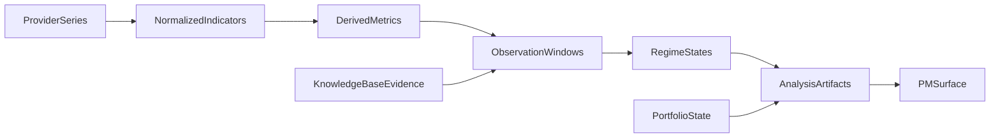
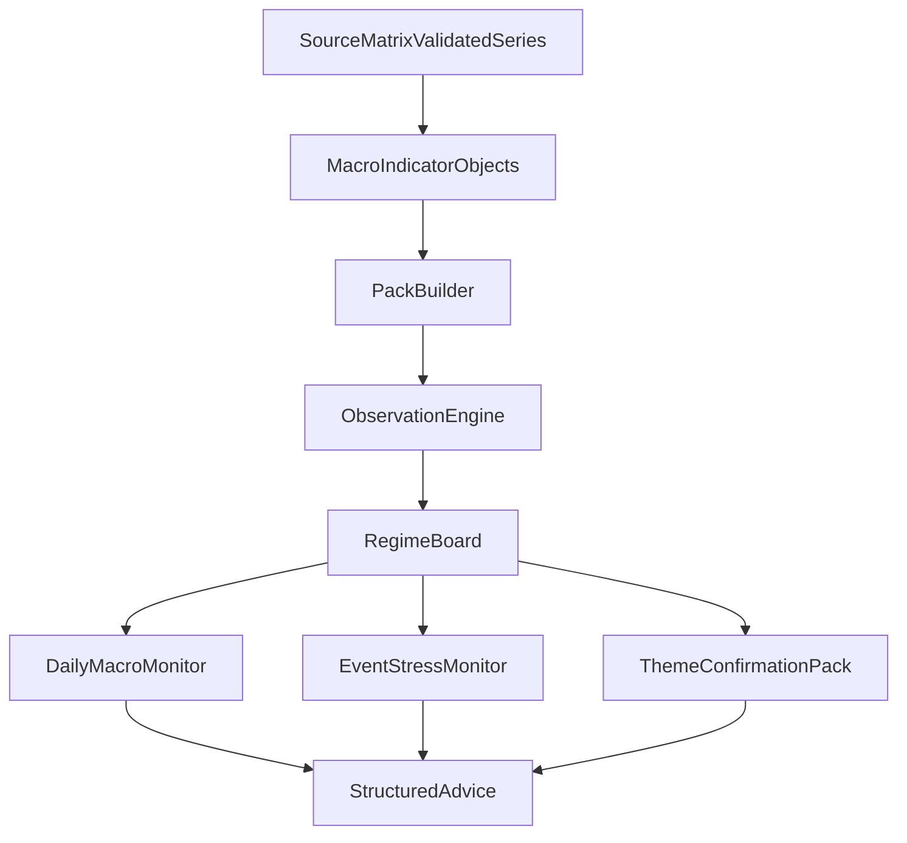

# Macro Analysis Framework Upgrade

**Status:** temporary upgrade design doc  
**Date:** 2026-03-27  
**Purpose:** define how macro indicators should be grouped, interpreted, and promoted into PM-facing workflows so the repo moves from scattered macro references to a reusable analysis framework.

## 1. Why This Upgrade Is Needed

The repo already has:

- strong research memory and archive-first ingest
- theme-level macro reasoning such as `iran-hormuz-escalation`
- a clean `KnowledgeBase` vs `AnalysisPlatform` split
- recurring use of macro windows like `SOFR-FF`, `TGA`, `USDJPY`, `VIX`, `cross-currency basis`, and `UST` yields

What it still lacks is a unified layer that says:

- which indicators belong together
- how raw series become observation windows
- how observation windows become regime states
- how regime states become PM-facing artifacts

Without that layer, the repo risks two failure modes:

- collecting many indicators without a repeatable interpretation model
- writing strong event/theme reports without a reusable macro monitor stack

This doc is the upgrade path for that missing middle layer.

## 2. Design Constraints

This framework must stay aligned with:

- [`../ai_native_trading_operating_system.md`](../ai_native_trading_operating_system.md)
- [`../knowledge_base_and_memory_system.md`](../knowledge_base_and_memory_system.md)
- [`../analysis_platform_and_pm_workspace.md`](../analysis_platform_and_pm_workspace.md)
- [`../market_data_architecture.md`](../market_data_architecture.md)
- [`../source_connectors_and_knowledge_ingestion.md`](../source_connectors_and_knowledge_ingestion.md)

Non-negotiable boundary rules:

- connectors fetch and preserve source truth, but do not own PM advice
- normalized indicator objects belong to the platform layer, not to raw provider payloads
- `KnowledgeBase` stores durable evidence and prior artifacts
- `AnalysisPlatform` consumes indicator packs, research, portfolio context, and risk context to form current judgment

## 3. Core Upgrade Principles

### 3.1 Separate observation from expression

An indicator or observation window tells the system what regime it is in. It does not automatically imply the correct trade expression.

### 3.2 Separate system stress from crowding stress

`Funding stress` and `crowded hedging` are related but not identical. The framework should explicitly distinguish:

- `system_is_breaking`
- `market_has_priced_a_scary_story`

This distinction already appears in local research and should become a first-class framework rule.

### 3.3 Prefer packs over isolated series

Single indicators should rarely drive final interpretation alone. The default analysis object should be a pack of linked indicators with explicit confirmation logic.

### 3.4 Prefer derived monitor objects over raw provider dumps

The AnalysisPlatform should consume:

- normalized indicator objects
- derived spreads and composites
- observation windows
- regime summaries

It should not consume raw terminal dumps or connector plumbing metadata.

### 3.5 Keep macro analysis reusable across themes

Theme reports like `iran-hormuz-escalation` and `usd-liquidity-plumbing` should provide strong examples, but they should not define the whole framework. The macro layer must work across routine daily monitoring, event stress, and cross-asset PM workflows.

## 4. System Flow

The key change is that the repo should no longer jump directly from `raw series` or `theme narrative` to `PM output`. It needs explicit middle objects.

## 5. Proposed Analysis Layers

### 5.1 Plumbing And Liquidity Layer

Purpose:

- answer whether the dollar system is functioning smoothly, fragile, or dislocating

Typical inputs:

- `WALCL`
- `TGA`
- `ON RRP`
- `SOFR`
- `EFFR`
- `SOFR-FF`
- bill yields
- repo softness
- reserve balances

Core question:

- is the short-end still buffered, or is the system beginning to bind?

### 5.2 Policy And Curve Repricing Layer

Purpose:

- answer how the market is changing its policy-path and discount-rate assumptions

Typical inputs:

- `UST 2Y`
- `UST 10Y`
- `2s10s`
- real yields
- breakevens
- SOFR futures strip
- `MOVE`

Core question:

- is the market pricing out cuts, pricing in hikes, or moving into a growth scare / duration bid?

### 5.3 Cross-Border Dollar Layer

Purpose:

- answer whether stress is staying onshore or is leaking into offshore dollar pricing

Typical inputs:

- `USDJPY`
- `EURUSD`
- `DXY`
- cross-currency basis
- `US2Y-JP2Y`

Core question:

- is the stress mainly a domestic rates repricing, or is offshore dollar strain becoming the real transmission channel?

### 5.4 Volatility And Hedging-Cost Layer

Purpose:

- answer how expensive protection has become across assets

Typical inputs:

- `VIX`
- `VVIX`
- `MOVE`
- `SPX` skew
- crude skew

Core question:

- is fear showing up as system stress, or mainly as expensive insurance and crowded hedges?

### 5.5 Positioning And Sentiment Layer

Purpose:

- answer whether macro moves are being amplified by exposure, crowding, or leverage

Typical inputs:

- `NAAIM`
- `AAII`
- `CFTC`
- margin debt
- sell-side or vendor flow datasets

Core question:

- how much of the move is regime change versus positioning pain?

### 5.6 Credit And Growth Damage Layer

Purpose:

- answer whether macro stress is spreading into financing conditions and growth-sensitive assets

Typical inputs:

- `IG OAS`
- `HY OAS`
- `CDX`
- copper
- broad equity beta
- long-duration growth proxies

Core question:

- is the damage staying in macro pricing, or moving into real financing stress?

### 5.7 Commodity And Import-Shock Layer

Purpose:

- answer whether supply shocks are becoming inflation and policy shocks

Typical inputs:

- `Brent`
- `WTI`
- commodity indexes
- LNG or JKM proxies
- freight / shipping proxies

Core question:

- is this still a localized commodity move, or is it changing the macro discount-rate regime?

### 5.8 Crypto Liquidity Layer

Purpose:

- treat crypto as a distinct high-beta liquidity and leverage window instead of folding it into generic risk sentiment

Typical inputs:

- `BTC`
- stablecoin supply
- crypto funding rates
- `MVRV`
- crypto fear and greed

Core question:

- is crypto confirming broader liquidity expansion or signaling leverage stress before other markets do?

## 6. Standard Monitor Objects

### 6.1 Indicator Pack

A reusable bundle of closely related indicators.

Suggested fields:

- `pack_id`
- `pack_name`
- `indicators`
- `derived_metrics`
- `cadence`
- `interpretation_rules`
- `confidence_notes`

Examples:

- `net_liquidity_pack`
- `funding_stress_pack`
- `curve_repricing_pack`
- `crossborder_usd_pack`
- `vol_crowding_pack`

### 6.2 Observation Window

A specific analytical lens that asks one clean question.

Suggested fields:

- `window_id`
- `question`
- `primary_pack_ids`
- `confirmation_pack_ids`
- `disconfirmation_rules`
- `linked_assets`
- `linked_themes`

Examples:

- `is_short_end_breaking`
- `are_cuts_being_priced_out`
- `is_offshore_dollar_stress_rising`
- `is_insurance_overpriced`
- `is_repair_unwind_starting`

### 6.3 Regime State

A compressed state object that downstream workflows can consume without re-reading every raw series.

Suggested fields:

- `state_id`
- `window_id`
- `state_label`
- `severity`
- `direction`
- `evidence_summary`
- `confidence`
- `as_of`

Recommended labels:

- `calm`
- `supportive`
- `fragile`
- `stressed`
- `dislocated`
- `repairing`

### 6.4 Trigger Condition

A machine-readable rule for when the system should escalate review.

Suggested fields:

- `trigger_id`
- `window_id`
- `condition_logic`
- `minimum_confirmations`
- `cooldown_rule`
- `notification_target`

### 6.5 Risk Checklist

A PM-facing checklist that forces the analysis surface to spell out the risks before pushing action framing.

Suggested fields:

- `checklist_id`
- `regime_state_ids`
- `known_risks`
- `what_would_disconfirm`
- `near_term_watchpoints`

### 6.6 PM Summary Artifact

The final compressed object for human consumption.

Suggested fields:

- `artifact_id`
- `artifact_type`
- `headline`
- `core_judgment`
- `evidence`
- `risks`
- `portfolio_relevance`
- `monitoring_actions`

## 7. Standard Observation Windows

The framework should standardize a small number of recurring questions.

### 7.1 Is The Short-End Still Buffered?

Primary packs:

- `net_liquidity_pack`
- `funding_stress_pack`

Confirmation windows:

- `MMF inflows`
- bill richness
- repo softness

### 7.2 Are Cuts Being Priced Out?

Primary packs:

- `curve_repricing_pack`

Confirmation windows:

- `MOVE`
- real yields
- front-end futures repricing

### 7.3 Is Offshore Dollar Stress Overtaking Onshore Calm?

Primary packs:

- `crossborder_usd_pack`

Confirmation windows:

- `USDJPY`
- `EURUSD`
- cross-currency basis

### 7.4 Is Protection Becoming Too Expensive?

Primary packs:

- `vol_crowding_pack`

Confirmation windows:

- `VIX`
- `VVIX`
- skew measures
- relative move between price decline and hedge pricing

### 7.5 Is Credit Starting To Confirm The Damage?

Primary packs:

- `credit_damage_pack`

Confirmation windows:

- `HY OAS`
- `IG OAS`
- `CDX`
- growth-sensitive cyclicals

### 7.6 Is A Repair / Unwind Phase Starting?

Primary packs:

- `repair_unwind_pack`

Confirmation windows:

- oil premium fading
- dollar easing
- hedge costs compressing
- broad beta outperforming defensives

## 8. Output Contracts

The framework should support four recurring output types.

### 8.1 Daily Macro Monitor

Purpose:

- summarize the current state of the main packs once per day

Minimum output:

- current regime labels
- top 3 changes since prior print
- confirmation and disconfirmation notes
- watchpoints for next session

### 8.2 Event Stress Monitor

Purpose:

- handle shock events such as war, CPI surprise, funding accident, or policy shift

Minimum output:

- shock transmission path
- what has already repriced
- what has not yet confirmed
- what would turn the shock into a funding accident

### 8.3 Theme Confirmation Pack

Purpose:

- let a theme report consume a compact, task-specific macro projection

Examples:

- `iran-hormuz-escalation` should consume oil, rates, funding, cross-border dollar, and vol-crowding packs
- `usd-liquidity-plumbing` should consume official-liquidity and treasury-plumbing packs

### 8.4 Repair / Unwind Watchlist

Purpose:

- detect when expensive hedges and crowded expressions are starting to reverse

Minimum output:

- which hedges are decompressing
- which assets are repairing first
- whether the repair is broad, narrow, or false

## 9. Workflow Upgrade

The intended path is:

1. validate source coverage from [`macro_indicator_source_matrix.md`](macro_indicator_source_matrix.md)
2. normalize raw series into platform-owned indicator objects
3. assemble recurring packs
4. evaluate observation windows
5. compress into regime states
6. emit PM-facing artifacts

## 10. Relationship To Existing Repo Surfaces

This upgrade should reuse current repo reality, not replace it.

Useful examples:

- [`../../data/research/themes/reports/usd-liquidity-plumbing.md`](../../data/research/themes/reports/usd-liquidity-plumbing.md)
- [`../../data/research/theme_update_drafts/iran-hormuz-escalation.ds.md`](../../data/research/theme_update_drafts/iran-hormuz-escalation.ds.md)
- [`../modules/structured_advice.md`](../modules/structured_advice.md)
- [`../modules/opportunity_ranking.md`](../modules/opportunity_ranking.md)

What changes is not the existence of these artifacts, but the addition of a reusable macro-monitor middle layer between `source data` and `PM-facing output`.

## 11. First Implementation Targets

### 11.1 Pack Set A: Core Macro Board

- `net_liquidity_pack`
- `funding_stress_pack`
- `curve_repricing_pack`
- `crossborder_usd_pack`

### 11.2 Pack Set B: Risk Transmission Board

- `vol_crowding_pack`
- `credit_damage_pack`
- `commodity_import_shock_pack`

### 11.3 Pack Set C: Optional Extensions

- `crypto_liquidity_pack`
- `repair_unwind_pack`
- `positioning_pack`

## 12. Implementation Backlog

1. Promote the first `P0` rows from [`macro_indicator_source_matrix.md`](macro_indicator_source_matrix.md) into normalized indicator definitions.
2. Define one lightweight object model for `indicator`, `pack`, `window`, and `regime_state`.
3. Implement the first four packs before adding broader vendor-only enrichments.
4. Build a simple daily macro monitor artifact before attempting a full PM dashboard.
5. Route event-theme workflows to consume packs instead of manually reassembling the same indicator logic each time.
6. Revisit this doc after the first validated source sprint and decide which parts should be promoted from `designDoc/temp/` into canonical root-level design docs.
