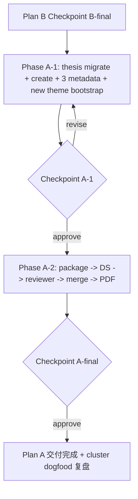

# 短期 3 主题重组（Plan A）

> Status: idea / proposal（未实现，未 canonical）
> Sibling idea: [`thesis_and_theme_writing_pipeline_reorg.md`](thesis_and_theme_writing_pipeline_reorg.md)（基础设施线）
> Companion plan file（带 todos / checkpoint）：[`/Users/bokanbao/.cursor/plans/3_themes_regime_reshuffle_b7e914f2.plan.md`](/Users/bokanbao/.cursor/plans/3_themes_regime_reshuffle_b7e914f2.plan.md)
> Sequence: 等 Plan B Checkpoint B-final 才启动；本 plan 同时是 Plan B cluster 的首次真实 dogfood

把流动性 + 通胀 + AI 基建重组为新的 short_term 主题（与 us-dollar-liquidity-plumbing / ai-datacenter-power 并列），把 Hormuz 降为 short_term #3 / oil-gas-shipping hedge overlay。

---

## 0. Reader End-State

跑完 Plan A 后 PM 应当能：

- 在 short_term 三主题之间立刻分清职责：
  - **新 regime theme**（候选 id 见 §2.1）：当 real-rate easing + AI capex GDP 支撑 + positioning 偏空 + liquidity floor 同时出现时，多资产价格的 regime 层叙事与含义
  - [`data/research/themes/metadata/us-dollar-liquidity-plumbing.json`](../../data/research/themes/metadata/us-dollar-liquidity-plumbing.json)：USD plumbing 机制（TGA / RRP / SOFR / IORB / balance-sheet ops / Warsh-led Fed regime）
  - [`data/research/themes/metadata/ai-datacenter-power-and-balance-of-plant.json`](../../data/research/themes/metadata/ai-datacenter-power-and-balance-of-plant.json)：AI infra 物理层（power / BoP / 天然气 / materials / 设备）
- 看到 Hormuz 收缩到 oil-gas-shipping hedge overlay 角色，AI capex 类 thesis 已经被退出 Hormuz、迁回正确归属
- 拿到一份新 regime 主题的完整 PM-facing 报告（含 toll-booth 之外的 regime 主线、来源三角、boundary 互引、下一周关键确认/证伪点）
- Plan B cluster 经过 Plan A dogfood 一次后，PM 知道哪个 agent contract 需要后验调整

## 1. 依赖契约（来自 Plan B）

启动 Plan A 前必须确认以下 Plan B 产物全部就位：

- 4 份新 SKILL 已落地：[`research-thesis-drafter`](../../.cursor/skills/research-thesis-drafter/SKILL.md) / [`research-thesis-verifier`](../../.cursor/skills/research-thesis-verifier/SKILL.md) / [`research-thesis-adversary`](../../.cursor/skills/research-thesis-adversary/SKILL.md) / [`research-theme-bootstrapper`](../../.cursor/skills/research-theme-bootstrapper/SKILL.md)
- thesis_note v1.5 schema doc 落定：[`designDoc/research_40_thesis_note_schema_v1_5.md`](../research_40_thesis_note_schema_v1_5.md)
- cluster contract doc 落定：[`designDoc/research_50_thesis_and_theme_agent_cluster.md`](../research_50_thesis_and_theme_agent_cluster.md)
- builder ≥ v1.5-aware：[`src/tools/build_theme_writer_package.py`](../../src/tools/build_theme_writer_package.py) 已加 `claims` / `counter_evidence_observed` 兼容补丁
- reviewer SKILL 已加 thesis structural readiness 节：[`.cursor/skills/research-theme-report-reviewer/SKILL.md`](../../.cursor/skills/research-theme-report-reviewer/SKILL.md)
- `./.venv/bin/python -m src.cli.tradectl test-thesis-agent <agent_id>` 4 个 agent 全 pass

任一不齐 → 不启动 Plan A，回 Plan B 补完。

## 2. 新主题 id + scope boundary

### 2.1 新主题 id 候选（confirm 时三选一或给新名）

- `equity-melt-up-via-ai-capex-and-real-rates`（窄一点，绑 equity）
- `ai-capex-and-real-rate-regime`（regime 词出现，跨资产）
- `liquidity-real-rates-equity-melt-up`（三件套全名，最长但最具描述）

下面以 `ai-capex-and-real-rate-regime` 为占位（confirm 时再替换）。

### 2.2 scope boundary（写进新主题 metadata）

- 本主题 OWN：当 real-rate easing + AI capex GDP 支撑 + positioning underweight + liquidity floor 同时存在时的 multi-asset 价格后果（equity melt-up、dispersion、index 集中度、credit cycle 错位）
- 本主题 IS NOT：USD plumbing 机制（→ `us-dollar-liquidity-plumbing`）、AI 物理基建受益资产（→ `ai-datacenter-power-and-balance-of-plant`）、地缘 hedge demand（→ `iran-hormuz-escalation`）

## 3. Phase A-1: dogfood thesis 重组 + 三主题 metadata + 新主题骨架

### 3.1 thesis 迁移与新建（cluster dogfood）

| 操作 | thesis | 之后归属 | 触发 source | cluster 步骤 |
| --- | --- | --- | --- | --- |
| MOVE OUT of Hormuz + upgrade v1.5 | [`ai_capex_is_the_real_melt_up_engine_via_real_rate_easing`](../../data/research/thesis_notes/ai_capex_is_the_real_melt_up_engine_via_real_rate_easing.json) | new theme (primary) | Capital Flows 4/10 + Citrini 4/19 | drafter 改名 + cross_theme_links → verifier 验证 → adversary 写 falsifiers + scenario_triggers |
| MOVE OUT of Hormuz + upgrade v1.5 | [`physical_bottlenecks_can_outperform_software_when_ai_capex_hits_the_real_world`](../../data/research/thesis_notes/physical_bottlenecks_can_outperform_software_when_ai_capex_hits_the_real_world.json) | ai-datacenter-power (primary), cross-link new theme | Citrini Atoms vs Bits | 同上 |
| MOVE OUT of Hormuz + upgrade v1.5 | [`ai_datacenter_buildout_can_reward_power_and_balance_of_plant_more_than_compute_narratives_alone`](../../data/research/thesis_notes/ai_datacenter_buildout_can_reward_power_and_balance_of_plant_more_than_compute_narratives_alone.json) | ai-datacenter-power (primary) | Citrini Let There Be Light | 同上 |
| MOVE OUT of Hormuz + upgrade v1.5 | [`ai_power_demand_can_pull_us_natural_gas_into_a_structurally_tighter_regime`](../../data/research/thesis_notes/ai_power_demand_can_pull_us_natural_gas_into_a_structurally_tighter_regime.json) | ai-datacenter-power (primary) | Citrini Let There Be Light | 同上 |
| NEW (in new theme) v1.5 | `equity_dispersion_can_persist_when_ai_capex_drives_index_concentration` | new theme | Capital Flows 4/9 + Citrini 26 Trades | 全 cluster |
| NEW (in new theme) v1.5 | `real_rate_easing_with_strong_growth_can_drive_a_non_recessionary_melt_up` | new theme | Capital Flows PCE/RealRates 4/10 + Citrini Macro Memo 4/19 | 全 cluster |
| NEW (in new theme) v1.5 | `positioning_underweight_can_extend_equity_advance_when_pessimism_is_priced_in` | new theme | Capital Flows Crowded Exit 3/16 + Positioning Unwind 3/18 | 全 cluster |
| NEW (in liquidity-plumbing) v1.5 | `warsh_led_fed_regime_can_compress_real_rates_via_balance_sheet_engineering` | us-dollar-liquidity-plumbing | Capital Flows Warsh 1/30 + Conks Warsh 3/19 | 全 cluster |
| NEW (in liquidity-plumbing) v1.5 | `repo_market_compression_can_silently_stage_a_fed_relief_valve` | us-dollar-liquidity-plumbing | Conks Plumbing Notes 1/25 / 2/2 / 3/1 / 3/11 / 3/23 / 4/9 | 全 cluster |
| KEEP in Hormuz (不动 schema) | toll-booth equilibrium / post-fracking elasticity / deescalation hedge unwind / crowded stagflation hedges / long-end real rates damage channel | Hormuz only | 既有 | 不进 cluster；下次触及时再升级 |

每条进 cluster 的 thesis 走严格顺序：drafter → verifier → adversary。三个 agent 通过 thesis_note v1.5 JSON 文件交接，不传 chat 上下文。

### 3.2 三主题 metadata + 新主题 owner.json（用 research-theme-bootstrapper）

- 新建 [`data/research/themes/metadata/<new_id>.json`](../../data/research/themes/metadata/) + 占位 `themes/reports/<new_id>.md`
- 修改 [`iran-hormuz-escalation.json`](../../data/research/themes/metadata/iran-hormuz-escalation.json)：删 4 条迁出 thesis、收 scope、`priority_rank: 1 → 3`、`title` 改为 `Iran / Hormuz oil-gas-shipping hedge overlay`
- 修改 [`us-dollar-liquidity-plumbing.json`](../../data/research/themes/metadata/us-dollar-liquidity-plumbing.json)：加 2 条新 plumbing thesis、追加近期 Conks/Capital Flows 链接
- 修改 [`ai-datacenter-power-and-balance-of-plant.json`](../../data/research/themes/metadata/ai-datacenter-power-and-balance-of-plant.json)：加迁入的 3 条 thesis、追加 Citrini "Atoms vs Bits / Let There Be Light" 链接
- 新建 `data/research/theme_update_drafts/<new_id>.owner.json`：包含 reader_end_state、scope_boundary、selected_materials、writer_direction（≥6 条）

### 3.3 重建索引 + priority view

- 跑 [`./.venv/bin/python src/tools/build_theme_indexes.py`](../../src/tools/build_theme_indexes.py)
- 验证 [`current_priority_tree.json`](../../data/research/themes/current_priority_tree.json) 的 short_term 排名为 [新主题, us-dollar-liquidity-plumbing, iran-hormuz, gold-monetary-fragmentation] 并各自显示 thesis 数

### 3.4 artifact_graph admission（rule 42）

本 phase **无需**往 [`data/runtime/artifact_graph.yaml`](../../data/runtime/artifact_graph.yaml) 添加新节点。`theme.owner_decision / theme.package / theme.report.ds / theme.report.review` 四个节点已经 `parameterize_by: [theme_id]`（yaml line 340 / 374 / 469 / 493），新主题在 3.2 + 3.3 完成后自动被这些参数化节点接收。

`theme.package` 节点上还有一条 `optional_overlay → asset_technical_report (params: theme_observation_assets(theme_id))`，[`designDoc/the_artifact_graph.md:649`](../the_artifact_graph.md) 显示该 resolver 仍在规划中、未实现，跑 plan 时会出 `unresolved_params:asset_set` UNKNOWN —— 按 rule 42 §3.8 是 input-gap UNKNOWN，**不阻塞**，本轮接受这个 UNKNOWN（与 Hormuz 现状一致）。

→ **Checkpoint A-1**：review thesis 重组结果 + 三主题 metadata + 新主题 owner.json + scope boundary 是否合意；不满意就回 §3 调；OK 才进 Phase A-2。

## 4. Phase A-2: 报告闸门（与上一轮 Hormuz 同流程，验证 cluster + v1.5 schema 端到端）

- 跑 `./.venv/bin/python -m src.cli.tradectl research build-theme-writer-package --theme-id <new_id> --report-date <D>`（owner-side coverage check 自然触发；Plan B 5.1 builder 兼容补丁应能识别 v1.5 改名字段）
- 跑 `tradectl research draft-theme-report-ds --package <new_id>.package.md --output <new_id>.ds.md`
- 跑 [`research-theme-report-reviewer`](../../.cursor/skills/research-theme-report-reviewer/SKILL.md)（含 Plan B 5.2 升级的 thesis structural readiness 节）拿 verdict；若有 major finding 回 §3.1 让 cluster 补 falsifiers / 调 cross_theme_links
- merge 进 [`data/research/themes/reports/<new_id>.md`](../../data/research/themes/reports/) + 写 `themes/reports/<new_id>.md.writer.json` sidecar
- 跑 `tradectl plan theme.report.ds --emit-sidecar auto` 关闸记账
- 跑 `tradectl research export-markdown-document --source themes/reports/<new_id>.md`
- 把 PDF 拷一份带日期的副本到 `data/archive/themes/<new_id>/`

→ **Checkpoint A-final**：报告交付 + cluster dogfood 复盘（哪个 agent contract 需要后验调整 → 反馈给 Plan B 后续 patch）。

## 5. 流图

## 6. confirm 时定的几件事

### 6.1 新主题 id（三选一或给新名）

- `equity-melt-up-via-ai-capex-and-real-rates`
- `ai-capex-and-real-rate-regime`
- `liquidity-real-rates-equity-melt-up`

### 6.2 跳过 / 简化哪些阶段

- 默认全两阶段：A-1 → A-2
- 选项 a：先只跑 3 条新 thesis 验证 cluster 端到端，再补另外 3 条 + 4 条迁移 —— 适合 Plan B 交付后想小步验证的场景
- 选项 b：本轮**不**重写 Hormuz 主题报告（默认；Hormuz 报告重写下一轮做）
- 选项 c：本轮**不**为 us-dollar-liquidity-plumbing / ai-datacenter-power 出独立报告（默认；只产新 regime 主题报告）；这两个主题的独立报告留下一轮

## 7. 工作量与风险

### 7.1 工作量

- Phase A-1：6 条新 thesis_note（v1.5）+ 4 条迁移并升级 v1.5 + 3 份 metadata 改 + 1 份新 metadata + 1 份占位 report + 1 份 owner.json；改动面集中在 [`data/research/thesis_notes/`](../../data/research/thesis_notes/) + [`data/research/themes/metadata/`](../../data/research/themes/metadata/) + [`data/research/theme_update_drafts/`](../../data/research/theme_update_drafts/)
- Phase A-2：与上一轮 Hormuz 报告同流程，body ≤200 KB，DS + reviewer ≤2 round

### 7.2 风险

- 新主题与 us-dollar-liquidity-plumbing 边界稍重叠，靠「regime / 价格后果 vs plumbing / 机制」切分；Phase A-1 的 scope_boundary 一句话写错就会内卷。Checkpoint A-1 必须卡这一点
- Hormuz scope 收窄后，[`iran-hormuz-escalation.md`](../../data/research/themes/reports/iran-hormuz-escalation.md) 现报告里「双轨 - AI capex」那一段要在下一次 Hormuz refresh 时退掉；本轮**不重写 Hormuz 报告**，只动 metadata + 主题定位，避免一次性改太多
- Cluster dogfood 反馈：Plan A 跑完后若发现某个 agent contract 不顺手（如 verifier 在本机 Perplexity 缺失下大量 pending），应回 Plan B 后续 patch，不在 Plan A 内打补丁
- 老 thesis lazy-upgrade 触发面：本轮只 upgrade 涉及迁移的 4 条；其余 35 条 v1 老 thesis 不动，下次 cluster 触及时再升级

## 8. 显式不做（避免 scope 蔓延）

- 不在 Plan A 内修改 cluster 任何 SKILL.md / 任何 fixture / 任何 harness（属于 Plan B 责任）
- 不重写 Hormuz 主题报告（本轮只动它的 metadata + scope；报告重写下一轮做）
- 不为 us-dollar-liquidity-plumbing / ai-datacenter-power 出独立报告（留下一轮）
- 不把 v1 老 thesis 全部一次性 migrate 到 v1.5（lazy-migrate，触及才升级）
- 不在 Plan A 内修 builder / reviewer Python 代码（属于 Plan B 5.1 / 5.2）
