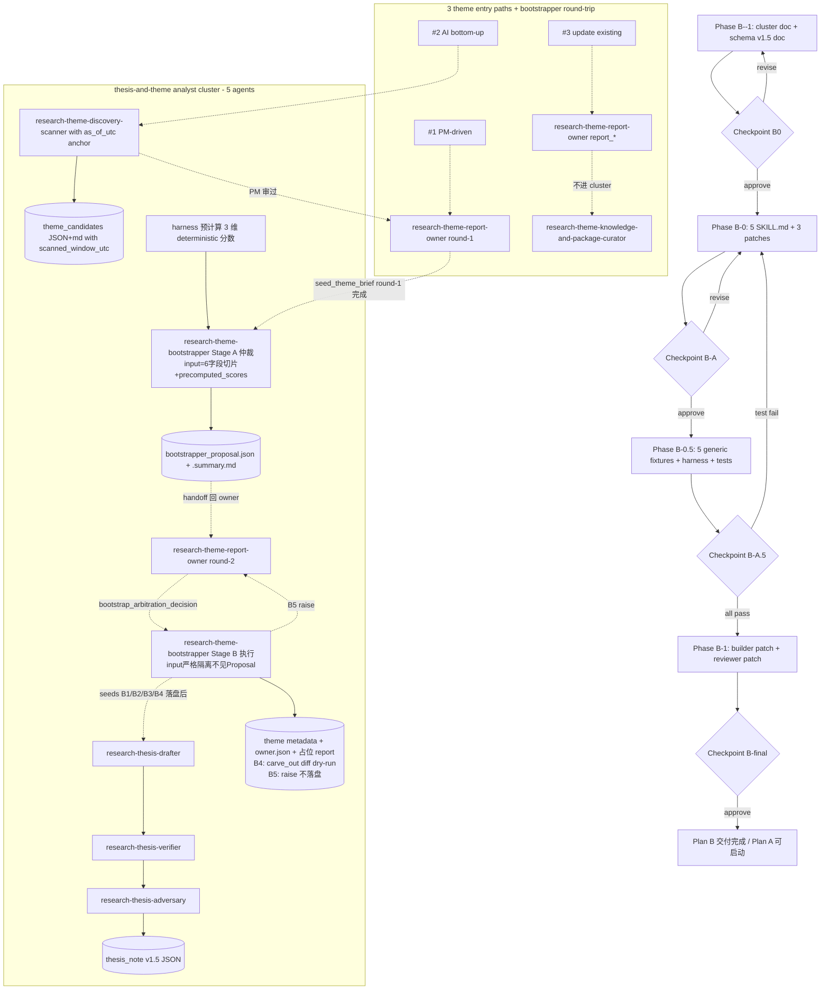

# Thesis & Theme Writing 流水线重组（Plan B）

> Status: idea / proposal（未实现，未 canonical）
> Sibling idea: [`short_term_3_themes_regime_reshuffle.md`](short_term_3_themes_regime_reshuffle.md)（业务执行线，依赖本 plan 完成）
> Companion plan file（带 todos / checkpoint）：[`/Users/bokanbao/.cursor/plans/regime_theme_rebuild_+_analyst_skill_bootstrap_a25638b4.plan.md`](/Users/bokanbao/.cursor/plans/regime_theme_rebuild_+_analyst_skill_bootstrap_a25638b4.plan.md)
> Sequence: 先做 Plan B → Checkpoint B-final → 才启动 Plan A

把 thesis 与 theme 的「建立」环节从 ad-hoc 路径升级为 agent cluster + 共享 thesis_note v1.5 object model + per-agent live-diff 测试。所有测试 fixture 故意不绑定任何当前主题（包括 Plan A 三主题），改用泛化合成样本，保证日后扩 agent / 升 schema 时复用。

---

## 0. Reader End-State

> **Reader gain (F12 / Rule 36)**：读完本 plan 后 PM 应当能 (a) 知道 cluster 里 5 个 agent 的责任如何切分；(b) 知道哪些事必经 PM 手动确认（owner round-1 / round-2 / carve_out dry-run / scanner `as_of_utc`）；(c) 知道 v1.5 schema 哪些字段是结构化、哪些保 prose；(d) 知道哪些下游消费侧已升级、哪些没升级会被 reviewer 拦下；(e) 知道哪些是有意推迟的 backlog（subordinate executor / scenario 一等对象 / cron）。

跑完 Plan B 后 PM 应当能：

- 看到仓库里出现一套 **thesis-and-theme analyst agent cluster**：5 个独立 SKILL（drafter / verifier / adversary / discovery-scanner / bootstrapper）+ 共享 v1.5 schema + 5 套独立 fixture（bootstrapper 含 Stage A + B 共 5 个分支，B5 是 raise 测试不是落盘）+ 1 份 harness
- 三种 theme 入口（PM-driven / AI bottom-up / update existing）在 cluster 路径上各有归属，不再有「AI 自己读完一堆 message 觉得有规律」却没人接的悬空
- 任何 theme 创建意图（无论 #1 #2）都强制经过 bootstrapper 的 5 维相似度仲裁 + 5 种 negotiation 方案对照，由 owner 做 informed round-2 决策，避免重复主题与 scope 冲突
- 知道 thesis_note 已升级 v1.5：5 个新结构化字段 + 2 个改名 + 显式撤销 v2 过载字段（详见 §2.2）
- 通过 `./.venv/bin/python -m src.cli.tradectl test-thesis-agent <agent_id>` 在本地用真 LLM call + golden-file 结构性 diff 验证任意一个 agent 是否还工作，不需要跑完整 cluster
- 信任：Plan A 及之后任何「建新主题 / 建新 thesis」都走 cluster 路径，不再回 ad-hoc
- 知道下游 builder / reviewer 已升级会真消费 v1.5 新字段，避免「投资无回报」
- 知道 fixture 是泛化的，Plan A 主题落幕之后 fixture 不会跟着失效

### 0.1 PM-side workload（合并视图，F11 / A02-A04）

> 本 plan 把 PM 的"决策时刻"+"输入义务"集中列在一处，避免每条 PM 责任分散在 §2-§5 各处难以总览。AI 是 multiplier 而非 replacer：cluster 加速的是**起草 / 扫描 / 审计**，PM 仍是**决策与确认**唯一权威。

| 时刻 | PM 输入 | 必填字段 | 缺失后果 |
|---|---|---|---|
| `research-theme-report-owner` round-1（"值不值得开"） | reader_end_state + scope_intent + framing brief | owner.json round-1 段 | bootstrapper Stage A raise `missing_owner_decision_round1` |
| `research-theme-discovery-scanner` 触发 | `as_of_utc` 显式时间锚 + lookback_days | `scanned_window_utc.{as_of_utc, lookback_days, anchor_kind}` | scanner raise `missing_temporal_anchor` |
| `research-theme-discovery-scanner` 候选审过 | 选定要走 owner round-1 的 candidate 列表 | candidate selection（chat 或文件） | candidate 悬空 |
| `research-theme-report-owner` round-2（看 `bootstrapper_proposal.json` 后选 negotiation 方案） | `bootstrap_arbitration_decision.{kind, target_theme_id?, narrowed_scope_is?, rationale, decided_at_utc, pm_explicit_confirm: true, pm_chat_message_id}` | owner.json round-2 段 | bootstrapper Stage B raise `missing_owner_decision_round2` 或 `missing_pm_confirmation_round2` |
| `research-theme-bootstrapper` Stage B B4 `carve_out_from` | 在线 confirm `bootstrapper_carve_out_diff.json` | PM 在 chat / 文件追加 confirm 标记 | Stage B raise `pending_pm_confirmation_carve_out` |
| `research-theme-bootstrapper` Stage B B5 `subordinate_to` | （本轮 raise 不实现）改 round-2 决策为 admit / narrow | owner.json round-2 改字段 | Stage B raise `subordinate_executor_not_implemented` |
| Plan A dogfood 后 calibration | 检视 owner.json `rationale` 含 `[OVERRIDE]` 前缀的次数 + reviewer major findings | calibration follow-up plan trigger | 阈值（0.70 / 0.50）一直用启发式默认值，可能渐进失准 |

## 1. 借鉴的外部框架（写进 cluster contract / schema doc）

### 1.1 V5.4 Product Definition digest（[`designDoc/bp/Product-Definition-v5.4_digest.md`](../bp/Product-Definition-v5.4_digest.md)）

- **多 agent 编排**（V5.4 §5.2）：cluster 内每个 agent 独立 system prompt + 独立 tool 清单，**共享 object model 不共享 prompt context**
- **Agent 责任边界**（V5.4 §6.5）：agent 提议 / 起草 / 评分独立完成；定版与合入由 PM 显式签字；agent 永不直接改已被 theme metadata 引用的 thesis，只能产新版
- **Thesis sub-assertion schema 升级**（V5.4 §13.4 第 3 条）：原始建议 per-claim 拆 `{text, falsification_condition, verification_data_source, confidence}`。本轮**只部分采纳**：保 `claims[]` 为 prose（顺序即重要性），把 falsifier 提到顶层 `falsifiers[]: str[]`（≥1）。理由见 §2.2
- **Trigger state machine**（V5.4 §13.4 第 1 条）：`scenario_triggers[]` 升为 `{observable_data, threshold, direction, status, observed_at_utc, hit_evidence}`。这是本轮唯一从 prose 升为 object 数组的字段
- **Probability 三条硬约束**（V5.4 §5.5）：drafter 用 prose `probability_view`（含 hedging）表达概率倾向，**不写** `confidence_estimate: float`
- **明确不借鉴**（V5.4 §13.3）：thesis 三动作里的「辅导」不做；MCP / 多 tenant / SOC2 不引入

### 1.2 上一轮外部 macro-analyst skill 调研

- **Persona 分离**：researcher / external-fact-checker / adversary / architect 各一个 agent，每个独立 SKILL（不同 prompt context、不同 tool 集合）
- **多源三角验证**：thesis 关键数字 / 因果论断应有 ≥2 个独立 source；本轮**不**为此新建 `evidence_strength` enum，verifier 在 `notes` 末尾用 prose 标 `external verification: <verified|partial|pending> – <一句>`
- **Reader-state-first**（[`.cursor/rules/35_pm_reader_state_first.mdc`](../../.cursor/rules/35_pm_reader_state_first.mdc) + [`36_reader_gain_before_instruction_detail.mdc`](../../.cursor/rules/36_reader_gain_before_instruction_detail.mdc)）：research-theme-bootstrapper 第一步是写 `reader_end_state`

## 2. Phase B-(-1): 设计文档先行

> 没有这两份 doc，4 份 SKILL 各写各的会很快失序，schema 也会被 research-thesis-drafter 单方面定义。先 doc 后 skill。

### 2.1 [`designDoc/research_50_thesis_and_theme_agent_cluster.md`](../research_50_thesis_and_theme_agent_cluster.md)

- **Cluster boundary**：什么算 cluster 内（5 个 agent + 共享 v1.5 schema），什么不算（writer-handoff / research-theme-report-reviewer / research-theme-report-owner 是上游/下游 controller）
- **Agent roster**：drafter / verifier / adversary / discovery-scanner / bootstrapper（前 3 是 thesis 子 cluster；discovery-scanner 覆盖 #2 AI bottom-up 入口；bootstrapper 是 orchestrator + executor 双段，对所有 #1 #2 入口统一做相似度仲裁与协商落盘）
- **三入口路径映射**：#1 PM-driven → owner round-1 → bootstrapper Stage A 仲裁 → owner round-2 → bootstrapper Stage B 落盘；#2 AI bottom-up → discovery-scanner → PM 审 → owner round-1 → 同 #1 后段；#3 update existing → owner → content-maintainer + reviewer + priority-updater（不进 cluster，除非该 pass 决定要新建 thesis）
- **Bootstrapper 双段 + 5 分支**：Stage A 全库 5 维相似度扫描（3 维 deterministic 由 harness 预计算 + 2 维 LLM 语义判，F1 / T10）+ 5 种 negotiation 方案对照表（admit_as_independent / merge_into / narrow_self_to / carve_out_from / subordinate_to）；Stage B 按 owner round-2 决策走 5 条互斥执行分支；其中 carve_out_from 必经 PM 在线 confirm dry-run diff，subordinate_to 本轮**直接 raise 不实现**（F3 / M05，避免 placeholder 文件污染系统，留作后续 plan）；Stage A / B input 严格隔离，Stage B 不见 Stage A proposal（F4 / T03）
- **Cluster controller**：沿用 [`routing-task-mode-router`](../../.cursor/skills/routing-task-mode-router/SKILL.md) + [`research-theme-report-owner`](../../.cursor/skills/research-theme-report-owner/SKILL.md)，**不**新建 controller agent
- **Message contract**：agent 之间通过 thesis_note v1.5 JSON 字段交接，不传 chat 上下文。drafter 写 prose `claims / key_dependencies / probability_view` + 结构化 `cross_theme_links` + `lifecycle_stage = "draft"`；verifier 在 `notes` 末尾追加 `external verification:` 行；adversary 写 prose `counter_evidence_observed` + 结构化 `falsifiers (≥1)` + `scenario_triggers` + `next_review_trigger`，升 `lifecycle → active`；discovery-scanner 输出 `data/research/theme_candidates/<scan_id>.json` + `.md`（不写 thesis_note，不写 themes/metadata）；bootstrapper 接 owner.json 决策落 themes/metadata + 占位 report + 触发 seed thesis cluster
- **共享 object model**：thesis_note v1.5 schema（见 §2.2）、theme metadata、artifact_graph node、source_collections.json、theme_candidates 目录
- **运行时形态**：thesis 子 cluster 内顺序为 drafter → verifier → adversary；discovery-scanner 与 bootstrapper 独立调度（PM 按需触发，非常驻）
- **Agent 责任边界**：agent 永不直接修改已被 theme metadata 引用的 thesis；只能产 vN+1 + 请求 PM 合入；discovery-scanner 不决定 theme 是否要开（只产候选）；bootstrapper 不做决策（只在 owner.json 就位时落文件）
- **失败模式**：verifier 拿不到外部数据时在 `notes` 写 `pending – <reason>`；adversary 找不到反例时强制声明 single-perspective risk，禁止空 `falsifiers[]`；discovery-scanner 无 ≥3 message 簇时输出空清单，禁止强行造候选；bootstrapper 被调用但 owner.json 未就位时 raise `missing_owner_decision`

### 2.2 [`designDoc/research_40_thesis_note_schema_v1_5.md`](../research_40_thesis_note_schema_v1_5.md)

> **设计原则**：prose 自带四种机器扔不掉的信号——顺序 = 优先级、句长 + 让步成分 = 信心强弱、副词 = 时效边界、prose 段落连贯 = 因果链。把 prose 数组拍成结构化对象数组会让「每条都长得一样重」，PM/LLM 后续读时丢失原作者排序判断。**只在机器真正要做状态机判断 / 计数 / 路由的地方结构化，其它一律保 prose**。

**5 个新结构化字段**：

- `lifecycle_stage: draft | active | stress_tested | evolving | invalidated | archived`
- `cross_theme_links[]: [{theme_id, role: primary | secondary | boundary_reference}]`
- `falsifiers[]: [str, ...]`（≥1；纯字符串列表；reviewer 强制 ≥1 检查）
- `next_review_trigger: {kind: time | event | catalyst, value: str}`（单对象，不是数组）
- `scenario_triggers[]: [{observable_data, threshold, direction, status: pending | triggered | reverse_triggered | obsolete, observed_at_utc, hit_evidence}]`

**2 个改名**：

- `claim_bullets` → `claims`（仍是 `[str, ...]`，prose 排序保留）
- `disconfirming_evidence` → `counter_evidence_observed`（仍是 `[str, ...]`，与未来 falsifiers 区分开）

**保留 prose 不动**：`claims / key_dependencies / counter_evidence_observed / probability_view / notes / expected_winners / expected_losers`

**显式撤销原 v2 spec 字段**（结构化收益不抵 prose 损失）：

- `sub_assertions[]` per-claim 拆 falsification_condition / verification_data_source / confidence
- `mechanism` 独立字段
- `supporting_evidence[]` / `counter_evidence[]` per-claim object 化
- `confidence_estimate: float`
- `evidence_strength` enum + `external_verification_status` enum
- `auto_degrade_when[]`（与 `falsifiers[]` + `scenario_triggers[].status` 重叠）
- `resurrection_rationale ≥100 字`（真复活时临时写进 `notes`）

**JSON 体量预期**：以 [`ai_capep_is_the_real_melt_up_engine_via_real_rate_easing.json`](../../data/research/thesis_notes/ai_capex_is_the_real_melt_up_engine_via_real_rate_easing.json) 为基线（v1 = 90 行），v1.5 升级后约 **110-125 行**。

**v1 ↔ v1.5 共存**：v1.5 字段都是 additive；改名两字段做向后兼容（reader 同时识别新旧名）。新生成 thesis 走 v1.5；老 thesis 在 cluster 触及时升级。

→ **Checkpoint B0**：review 两份 design doc，cluster 边界 / agent roster / schema 字段集合不满意就改；OK 才进入 Phase B-0。

## 3. Phase B-0: Cluster 内 5 份 SKILL.md

> **为什么 5 份独立 SKILL 不合并**：rule 41 只管 dedicated theme skill 的 admission（如 Hormuz / Fed cycle），不管 persona 切分；rule 30 反而明确「Do not collapse distinct recurring task lines just to keep the count small」；V5.4 §5.1 的 6 agent 设计也是「独立 system prompt + 独立 tool 清单」的先例。3 个 thesis persona 在**输入对象 / 工具栈 / 输出字段 / 失败模式**四维度实质不同（drafter 读 raw research 写 prose claims / verifier 调外部 API 写 notes 验证行 / adversary 写 falsifiers + scenario_triggers）。discovery-scanner 与 bootstrapper 在**触发时机 / 输入形态 / 输出位置**三维度也实质不同（前者从 archive 涌现 candidate，后者从 owner.json 决策落文件），合一会让一个 SKILL 双 mode（仓库反模式）。dogfood 跑完后若 contract 高度重叠再合并不晚。

新建（每份按 [`.cursor/rules/20_daily_task_router_and_skill_persona.mdc`](../../.cursor/rules/20_daily_task_router_and_skill_persona.mdc) 的 `Current persona / Current task / Primary truth surface / Output artifact` 四件套，再加 cluster 内位置 / message contract / 失败模式 / Self-test 节）：

### 3.1 [`.cursor/skills/research-thesis-drafter/SKILL.md`](../../.cursor/skills/research-thesis-drafter/SKILL.md)

- persona = 拆 claim 的 researcher
- 输入：raw research 段落 / message_id 列表 / theme 上下文
- 必填输出（v1.5 prose 主体）：`claims[]`（按重要性排序）/ `key_dependencies[]` / `probability_view` / `cross_theme_links[]`（含 role）/ `lifecycle_stage = "draft"`
- 不允许：写 `falsifiers[]` / `scenario_triggers[].status`（留给 adversary）/ 在 notes 写 verification 行（留给 verifier）

### 3.2 [`.cursor/skills/research-thesis-verifier/SKILL.md`](../../.cursor/skills/research-thesis-verifier/SKILL.md)

- persona = external fact checker
- 输入：drafter 写完的 thesis_note v1.5（只读）
- 工具：Perplexity（首选）或 web fetch；都拿不到就在 notes 末尾写 `external verification: pending – <reason>`
- 必填输出：在 `notes` 末尾追加 `external verification: <verified | partial | pending> – <一句>`；并在顶层 `source_research_ids[]` 追加外部验证到的 source_id；不新增 enum 字段

### 3.3 [`.cursor/skills/research-thesis-adversary/SKILL.md`](../../.cursor/skills/research-thesis-adversary/SKILL.md)

- persona = critic / pre-mortem
- 输入：drafter + verifier 写完的 thesis_note v1.5
- 必填输出：`counter_evidence_observed[]`（prose）/ `falsifiers[]`（≥1）/ `scenario_triggers[]`（含 `status: pending`）/ `next_review_trigger: {kind, value}`
- 强制：`falsifiers[].length >= 1`；空就 raise 让 PM 补；本 agent 不写 confidence float
- 升级 lifecycle：`draft → active`

### 3.4 [`.cursor/skills/research-theme-discovery-scanner/SKILL.md`](../../.cursor/skills/research-theme-discovery-scanner/SKILL.md)

- persona = archive scanner / candidate proposer
- 触发：PM 在 chat 里手动调用（典型 prompt："最近一个月有什么 candidate 吗" / "扫一下 messages_index 看有没有新主题在成型"）
- 输入：`time_window`（默认最近 30 天）+ 可选 `source_collection_filter` + 现有 `themes/metadata/*.json` 全集（用作去重）
- 工具：读 `data/research/messages_index.jsonl` / grep；不调外部 API
- 步骤：window scan → 多维聚类（theme_tag / sender / source_collection / ticker）→ 与现有 themes 去重 → 候选筛选（≥3 message 且 ≥2 独立 source）→ 每个候选写 brief（proposed_id_suggestion / proposed_scope_one_line / evidence_cluster / nearest_existing_themes ≥2 / recommended_candidate_level / why_not_existing_theme）→ handoff PM 审
- 输出：`data/research/theme_candidates/<scan_id>.json` + `data/research/theme_candidates/<scan_id>.md`
- 不允许：直接写 `themes/metadata/*.json`；直接调 bootstrapper（必须 PM 审过）；候选数 >5（一次 scan ≤5 候选）；强行造候选（无簇时输出空清单）

### 3.5 [`.cursor/skills/research-theme-bootstrapper/SKILL.md`](../../.cursor/skills/research-theme-bootstrapper/SKILL.md)

- persona = similarity-and-negotiation orchestrator + executor（双段，Stage A + Stage B）
- 触发前提：owner.json round-1 已就位（reader_end_state + scope_intent + framing brief）。未就位时 raise `missing_owner_decision_round1`，不向后跑
- 输入：owner.json + 拟用 `theme_id` + `themes/metadata/*.json` **全集** + `source_collections.json` + 若来自 #2 入口则附 `theme_candidates/<scan_id>.json` 中 candidate 的 evidence_cluster
- **Stage A（仲裁，对所有 theme 创建意图统一执行）**：A1 全量加载 themes/metadata → A2 5 维相似度（scope.IS / linked_research_ids / source_collection / theme_tag / asset focus）→ A3 取 top-N 邻居 → A4 对每邻居判定冲突类型 + 推荐 5 种 negotiation 方案之一（admit_as_independent / merge_into / narrow_self_to / carve_out_from / subordinate_to，对照表见 [`research_05 §2.5.1`](../research_50_thesis_and_theme_agent_cluster.md#251-冲突类型--协商方案对照表stage-a4-用)）→ A5 写 `bootstrapper_proposal.json` → A6 handoff 回 owner 等 round-2 决策（block）
- **Stage B（执行，按 owner round-2 决策走 5 条互斥分支）**：B1 admit_as_independent / B2 merge_into（不建新 metadata，candidate evidence 触发 ≥1 seed thesis link 到现有 theme，merge_audit 含 merged_at_utc）/ B3 narrow_self_to（用收窄后 scope 走 B1）/ B4 carve_out_from（先写 dry-run diff 含 dry_run_generated_at_utc → PM 在线 confirm → 改邻居 metadata → 走 B1）/ B5 subordinate_to（**raise `subordinate_executor_not_implemented`**，不落任何 metadata，提示 owner 改 round-2 决策，F3 / M05）
- 输出：Stage A `bootstrapper_proposal.json`（必出）；Stage B 按决策不同：新 metadata 文件 / 邻居 metadata 改动 + audit / 现有 metadata 追加 merge_audit / ≥3 seed thesis_note v1.5（B5 除外）
- 不允许：跳过 Stage A 直接落盘（即便 PM 说"直接开吧"）；自己做 round-1 或 round-2 决策；让 LLM 重算 deterministic 三维分数（F1 / T10）；送整 metadata 全文进 Stage A prompt（F2 / A14）；Stage B input 含 Stage A proposal 全文（F4 / T03）；执行 carve_out_from 时不写 dry-run diff；B5 subordinate 落任何 metadata 文件（F3 / M05，直接 raise）；scope_boundary 不写 IS_NOT；seed thesis < 3（除 B5 raise 路径）；owner round-2 缺 `pm_explicit_confirm: true`（F7 / V01）

### 3.6 升级（最小改动）

- [`.cursor/skills/research-theme-priority-updater/SKILL.md`](../../.cursor/skills/research-theme-priority-updater/SKILL.md) 加一节 `cross-theme thesis link role`：thesis 多主题出现时强制 `role: primary | secondary | boundary_reference`
- [`.cursor/skills/routing-task-mode-router/SKILL.md`](../../.cursor/skills/routing-task-mode-router/SKILL.md) 加 `research-theme-discovery-scanner` 入口判别（"扫资料找 candidate" / "最近 N 天有什么 candidate" 类 prompt 路由到这里）
- [`.cursor/skills/research-theme-report-owner/SKILL.md`](../../.cursor/skills/research-theme-report-owner/SKILL.md) 加两节：(a) `seed_theme_brief` round-1 决策完成后 handoff `research-theme-bootstrapper` Stage A；(b) round-2 决策（owner 看完 `bootstrapper_proposal.json` 后选 5 种 negotiation 方案之一）追加在同一份 owner.json 的 `bootstrap_arbitration_decision` 字段，再次 handoff `research-theme-bootstrapper` Stage B。这是当前 SKILL 的真实空缺
- [`.cursor/skills/INDEX.md`](../../.cursor/skills/INDEX.md) 与 [`09_soul/skills/INDEX.md`](../../09_soul/skills/INDEX.md) 注册 cluster + 5 个新 agent

不动：research-theme-knowledge-and-package-curator / writer-handoff / research-theme-report-reviewer 已上一轮升级（owner-side coverage check + cross-mainline coherence），本轮只在 §5.2 给 reviewer 加 thesis structural readiness 一节；research-theme-report-owner 只加 §3.6 那一节 handoff bootstrapper 的最小条目，不动其余。

→ **Checkpoint B-A**：review 5 份新 SKILL contract + 3 份升级 + cluster controller 编排；不满意就改；OK 才进入 Phase B-0.5。

## 4. Phase B-0.5: Per-agent 独立测试（generic fixtures + golden-file live diff）

> **决策回顾**：测试形态 = C（live diff）；fixture 组织 = A（per-agent independent）。frozen input → 真跑 LLM → 输出 JSON 与 committed golden 做**结构性 diff**（仅校验 schema-required 字段 + 基数约束 + 枚举合法 + cross-ref 完整性，**不**比 prose 字面值）；每个 agent 一组独立 input + golden + assertions，**手工准备**，不依赖上游 agent 输出。

### 4.1 fixture 设计原则（关键：generic / 不绑定任何当前主题）

- 5 套 fixture 的 input 全部用**泛化合成样本**，刻意不复用 Plan A 三主题（regime / liquidity / AI infra）的命名、ticker、source；改用一个虚拟「policy X → regime Y → asset Z」案例
- 这样做的代价：fixture 不能直接当 dogfood 用，PM 手工写 input 多花 30-60 分钟
- 这样做的回报：Plan A 跑完之后 fixture 仍然有效；未来 Fed cycle / 港股 / 黄金 / AI 等任何主题来到时，fixture 不需要重做；新增第 6 个 agent（如 `thesis-historian`）时复用同一目录与 harness 即可

### 4.2 fixture 目录约定

```
tests/thesis_cluster_fixtures/
├── research-thesis-drafter/
│   ├── input.json        # 1-2 份合成 raw research 段落 + 1 份合成 theme 上下文（虚拟 policy X 案例）
│   ├── golden_output.json
│   └── assertions.json
├── research-thesis-verifier/
│   ├── input.json        # 手工准备的 simulated drafter v1.5 输出，刻意留 2-3 个能被外部验证 / 反驳的数字
│   ├── golden_output.json
│   └── assertions.json
├── research-thesis-adversary/
│   ├── input.json        # 手工准备的 simulated drafter+verifier 输出，至少 1 条 claim 留明显反例钩子
│   ├── golden_output.json
│   └── assertions.json
├── research-theme-discovery-scanner/
│   ├── input.json        # 手工准备的虚拟 messages_index.jsonl 切片（~20-40 条 message，含 2-3 个成型簇 + 噪声），加虚拟 themes/metadata 列表（用作去重）
│   ├── golden_output.json
│   └── assertions.json
└── research-theme-bootstrapper/
    ├── stage_a/
    │   ├── input.json    # 虚拟 owner.json round-1 + 6 字段精简邻居切片（high-overlap + partial + 无关各 1）+ harness 已注入的 precomputed_overlap_scores（3 维 deterministic 分数）+ 可选 candidate evidence_cluster
    │   ├── golden_output.json   # 期望的 bootstrapper_proposal.json：5 维 dimension_scores + dimension_score_provenance + 冲突类型 + recommended_primary（含 synthesis_narrative）
    │   └── assertions.json
    └── stage_b/
        ├── input_admit.json     # owner.json round-2 选 admit_as_independent（含 pm_explicit_confirm:true + pm_chat_message_id）
        ├── input_merge.json     # owner.json round-2 选 merge_into:<existing>
        ├── input_narrow.json    # owner.json round-2 选 narrow_self_to:<scope>
        ├── input_carve.json     # owner.json round-2 选 carve_out_from:<neighbor>
        ├── input_subordinate.json   # owner.json round-2 选 subordinate_to:<parent>（用于 raise 测试）
        ├── golden_output_admit.json
        ├── golden_output_merge.json
        ├── golden_output_narrow.json
        ├── golden_output_carve.json   # 应当输出 bootstrapper_carve_out_diff.json（含 dry_run_generated_at_utc）+ raise pending_pm_confirmation_carve_out
        ├── expected_raise_subordinate.json   # 期待 raise 类型 = subordinate_executor_not_implemented；assertion = 无任何 metadata 文件落盘 + owner.json notes 含 subordinate_pending_future_plan
        └── assertions.json     # 4 落盘 + 1 raise 共享一份 assertion 但分支判别不同
```

**手工准备的关键意义**：verifier / adversary / discovery-scanner / bootstrapper 的 `input.json` **不是**从上游真实输出截取的，而是 PM 手工写好、刻意留了「该被验证的数字」/「该成型的簇」/「已就位的 owner.json」等 hook 的 fixture。这样即便上游 agent 在某次 prompt 调整后输出变烂，下游 agent 的测试仍能独立判定它们自己的功能是否正确。

### 4.3 测试 harness（≤200 行 Python，单脚本）

新建 [`src/tools/test_thesis_agent.py`](../../src/tools/test_thesis_agent.py)，挂到 [`tradectl`](../../src/cli/tradectl.py) 子命令 `tradectl test-thesis-agent <agent_id>`：

- 读 `tests/thesis_cluster_fixtures/<agent_id>/input.json`
- 把对应 SKILL.md 的 system prompt + input 发给 Anthropic API（同档模型，不降档）
- 拿到模型返回的 JSON（要求 SKILL.md 末尾「output schema」段约束模型只吐 JSON）
- 加载 `assertions.json`，逐条机审：required_fields / forbidden_fields / field_constraints / cross_ref_checks
- 不通过：打印 fail 项 + 实际值 + 预期约束
- 通过：把本次实际输出存到 `tests/thesis_cluster_fixtures/<agent_id>/last_run.json`（gitignore），方便 PM 复盘 prose 漂移

**不**做：不 mock LLM、不录像 cassette、不 assert prose 字面值。结构 diff only。

### 4.4 assertions.json 写法（4 份各自一份）

drafter 示例（其它 3 份类同）：

```json
{
  "required_fields": ["claims", "key_dependencies", "probability_view", "cross_theme_links", "lifecycle_stage", "source_research_ids"],
  "forbidden_fields": ["falsifiers", "scenario_triggers", "next_review_trigger"],
  "field_constraints": {
    "lifecycle_stage": {"enum": ["draft"]},
    "claims": {"type": "array", "min_length": 3, "item_type": "string"},
    "key_dependencies": {"type": "array", "min_length": 1},
    "cross_theme_links": {"type": "array", "min_length": 1, "item_required_keys": ["theme_id", "role"]},
    "cross_theme_links[*].role": {"enum": ["primary", "secondary", "boundary_reference"]},
    "source_research_ids": {"type": "array", "min_length": 2, "note": "三角验证"}
  },
  "cross_ref_checks": [
    {"path": "cross_theme_links[*].theme_id", "must_exist_in": "data/research/themes/metadata/"}
  ]
}
```

verifier 重点 assertion：`notes` 末尾正则匹配 `external verification: (verified|partial|pending) – .+`；`source_research_ids` 长度 ≥ input 中的长度。

adversary 重点 assertion：`falsifiers.length >= 1`、`scenario_triggers[*].status == "pending"`（首跑必为 pending）、`lifecycle_stage == "active"`、`next_review_trigger.kind in ["time", "event", "catalyst"]`。

discovery-scanner 重点 assertion：candidate 数 ∈ [0, 5]；每条候选含 `evidence_cluster.message_ids[].length >= 3`、`nearest_existing_themes[].length >= 2`、`recommended_candidate_level ∈ {adjacent, thesis_only, regional, industry, top_level}`；候选 `proposed_id_suggestion` 不与现有 themes/metadata id 重复（cross-ref check）；输出顶层必须含 `scanned_window_utc.{as_of_utc, lookback_days, anchor_kind, scanner_invoked_at_utc}`（F6 / V04 / T11）；缺 `as_of_utc` 的 negative-case fixture 必须 raise `missing_temporal_anchor`（不允许 scanner 默认 wall clock）。

bootstrapper Stage A 重点 assertion：`bootstrapper_proposal.json` 含 `per_neighbor[].length ≤ 5`；每个 neighbor 含完整 5 维 `dimension_scores` + `dimension_score_provenance`（3 维必须为 `"deterministic"`，2 维必须为 `"llm"`，F1 / F8）；`recommended_primary.kind ∈ {admit_as_independent, merge_into, narrow_self_to, carve_out_from, subordinate_to}`；`recommended_primary.synthesis_narrative.length > 0`；当 fixture 中 high-overlap 邻居 ≥3 时 `recommended_primary.kind != "admit_as_independent"`（强制规则）；alternatives 数 ≥1。harness pre-flight：input 必须含 `precomputed_overlap_scores`；assertion `dimension_score_provenance` 中 deterministic 维度的实际数值必须等于 `precomputed_overlap_scores` 给的值（F1 / T10）。

bootstrapper Stage A input fixture 必须含**精简切片邻居**（每邻居 6 字段：`theme_id / scope_boundary.IS / linked_research_ids_count / source_collection / theme_tag / primary_assets`），**不**送整 metadata 全文（F2 / A14；harness pre-flight assertion：input 中任一邻居字段集 ⊆ 6 字段白名单）。

bootstrapper Stage B 重点 assertion（5 分支，B5 是 raise 测试）：
- B1 admit：metadata 含 `reader_end_state`（与 owner.json 一致）/ `scope_boundary.IS` / `scope_boundary.IS_NOT` ≥2 邻居；占位 report 建出；`source_collections.json` 新路由项出现；调用 thesis cluster ≥3 次
- B2 merge：**不**新建 metadata；目标 theme metadata 出现 `merge_audit[]` 项含 `merged_at_utc`；调用 thesis cluster ≥1 次
- B3 narrow：metadata 的 scope.IS 与 owner round-2 的 `narrowed_scope_is[]` 一致；被让出的邻居 metadata 出现 `explicit_IS` 项
- B4 carve_out：**未**直接改邻居 metadata；输出 `bootstrapper_carve_out_diff.json`（含 `dry_run_generated_at_utc`）；raise `pending_pm_confirmation_carve_out`
- B5 subordinate：**未**落任何 metadata 文件（F3 / M05）；raise `subordinate_executor_not_implemented`；owner.json 出现 `notes: "subordinate_pending_future_plan"`；返回 prompt 含「请改 round-2 决策为 admit_as_independent 或 narrow_self_to」字样
- 隔离 assertion（F4 / T03）：所有 Stage B 分支 fixture 的 input.json 中**不得**含 `bootstrapper_proposal.json` 全文字段；harness pre-flight 检查 input keys 不含 `bootstrapper_proposal`，违反 raise `stage_b_context_leak`
- PM confirm assertion（F7 / V01）：所有 Stage B 分支 input.json 的 owner.json round-2 段必须含 `pm_explicit_confirm: true` + `pm_chat_message_id`；缺失时 fixture 必须改成 negative-case fixture 测试 raise `missing_pm_confirmation_round2`

### 4.5 SKILL.md 末尾 Self-test 节（5 份各加一节）

每份 SKILL.md 末尾加 `## Self-test`：

- 指向 fixture 路径
- 列出运行命令 `./.venv/bin/python -m src.cli.tradectl test-thesis-agent <agent_id>`（命令名沿用 `test-thesis-agent` 便于复用 harness；scanner / bootstrapper 也是 cluster 内 agent，命令通用）
- 列出 prompt 改动后的 golden rebake 流程：跑命令 → 人工 review last_run.json → 满意就 `cp last_run.json golden_output.json` 并 git commit

### 4.6 通过标准 + 失败处置

- **本 phase 完成 = 5 个 agent 各自 `tradectl test-thesis-agent` 全 pass**
- 若某 agent 测试失败：回 §3 改对应 SKILL.md（contract / system prompt），重跑测试；**不许直接改 fixture / assertions** 来「绕过」fail
- 若 assertion 本身写错（schema 与 SKILL contract 不一致）：回 §3 与 §2.2 对齐；这种情况算 design bug 而非 prompt bug

→ **Checkpoint B-A.5**：review 5 份 fixture 的 input 是否真实可代表 / golden 是否合意 / assertion 严格度是否合理；5 个 agent 测试全 pass 才进入 Phase B-1。

## 5. Phase B-1: 下游消费侧补丁（让 v1.5 字段被真消费）

> 没有这两个补丁，v1.5 的 5 个新结构化字段就只是「写入但不被读」的「投资无回报」。本 phase 闭环：让 builder 识别改名字段、让 reviewer 机审新字段并把结果写进 verdict。

### 5.1 builder 向后兼容补丁（≤30 行 diff）

- 改 [`src/tools/build_theme_writer_package.py`](../../src/tools/build_theme_writer_package.py) 的 thesis 渲染：先读 `claims`，缺失才回落 `claim_bullets`；先读 `counter_evidence_observed`，缺失才回落 `disconfirming_evidence`；不动其它逻辑
- 不识别 v1.5 新增字段（falsifiers / scenario_triggers / next_review_trigger）时不阻塞；reviewer 来读

### 5.2 reviewer 最小升级（**含独立验证**，F9 / T02）

- 改 [`.cursor/skills/research-theme-report-reviewer/SKILL.md`](../../.cursor/skills/research-theme-report-reviewer/SKILL.md)，verdict 输出加一节 `thesis structural readiness`
- **reviewer 的角色定位（F9 / T02）**：reviewer 是 **cluster 之外的独立验证 agent**，不只是结构格式 check，还必须**能 raise major finding 推翻 cluster 的判定结果**。例如：cluster adversary 写了 falsifier 但 reviewer 发现该 falsifier 与 claim 不对位，reviewer 必须在 verdict 里点名指出（major finding），不可以"既然 adversary 写了我就当过了"
- **结构性 check（机审）**：
  - 对 package 引用的每条 thesis，机审 `falsifiers[].length`：=0 → minor finding「falsifier missing, adversary 没跑透」；≥1 → ok
  - 机审 `scenario_triggers[].status`：若有 `triggered / reverse_triggered` 但 `themes/reports/<theme_id>.md` 没把这条 trigger 写进「What to watch / What changed」→ major finding
  - 机审 `lifecycle_stage`：若引用了 `invalidated / archived` thesis → major finding
  - 机审 `cross_theme_links[].role`：若本 theme 引用了 `boundary_reference` 角色的 thesis 但 ds 把它当 primary 论据展开 → major finding
- **独立判定 check（语义审，新增）**：
  - 抽样 1-2 条 thesis 的 `falsifiers[]`，独立判断"如果 falsifier 真发生了，原 `claims[]` 是否真的会失效"。若不对位 → major finding「falsifier 与 claim 不对位，adversary 形式上写了但语义上没否定 thesis」
  - 抽样 1 条 `scenario_triggers[]`，独立判断 `observable_data + threshold + direction` 是否可机器观测（不是"市场情绪转好"这种主观）。若不可观测 → minor finding

→ **Checkpoint B-final**：Plan B 交付完成；Plan A 可启动。

## 6. 流图



## 7. confirm 时定的几件事

### 7.1 跳过 / 简化哪些阶段

- 默认全四阶段：B-(-1) → B-0 → B-0.5 → B-1
- 选项 a：跳过 B-(-1)（design doc），直接 B-0（4 SKILL 各自拍脑袋写）—— 不推荐
- 选项 b：合并 B-(-1) + B-0（design doc 写完不停 checkpoint）
- 选项 c：cluster 内只做 drafter + adversary + bootstrapper 三个 agent，verifier 留作 backlog（如 Perplexity 本机不可用）+ discovery-scanner 留作 backlog；同步 fixture 减为 3 套
- 选项 d：跳过 Phase B-0.5（不写 fixture / 不建 harness），直接进 Phase B-1—— 强烈不推荐：Plan A dogfood 时没有任何独立信号告诉你某个 agent 是否还工作
- 选项 e：cluster 仍做 5 agent，但 discovery-scanner 推迟到下个 plan（缓 #2 入口；本轮只做 4 agent）—— 这是上一轮 Checkpoint B0 review 之前的旧设计，现已被 PM 选 B 推翻

### 7.2 cluster 内是否本轮加 scenario 一等公民对象

- 默认不加（留 Phase 3）
- 加：会让 schema doc 多 `data/research/scenarios/<id>.json` 这层；Phase B-0 多 1 个 SKILL（scenario-builder）；fixture 多 1 套；工作量 ×1.5

## 8. 工作量与风险

### 8.1 工作量

- Phase B-(-1)：2 份 design doc（cluster 契约 v0.4 ~390 行 / schema v1.5 spec v0.2 ~270 行），不改任何数据
- Phase B-0：5 份 SKILL.md（drafter / verifier / adversary / discovery-scanner 每份 200-350 行；**bootstrapper 因双段 + 4 落盘分支 + 1 raise 分支 + dry-run 协议 + deterministic 三维分数预处理 harness，预计 400-500 行**；含 Self-test 节）+ priority-updater 补丁 + routing-task-mode-router 补丁 + research-theme-report-owner 加 round-1 / round-2 双段 handoff 节 + 2 份 INDEX 注册
- Phase B-0.5：4 组 fixture × 3 个文件（drafter / verifier / adversary / discovery-scanner）+ **bootstrapper 1 组 × Stage A 3 个（input / precomputed_overlap_scores / golden）+ Stage B 4 落盘分支 × 3（input / golden / assertion）+ 1 raise 分支 × 2（input / 期待 raise 类型）= 3 + 12 + 2 = 17 个**；其中 bootstrapper Stage A input 含 ≥3 个虚拟邻居（high-overlap / partial / 无关各 1）+ harness 预计算 3 维分数注入 input；总计 4 × 3 + 17 = **29 个 JSON**（discovery-scanner 含 1 个 negative-case fixture 触发 `missing_temporal_anchor`）+ 1 份 [`src/tools/test_thesis_agent.py`](../../src/tools/test_thesis_agent.py)（≤300 行，bootstrapper 双段 + 5 分支 + Stage B context 隔离 pre-flight + deterministic 预处理脚本）+ tradectl 子命令注册；5 个 agent 各跑测（bootstrapper 跑 6 次 = Stage A + 5 分支，B5 是 raise 测试）锁 golden（一次性 token 成本 < $2.5）
- Phase B-1：builder ≤30 行 diff + reviewer SKILL 加一节（~50-80 行；含独立判定语义审）

### 8.2 风险

- Perplexity cli 本机就绪未确认；若无，verifier 在 notes 写 `pending – <reason>`，不阻塞，但 reviewer 后续会列 minor finding。可走 7.1.c 砍 verifier
- 测试 golden 漂移成本：选 C（live diff）意味着每次 prompt 调整后都要重跑 LLM、人工判定再 commit 新 golden。**Checkpoint B-A 必须真正卡死 contract 才进 B-0.5**，否则 golden 反复 rebake
- 手工准备 verifier / adversary / bootstrapper fixture 的人力成本：3 份 simulated input 加起来 ~30-60 分钟，是为「上游 bug 不污染下游测试」付的合理对价
- harness 与 SKILL prompt 同步漂移：harness 通过 Anthropic API 直接送 SKILL.md 内容做 system prompt；SKILL 必须严格三段式（contract / prompt / self-test），前两段必须能脱离 Cursor 上下文独立工作
- v1.5 5 个新字段如果不被 reviewer 真消费，就退回「投资无回报」。已通过 §5.2 reviewer 升级把它们写进 verdict 强制项；Checkpoint B-A.5 时若决定砍 §5.2，则 §2.2 应同步降级到只动 prose 改名两件事
- Cluster 过度工程化的反向风险：5 份 SKILL 写了但单 PM 场景下短期只跑十几条 thesis / 1-2 次 discovery scan，cluster 价值密度不够。缓解方式：Phase B-0 SKILL 写得短而准（每份控制在 250-350 行），不为对齐 V5.4 而堆字段
- discovery-scanner 的 fixture 难度：手工写一份「带 2-3 个真实成型簇 + 噪声」的虚拟 messages_index 切片是 scanner 自己的最重 fixture。若 Checkpoint B-A.5 review 时 PM 觉得 fixture 不够代表性，宁可缩到「只有 1 个真簇 + 噪声」也不要让 fixture 跨 Plan A 真实主题（保持 generic 原则）
- bootstrapper Stage A 5 维相似度评分阈值（0.70 / 0.50 等）首版用启发式默认值，**未经过任何 dogfood 校准**。可能导致首批 case 推荐方案过松（false admit）或过紧（false merge）。**Calibration trigger（F10 / M01）**：每月一次或 dogfood 5 个 theme 后（取先到），PM grep `data/research/theme_update_drafts/*.owner.json` 中 `bootstrap_arbitration_decision.rationale` 含 `[OVERRIDE]` 前缀的次数（PM 推翻 bootstrapper 推荐时必须以 `[OVERRIDE]` 开头）。若 OVERRIDE 比例 ≥30% → 触发"调阈值"专项 plan；若 <10% → 阈值合理；中间区间 → 观察。reviewer major findings 同步看：若同一 theme reviewer 反复点名"thesis 该归隔壁主题"，也算阈值偏松信号。该节是 closed-loop calibration 的 trigger 来源
- bootstrapper Stage B `subordinate_to` 分支本轮**直接 raise 不实现**（F3 / M05，避免 placeholder 文件污染系统）。如果 PM 在 Plan A dogfood 时碰到一个明显该走 subordinate 的 case，bootstrapper 会 raise 并提示改 round-2 决策为 `admit_as_independent` 或 `narrow_self_to`；缓解方式：Plan A 三主题已确认都不是 overlay 关系，本轮不会触发该分支；若将来真需要该分支，作为 follow-up plan 单独设计 executor
- bootstrapper round-trip（owner round-1 → Stage A → owner round-2 → Stage B）增加了 PM 一次决策，可能让"开个新主题"流程从 1 次互动变成 2 次互动。这是**有意权衡**：增加一次 round-trip 换取去重责任的清晰归属。若 PM 在实际使用中觉得 round-2 决策总是在选 admit_as_independent，再考虑允许 owner 在 round-1 预声明"我已确认无重叠"作为 fast-path（**当前不开此口子**，避免责任虚化）

## 9. 显式不做（避免 scope 蔓延）

- 不做 Python 工程层 cluster orchestrator（AutoGen / LangGraph 风格的多 agent 编排引擎）
- 不引入 MCP / Anthropic-only 技术栈
- 不做「thesis library / GitHub for thesis」之类外部叙事
- 不在本轮把 scenario 提为一等公民对象（留 Phase 3，除非选 7.2 加做）
- 不把 v1 老 thesis 全部一次性 migrate 到 v1.5（lazy-migrate，触及才升级）
- 不在 v1.5 schema 里加 `confidence_estimate: float` / `evidence_strength` enum / `external_verification_status` enum / `auto_degrade_when[]` / `resurrection_rationale` / `sub_assertions[]`（原 v2 spec 字段，本轮显式撤销，详见 §2.2）
- 测试侧：不 mock LLM、不录像 cassette、不写 prose 字面值断言、不接 CI（本轮单 PM 本地手跑 `tradectl test-thesis-agent`）；不为 research-theme-report-owner / research-theme-knowledge-and-package-curator / writer-handoff / research-theme-report-reviewer 这 4 个老 SKILL 补 fixture
- 测试 fixture **不**复用 Plan A 三主题命名 / ticker / source（保持泛化）
- **不在 Plan B 内执行 Plan A 的 3 主题重组**（业务执行属于 Plan A；Plan A 等 Checkpoint B-final 后启动）

## 10. Changelog

- 2026-04-19 v0.4 — 落地 13 条 review（High 3 + Medium 10）：(F1 / T10) §2.1 / §4.4 拆 deterministic 三维 + LLM 二维 + harness 预计算；(F2 / A14) §2.1 Stage A prompt 输入收紧到 6 字段精简切片；(F3 / M05) Stage B B5 改 raise 不落 placeholder，fixture 数 26 → **29**（B5 改 expected_raise 而非 golden_output）；(F4 / T03) Stage B input 严格隔离不见 Stage A proposal；(F5 / T11) 时间字段统一 `_utc` 后缀；(F6 / V04) discovery-scanner 强制 `as_of_utc` 显式锚 + `scanned_window_utc`；(F7 / V01) round-2 决策加 `pm_explicit_confirm` + `pm_chat_message_id`；(F8 / X05) `bootstrapper_proposal.json` schema 加 per-dimension `dimension_score_provenance` + `synthesis_narrative` + `.summary.md` 伴生文件；(F9 / T02) §5.2 reviewer 升级"独立判定语义审"，可推翻 cluster；(F10 / M01) §8.2 加 calibration trigger（OVERRIDE 比例 ≥30% 触发"调阈值"专项 plan）；(F11 / A02-04) §0.1 加 PM-side workload 合并视图；(F12 / Rule 36) §0 加 reader gain 一句；(F13 / Rule 42) [`research_05 §2.5.6`](../research_50_thesis_and_theme_agent_cluster.md#256-thesis_note-是否需要-graph-emit-sidecarf13--rule-42) + [`research_06 §5.7`](../research_40_thesis_note_schema_v1_5.md) 显式声明 thesis_note 当前不在 artifact_graph 内、cluster 不需要 emit-sidecar
- 2026-04-19 v0.3 — bootstrapper 升级为 orchestrator + executor 双段；加 5 种 negotiation 方案对照；加 owner round-2 决策；Stage B 5 互斥分支
- 2026-04-19 v0.2 — cluster 4 → 5 agent，加 `research-theme-discovery-scanner` 覆盖 #2 AI bottom-up 入口
- 2026-04-19 v0.1 — 首版 Plan B
