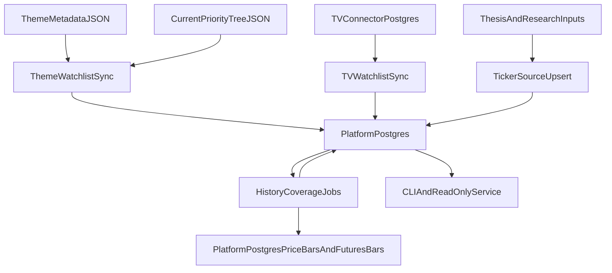

# PostgreSQL Ticker Coverage Design v0.1

## Goal

Define the canonical PostgreSQL middle layer for ticker universe management, theme-derived watchlists, source provenance, history coverage status, and platform-owned macro indicator history.

This document does not define:

- price object semantics
- fundamentals object semantics
- provider precedence for price or fundamentals
- futures contract-selection policy

Those rules now belong to:

- [`market_data_architecture.md`](market_data_architecture.md)
- [`price_data_architecture.md`](price_data_architecture.md)
- [`research_33_company_fundamentals_data_architecture.md`](research_33_company_fundamentals_data_architecture.md)

This layer sits between:

- connector-owned stores such as the TradingView news/watchlist database
- public macro data sources such as New York Fed, Treasury, Cboe, and FRED-style series
- semantic knowledge artifacts such as theme metadata and thesis notes
- downstream market-data coverage jobs and runtime read APIs

It is the single source of truth for:

- which tickers are in the platform universe
- why each ticker is in scope
- which watchlists exist
- which tickers belong to which watchlists
- what historical coverage status each ticker currently has
- which macro series are normalized in the platform layer
- what observation history and ingest status each macro series currently has

## Canonical Rules

1. PostgreSQL is the canonical operational middle layer for ticker coverage orchestration.
2. Theme metadata remains the semantic authoring source for thesis-linked tickers.
3. Connector-owned databases remain connector-local capture stores; they do not replace the platform ticker universe.
4. Historical coverage jobs must read their worklist from PostgreSQL by default.
5. Path/config behavior must use one canonical Postgres connection setting and must not use fallback search loops.

## Scope Split

### PostgreSQL-owned operational objects

- `tickers`
- `ticker_sources`
- `watchlists`
- `watchlist_members`
- `coverage_status`
- `macro_series`
- `macro_observations`
- `macro_ingest_status`

### File-owned semantic objects

- `data/research/themes/metadata/*.json`
- `data/research/themes/current_priority_tree.json`
- `data/research/thesis_notes/*.json`
- `data/knowledge/asset_logic_cards/*.json`

### Connector-owned operational objects

- TradingView raw watchlist/news rows inside the connector database

## Data Flow

## Canonical Tables

### `macro_series`

One row per normalized platform-owned macro indicator.

Recommended columns:

- `series_key text primary key`
- `display_name text`
- `category text`
- `provider text`
- `source_ref text`
- `frequency text`
- `unit text`
- `is_derived boolean`
- `first_observation_at timestamptz`
- `last_observation_at timestamptz`
- `last_ingest_at timestamptz`
- `metadata jsonb`

### `macro_observations`

One row per `(series_key, provider, observation_time)` macro print.

Recommended columns:

- `series_key text`
- `provider text`
- `observation_time timestamptz`
- `value double precision`
- `value_text text`
- `as_of timestamptz`
- `metadata jsonb`

Primary key:

- `(series_key, provider, observation_time)`

### `macro_ingest_status`

Current per-series ingest state.

Recommended columns:

- `series_key text`
- `provider text`
- `status text`
- `last_attempted_at timestamptz`
- `last_success_at timestamptz`
- `rows_written integer`
- `last_error text`
- `metadata jsonb`

Primary key:

- `(series_key, provider)`

### `tickers`

One row per canonical platform symbol.

Recommended columns:

- `symbol text primary key`
- `display_name text`
- `asset_type text`
- `status text` with values such as `active`, `monitor`, `inactive`
- `coverage_enabled boolean`
- `last_theme_at timestamptz`
- `last_tv_at timestamptz`
- `last_thesis_at timestamptz`
- `first_seen_at timestamptz`
- `last_seen_at timestamptz`
- `metadata jsonb`

### `ticker_sources`

One row per `(symbol, source_kind, source_ref)` provenance edge.

Recommended columns:

- `symbol text`
- `source_kind text`
- `source_ref text`
- `source_label text`
- `first_seen_at timestamptz`
- `last_seen_at timestamptz`
- `metadata jsonb`

Suggested `source_kind` values:

- `theme`
- `subtheme`
- `tv_watchlist`
- `thesis`
- `manual`

### `watchlists`

One row per operational watchlist.

Recommended columns:

- `watchlist_id text primary key`
- `name text`
- `source_kind text`
- `source_ref text`
- `generated boolean`
- `status text`
- `updated_at timestamptz`
- `metadata jsonb`

Examples:

- `theme:iran-hormuz-escalation`
- `subtheme:iran-hormuz-escalation:oil-supply-shock`
- `tv:Macro`

### `watchlist_members`

Membership table for watchlists.

Recommended columns:

- `watchlist_id text`
- `symbol text`
- `source_kind text`
- `source_ref text`
- `priority_bucket text`
- `priority_rank numeric`
- `updated_at timestamptz`
- `metadata jsonb`

Primary key:

- `(watchlist_id, symbol)`

### `coverage_status`

Current per-symbol, per-interval coverage state.

Recommended columns:

- `symbol text`
- `interval text`
- `status text`
- `last_update_started_at timestamptz`
- `last_update_completed_at timestamptz`
- `last_success_at timestamptz`
- `rows_written integer`
- `last_error text`
- `source_watchlist_id text`
- `updated_at timestamptz`
- `metadata jsonb`

Primary key:

- `(symbol, interval)`

## Theme-Derived Watchlist Rules

Theme watchlists are deterministic generated objects, not manual freeform lists.

### Generation inputs

- theme-level `linked_asset_tickers`
- subtheme-level `linked_asset_tickers`
- priority metadata from `current_priority_tree.json`

### Generation outputs

- one theme-level watchlist per theme
- one subtheme-level watchlist per subtheme with non-empty tickers
- one source edge per generated membership

### ID rules

- theme watchlist: `theme:<theme_id>`
- subtheme watchlist: `subtheme:<theme_id>:<subtheme_id>`

### Metadata rules

Theme-generated watchlist metadata should preserve:

- theme title
- subtheme title if applicable
- priority bucket
- priority rank
- time horizon
- generation timestamp

## TradingView Sync Rules

TradingView sync does not define the canonical ticker universe by itself; it contributes operational evidence.

### Required behavior

- read watchlists from the connector-owned DB
- upsert a platform watchlist per TV watchlist
- upsert ticker rows for discovered symbols
- record `ticker_sources` with `source_kind = tv_watchlist`
- preserve the original TV symbol string in metadata

### Normalization behavior

- keep the canonical `symbol` field stable and uppercase
- preserve raw TV fields in JSON metadata
- do not guess alternate ticker paths when the source symbol is ambiguous

## History Coverage Rules

The default history update flow must read symbols from PostgreSQL.

### Default selection

- active tickers with `coverage_enabled = true`

### Optional narrowing

- one watchlist
- one source kind
- explicit CLI symbols for debugging only

### Status updates

Each history run should update `coverage_status` so the runtime can answer:

- what was attempted
- what succeeded
- what failed
- which watchlist or selection produced the worklist

## Verification Gates

1. Running the theme watchlist sync should produce deterministic Postgres rows from theme JSON.
2. Running TV sync should produce or refresh TV-derived watchlists and ticker source edges.
3. Running history update with no explicit symbols should use the Postgres ticker universe.
4. Read APIs should be able to list watchlists and coverage status directly from Postgres.
