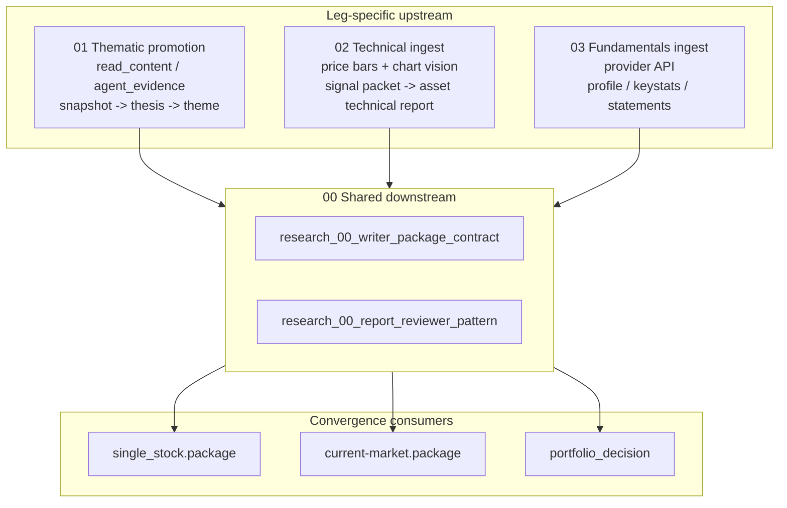

# Research Family Overview

**Version 0.1 — 2026-04-19**

This is the entry doc for the `research` family inside `designDoc/`.
Open this file first whenever the question is "where does this
research-related thing live and what does it do".

---

## 1. What This Layer Does

`research` is the layer that turns Material Catalog objects, canonical
source read content, market signals, and provider-normalized data into
structured judgment workflows and PM-facing artifacts:
themes, theses, signal packets, valuation views, evidence drafts,
technical reports, and writer packages.

Material boundary:

- Material Catalog owns the object contracts for Source Card, Typed
  Claim, Expert Artifact, Evidence, Thesis, Scenario, Theme, Technical
  Report, and Operating Cycle Artifact.
- Research owns promotion workflow, lifecycle gates, package assembly,
  report writing, review, and downstream consumption policy.
- Legacy `agent_evidence.json` / "evidence unit" references are draft
  research inputs unless they carry belief_delta and target belief refs
  under the Evidence contract.

It is **not** the data infrastructure layer. Connectors, ticker
universe, price storage, fundamentals provider plumbing, and
session/timestamp contracts live elsewhere; the research layer
consumes them.

It is **not** the PM workspace layer either. The research layer
produces inputs for `single_stock.package`, `current-market.package`,
`portfolio_decision`; it does not itself decide positions.

The research family is organized as **three legs plus a shared
downstream**:

- `01 thematic` — narrative / qualitative research promotion
  (`read_content.md` / `agent_evidence.json` → snapshots → theses → themes)
- `02 technical` — chart / price-action research (bars + chart vision
  → signal packet → asset technical report)
- `03 fundamentals` — issuer / filings research (provider API →
  profile / keystats / statements → valuation view) — currently
  bootstrapping
- `00 shared` — cross-leg downstream contracts (writer-facing package
  contract, post-write reviewer pattern)

---

## 2. Three Legs



### 2.1 Thematic (01)

Input shape: ingestion-produced `read_content.md` and, when promotion is needed, `agent_evidence.json` with draft evidence units. The raw newsletters, PDFs, screenshots, image ledgers, and archive internals belong to ingestion.

Compression chain: `read_content.md → agent_evidence.json → snapshot /
thesis_note → theme update → finalized theme report`. Heavy human-and-AI
mixed review at every promotion gate.

Material mapping: `snapshot` is an Operating Cycle Artifact subtype;
`thesis_note` / `theme update` must respect Thesis and Theme material
contracts; `agent_evidence.json` becomes Evidence only after belief_delta
and target belief refs are attached.

Truth-surface SKILLs: `ingestion-research-archive-operator`,
`research-theme-report-owner`, `research-theme-knowledge-and-package-curator`, `research-theme-priority-updater`.

Hard rule: external narrative cannot bypass the snapshot / thesis
layer to write directly into a theme report or a portfolio thesis.

### 2.2 Technical (02)

Input shape: structured market bars (postgres OHLCV) plus rendered
candlestick PNGs read by Claude vision.

Compression chain: deterministic signal packet (numeric layers) +
chart-vision structural pattern → DeepSeek-written asset technical
report. Layered packet is machine-readable, report is PM-readable.

Material mapping: the signal packet is a technical execution schema and
market-feature support surface. The PM-readable report is governed by
the Technical Report material contract. Packet-level `scenarios[]` are
`technical_scenario` candidates, not canonical Scenario assets unless a
Research / Expertise promotion workflow admits them.

Truth-surface SKILLs: `writer-asset-technical`. Builders:
`asset_technical_runtime`, `render_asset_candlestick_chart`,
`extract_structural_patterns_with_claude`,
`draft_asset_technical_reports_with_deepseek`.

Hard rule: numeric truth is deterministic-only; geometric pattern
truth is Claude-vision-only; prose is DeepSeek-only. No layer guesses
another layer's territory.

### 2.3 Fundamentals (03)

Input shape: structured filings and reference data from provider APIs
(EODHD currently planned as primary).

Compression chain (planned): `provider payload → SecurityProfile +
KeyStatsSnapshot + FinancialStatementSet → FundamentalsResolution →
valuation view`. Workflow doc not yet written; only the data
architecture exists.

Material mapping: provider payloads are Raw Data or Canonical Input
until a research workflow converts them into Evidence, Thesis, report,
or Operating Cycle Artifact refs.

Truth-surface SKILLs: TBD when workflow lands. Today this leg is
referenced by `research-single-stock-analysis` and PM workspace docs as a
placeholder.

Hard rule: point-in-time semantics (`period_end`, `filing_date`,
`accepted_date`, `retrieved_at`, `as_of`) are mandatory; no field can
collapse into "today's value".

---

## 3. Naming Convention

All research-family docs at `designDoc/` root use:

```
research_NN_<descriptor>.md
```

NN slot allocation:

- `00` — cross-leg shared (writer-package contract, reviewer pattern,
  this overview)
- `01` — thematic
- `02` — technical
- `03` — fundamentals
- `04+` — reserved for future legs, task-specific report
  instructions, or new cross-leg contracts; allocate at the time the
  first doc lands

When a doc currently named with a leg-specific prefix (e.g.
`theme_*`) is found to actually carry cross-leg content, promote it
to `research_00_*` and recast the title to drop the leg-specific
framing. The leg's own instance becomes a section inside the
promoted doc, marked as the first concrete instantiation.

Files outside this scheme:

- `designDoc/modules/asset_technical_signal_pipeline.md` — older
  module-level note, superseded by
  `research_20_technical_signal_pipeline_v2.md`; kept for phase-1
  reference, not renamed
- `designDoc/ingestion_00_overview.md`,
  `designDoc/source_connectors_and_knowledge_ingestion.md`,
  `designDoc/market_data_architecture.md`,
  `designDoc/price_data_architecture.md`,
  `designDoc/postgres_ticker_coverage_design_v0_1.md` — data
  infrastructure that all three legs consume; not part of the
  research family but referenced from it

---

## 4. Per-Doc Registry

Research-family docs live in this registry. Each registry entry
answers: what does this doc own, what must it keep aligned, what to
read before / after, who consumes it, what nearby docs are easy to
confuse with it.

### 4.1 [`research_00_overview.md`](research_00_overview.md)

- `leg`: 00 shared
- `boundary`: this file. The topology and per-doc registry of the
  research family.
- `responsibility`: stay aligned with actual filenames; whenever a
  research-family doc is added / renamed / removed, update this
  registry first.
- `read before`: nothing required.
- `read after`: depends on the leg. For thematic work go to §4.4–4.5,
  technical to §4.6–4.7, fundamentals to §4.8.
- `consumed by`: any agent or human entering the research family.
- `confusion neighbors`:
  - [`README.md`](README.md) — repo-wide design index, points here for
    research-related questions.
  - [`knowledge_base_and_memory_system.md`](knowledge_base_and_memory_system.md)
    — system-level memory framing; broader than research alone.

### 4.2 [`research_00_writer_package_contract.md`](research_00_writer_package_contract.md)

- `leg`: 00 shared
- `boundary`: the contract for any writer-facing package artifact
  (`theme.package`, `current-market.package`, `single_stock.package`,
  asset-technical package, weekly account review package, portfolio
  debate package).
- `responsibility`: enforce tier order, owner-direction-first
  integration, `content_selection.json`-driven excerpts, fail-fast
  rules R1–R11, 500 KB hard ceiling.
- `read before`: §4.4 if the package being assembled is theme-related
  (current first instance).
- `read after`: §4.3 (the post-writing reviewer that scores against
  the same contract).
- `consumed by`: `research-theme-knowledge-and-package-curator`, `writer-handoff`,
  package builders (`build_theme_writer_package.py`,
  `assemble_market_observation_package.py`,
  `build-single-stock-analysis-package`).
- `confusion neighbors`:
  - [`ingestion_20_archive_message_contract.md`](ingestion_20_archive_message_contract.md)
    — owns per-message archive shape; this doc owns the assembled
    package shape that consumes source and promotion objects.
  - [`the_task_routing.md`](the_task_routing.md)
    — routing-level contract; this doc is package-level.

### 4.3 [`research_00_report_reviewer_pattern.md`](research_00_report_reviewer_pattern.md)

- `leg`: 00 shared
- `boundary`: the post-writing reviewer pattern: write → review →
  merge. Three-layer pipeline (self-audit, narrow external
  verification, adversarial review). Structured sidecar verdict.
- `responsibility`: never edit the draft, never retake owner
  authority, always emit `accept_as_is` / `accept_with_revisions` /
  `needs_rewrite` plus a sidecar that downstream merge logic can read.
- `read before`: §4.2 (the package contract the draft was written
  against) and the relevant leg's workflow doc.
- `read after`: leg-specific maintainer SKILL that applies revisions
  or routes back to owner.
- `consumed by`: `research-theme-report-reviewer` (current only instance);
  `research-theme-knowledge-and-package-curator` reads its sidecar before merge.
- `confusion neighbors`:
  - `writer-handoff` SKILL — pre-writing package gate. Reviewer is
    post-writing; writer-handoff is pre-writing.

### 4.4 [`research_10_thematic_workflow.md`](research_10_thematic_workflow.md)

- `leg`: 01 thematic
- `boundary`: the canonical workflow for thematic research promotion
  after ingestion has produced `read_content.md` and, when needed,
  `agent_evidence.json`: snapshot / thesis / theme promotion, review
  gates, `theme_update_drafts/` layer, context indexes, candidate queue,
  and derived-surface audit.
- `responsibility`: keep the promotion model (`read_content.md` →
  `agent_evidence.json` → Snapshot → ThesisNote / ThemeUpdateDraft →
  ThemeObject → ThemeAnalyticReport) consistent; own research promotion
  paths and gates, not message archive internals or material object
  boundaries.
- `read before`: [`knowledge_base_and_memory_system.md`](knowledge_base_and_memory_system.md)
  for the system-level framing.
- `read after`: §4.2 for what packages built from this layer must look
  like; ingestion docs when source archive or `read_content.md` behavior
  is in question.
- `consumed by`: `ingestion-research-archive-operator`, `research-theme-report-owner`,
  `research-theme-knowledge-and-package-curator`, `research-theme-priority-updater`,
  `ingestion-agentmail-inbox-triage`.
- `confusion neighbors`:
  - §4.5 — deprecated pointer for older message-archive references.
  - [`ingestion_00_overview.md`](ingestion_00_overview.md) /
    [`ingestion_20_archive_message_contract.md`](ingestion_20_archive_message_contract.md)
    — ingestion and archive-object boundary upstream of research
    promotion; this workflow starts where read content and archive state
    are available.

### 4.5 [`research_10_thematic_message_archive.md`](research_10_thematic_message_archive.md)

- `leg`: compatibility pointer
- `boundary`: deprecated pointer for older references. It does not own
  new archive, tagging, source identity, or file-shape rules.
- `responsibility`: route readers to `ingestion_20` for archive-object
  and tag-taxonomy rules, `ingestion_30` for `read_content.md`, and §4.4
  for thematic promotion.
- `read before`: `ingestion_00_overview.md`.
- `read after`: `ingestion_20_archive_message_contract.md`,
  `ingestion_30_ai_read_content_contract.md`, and §4.4.
- `consumed by`: legacy references only. New work should enter through
  ingestion docs or §4.4 depending on boundary.
- `confusion neighbors`:
  - §4.4 — research promotion workflow after ingestion.
  - [`ingestion_20_archive_message_contract.md`](ingestion_20_archive_message_contract.md)
    — canonical archive-object file, tag taxonomy, source identity, and
    mutable-link contract.
  - `source_collections.json` — source-family routing registry; this
    pointer references it but does not own it.

### 4.6 [`research_20_technical_signal_pipeline_v2.md`](research_20_technical_signal_pipeline_v2.md)

- `leg`: 02 technical
- `boundary`: the v2 system-level truth surface for the asset
  technical signal pipeline: deterministic numeric layers + Claude
  vision structural pattern + DeepSeek prose. All future signal
  package, deterministic compute, vision layer, downstream-report
  changes land in this doc's §12 Changelog.
- `responsibility`: define the layered packet schema (current_bar,
  recent_path, structural_window, fib, relative_strength, events,
  cross_timeframe, scenarios, entry_setups, technical_setup_projection),
  per-layer ownership (det vs vision vs AI weighting), pipeline
  stage order, validation contract. Packet-level `scenarios` are
  technical_scenario candidates; `material_80_scenario_contract.md`
  owns canonical Scenario admission.
- `read before`: §4.7 for the narrower PM-facing
  `AssetLogicCard.technical_framework` field contract.
- `read after`: §4.2 if assembling a single-stock package that
  consumes technical signals; PM workspace docs for downstream usage.
- `consumed by`: `writer-asset-technical` SKILL; builders
  `asset_technical_runtime.py`, `render_asset_candlestick_chart.py`,
  `extract_structural_patterns_with_claude.py`,
  `draft_asset_technical_reports_with_deepseek.py`,
  `build_asset_logic_index.py`.
- `confusion neighbors`:
  - §4.7 — v0.1 is the PM-facing card field contract;
    v2 is the system-level packet contract; they coexist.
  - [`modules/asset_technical_signal_pipeline.md`](modules/asset_technical_signal_pipeline.md)
    — pre-v2 module-level note; superseded but kept for phase-1 reference.
  - [`price_data_architecture.md`](price_data_architecture.md) /
    [`market_data_architecture.md`](market_data_architecture.md) —
    upstream price storage; this doc consumes them.

### 4.7 [`research_20_technical_framework_v0_1.md`](research_20_technical_framework_v0_1.md)

- `leg`: 02 technical
- `boundary`: the narrow `AssetLogicCard.technical_framework` field
  contract: trend_state, risk_levels, take_profit_levels, add_zones,
  invalidation conditions. PM-maintained (human or human + AI).
- `responsibility`: define the per-asset card field shape used by PM
  workspace; clarify how it relates to (and is **not** auto-overwritten
  by) §4.6's signal packet.
- `read before`: §4.6 if you want to understand how packet output may
  reference card fields.
- `read after`: PM workspace docs for how the card is consumed.
- `consumed by`: `research-single-stock-analysis` SKILL, `build_asset_logic_index.py`.
- `confusion neighbors`:
  - §4.6 — system-level packet vs PM-level card field; partial
    extension relationship explained in §4.6's frontmatter.

### 4.8 [`research_33_company_fundamentals_data_architecture.md`](research_33_company_fundamentals_data_architecture.md)

- `leg`: 03 fundamentals
- `boundary`: canonical fundamentals object model (SecurityProfile,
  KeyStatsSnapshot, FinancialStatementSet, FundamentalsResolution),
  point-in-time semantics, provider precedence (EODHD primary,
  Schwab not authoritative), revision handling.
- `responsibility`: keep the data shape and time-semantics layer
  rigorous; do not collapse into "today's value"; do not let provider
  payload field names leak into analysis consumers.
- `read before`: [`postgres_ticker_coverage_design_v0_1.md`](postgres_ticker_coverage_design_v0_1.md)
  for ticker universe boundary.
- `read after`: TBD — fundamentals workflow doc not yet written;
  next addition would be `research_03_fundamentals_workflow.md`.
- `consumed by`: TBD — currently referenced by single-stock analysis
  as a placeholder for valuation overlay.
- `confusion neighbors`:
  - [`postgres_ticker_coverage_design_v0_1.md`](postgres_ticker_coverage_design_v0_1.md)
    — universe orchestration; this doc explicitly carves it out.
  - [`market_data_architecture.md`](market_data_architecture.md) /
    [`price_data_architecture.md`](price_data_architecture.md) —
    price domain; this doc explicitly carves it out.

### 4.9 [`research_31_private_company_report_instruction.md`](research_31_private_company_report_instruction.md)

- `leg`: 08 task-specific PM report instruction.
- `boundary`: the PM-facing report instruction for private-company
  research after Digestion has produced a writer package. It owns the
  report's reader end-state, headline-judgment requirement, biggest
  misread section, pricing-surface prose limits, public-comp
  calibration boundaries, and watchpoints that change the read.
- `responsibility`: keep the final report from collapsing into a
  dossier summary or turning private-company evidence into transaction
  advice. Preserve the separation between operating-company quality,
  security price, valuation translation, liquidity, and cannot-know
  fields.
- `read before`: [`digestion_12_private_company_report_package_contract.md`](digestion_12_private_company_report_package_contract.md)
  and [`digestion_41_1_private_company_expert.md`](digestion_41_1_private_company_expert.md).
- `read after`: [`research_00_report_reviewer_pattern.md`](research_00_report_reviewer_pattern.md)
  for post-writing review posture.
- `consumed by`: `research-single-stock-analysis` when it is asked to
  produce a PM-readable private-company report from a private-company
  writer package; future private-company report reviewer gates.
- `confusion neighbors`:
  - [`digestion_12_private_company_report_package_contract.md`](digestion_12_private_company_report_package_contract.md)
    — package assembly contract; this doc owns prose and reader
    judgment in the final report.
  - [`digestion_41_1_private_company_expert.md`](digestion_41_1_private_company_expert.md)
    — expert artifact and claim firewall; this doc does not author
    Source Cards, Typed Claims, or the dossier.

---

## 5. Cross-Cutting Downstream

The research family publishes into and consumes from these
non-research docs. Treat them as boundary contracts, not as research
truth surfaces:

- [`ingestion_00_overview.md`](ingestion_00_overview.md)
  — entry point for source intake, message archive surfaces,
  canonical source read content, and blocker/readiness contracts. Thematic
  research consumes this layer.
- [`source_connectors_and_knowledge_ingestion.md`](source_connectors_and_knowledge_ingestion.md)
  — legacy connector boundary note; retained while `ingestion_10` fully
  absorbs connector responsibilities.
- [`the_artifact_graph.md`](the_artifact_graph.md)
  — the canonical node + dependency registry where every research-family
  artifact (theme.package, asset_technical.report, single_stock.package,
  theme.report.review, …) appears as a node.
- [`material_00_overview.md`](material_00_overview.md)
  — material-object boundary authority for Source Card, Typed Claim,
  Expert Artifact, Evidence, Thesis, Scenario, Theme, Technical Report,
  and Operating Cycle Artifact.
- [`the_task_routing.md`](the_task_routing.md)
  — the routing contract that decides which mainline a request enters
  before any research SKILL is invoked.
- [`last_session_truth_and_ingestion_boundary.md`](last_session_truth_and_ingestion_boundary.md)
  — session / timestamp contract that any research artifact carrying a
  market-time field must respect.

---

## 6. Out Of Research Family

These directories are not part of the research family even when their
content touches research:

- `designDoc/modules/` — module-level implementation notes, narrower
  than family-level truth surfaces.
- `designDoc/ideas/` — future-facing proposals; promote to a
  `research_NN_*` doc only when work actually lands.
- `designDoc/bp/` — blueprint / template / deck-style reference docs.
- `designDoc/temp/` — handoff and migration notes.
- `designDoc/learning_library/` — external references and extracted
  lessons.
- `designDoc/agreement/`, `designDoc/ai_guidelines/` — higher-level
  agreements / agent-facing protocol; orthogonal to the research
  family.

If a doc in any of these directories grows into a real
research-family truth surface, promote it to `designDoc/research_NN_*.md`
and update §4 here in the same change.
