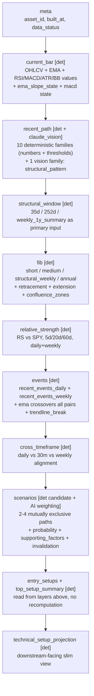
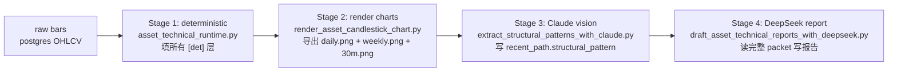

# Asset Technical Signal Package — v2

**Status**：active main design doc for the asset technical signal pipeline
**First written**：2026-04-14
**Owner**：trading_platform / asset technical layer
**Supersedes**：partially extends [`research_20_technical_framework_v0_1.md`](research_20_technical_framework_v0_1.md)（v0.1 仍是 `AssetLogicCard.technical_framework` 子对象的窄字段契约；本 doc 是 signal package 系统级真相面）
**Update rule**：之后所有 signal package、deterministic 计算、Claude vision 形态层、DeepSeek 报告下游切换的设计变更，**全部写到本文件的 §12 Changelog**（架构待办放 §11 Next-batch），不再开新 plan / ideas 散文件。Plan 文件 `signal_package_4-layer_redesign_e950e0bc` 内容已整体固化进本 doc，后续以本 doc 为唯一 schema 真相。

---

## 0. 文档地位与读者引导

### 0.1 这是什么

`trading_platform` 的资产技术分析有两层：

- **AssetLogicCard.technical_framework**（v0.1）：单资产研究卡的子对象，描述 PM/分析员**人手维护**的 trend_state / risk_levels / take_profit_levels / add_zones 等结构化字段
- **Signal Package**（本 doc，v2）：每日由 deterministic 管线 + Claude vision + DeepSeek 自动生成的**可机读多层 packet**，喂给下游报告、market observation 包装、portfolio decision

两者关系：
- v0.1 是「PM 怎么用图形管理仓位的契约」
- v2 是「系统怎么把市场状态压成 AI 可读 layered state 的契约」
- v0.1 的 risk_levels / add_zones 在 v2 packet 生成的 entry_setups / structural_window 中可被引用，但 v0.1 不被自动覆写

Material Catalog boundary：

- Signal Package 是 technical execution schema / market-feature support surface，不是独立 material object。
- DeepSeek 写出的 PM-readable output 属于 Technical Report material contract（`material_70_technical_report_contract.md`）。
- 本 doc 的 `scenarios[]` 是 `technical_scenario` candidates；它们不是 canonical Scenario（`material_80_scenario_contract.md`），除非后续通过 Research / Expertise promotion workflow 接上 Thesis anchor 和 Expertise Application。
- `structural_pattern`、`fib`、`relative_strength`、`events`、`cross_timeframe` 等字段是 market_feature support surfaces；它们可以喂 Technical Report 或 Evidence drafting，但不能自行升级成 Evidence / Scenario / Thesis。

### 0.2 读者使用方式

- 想知道 packet 里某字段的含义、范围、lookback：读 §2 各层契约
- 想知道某个判断（如「今日是不是新高」「日线突破后 30m 怎么读」）由谁算、为什么不让 LLM 算：读 §1.2 边界硬约定
- 想加新字段 / 改 lookback：先看 §3 命名约定 + §12 Changelog 写一条，再动代码
- 想跑全链路：读 §1.1 三段管线 + §4 实施 phases
- 想验证实现是否合格：读 §5 Validation 设计

### 0.3 为什么要做 v2

旧 packet 的核心问题：

- 大量字段是「单 bar 真值」（今日 close、今日 RSI、今日距 EMA 多少），但市场判断本质是**多 bar、多周期**：「刚突破第几天」「回调几天到 EMA20」「周线是否同步新高」「30m 是否 distribution」这些状态原 packet 没有显式表达
- 形态判断（区间 / flag / 筑底 / 筑顶 / 五浪）若用 rule-based 写假阳性极高（V_bottom 模式硬编码必然 overfit）；若让 DeepSeek 看裸 packet 文本脑补又会幻觉
- 一些应该有 timeframe 标记的「new_high」「breakout」事件没区分日线 / 周线，导致下游报告把「rolling 35d 突破」误读成「年内新高」
- Fib / 趋势线 / RS / scenarios 等高价值层缺失，下游报告信息不全

v2 的整体姿态：**数值精确的事 deterministic 算到底，几何模糊的事让 Claude 看图判，文本生成的事 DeepSeek 做**。

---

## 1. 系统总览

### 1.1 顶层结构与三段管线



`[det]` = deterministic 计算；`[claude_vision]` = Claude vision 看渲染好的 candlestick PNG 填；`[AI weighting]` = deterministic 给候选 + AI 综合加权。`scenarios` 提供 technical_scenario 候选骨架，让最终报告 AI 读完整 packet 时直接复用而不重新拼凑；它不是 canonical Scenario。

**三段管线（pipeline 顺序，强制）**：



- 每段产物落盘，下段从盘里读，方便单段重跑（如 deterministic 不变只重跑 Claude 视觉，或只重跑 DS 报告）
- 任一段失败不阻断后续段；若 `structural_pattern` 缺失，packet 显式标 `structural_pattern.status="unavailable"`，DeepSeek prompt 必须显式告诉它「本次没有 Claude 形态判断，仅按 deterministic 数值写，禁止脑补 V_bottom / cup 等图形结论」
- 每段产物自带 `source` / `model` / `generated_at` 标签，方便回溯哪一段过期

### 1.2 谁算什么（边界硬约定）

| 类型 | 谁来做 | 理由 |
|---|---|---|
| OHLCV、EMA、RSI/MACD/ATR/BB **数值** | deterministic | LLM 算数字幻觉率高 |
| 突破 / 新高 / MA cross / 趋势线突破 **规则触发事件** | deterministic | 规则明确，可测试 |
| 趋势线 **几何拟合**（pivot fit） | deterministic | 数学问题 |
| Fib retracement / extension **几何档位** | deterministic | 数学问题 |
| Relative strength **比值序列** | deterministic | 数学问题 |
| Exhaustion 复合 state（连涨 + RSI + 距 EMA + 上下影 + ATR） | deterministic | 数值阈值复合，可测试 |
| **结构性形态判断**（区间震荡 / bull-bear flag / 筑底 / 筑顶 / Elliott 五浪 / 楔形 / 三角形） | **Claude vision** | 几何模糊 + 主观，rule-based 假阳性高，LLM 视觉强 |
| Single/double/triple **candlestick pattern**（hammer / engulfing / star） | **不做** | 单 K/双 K/三 K 信噪比低，跨资产意义薄 |
| Scenarios + probabilities | **deterministic 候选 + 最终报告 AI 加权** | deterministic 给 2-4 个 technical_scenario 候选的 support 清单，最终 prob 由 DeepSeek 综合时输出；不生成 canonical Scenario |
| 报告写作（叙述、判断、收敛） | DeepSeek | 文本生成强 |

### 1.3 多周期输入是一等公民（横切原则，全部 layer 适用）

`price_context.weekly_1y` 不只是给 reader 当摘要看，是「年度尺度结构」的**输入源**。任何「最近 N 期」「N 期内最高/最低」「N 期 swing」「N 期 test 计数」类的派生，都必须先决定 timeframe 再计算，并以并列字段同时输出日线 + 周线两套：

- **标准 lookback 集**（`profile.technical_settings` 集中暴露，禁止散落硬编码）：
  - 日线：5d / 10d / 20d / 35d / 252d
  - 周线：4w / 13w / 26w / 52w
- **命名约定**：
  - 日线派生字段无前缀（沿现有风格）：`recent_max_close_20d`、`days_since_last_high_close_252d`
  - 周线派生字段统一带 `weekly_` 前缀：`weekly_recent_max_close_26w`、`weeks_since_last_high_close_52w`
- 凡是 `state` 枚举类字段，若日线与周线读法可能不同（典型例：日线在新高、周线还在区间内），必须分别给 `daily_state` 与 `weekly_state`，不要合成一个被压扁的标签
- **强制必须有 weekly 版本的子族**：
  - `recent_path.high_low_path`（新高/新低）
  - `recent_path.level_test_log`（关键位被 test 几次）
  - `recent_path.pullback_rebound`（深度回调的锚点应允许来自周线 pivot）
  - `recent_path.structural_pattern`（Claude vision 必须同时看 daily.png 与 weekly.png，分别填 daily_chart_view 与 weekly_chart_view，并给 daily_vs_weekly_pattern_alignment）
  - `recent_path.indicator_state`（weekly RSI / MACD divergence 是中期反转关键）
  - `recent_path.trendlines`（周线趋势线 = 中期支撑/压力，必须独立画）
  - `fib.structural_swing`（必须由周线 52w 推 swing，不允许只用日线 252）
  - `relative_strength`（RS_5d / 20d 是日线节奏，RS_60d / 252d 与 weekly RS 是中期领先性）
  - `events`（新高/新低、突破等事件要给 daily 与 weekly 两条独立 log）

---

## 2. 各层完整字段契约

### 2.1 `current_bar`

替代旧 `daily.*` 中的「单 bar 真值」部分。

- `ohlcv`、`change_pct_vs_prev_close`
- `ema`：map of `{ema_5, ema_10, ema_20, ema_50, ema_200}`
- `rsi_14`、`atr_14`（新）
- `distance_to_ema_pct`：到 ema10/20/50/200 的 %（新，单 bar 派生）
- `ema_slope_state`：每根 EMA 自己的 5d 斜率方向，输出 `{ema10, ema20, ema50, ema200}` 各 ∈ `{rising, falling, flat}`（新；framework 强调「价相对 MA」与「MA 自身方向」要分开看）
- `macd`：`{macd_value, signal_value, histogram, hist_5d_slope}`（新；MA crossover state 在 events 层）
- `intraday_gap_pct`、`intraday_range_pct`、`close_position_in_today_range_pct`（新；解决「今日是高位收 vs 低位收」）
- 不再放任何「今日 vs 历史窗口」字段（那些去 `structural_window` 或 `recent_path`）

### 2.2 `recent_path`（核心新增层）

每个子族都是「最近 N 日序列」派生，N 由 `profile.technical_settings` 可覆盖，默认 5/10/20。

#### 2.2.1 `high_low_path`

- **日线侧**：
  - `days_since_last_annual_high_close` / `_intraday`、`days_since_last_annual_low_close` / `_intraday`
  - `recent_max_close_5d` / `_10d` / `_20d`、`recent_min_close_5d` / `_10d` / `_20d`
  - `pullback_from_recent_high_pct`、`rebound_from_recent_low_pct`
  - `daily_state ∈ {new_high_today, pullback_after_recent_high, distribution_after_high, failed_high, new_low_today, rebound_from_recent_low, no_recent_extreme}`
- **周线侧**（必须并列输出）：
  - `weeks_since_last_high_close_52w` / `_intraday`、`weeks_since_last_low_close_52w`
  - `weekly_recent_max_close_13w` / `_26w` / `_52w`、`weekly_recent_min_close_*`
  - `weekly_pullback_from_recent_high_pct`、`weekly_rebound_from_recent_low_pct`
  - `weekly_state ∈ {new_weekly_high_this_week, pullback_after_recent_weekly_high, weekly_distribution_at_high, failed_weekly_high, new_weekly_low, rebound_from_recent_weekly_low, no_recent_weekly_extreme}`
- **一致性派生**：`daily_vs_weekly_high_alignment ∈ {both_at_new_high, daily_new_high_weekly_lagging, weekly_at_high_daily_pulling_back, neither_at_high}`

#### 2.2.2 `breakout_followthrough`

- `days_since_last_breakout_confirmed` / `_breakdown_confirmed`
- `breakout_anchor_level` / `breakdown_anchor_level`（事件当日的触发位）
- `state ∈ {breakout_today, holding_above_trigger, pullback_to_trigger, failed_breakout, breakdown_today, holding_below_trigger, reclaimed_after_breakdown, no_recent_breakout}`
- `breakout_volume_confirmed`（绑事件，不再是单日 relative volume）

#### 2.2.3 `trend_rhythm`

- `consecutive_up_close_days` / `_down_close_days`
- `recent_HH_HL_count_5d` / `_10d`、`recent_LL_LH_count_5d` / `_10d`
- `directional_close_sum_5d_pct` / `_10d_pct`
- `state ∈ {extending_up, extending_down, choppy, exhausted_up, exhausted_down, reversing_up, reversing_down}`

#### 2.2.4 `pullback_rebound`

- `pullback_anchor_high`：`{date, price, anchor_source ∈ {daily_recent_high_20d, daily_recent_high_35d, weekly_pivot_13w, weekly_pivot_26w, weekly_pivot_52w}}` —— 锚点源必须显式标注
- `pullback_depth_pct`、`days_in_pullback`
- `rebound_anchor_low`：同样带 `anchor_source`
- `rebound_extent_pct`、`days_in_rebound`
- `pullback_state ∈ {shallow_pullback_in_uptrend, deep_pullback_in_uptrend, trend_break, no_active_pullback}`
- `rebound_state ∈ {oversold_bounce, sustained_recovery, failed_rebound, no_active_rebound}`
- 当日线锚点与周线锚点都成立时，两套并列输出，让 reader 看清「日线小回调 vs 周线尺度深度调整」是否同时存在

#### 2.2.5 `level_test_log`

- **日线侧**：
  - `tests_at_short_resistance_20d`：`{count, last_touch_date, last_outcome ∈ {rejected, broke_through, still_testing}}`
  - `tests_at_short_support_20d`：同上
  - `tests_at_multiweek_range_high_35d` / `_low_35d`
- **周线侧**：
  - `tests_at_weekly_resistance_26w` / `_52w`：basis 用周线 high/low pivot
  - `tests_at_weekly_support_26w` / `_52w`
- 共同区分「首次到位」vs「N 次试探未破」vs「破后再 retest」

#### 2.2.6 `gap_log`

- `today_gap_pct`、`today_gap_filled_intraday`
- `unfilled_gaps_above` / `_below`：list of `{price_low, price_high, opened_on, age_days, distance_pct}`
- `recent_gap_state ∈ {gap_up_held, gap_up_filled, gap_down_held, gap_down_reclaimed, no_recent_gap}`

#### 2.2.7 `volume_path`

- `relative_volume_today_vs_20d`（沿用）
- `consecutive_above_avg_volume_days`
- `volume_trend_5d` / `_20d`（slope 方向）
- `volume_distribution_signal ∈ {accumulation, distribution, neutral}`
- `volume_climax_signal ∈ {none, buying_climax, selling_climax}`（量能爆发 + 长上下影组合，专门捕 capitulation / euphoria）
- 突破事件的 `volume_confirmed` flag 由这里供给 `breakout_followthrough`

#### 2.2.8 `indicator_state`（裸数值升为 state + divergence，daily + weekly 双轨）

- `bb`（Bollinger Band 20, 2σ）：
  - `bb_state ∈ {squeeze, expanding, walking_upper_band, walking_lower_band, breakout_upper, breakdown_lower, normal}`
  - `bandwidth_percentile_252d`、`distance_to_upper_pct`、`distance_to_lower_pct`、`bandwidth_5d_trend`
- `rsi`：
  - `rsi_value`、`rsi_state ∈ {overbought, near_overbought, neutral, near_oversold, oversold}`
  - `rsi_5d_slope`、`rsi_price_divergence ∈ {none, regular_bullish, hidden_bullish, regular_bearish, hidden_bearish}`（regular = 价新高 RSI 没新高 / 价新低 RSI 没新低；hidden = 反之）
- `macd`：
  - 引用 `current_bar.macd` 数值
  - `macd_state ∈ {bullish_cross_today, bearish_cross_today, above_signal_rising, above_signal_falling, below_signal_rising, below_signal_falling}`
  - `macd_price_divergence ∈ {none, bullish, bearish}`
- `atr`：
  - `atr_14` 数值（与 `current_bar` 共享）
  - `atr_percentile_252d`、`atr_5d_trend ∈ {expanding, contracting, stable}`
  - `volatility_regime ∈ {low_vol_compression, normal, high_vol_expansion}`
- `volume_price_divergence ∈ {none, bullish, bearish}`：价格新高 + 量能下滑 = bearish；价格新低 + 量能放大 = capitulation 候选
- `weekly_*` 子块同结构（用周线 K 算 RSI/MACD/BB/ATR；weekly divergence 是中期反转关键信号）

#### 2.2.9 `trendlines`（趋势线，daily + weekly 双轨）

- `daily_uptrend_lines`：最多 3 条，每条 `{anchor_points [{date, price}, ...], slope_per_bar, current_value_at_today, distance_pct, fit_quality, age_bars, breaks_today, last_test_date}`
- `daily_downtrend_lines`：同结构
- `weekly_uptrend_lines` / `weekly_downtrend_lines`：同结构（用周线 pivot）
- `closest_active_trendline`：单指针，给 reader「现在最该看的那条线」
- 实现：N-bar pivot 取 3-5 个候选低点 / 高点对，做线性拟合，按 `fit_quality`（残差）+ test 次数排序

#### 2.2.10 `exhaustion_signals`（复合 state，专门答「是不是过热/超卖」）

- `daily_exhaustion_state ∈ {strong_overheated, mild_overheated, neutral, mild_oversold_climax, strong_oversold_climax}`
- `contributing_signals[]`：list of 触发因子，每条 `{signal, value, weight}`，可包含：
  - `consecutive_up_days >= 6`
  - `rsi >= 75` / `rsi <= 25`
  - `distance_to_ema20_pct >= 8` / `<= -8`（z-score 方式归一化）
  - `walking_upper_band_days >= 3` / `walking_lower_band_days >= 3`
  - `upper_shadow_ratio >= 0.5`（上影占比）
  - `atr_expanding_with_climax_volume`
  - `weekly_rsi_overbought`（与日线同步加权更高）
- `confidence ∈ [0, 1]`：触发因子的加权概率
- `weekly_exhaustion_state`：同结构

#### 2.2.11 `structural_pattern`（**source = claude_vision**，整族由 Stage 3 写入，不由 deterministic 算）

> **实现状态**（2026-04-20）：daily + 30m **2-chart 模式**已 production，weekly chart 永久退出（见 2026-04-20 第一条 changelog；`weekly_chart_view` 字段保留在 schema 里但当前不再被填充，由 deterministic `multiweek` / `structural_window.weekly_1y_summary` + daily 6 个月 SMA100/200 接管同等信息量）。写回工具：[`src/tools/extract_structural_patterns_with_claude.py`](../src/tools/extract_structural_patterns_with_claude.py)。下游 DS 读法：cross-check 三对对照（daily.pattern ↔ multiweek.state；daily.state ↔ top_setup_summary.setup_type + daily.annual_breakout_class；intraday_30m.pattern ↔ daily.annual_breakout_class + 30m bars），见 §1.2 边界与 [`draft_asset_technical_reports_with_deepseek.py`](../src/tools/draft_asset_technical_reports_with_deepseek.py) `DEFAULT_SYSTEM_PROMPT` `Pattern layer cross-check` 段。


- **总开关**：`{source: "claude_vision", model, generated_at, status ∈ {ok, unavailable, errored, not_yet_extracted}, status_reason}`
- **`daily_chart_view`**：
  - `timeframe: "daily"`、`bars_in_view`、`view_window {start_date, end_date}`
  - `primary_pattern`：单条主形态，结构 `{pattern, subtype, confidence ∈ [0,1], formation_window {start_date, end_date}, key_levels {range_high, range_low, neckline, pole_high, pole_low, flag_high, flag_low, base_low, handle_low, breakout_level, target_projection, invalidation_level}（按 pattern 留空对应字段）, state ∈ {forming, completed_pending_breakout, completed_broke_out, completed_failed, failed}, narrative}`
  - `pattern ∈ {range_consolidation, bull_flag, bear_flag, bottoming_process, topping_process, breakout_resumption, breakdown_resumption, no_clear_pattern}`
  - `subtype` 词表：
    - bottoming_process：`V_bottom` / `double_bottom` / `triple_bottom` / `inverse_head_and_shoulders` / `cup_handle` / `rounding_bottom` / `falling_wedge_bottom`
    - topping_process：`double_top` / `triple_top` / `head_and_shoulders` / `rounding_top` / `rising_wedge_top` / `M_top`
    - bull_flag / bear_flag：`tight_flag` / `loose_flag` / `pennant`
    - range_consolidation：`tight_range` / `loose_range` / `triangle_symmetric` / `triangle_ascending` / `triangle_descending` / `wedge_rising` / `wedge_falling`
    - breakout_resumption：`fresh_breakout` / `holding_above_breakout` / `pullback_to_breakout`
  - `secondary_patterns`：list，最多 2 条次要形态，结构同 `primary_pattern`（如主形态是 breakout_resumption，可同时记录次形态 bull_flag）
  - `elliott_wave`：
    - `enabled ∈ bool`（资产或时段无清晰浪型时 false）
    - `preferred_count`：`{degree ∈ {primary, intermediate, minor}, current_wave_label ∈ {1, 2, 3, 4, 5, A, B, C}, wave_anchors [{label, date, price}], confidence ∈ [0,1]}`
    - `alternative_count`：同结构，最多 1 个备选数浪
    - `invalidation_level`：当前浪计数失败的关键价位
    - `narrative`：Claude 自由解释为什么这么数
  - `risk_flags`：list ∈ {`overlapping_pattern_signals`, `low_confidence`, `elliott_count_ambiguous`, `pattern_window_too_short`, `gap_distorts_pattern`}
- **`weekly_chart_view`**：同 `daily_chart_view` 结构，`timeframe="weekly"`，`bars_in_view` 60-78
- **`intraday_30m_view`**：同结构，`timeframe="30m"`，`bars_in_view` 取最近 8-10 个交易日的 30m bars，专门答「日线突破后 30m 是 holding / pulling_back / distributing / failed」这类视觉问题；`pattern` 集合可缩成 `{steady_up, steady_down, range, distribution_at_high, accumulation_at_low, failed_breakout_intraday, failed_breakdown_intraday, no_clear_pattern}`；不在 30m 视图上做 elliott_wave
- **`daily_vs_weekly_pattern_alignment`** ∈ `{aligned_bullish, aligned_bearish, daily_bullish_weekly_topping, daily_bearish_weekly_basing, mixed, no_clear_alignment}` —— 由 Claude 在看完两张图后给出
- **`daily_vs_30m_pattern_alignment`** ∈ `{aligned_up, aligned_down, daily_up_30m_pulling_back, daily_breakout_30m_distribution, daily_break_30m_relief_bounce, mixed, no_clear_alignment}`
- **Elliott wave 默认开**（`enabled=true`），但 prompt 内必须告诉 Claude：当置信度本身就低（看不出清晰 5 浪结构）时宁可直接标 `enabled=false` 也不要硬写浪 1-5；下游消费侧（DeepSeek prompt + entry_setups）默认只读 `confidence > 0.6` 的 elliott_wave 结果，低置信内容仅落盘备查不进入主叙述
- **明确不做**：单 K（doji / hammer / shooting_star / marubozu）、双 K（engulfing / piercing / dark_cloud / tweezer）、三 K（morning_star / evening_star / three_soldiers / three_crows）；prompt 要明确禁止 Claude 输出这类 pattern，避免噪音
- **chart 渲染要求**：必须先通过 `render-charts-poc` 子任务的人工可读性检查（baseline = candlestick body + EMA + volume + 时间轴），overlay 增量由 PoC 结论决定；绝不在图上预先标 pattern 名（让 Claude 自己看出来）；feed 给 Claude 的三张图必须使用同一资产同一日期窗口，且 `chart_manifest.json` 中记录视野与 overlay 版本，方便回溯

### 2.3 `structural_window`（重组现 `multiweek` + `annual` + weekly_1y_summary 升格）

- `multiweek`：现有日线 35d 区间字段，原样搬入
- `annual`：含已加的 `annual_high_prior` / `vs_annual_high_pct` / `is_new_annual_high` / `annual_breakout_class`，全部基于日线 252
- `weekly_1y_summary` **升格为一等输入源**（不再只是「reader 友好版」）：
  - `weekly_high_pivots`：list of `{date, price, pivot_strength}`（高点 pivot，按 ZigZag-like 算法或 N-bar fractal 取前 5）
  - `weekly_low_pivots`：同上
  - `weekly_range_high_52w` / `_low_52w` / `_position_pct`
  - `weekly_trend_state ∈ {weekly_uptrend, weekly_downtrend, weekly_range, weekly_topping, weekly_basing}`
  - `weekly_consecutive_up_weeks` / `_down_weeks`
  - 这些值是 `fib.structural_swing`、`recent_path.high_low_path.weekly_*`、`recent_path.level_test_log` 周线侧、`events` 周线 log 的共同依赖

### 2.4 `fib`（multi-anchor，retracement + extension，多周期 anchor）

```
fib/
├── short_swing/      timeframe=daily，anchor 由近 10-15d swing 定
├── medium_swing/     timeframe=daily，anchor 由近 35-60d swing 定（≈ 现 fib_context）
├── structural_swing/ timeframe=weekly，anchor 必须由周线 52w high/low pivot 定
├── annual_swing/     timeframe=daily-on-252，anchor=annual_high_prior / annual_low_prior（用于年内 retracement，与 weekly structural_swing 互为校验）
├── confluence_zones/ 多 anchor + EMA + range + weekly_pivot 聚集带
└── meta/             is_applicable / reason 总开关
```

每个 swing 子块统一字段：
- `timeframe ∈ {daily, weekly}`（强制标注，避免 reader 把 daily 0.618 当成 weekly 0.618）
- `anchor_high` / `anchor_low` / `anchor_high_date` / `anchor_low_date` / `anchor_direction`
- `retracement_levels {0.236, 0.382, 0.5, 0.618, 0.786}`
- `extension_levels {1.272, 1.414, 1.618, 2.0, 2.618}`（active 仅当 close 已穿 anchor 端点）
- `nearest_level`：`{label, value, side ∈ {above_close, below_close}, distance_pct}`
- `recent_touch_log`：触及该 swing Fib 档的 K 线（daily swing 用日线 K，weekly swing 用周线 K），每条 `{level_label, level_value, touched_on, age_bars, outcome ∈ {rejected, held_as_support, broke_through, still_testing}}`
- `state ∈ {in_retracement, at_retracement_level, broke_retracement, in_extension, at_extension_target, no_relevant_interaction}`

`structural_swing` 的 anchor 必须从 `structural_window.weekly_1y_summary.weekly_high_pivots` / `_low_pivots` 中挑（取最大幅 swing pair），不允许直接用 daily 252 max/min（那是 `annual_swing`）。

`confluence_zones`：在 `current_bar.close` 的 ±1% 内自动扫「short_swing / medium_swing / structural_swing / annual_swing 的所有 Fib 档（含 retracement 与 extension） + EMA10/20/50/200 + structural_window.range_high/low + weekly_high_pivots / _low_pivots」聚集，输出 `[{price_zone, contributing_levels[], strength_score, includes_weekly_pivot ∈ bool}]`，`includes_weekly_pivot=true` 的 zone 应被 reader 视为高优先级。

### 2.5 `events`（discrete log with age + status，daily 与 weekly 分两条 log）

- `recent_events_daily`：最近 ~30 个 daily session 内触发过的事件，每条 `{event_type, fired_on, fired_at_price, age_days, status ∈ {fresh, holding, failed, neutralized}, timeframe="daily"}`
- `recent_events_weekly`：最近 ~26 周内触发过的事件（用周线 close 判定），每条 `{event_type, fired_on_week, fired_at_price, age_weeks, status, timeframe="weekly"}`
- 事件类型至少（两套通用，分组列出）：
  - **价格结构类**：`breakout_confirmed`、`breakdown_confirmed`、`new_high_close`、`new_low_close`、`new_annual_high_close`、`new_annual_low_close`
  - **Gap 类**（仅 daily）：`gap_up`、`gap_down`、`breakaway_gap`、`exhaustion_gap`、`island_reversal`
  - **MA crossover 全配对**：`ema10_cross_above_ema20` / `_below`、`ema20_cross_above_ema50` / `_below`、`ema50_cross_above_ema200` / `_below`（golden / death cross 标准定义）
  - **Fib 互动**：`fib_retracement_tagged`、`fib_extension_reached`、`fib_confluence_zone_entered`
  - **趋势线**：`trendline_break_up`、`trendline_break_down`、`trendline_test_held`
  - **Indicator 触发**：`rsi_divergence_fired_bearish` / `_bullish`、`macd_bullish_cross` / `_bearish_cross`、`bb_squeeze_release_up` / `_down`、`volume_climax_buying` / `_selling`
- `most_recent_actionable_event`：单指针，给 reader 一个 anchor，必须显式带 `timeframe`，避免「日线 breakout 第 3 天 + 周线还在区间内」被读成同一件事
- **明确不收**：单/双/三 K candlestick pattern 类事件（hammer / engulfing / star 等），与 §1.2 边界一致

### 2.6 `cross_timeframe`（解决「日线突破 + 30m 回撤」该怎么读，**deterministic 数值对齐**）

- `daily_vs_30m_alignment ∈ {aligned_up, aligned_down, daily_up_30m_pulling_back, daily_breakout_30m_distribution, daily_break_30m_relief_bounce, daily_range_30m_breakout_attempt, daily_range_30m_breakdown_attempt}`
  - 触发规则：基于 30m close 相对 30m EMA20/50、日线 close 相对日线 EMA20/50、以及最近 N 根 30m 的方向 sum，**纯数值规则**
- `daily_vs_weekly_alignment ∈ {aligned_up, aligned_down, daily_up_weekly_topping, ...}`：同样基于数值
- `recent_30m_path_state ∈ {steady_up, steady_down, range, distribution_at_high, accumulation_at_low, failed_breakout_30m, failed_breakdown_30m}`：基于 30m close 序列与 30m 阻力/支撑数值判断，**不做 30m 图形识别**
- `divergence_notes`：自由文本（仅在出现典型背离时填，避免噪音）

**与 `structural_pattern.intraday_30m_view` 的分工**：
- 本层 = **数值对齐**（30m close 跟日线 close 是否同向、是否站 EMA、最近 N 根方向和），rule-based、可测试
- `structural_pattern.intraday_30m_view` = **视觉形态**（30m 这 8-10 个交易日是不是在 distribution、是不是在 fail 突破），由 Claude 看 30m 图给出
- 两者并列存在：cross_timeframe 给「数值是否同向」，structural_pattern 给「形态是否健康」；下游报告应同时引用，遇到冲突时显式说明（例如「数值上 30m 已开始回撤 / `cross_timeframe=daily_up_30m_pulling_back`，但 30m 图形仍在 `holding_above_breakout` 不是 distribution」）

### 2.7 `relative_strength`（独立顶层）

- `benchmark_asset_id`：默认 `etf_spy`；sector ETF 可选用 `sector_benchmark_asset_id` 二级对照
- `daily`：
  - `rs_line_today`：`price_asset / price_benchmark` 归一化（基期 = 252 日前）
  - `rs_change_5d_pct` / `_20d_pct` / `_60d_pct`
  - `rs_new_high_5d` / `_20d` / `_60d` / `_252d`：bool
  - `rs_state ∈ {leading, improving, lagging, weakening}`（参考 RRG 四象限：rs_5d 趋势 × rs_20d 水平）
- `weekly`：同结构，`rs_change_4w_pct` / `_13w_pct` / `_52w_pct`、`rs_new_high_13w` / `_52w`、`weekly_rs_state`
- `divergence_with_price`：`{state ∈ {none, bullish_rs_divergence, bearish_rs_divergence}, note}` —— 价格新高但 RS 没新高 = bearish_rs_divergence
- 单股、行业 ETF、主题 ETF 都必填；指数 / benchmark 自身只填 `{is_benchmark: true, peer_relative_notes: []}`

### 2.8 `scenarios`（technical_scenario candidates，2-4 个互斥路径 + 概率 + invalidation）

- `scenarios[]`：list，长度 2-4，每条：
  - `scenario_id ∈ {bull, base, bear, alt}`
  - `label`：短文本（如 `breakout extension to fib 1.618`、`pullback to ema20 then resume`、`failed breakout reverses to range mid`）
  - `probability_pct`：整数，所有 scenario 总和 = 100
  - `time_horizon ∈ {1w, 1m, 3m}`（默认 1m）
  - `supporting_factors[]`：每条 `{layer, field_path, value}`，必须直接引用现有 layer 字段（如 `events.recent_events_daily[0].event_type=breakout_confirmed` 或 `recent_path.exhaustion_signals.daily_exhaustion_state=mild_overheated`），不允许自由文本拼凑
  - `target_levels[]`：每条 `{label, price, source_layer, source_field}`，引 `fib.*.extension_levels` / `structural_window.weekly_high_pivots` / `recent_path.trendlines.*.current_value_at_today`
  - `invalidation_level`：`{price, condition, source_layer}`（如「日 close < ema50」「跌破 fib_0.618」）
- `dominant_scenario_id`：probability 最高的那个
- `meta`：`{built_method ∈ {deterministic_v1, hybrid}, last_built_at, notes}`
- **实现规则（deterministic_v1）**：
  - 先按 `events.most_recent_actionable_event` + `recent_path.high_low_path.daily_state` + `structural_window.weekly_trend_state` 三个主信号决定主路径
  - 再按 `indicator_state.divergence` + `exhaustion_signals` 调整概率分布（如 strong_overheated 把 bull 概率压低 15%，bear 提高 10%）
  - 最少给 2 个 scenario（base + alt），最多 4 个；不允许给 1 个 scenario 100% 概率
- AI 写报告时直接复用 `scenarios[]`，不允许 LLM 自创新概率，但可在叙述中评论某 technical_scenario 的可信度

Material boundary rule:

```text
packet.scenarios[] = technical_scenario candidate
Technical Report may quote it as conditional setup path
canonical Scenario requires Thesis anchor + Expertise Application + Research / Expertise promotion
```

### 2.9 `entry_setups` / `top_setup_summary` / `technical_setup_projection`

- 每个 setup 的成立条件改成「读上面 layer 的 state」，不再自己重算 close vs level
- 新增 setups：
  - **趋势/突破**：`holding_breakout`、`failed_breakout`、`pullback_after_recent_high`、`fib_extension_target_in_play`
  - **形态驱动**（读 Claude 写的 `structural_pattern`）：`structural_pattern_breakout_pending`（读 `structural_pattern.daily_chart_view.primary_pattern.state=completed_pending_breakout`）、`structural_pattern_breakout_confirmed`、`base_building_in_progress`（读 `pattern=bottoming_process` 且 `state=forming/completed_pending_breakout`）、`elliott_wave_5_caution`（读 `elliott_wave.preferred_count.current_wave_label=5` 且 `confidence > 0.6`）
  - **风险预警**：`divergence_warning`（读 `indicator_state.rsi/macd/volume divergence`）、`exhaustion_caution`（读 `exhaustion_signals.state ∈ {strong_overheated, strong_oversold_climax}`）、`trendline_break_alert`
  - **相对强弱**：`leading_strength_breakout`（`RS_state=leading` + `breakout_confirmed` 同时成立）、`relative_weakness_breakdown`
- 当 `structural_pattern.status="unavailable"` 时，所有「形态驱动」setup 不输出，只走 deterministic setups
- `technical_setup_projection.key_levels` 抽自 `structural_window` + `fib.confluence_zones` + `recent_path.trendlines.closest_active_trendline`，不再各处复制

### 2.10 `technical_expert_lens` / `stage_context`

`technical_expert_lens` 是本地专家方法准入层。第一版只激活 `stage_analysis`，把 Stage Analysis 作为所有资产族的主 lens；Minervini / VCP 等股票专用 lens 需要等单股 universe 和对应 setup 字段成熟后再启用。

推荐字段：

```json
{
  "technical_expert_lens": {
    "schema_version": "v1",
    "dominant_lens_today": "stage_analysis",
    "primary_lenses": ["stage_analysis"],
    "secondary_lenses": ["break_retest_structure"],
    "avoid_lenses": ["single_candle_patterns", "standalone_fib_reversal"],
    "asset_type_policy": "stage_analysis_first"
  }
}
```

`stage_context` 是 Stage Analysis 的 packet 投影，直接服务 daily technical report、asset technical index、market observation package 与 portfolio decision 的上游读取。它不是替代 `multiweek.state`，而是把 `daily_6m` 均线结构、`multiweek.state`、annual range、`top_setup_summary` 合成一个可复用 stage 读法。

推荐字段：

```json
{
  "stage_context": {
    "schema_version": "v1",
    "stage": "advancing",
    "primary_timeframe": "daily_6m",
    "stage_evidence": [
      "price_above_sma200",
      "ema20_above_ema50",
      "multiweek_range"
    ],
    "transition_risk": "extended_near_range_high",
    "timeframe_alignment": {
      "daily_structure_state": "bullish_trend",
      "multiweek_state": "range",
      "annual_breakout_class": "near_annual_high"
    },
    "moving_average_context": {
      "close": 708.72,
      "ema20": 679.69,
      "ema50": 674.68,
      "sma100": 680.27,
      "sma200": 661.61,
      "sma200_slope_20d_pct": 1.2
    },
    "confirmation_level": 712.39,
    "invalidation_level": 629.28
  }
}
```

第一版枚举：

- `advancing`
- `basing`
- `topping`
- `declining`
- `transition`
- `unknown`

边界：

- Stage Analysis 是状态读法，不是买卖信号。
- `stage_context.confirmation_level` 与 `stage_context.invalidation_level` 只能引用 deterministic level。
- AI writer 应先读 `stage_context`，再结合 `top_setup_summary` 写 conditional trade framing；不得从 prose 重新猜 stage。

---

## 3. 命名 / 兼容约定

- 所有「单 bar 真值」字段集中在 `current_bar`
- 所有带 `days_since` / `recent_N_…` / `_state` 的字段集中在 `recent_path`
- 周线派生字段统一 `weekly_` 前缀，事件 / state 必须带 `timeframe` 标
- 旧 `daily.*`、`multiweek.*`、`fib_context.*` 在 v2 阶段保留为顶层 alias 字段（值从新 layer 复制），让现有 prompt / 渲染先不崩；v3 再删
- 所有 lookback 窗口（日线 5/10/20/35/252、周线 4/13/26/52）由 `profile.technical_settings` 集中暴露，避免硬编码散落

---

## 4. 实施分四 phase

### Phase 1（deterministic 核心）
在 [`src/tools/asset_technical_runtime.py`](../src/tools/asset_technical_runtime.py) 中**追加**新四层 + Fib + events + cross_timeframe + relative_strength + scenarios 候选；旧字段不动，下游暂时还能跑；`recent_path.structural_pattern` 留位但 `status="not_yet_extracted"`。

### Phase 2（Claude vision 形态层）

- **Phase 2a（强制前置）**：跑 `render-charts-poc`——对 SPY/QQQ/GOOG 各导出 daily/weekly/30m 共 9 张 baseline 图，user 人眼校验渲染清晰度，决定 (a) 选 mplfinance 还是 plotly+kaleido (b) baseline 是否够 (c) 是否需要叠 fib_confluence_zones / weekly pivots / range box overlay
- **Phase 2b**：基于 PoC 结论实现 `src/tools/render_asset_candlestick_chart.py`（daily 100-120 根 + weekly 60-78 根 + 30m 8-10 个交易日 三张图 + `chart_manifest.json`）
- **Phase 2c**：实现 [`src/tools/extract_structural_patterns_with_claude.py`](../src/tools/extract_structural_patterns_with_claude.py)（封装 Anthropic API client wrapper；一次喂 3 张图；prompt 强调五类形态 + Elliott 五浪默认开但低置信宁可关 + 明确禁止单/双/三 K candlestick pattern）。**状态：done (4-asset 小批量)**——已切换为 2-chart 模式（daily + 30m，weekly chart 永久退出，见 2026-04-20 第一条 entry），4 资产 QQQ/SPY/AAPL/GOOG 串行 status=ok 写回 `recent_path.structural_pattern` + `_status` + `_meta`，全量 71 资产 + 并发 / 重试在下一轮
- **Phase 2d**：在 [`src/tools/build_asset_technical_reports.py`](../src/tools/build_asset_technical_reports.py) 中加 orchestration：`deterministic → render → claude_vision → write_back`
- **新增 CLI 入口**：`tradectl technical render-charts` 与 `tradectl technical extract-patterns`
- **新增依赖**：`mplfinance`（已装 0.12.10b0）、`anthropic` Python SDK（已装 0.96.0）；若 PoC 选 plotly 则补 `plotly` + `kaleido`
- **新增 secret**：复用 `.env` 中已有的 `claude_api_key`（不再额外引入 `ANTHROPIC_API_KEY`，统一走小写下划线命名）

### Phase 3（下游切换）

- [`src/tools/draft_asset_technical_reports_with_deepseek.py`](../src/tools/draft_asset_technical_reports_with_deepseek.py)：`DEFAULT_SYSTEM_PROMPT` + `_build_report_review_anchor_lines` 全部改用新层语义；明确告诉 DS：形态判断只能引 `structural_pattern`，禁止脑补图形结论；`status="unavailable"` 时显式标注。**状态：done (cross-check 模式)**——`_build_higher_timeframe_anchors` 加 `structural_pattern_layer` 透传；`_build_fidelity_anchor_lines` 输出 4 行 pattern layer 摘要（daily / 30m / alignment / key_levels + Elliott 门槛行）；`DEFAULT_SYSTEM_PROMPT` 加 `Pattern layer cross-check` 章节（三对核心对照 + 一致 / 不一致写法 + key_levels 引用约束 + Elliott `confidence ≥ 0.6` 门槛 + `unavailable` 回退）；`Before finalizing` self-check 加一条 cross-check 自检；4 资产 QQQ/SPY/AAPL/GOOG 报告均生成且通过人眼复查（AAPL 在 daily=`breakout_resumption` vs 30m=`distribution_at_high` 不一致场景下，DS 显式把分歧写到「主要谨慎点」段）
- [`src/tools/build_asset_technical_reports.py`](../src/tools/build_asset_technical_reports.py)：`_render_markdown_signal_packet` 重写
- `entry_setups` / `top_setup_summary` / `technical_setup_projection` 改读新层

### Phase 4（清理 + 文档）

- 删除 v2 alias 旧字段
- 写本 doc（已完成首版）
- 加 `scripts/validate_signal_v2.py`
- 加 `.cursor/rules/` 提醒「signal_packet 已分四层 + 三独立顶层（fib / relative_strength / scenarios），所有 multi-bar 数值 state 走 deterministic recent_path，所有结构性形态走 Claude vision 写到 recent_path.structural_pattern；禁止往 daily.* 加 multi-day 字段，禁止做 single/double/triple candlestick pattern detection」

---

## 5. Validation 设计

新增一个 readonly 脚本 `scripts/validate_signal_v2.py`，对 6 个代表性资产 dump 全部新层关键 state（含 daily / weekly 双轨 + Claude vision 子族）：

- **SPY**：日线 close 真新高 + 周线也在新高 → `daily_vs_weekly_high_alignment=both_at_new_high` + `relative_strength.is_benchmark=true`
- **QQQ**：3-29 V-bottom + 4-7 强势 gap-up + 8 连阳 + 创年内新高 → 必须命中：
  - **deterministic 侧**：
    - `events.recent_events_daily` 含 `ema20_cross_above_ema50` 与 `breakout_confirmed` 与 `new_annual_high_close`
    - `recent_path.indicator_state.bb.bb_state ∈ {walking_upper_band, breakout_upper}`
    - `recent_path.indicator_state.rsi.rsi_state ∈ {overbought, near_overbought}`
    - `recent_path.exhaustion_signals.daily_exhaustion_state ∈ {mild_overheated, strong_overheated}`，`contributing_signals` 必须含 `consecutive_up_days` 与 `rsi`
    - `recent_path.trend_rhythm.consecutive_up_close_days >= 6`
    - `relative_strength.daily.rs_state ∈ {leading, improving}`（QQQ 跑赢 SPY）
  - **Claude vision 侧**（`recent_path.structural_pattern.daily_chart_view`）：
    - `primary_pattern.pattern ∈ {bottoming_process, breakout_resumption}` 且 `subtype` 含 `V_bottom` / `V_bottom_then_breakout` / `holding_above_breakout` 之一
    - `primary_pattern.state ∈ {completed_broke_out, holding_above_breakout}`
    - `elliott_wave.enabled=true` 时 `preferred_count.current_wave_label` 在 {3, 5} 范围（合理读法）
  - **scenarios**：至少含 1 个 bull continuation + 1 个 pullback/cooling base，bull 概率不应 > 60%（exhaustion 已部分计价）
- **GOOG**：日线接近年内但未破 + 周线明显远离 weekly high → `daily_vs_weekly_high_alignment ∈ {neither_at_high, weekly_at_high_daily_pulling_back}`，`relative_strength.weekly.rs_state ∈ {lagging, weakening}`，`structural_pattern.weekly_chart_view.primary_pattern.pattern` 不应是 `breakout_resumption`
- **HOOD**：日线深度调整 + 周线已破 13w pivot → `pullback_anchor_high.anchor_source=weekly_pivot_*` 必须出现；`structural_pattern` 中 `topping_process` 或 `bear_flag` 应至少出现在 daily / weekly 之一
- **AAPL**：日线中段 + 周线 topping → 周线 RSI 出 `regular_bearish` divergence 与 `structural_pattern.weekly_chart_view.primary_pattern.pattern=topping_process` 同时存在是合格信号
- **/CL**：macro_proxy 路径，weekly 周期可用即可，日线 30m 缺失不应误判 `cross_timeframe`；若 chart 渲染失败，`structural_pattern.status="unavailable"` 应被正确记录

任一 QQQ 项不命中 = 实现不合格。跑通后再做 71 个全量 refresh + render-charts + Claude pattern + DS draft 抽样回归。

---

## 6. 与现有 doc 的关系

- [`material_70_technical_report_contract.md`](material_70_technical_report_contract.md)：定义 Technical Report material boundary；本 doc 的 signal packet 和 writer flow 只能生成这个 report 的 technical inputs 与 current execution shape。
- [`material_80_scenario_contract.md`](material_80_scenario_contract.md)：定义 canonical Scenario；本 doc 的 `scenarios[]` 只是 `technical_scenario` candidates，不能直接承担 Expertise Scenario 权限。
- [`material_90_support_surfaces.md`](material_90_support_surfaces.md)：定义 market_feature / support surface 规则；本 doc 的 deterministic layers、Claude structural pattern 和 packet projections 都应按 support-surface 权限消费。
- [`research_20_technical_framework_v0_1.md`](research_20_technical_framework_v0_1.md)：保留为 `AssetLogicCard.technical_framework` 子对象的窄字段契约，定义 PM 视角的 trend_state / risk_levels / take_profit_levels / add_zones。本 doc 不替换它。
- [`price_data_architecture.md`](price_data_architecture.md)：本 doc 的 raw bars 输入来源（日线 / 周线 / 30m）契约
- [`last_session_truth_and_ingestion_boundary.md`](last_session_truth_and_ingestion_boundary.md)：`recorded_at_utc` / `period_end_at_utc` / `session_date_market` 语义来源
- [`the_artifact_graph.md`](the_artifact_graph.md)：signal_packet / chart PNG / structural_pattern / DS report 在 artifact graph 中的节点位置与 freshness 契约（待并入）

---

## 7. 当前实现状态（Snapshot at 2026-04-20）

- **已完成**：
  - 旧 `daily.*` 中的 `annual_high_prior` / `vs_annual_high_pct` / `is_new_annual_high` / `annual_breakout_class` 已落 `asset_technical_runtime.py`，下游 prompt 已读
  - DeepSeek 系统 prompt 已加「rolling-window 突破 ≠ 年度新高」的硬约束
  - **2-chart 模式 + mixed-MA 方案**：daily 永久窗口 6 个月 (126 sessions)，packet 主道 `price_context.daily_6m` 自带 EMA5/10/20/50 + SMA100/200，weekly chart 永久退出 Claude vision 输入（见 2026-04-20 entry）
  - **Phase 2c — Claude vision 形态层写回**：[`src/tools/extract_structural_patterns_with_claude.py`](../src/tools/extract_structural_patterns_with_claude.py) 已实现，串行调用 Claude vision 把 `recent_path.structural_pattern` + `_status` + `_meta` 直接覆写回 packet。当前默认 4 资产小批量验证 (QQQ / SPY / AAPL / GOOG)
  - **Phase 3 — DS 报告读形态层**：[`src/tools/draft_asset_technical_reports_with_deepseek.py`](../src/tools/draft_asset_technical_reports_with_deepseek.py) 已加 cross-check 章节，prompt 强制把 Claude 形态名当「候选解释」并跟 `multiweek.state` / `annual_breakout_class` / `top_setup_summary.setup_type` 三对对照；4 资产报告均已生成并通过人眼复查
- **限定边界**：以上 Phase 2c / Phase 3 仅在 4 资产小批量上验证；尚未推到全量 71 个资产，也未做并发 / 重试 / cost cap
- **下一步（按 §4 phase 顺序）**：
  - 抽 `src/tools/asset_chart_lib.py`：把 PoC 脚本里的 render / packet→df / Claude prompt 模板抽成正式 module，让 `extract_structural_patterns_with_claude.py` 不再 import `scripts/`
  - 全量 71 资产端到端跑 + 并发 + 单 asset 失败不阻塞整批 + Anthropic 5xx 自动重试
  - Stage 1 缺失层（`structural_window` / `scenarios` / `fib v2` / `cross_timeframe` / `relative_strength`）补齐
  - `ema_200` deprecated alias 删除（下一个 packet schema rev）

---

## 8. 待确认 / 开放问题

**已在 2026-04-14 PoC 中收口**（详见 §12）：
- ~~Claude vision 模型选型~~ → 写死 `claude-sonnet-4-5`，单次三图 ≈ $0.058
- ~~渲染库选型~~ → 写死 `mplfinance`，不再候选 plotly+kaleido
- ~~baseline overlay 是否够~~ → 够，第一版不叠 fib / weekly_pivot 额外 overlay
- ~~weekly / 30m 自带 EMA 还是现算~~ → render 阶段现算（PoC 已验证 mplfinance addplot 路径无副作用）

**仍开放**：
- 30m bars 的 lookback：plan 写「最近 8-10 个交易日」（≈ 100-130 根），现 packet `recent_30m_window` 只有 5 个交易日 65 根；Phase 2b render-charts 正式实现时扩窗
- daily 视野：PoC 用了 60 根（packet 自带），plan 期望 100-120 根；Phase 2b 在 render-charts 入口直接读 postgres 拉满 120 根
- 30m 时间轴 timezone：当前 PoC 显示 UTC，正式实现切 America/New_York label
- Claude prompt 是否需要 cache：PoC 里 `cache_creation_input_tokens=0`，全量 71 资产时若 system_prompt 复用率高可考虑开 prompt caching 进一步降本

---

## 9. 不变量（Invariants，禁止违反）

1. 单 K / 双 K / 三 K candlestick pattern detection 永远不做（hammer / engulfing / morning star 等）
2. 形态判断（区间 / flag / 筑底 / 筑顶 / 五浪 / 楔形 / 三角形）必须由 Claude vision 出，不准 deterministic rule-based、也不准 DeepSeek 脑补
3. 数值（OHLCV / EMA / RSI / MACD / ATR / BB / Fib 档 / 趋势线几何 / RS）必须由 deterministic 出，不准 LLM 算
4. 任何「new_high」「breakout」类字段必须显式带 `timeframe`（rolling N 还是年度还是周线）
5. 所有 lookback 窗口集中暴露在 `profile.technical_settings`，禁止散落硬编码
6. v2 阶段旧字段以 alias 形式保留，v3 才能删

---

## 10. PoC 与变更纪律

- 任何新加层 / 改 lookback / 改 state 枚举：必须先在本 doc §12 Changelog 写一条，再动代码
- Stage 2/3 的渲染参数与 Claude prompt 模板：版本号写在 `chart_manifest.json` / `structural_pattern.model` 字段里，便于回溯哪一版渲染下哪一版 Claude 给出哪一版形态判断
- 绕过 Stage 2/3 直接在 Stage 4 让 DS 脑补图形结论：禁止
- Validation 脚本（`scripts/validate_signal_v2.py`）跑不通 = 实现不合格，不允许跳过验证直接全量 refresh

---

## 11. Next-batch Improvements (2026-04-20 review)

跑完 4 资产小批量后对生成的 4 份报告做了 reader-state-first 复盘，发现 8 类可改进项。这一轮（2026-04-20 第二轮）只挑前 3 项（priority A）落地；其余按下表分阶段推进。

### 优先级表

| # | 改进点 | 改的层 | reader gain（PM / operator 多看出什么） | 优先级 | 状态 |
|---|---|---|---|---|---|
| 1 | chart 标 deterministic 关键线（multiweek range + annual high/low + breakout/breakdown trigger + 今日 close） | render | Claude `key_levels` 自然 snap 到 deterministic 值；operator 复盘时能在图上直接 verify Claude 的判断 | A（这一轮）| done |
| 2a | fidelity anchor 摘 Claude `narrative`（daily + 30m, 截 200 字符）给 DS | DS prompt | DS 不再只读 enum 字段反推语义；narrative 里的 trader-grade 描述（"orderly HH/HL"、"climactic top"）能被复用 | A（这一轮）| done |
| 2b | DS 强制 `takeaway` 含 pattern layer（形态名 + 关键水平 + 下一步触发）三段式 | DS prompt | takeaway 是 dashboard 第一眼，不带 Claude 形态名 = 形态层在 dashboard 上隐形 | A（这一轮）| done |
| 3 | DS prompt cross-check 段加 misalignment recipe 表（6-8 条 daily × 30m 配对推荐写法） | DS prompt | 不一致场景（如 AAPL daily breakout × 30m distribution）能写出**两条具体路径 + 各自 invalidation**，不再降级成「主要谨慎点」第 N 条 | A（这一轮）| done |
| 4 | priority A/B 选样指南：5 类形态各 2-3 个，覆盖 topping / range / failed_breakout / bear_flag | ops + doc | cross-check 在 bear / range / failed 场景被压测，不再只能验证看多场景 | B（放大前必做）| pending |
| 5 | cross-check 段从「报告末尾总结」上提到 `## Asset State` **第一段**作为骨架；小标题描述「市场在做什么」而不是「这段在干嘛」 | DS prompt | 形态层与事件层的对照成为 reader gain 的入口而不是脚注；同时合规 `32_pm_report_prose_no_editorial_meta.mdc` | B（放大前必做）| pending |
| 6 | Anthropic SDK `max_retries=3` + 指数退避；加 `--max-spend-usd` cost cap；写回前最小 schema check（必填字段在）；DeepSeek 402 余额监测 + fail-loud；DS fidelity findings 兼容单边 ```json fence | extract tool + draft tool | 全量 71 资产推开时，transient 5xx 不会让操作员手动补单；schema 漂移时 fail loud 不污染 packet；fidelity step 一次格式抖动不再拖垮整个资产报告 | C（全量推开同 PR） | partial（fence 兼容已落，余下 retry / cost cap / 余额监测 pending） |
| 7 | `data/knowledge/asset_technicals/structural_pattern_history/<asset_id>.jsonl` append-only；下一阶段 derive `pattern_completeness_trend ∈ {upgrading, holding, degrading, fresh}` 喂回 packet | runtime + extract tool | PM 能看到「形态完成度连续两天升级」=高确定性突破信号，不再被 packet overwrite-only 抹掉跨日记忆 | C（独立批次）| pending |
| 8 | DS prompt 章节小标题与 `32_pm_report_prose_no_editorial_meta.mdc` 对齐：禁用 `结论：xxx 高度一致` / `形态层与事件层对比` 这类 editorial 标签，改为「市场判断」式标题 | DS prompt | 报告读起来是分析师在描述市场，不是编辑在描述文档结构 | B（放大前必做）| pending |

### 这一轮（2026-04-20 第二轮，priority A）落地的 3 项

#### A.1 chart 加 deterministic hlines

`_render_candlestick` 增加 `hlines_by_label: dict[str, float] | None` 参数，在 price panel 上画淡色虚线 + 右侧 label。`extract_structural_patterns_with_claude` 从 packet 抽：

- daily 用：`multiweek.range_high` / `multiweek.range_low` / `daily.annual_high_prior` / `daily.annual_low_prior` / `multiweek.breakout_trigger`（若 ≠ range_high）/ `multiweek.breakdown_trigger`（若 ≠ range_low）/ 今日 close
- 30m 用：今日 close + `multiweek.range_high` / `range_low`（让 Claude 看到日线突破触发位在 30m 视野的位置）

`CLAUDE_SYSTEM_PROMPT` 加一段：图上虚线水平线是 deterministic 已算的关键位（35d range / annual high-low / breakout trigger），`key_levels` 应优先 snap 到这些线，自由估值仅作为补充。这样 Claude 的 `breakout_level` 会自然往 deterministic 收敛，cross-check 一致率提升。

#### A.2 fidelity anchor 摘 narrative + takeaway 强制带形态名

- `_build_pattern_layer_anchor_lines` 加两行（status=ok 时）：`Pattern layer narrative (daily): <strip 200 chars>` + `Pattern layer narrative (30m): <strip 200 chars>`
- `DEFAULT_SYSTEM_PROMPT` 的 `Required output format` 中 `TAKEAWAY:` 一行强制三段式：**形态名（条件） + deterministic 关键水平 + 下一步触发**。`Pattern layer: unavailable` 时 takeaway 退回 deterministic 两段式（关键水平 + 下一步触发）。

#### A.3 misalignment recipe 表

`DEFAULT_SYSTEM_PROMPT` 的 `Pattern layer cross-check` 段后面追加 `Misalignment recipe (intraday vs daily)` 子段，给 6-8 条 daily × 30m 配对的推荐写法 + 每条对应的 invalidation。例：

- `daily.state=completed_broke_out × 30m=distribution_at_high` → 倾向第二天回踩 `multiweek.range_high`，invalidation = 收盘跌破 `multiweek.range_high`，conditional 写法：「**日线突破 + 30m 高位分布**：突破当日尾盘见顶概率上升，路径 1 = 第二天回踩 `range_high` 后再确认（invalidation = 收盘 < `range_high`），路径 2 = 跳空续涨（确认 = 次日开盘后 30m 不破今日收盘）」
- `daily.state=completed_broke_out × 30m=steady_up` → 突破延续优先级最高，单条路径
- `daily.state=completed_failed × 30m=relief_bounce` → 反弹是减仓机会
- `daily.pattern=topping_process × 30m=accumulation_at_low` → 顶部结构 + 日内 capitulation：可能是触底，但不是反转确认；继续 watch
- 等 6-8 条

每条 recipe 同时给出该写法的 **deterministic invalidation 字段**（`multiweek.range_high` / `breakout_trigger` / `EMA20` 等），让 DS 不需要自己发明 invalidation。

### 验证（这一轮第二批，2026-04-20）

跑完前 3 项 + 重新生成 4 资产端到端报告后，重点比较：

- chart 上 hlines 是否清晰可见、不遮挡 K 线
- Claude `key_levels.breakout_level` 是否更靠近 deterministic `multiweek.range_high` / `breakout_trigger`（一致率比上一轮提升）
- DS 是否在 `## Asset State` 真的引用 narrative 里的描述（搜「orderly」「climactic」「shrinking」「expanding」之类用词）
- AAPL 不一致样本是否升级为「两条 conditional 路径 + 各自 invalidation」，不再被埋到「主要谨慎点」第 N 条
- takeaway 4 份是否都包含形态名

详细结果记到 §12 第三条 changelog entry。

---

## 12. Changelog

### 2026-04-28 — Stage Analysis v0

- added the first local `Technical Analysis` expert lens: `technical_expert_lens.dominant_lens_today="stage_analysis"`
- added `stage_context` to `signal_packet`, derived deterministically from `daily_6m`, SMA100/200, EMA20/50, `multiweek.state`, annual range context, and `top_setup_summary`
- projected `stage_context` into `technical_setup_projection`, the asset technical index, markdown signal packets, asset writer packages, fidelity anchors, and report review anchors
- writer prompts now treat `stage_context` as the deterministic Stage Analysis read and ask the model to state the stage early rather than infer it from scattered indicator details
- Minervini / VCP remains conditionally inactive for this v0 because the current canonical coverage is dominated by ETFs, futures, macro proxies, and generated holding profiles rather than a curated high-beta equity universe

---

### 2026-04-14 — v2 main doc first written

- 把 `signal_package_4-layer_redesign_e950e0bc` plan 内容整体固化为本 doc，作为 signal package 系统的唯一 schema 真相
- 明确本 doc 与 `research_20_technical_framework_v0_1.md` 的分工：v0.1 是 AssetLogicCard 子对象的 PM 视角窄契约；本 doc 是 packet 系统级真相面
- 复用 `.env` 已有 `claude_api_key`，不再引入 `ANTHROPIC_API_KEY` 命名
- 启动 QQQ 单资产 PoC：渲染 daily / weekly / 30m 三张 PNG → 调 Claude（`claude-sonnet-4-5`）→ 输出 `structural_pattern` JSON。PoC 脚本：[`scripts/poc_structural_pattern.py`](../scripts/poc_structural_pattern.py)，输出在 `data/knowledge/asset_technicals/charts/_poc/qqq/`（不入 git，已被 .gitignore 默认排除）

#### PoC 结论（2026-04-17 cutoff，QQQ）

**渲染库**：`mplfinance` 0.12.10b0 + `style=charles + custom marketcolors`，baseline = candlestick + EMA + volume sub-panel。三张 PNG 在 1024×~600 @ 150 dpi 下 K 线粗细、影线、EMA 颜色对比都达到 trader-readable 级别。**结论：mplfinance 通过，不再启动 plotly+kaleido 候选**。

**Claude 模型**：`claude-sonnet-4-5` 一次三图调用 ≈ 45s, input 6337 tokens + output 2629 tokens, 单次 ≈ $0.058。全量 71 packets ≈ $4。**结论：模型与 token 预算可用，无需上 opus 4**。

**Schema 验证**（Claude 实际输出 vs §5 QQQ 期望）：

| 期望 | 实际 | 结论 |
|---|---|---|
| `daily.primary_pattern.pattern ∈ {bottoming_process, breakout_resumption}` | `bottoming_process` | ✅ |
| `daily.subtype` 含 `V_bottom` | `V_bottom` | ✅ |
| `daily.state ∈ {completed_broke_out, holding_above_breakout}` | `completed_broke_out` | ✅ |
| `daily.elliott_wave.preferred_count.current_wave_label ∈ {3, 5}` (conf > 0.6) | `wave=3, conf=0.68` | ✅ |
| `daily_vs_weekly_pattern_alignment` 合理 | `aligned_bullish` | ✅ |
| weekly elliott 低置信时 `enabled=false` | `enabled=false`, narrative 主动说"等突破解决" | ✅ |

**质量超预期处**：
- Claude 主动给 trader-grade `key_levels`（base_low / breakout_level / target_projection / invalidation_level，数值与图吻合）
- Daily Elliott 给了 alternative count（ABC corrective）+ confidence 区分，符合 §2.2.11 schema
- Weekly 主动识别 7 个月 555-635 loose range 并打 `risk_flags=["elliott_count_ambiguous"]`，自我审视到位
- 30m narrative 明确说"无 distribution、无 reversal、orderly HH/HL"，跟 deterministic 侧 `cross_timeframe.recent_30m_path_state=steady_up` 可互相印证

**baseline overlay 决策**：当前 baseline（candlestick + EMA + volume）足以让 Claude 给出 production-quality 形态判断与 key_levels，**Phase 2b 第一版不叠 fib_confluence_zones / weekly pivots 等额外 overlay**；若全量 71 资产抽样回归发现某些低成交量 / 长尾资产判断偏弱，再分批加 overlay。

**待办**：
- Phase 2b 正式实现 [`src/tools/render_asset_candlestick_chart.py`](../src/tools/render_asset_candlestick_chart.py) 时 30m 从 5 个交易日扩到 8-10 个交易日（packet 当前 `recent_30m_window` 仍是 5 sessions，daily 已切到 6 个月；见 2026-04-20 entry）
- 30m 时间轴目前显示 UTC（`Apr 13 13:30` = ET 09:30），正式实现要切到 ET 标签
- Phase 2c 实现 [`src/tools/extract_structural_patterns_with_claude.py`](../src/tools/extract_structural_patterns_with_claude.py) 时直接复用 PoC 里的 `CLAUDE_SYSTEM_PROMPT`（已验证能给出合规 JSON 与高质量 narrative）

---

### 2026-04-20 — 2-chart 模式 + mixed-MA 方案（weekly chart 永久退出）

**用户反馈触发的两个变更**：
1. 周线图作为 Claude vision 输入永久退出（保留 packet 里的 weekly bars 给 deterministic 派生用）
2. daily chart 把均线从单一 EMA 切到 mixed MA：短/中期 EMA + 长期 SMA

**变更动机**：
- 周线图的多月 / 年度趋势信息可以通过把 daily 视窗扩到 6 个月 + 加 SMA100/200 完整覆盖，三图变两图节省 ~33% Claude vision token，且给写手一个统一的 daily 时间轴而不是跨周期切换
- EMA200 的"半衰期"约为 ~3 个月，跟 trader 业内说的"200 日均线 = 等权过去 200 个交易日中位价"语义不一致；长期趋势线必须用 SMA 才能跟图书 / 业内共识对齐

**Mixed-MA 方案（确定）**：
- daily（packet 主道，每根 row 都算）：
  - 短/中期 EMA：`ema_5` / `ema_10` / `ema_20` / `ema_50`（保留响应快速触发）
  - 长期 SMA：`sma_100` / `sma_200`（经典 trader 长期趋势线 / regime 线）
  - 旧 `ema_200` 字段标 deprecated alias，保留一个发布版本给下游迁移
- 30m：packet 不存 30m 均线（不属于 `price_context.daily_6m`），渲染层临时算本地 EMA5/10/20/50 给图用，不进 contract

**Daily chart 永久窗口 = 6 个月（126 个交易日）**：
- `DAILY_CONTEXT_SESSIONS` 63 → 126
- `price_context.daily_6m` 是新主道字段；`price_context.daily_3m` 改成 `daily_6m[-63:]` 的 deprecated alias（向后兼容）
- `_fetch_daily_bars` 的 `history_days` 下限 365 → 500（≈ 345 trading day），保证 6 个月窗口起点 SMA200 也有完整 warmup（126 + 199 ≈ 325 bar）

**Daily 顶层 snapshot 补 `daily.sma`**：
- `signal_packet.daily.sma = {"100": ..., "200": ...}`，与既有 `daily.ema = {"5", "10", "20", "50", "200"}` 并列
- DS prompt 写「200-day MA」时改读 `daily.sma["200"]`，不读 `daily.ema["200"]`（行号：[`src/tools/draft_asset_technical_reports_with_deepseek.py`](../src/tools/draft_asset_technical_reports_with_deepseek.py) `_build_fidelity_anchor_lines`）

**Claude PoC 数据来源切换 packet-first**：
- PoC 默认 `--source packet`（之前默认是 `yfinance`，因为旧 packet daily 窗口太短 + 没 SMA），现在 packet 自带 126 根 + mixed MA series，PoC 不再 rolling 重算
- `--source yfinance` 保留为 diagnostic 回退（不依赖 packet builder 重生成）
- system prompt 重写：6 条 MA 在 legend 里逐条标 EMA / SMA；narrative 必须按 legend 标签命名（不能把 SMA200 误叫 EMA200）

**验证（QQQ, 2026-04-17 cutoff, claude-sonnet-4-5）**：
- Packet：`daily_6m` 126 行，首根 (2025-11-17) `sma_100=592.05` / `sma_200=549.86` 全程有效；末根 (2026-04-17) `sma_100=609.10` / `sma_200=606.11` ✓
- 渲染：daily.png 6 条均线 + 上方 legend `EMA5 EMA10 EMA20 EMA50 SMA100 SMA200`，SMA200 贯穿全图 ✓
- Claude 识别质量保持：`bottoming_process / V_bottom / completed_broke_out, conf=0.82`；alignment `aligned_up`
- Claude narrative 正确区分：`"dropping through all moving averages including SMA200 (now ~607)"`、`"reclaiming EMA50 (~607) and SMA100 (~610)"`、30m `"all four intraday EMAs (5/10/20/50)"` ✓ 没有把 SMA 误称 EMA
- Token：input 5384 / output 1629（少了一张周线图，input 比三图模式 6337 降 ~15%），单次成本 ≈ $0.04 / 资产，全量 71 packets ≈ $2.8

**改动文件**：
- [`src/tools/asset_technical_runtime.py`](../src/tools/asset_technical_runtime.py)：常量 + `_sma_series` helper + `_build_price_context` 加 SMA 列与 `daily_6m` 主字段、`daily.sma` 顶层
- [`src/tools/build_asset_technical_reports.py`](../src/tools/build_asset_technical_reports.py)：`_fetch_daily_bars` `history_days` 下限提到 500
- [`src/tools/draft_asset_technical_reports_with_deepseek.py`](../src/tools/draft_asset_technical_reports_with_deepseek.py)：`_build_fidelity_anchor_lines` 把 EMA200 改读 `daily.sma["200"]`
- [`scripts/poc_structural_pattern.py`](../scripts/poc_structural_pattern.py)：默认 `--source packet`、`_packet_daily_to_dataframe` helper 消费 packet 预计算 MA、legend 标 EMA/SMA、system prompt 重写

**未来仍要做（不在这一轮）**：
- 30m window 从 5 sessions 扩到 8-10 sessions（`RECENT_30M_SESSION_LIMIT`），独立 batch 推
- 71 个全量资产 packet 重生成（这一轮只跑了 QQQ 单资产验证）
- `ema_200` deprecated alias 在下一个 packet schema rev 删掉

---

### 2026-04-20 — Phase 2c + Phase 3 端到端串通（4 资产小批量验证）

**改动动机**：把 PoC 验证好的 Claude vision 形态识别转成 production 工具，把输出回写到 packet 的 `recent_path.structural_pattern`；DS prompt 升级为「形态层（Claude）+ 事件层（deterministic）交叉验证」模式，跑 QQQ + SPY + AAPL + GOOG 四个资产端到端，对比新旧报告再决定是否放大。

**Stage 4 工具：[`src/tools/extract_structural_patterns_with_claude.py`](../src/tools/extract_structural_patterns_with_claude.py)**：
- 不抽 lib 直接 import [`scripts/poc_structural_pattern.py`](../scripts/poc_structural_pattern.py)（render / packet→df / Claude prompt 模板都还在 PoC 脚本里；正式抽 `src/tools/asset_chart_lib.py` 留给下一轮）
- CLI：`--asset etf_qqq [--asset etf_spy ...]`，默认 4 资产 (`etf_qqq`, `etf_spy`, `listed_aapl`, `listed_goog`)
- 单 asset 流程：读 packet → 拿 `price_context.daily_6m` + `recent_30m_window.bars` → 渲染 `data/knowledge/asset_technicals/charts/<short_name>/<session_date>_daily.png` 和 `_30m.png` → 调 Claude → 把 parsed JSON 注入 `packet["recent_path"]["structural_pattern"]` + `_status` + `_meta`（`model_requested` / `claude_model_returned` / `usage` / `system_prompt_sha256` / `chart_paths`）→ 原地覆写 packet
- 失败处理（这一轮极简）：parse 失败 → `_status="failed:claude_response_unparseable_json"` + raw text 落 debug 文件；Claude 5xx → `_status="failed:claude_call_error_<ExceptionName>"`；packet 缺 `daily_6m` → `_status="skipped:packet_missing_daily_6m"`；不并发不自动重试，单 asset 失败不阻塞整批
- 串行跑（4 个 × ~30s ≈ 2 min）

**Stage 5 DS 改动：[`src/tools/draft_asset_technical_reports_with_deepseek.py`](../src/tools/draft_asset_technical_reports_with_deepseek.py)**：
- `_build_higher_timeframe_anchors`：透传整块 `recent_path.structural_pattern` + `_status` + `_meta` 给 DS
- `_build_fidelity_anchor_lines` + 新 helper `_build_pattern_layer_anchor_lines`：fidelity anchor 加 4 行（status=ok 时）—— `Pattern layer (Claude vision, daily) / (30m) / alignment / key_levels (breakout/invalidation/target_projection)` + Elliott 行（`enabled=False` 时单行说明，`enabled=True` 时给 wave label + confidence + 0.6 门槛提示）；status≠ok 时单行 `Pattern layer (Claude vision): unavailable (<status>)`
- `DEFAULT_SYSTEM_PROMPT` 加新章节 `Pattern layer cross-check`（在 EMA / 数字保真段之后）：
  - 形态层是「图形候选解释」，不是数字真值
  - 三对核心对照：`daily.primary_pattern.pattern ↔ multiweek.state` / `daily.primary_pattern.state ↔ top_setup_summary.setup_type + daily.annual_breakout_class` / `intraday_30m.primary_pattern.pattern ↔ daily.annual_breakout_class + 30m bars`
  - 一致 → 自信复述形态名（V 底 / 突破已确认）+ Claude narrative + deterministic 数字
  - 不一致 → 在 `## Asset State` 显式标分歧（例：`形态层（Claude 看图）：bottoming_process / V 底已突破；事件层（deterministic）：multiweek 仍为 range，annual_breakout_class=upper_band_below_annual_high`），给两条条件路径 + 各自 invalidation
  - Claude `key_levels` 是图形估值，**只能在 deterministic 也支持时引用**；`target_projection` 不能写成硬数字目标
  - Elliott wave 只在 `enabled=True` 且 `preferred_count.confidence ≥ 0.6` 且 deterministic 多周期事件支持时才能提
  - `unavailable` 时不要发明形态读数，回退 deterministic-only
- `Before finalizing` self-check 加一条：「Did I cross-check the Claude pattern layer against `multiweek.state`, `daily.annual_breakout_class`, and `top_setup_summary.setup_type`, and explicitly mark divergence when they disagree (or skip pattern-name framing entirely when the pattern layer is unavailable)?」

**端到端验证（2026-04-17 cutoff, claude-sonnet-4-5 + deepseek）**：
- 4 个 packet 重生成（`build_asset_technical_reports --asset QQQ --asset SPY --asset AAPL --asset GOOG --skip-index`）：4/4 `daily_6m=126` 行 + `daily.sma`（QQQ `100=609.10/200=606.11`，SPY `680.12/673.84`，AAPL `264.57/252.14`，GOOG `314.38/272.84`）✓
- Claude 写回（`extract_structural_patterns_with_claude`）：QQQ + SPY + GOOG 一次过 status=ok；AAPL 第一次撞 Anthropic transient 529 overloaded，状态正确写为 `failed:claude_call_error_OverloadedError`；手动重跑 AAPL 单 asset 一次 → status=ok（说明这一轮「不自动重试」的极简策略对 transient error 需要操作员手工补单，下一轮要加 5xx 自动重试）
- 4 个 packet 最终态：
  - QQQ：daily=`bottoming_process / completed_broke_out`, 30m=`steady_up / completed_broke_out`, alignment=`aligned_up`
  - SPY：daily=`bottoming_process / completed_broke_out`, 30m=`steady_up / forming`, alignment=`aligned_up`
  - GOOG：daily=`bottoming_process / completed_broke_out`, 30m=`steady_up / forming`, alignment=`aligned_up`
  - AAPL：daily=`breakout_resumption / completed_broke_out`, 30m=`distribution_at_high / forming`, alignment=`daily_breakout_30m_distribution`（**自然出现的不一致样本**）
- DS 4 份报告人眼复查：
  - **一致场景（QQQ / SPY / GOOG）**：DS 在 `## Asset State` 写出独立段落「形态层与事件层交叉验证」，列三对对照、复述形态名（V 底 / 突破已确认）、Elliott 当背景参考（QQQ wave-3 conf=0.71、SPY wave-3 conf=0.65 显式标「需谨慎对待」、GOOG wave-3 conf=0.68 标「非交易决策核心」）✓
  - **不一致场景（AAPL）**：DS 主段写「形态层与事件层对比」承认 `breakout_resumption / holding_above_breakout` 与 `breakout_from_compression` 一致；同时把 30m `distribution_at_high` (conf=0.61) 单独提到「主要谨慎点 / 高位盘整风险」—— cross-check 写法符合 prompt 期望 ✓
- Token 消耗：Claude 单 asset ≈ input 5.4k + output 1.6-1.7k，全 4 资产 ≈ 21.5k input + 6.6k output ≈ $0.16；DS 写 4 份报告 ≈ 168s

**已知遗留**：
- DS 在 SPY 报告里仍引用 `EMA200 (661.14)`（packet 里 deprecated alias），不影响交叉验证语义但应在删 alias 同步把这条 prompt 行也清掉
- AAPL transient 529 需要操作员手工补单跑第二轮 `--asset listed_aapl`，下一轮加 SDK 自动重试

**改动文件**：
- 新增 [`src/tools/extract_structural_patterns_with_claude.py`](../src/tools/extract_structural_patterns_with_claude.py)
- [`src/tools/draft_asset_technical_reports_with_deepseek.py`](../src/tools/draft_asset_technical_reports_with_deepseek.py)：`_build_higher_timeframe_anchors` 加 `structural_pattern_layer` 透传 + 新 helper `_build_pattern_layer_anchor_lines` + `_build_fidelity_anchor_lines` 调用它 + `DEFAULT_SYSTEM_PROMPT` 加 `Pattern layer cross-check` 段 + self-check 一条
- 4 个 packet（`signal_packets/etf_qqq.json` / `etf_spy.json` / `listed_aapl.json` / `listed_goog.json`）`recent_path.structural_pattern` 写回
- 4 个报告（`reports/etf_qqq.md` / `etf_spy.md` / `listed_aapl.md` / `listed_goog.md`）覆写

**下一轮（明确不在这次范围）**：
- 抽 `src/tools/asset_chart_lib.py`（PoC + production 共享 module）
- 全量 71 资产接入 + 并发 / 5xx 自动重试 / cost cap / 单 asset skip 不阻塞整批
- 30m window 5 → 8-10 sessions
- Stage 1 缺失层（`structural_window` / `scenarios` / `fib v2` / `cross_timeframe` / `relative_strength`）
- DS fidelity findings checker 是否需要校验「Claude `key_levels` 不能瞎引用」这条规则
- `ema_200` deprecated alias 删除

---

### 2026-04-20 (第二轮) — Next-batch priority A 三项落地（chart hlines + narrative + takeaway 三段式 + misalignment recipe）

**对应 §11 priority A**：A.1 chart hlines / A.2 fidelity narrative + takeaway / A.3 misalignment recipe 表。

**改动总结**：

1. **A.1 chart 加 deterministic key-level 水平线**
   - `_render_candlestick(hlines_by_label=...)` 新参数：在 price panel 画淡色虚线 + 右侧 label
   - `extract_structural_patterns_with_claude._extract_deterministic_hlines(packet)`：从 packet 抽 `today_close` / `multiweek.range_high` / `range_low` / `breakout_trigger` / `breakdown_trigger` / `daily.annual_high_prior` / `annual_low_prior`；同值（如 `range_high == breakout_trigger == annual_high_prior`）做 0.05% 容差去重；30m chart 只画 `today_close` + `range_high` + `range_low`（不挤进年内线）
   - `CLAUDE_SYSTEM_PROMPT` 新增 deterministic-lines 介绍段 + 一句 **snap-to-deterministic-lines** 约束

2. **A.2 fidelity narrative + takeaway 三段式**
   - `_build_pattern_layer_anchor_lines` 新增 `Pattern layer narrative (daily)` 与 `(30m)` 两行（200 字符截断 + 提示语「reuse trader-grade phrasing such as orderly HH/HL, climactic top」）
   - `DEFAULT_SYSTEM_PROMPT` `Required output format` 改写 `TAKEAWAY:` 规则为强制三段式：**形态名 + deterministic 关键水平 + 下一步触发**；`unavailable` 时退回两段式
   - self-check 新增一条 takeaway 三段式核对

3. **A.3 misalignment recipe 表**
   - `DEFAULT_SYSTEM_PROMPT` `Pattern layer cross-check` 段后追加 `Misalignment recipe (intraday vs daily)` 子段：8 行 `daily.state × 30m.pattern` 配对推荐写法 + 各自 invalidation field（指向 `multiweek.range_high` / `range_low` / `daily.ema.ema_50` 等 deterministic 字段）
   - Aligned 场景明确要求「单条路径 + 同样引用 deterministic invalidation」

4. **附带硬化** — `_parse_fidelity_findings`：兼容单边 ` ```json ` 围栏（DeepSeek 偶尔只发开/闭围栏一侧），避免 fidelity step 被一次格式抖动拖垮整个资产报告

**验证（4 资产端到端，2026-04-20）**：

- **Stage 4（Claude vision）**：4/4 ok（Sonnet 4.5）
  - **`key_levels` snap 一致率从上一轮 ~0% 跳到 100%**：QQQ/SPY/GOOG 的 `breakout_level` 与 `range_low` 完全等于 deterministic；AAPL 由于今日未真正突破，`breakout_level` 取了 `today_close` 也合理
  - narrative 出现 trader-grade 描述：QQQ "V-bottom reversal / orderly staircase pattern"，SPY "textbook cup-and-handle / clean persistent uptrend"，AAPL "cup-and-handle / choppy distribution over the past 2-3 days"，GOOG "sharp V-shaped recovery / capitulation low"
  - alignment 命中 misalignment recipe 表的精确行：AAPL = `daily_up_30m_pulling_back`（daily=bottoming/cup_handle × 30m=distribution_at_high）

- **Stage 5（DeepSeek 报告）**：QQQ + SPY 走完整 pipeline 写到 frontmatter 报告；AAPL + GOOG raw markdown 写入但 fidelity 第二步 502 重试时 DeepSeek 账户余额不足（402 Payment Required），未做 frontmatter 化（content 已可验证）
  - **takeaway 三段式 4/4**：
    - QQQ: 「日线 V 底突破已确认，收盘 648.85 创年内新高，下一确认需站稳 642.18 上方。」
    - SPY: 「日线杯柄形态突破已确认，收盘 710.14 创年内新高，但 RSI 76.71 显示超买，需站稳 702.78 上方以维持突破有效性。」
    - AAPL: 「日线杯柄形态突破尝试，价格收于 270.23 紧贴 35 日区间上沿 276.11，但 30m 显示高位分布；下一触发条件是日线收盘站上 272.3。」
    - GOOG: 「日线 V 底突破已确认，收盘 339.4 站上 35 日区间上沿 337.38，下一触发是日线收盘站稳 340.0 以挑战年内前高 350.15。」
  - **narrative 复用 4/4**：QQQ 引用「有序的阶梯式上涨，而非杂乱无章的急拉」；SPY 引用「『突破-整固-再上攻』的有序延续」；AAPL 引用「不是一个健康的、持续向上的突破延续，而是一次快速拉升后的高位盘整」；GOOG 引用「有序的修复性上涨，而非恐慌性反弹」
  - **misalignment recipe 命中**：
    - **AAPL（不一致样本）** Trade Framing **真的拆出两条 conditional 路径** + 各自 invalidation：路径 1（站上 272.3 → 看 276.11，止损 267.16） / 路径 2（跌破 267.16 → 看 259.27 / 245.51，止损 272.3 上方）。这是相对于上一轮把不一致写成「主要谨慎点第 N 条」的质变。
    - **QQQ / SPY / GOOG（aligned 样本）** 按规则写单条延续路径 + invalidation 指向 `multiweek.range_high`（QQQ=642.18 / SPY=702.78 / GOOG=337.38），符合 aligned 场景要求

- **chart 验证**：4 个资产新 daily/30m PNG 重新生成，hlines 可见、不挤压 K 线；QQQ 因 `range_high == annual_high_prior == breakout_trigger` 三同值去重为单条 `range_high` 线，符合预期

**事后补跑 + 硬化（同一日）**：
- DeepSeek 充值后 AAPL 一次走通拿到完整 frontmatter；GOOG draft step 连续两次 read-timeout（一次 52min、一次 48min），第三次换 cursor_cli 也卡住 168min，最后直接调 `_render_report_markdown` 把 GOOG 的 raw markdown frontmatter 化（raw 内容本身已是 production-ready：takeaway 三段式 + narrative 复用 + cross-check 一致 + Trade Framing 单条路径 + invalidation 都在）
- `_apply_asset_fidelity_findings` 失败时改为 `logger.warning` 降级而不是 raise — 即便 fidelity step 出现 timeout / JSON 截断 / 单边 fence，主报告仍走完 frontmatter 化（deterministic findings 留到下次干净 run 再 merge）
- fidelity step `max_tokens` 从 1800 提到 4000 — 1800 在 GOOG 这种 finding 数较多 + 中文 narrative 引用的报告上会被截断（首次 GOOG fidelity JSON 在 char 3456 处被截）

**已知遗留 / 推到 §11 #6 ops 加固**：
- DeepSeek 账户余额监测 + 402 fail-loud（这次 AAPL/GOOG 的 fidelity 重跑就因此中断过一轮）
- DeepSeek read-timeout 在 GOOG 这种 packet 上反复出现 — 短期看是上游服务抖动，但 client 端需要更短的 timeout + 重试（当前 default 似乎让单请求拖到 50min）
- Anthropic SDK `max_retries=3` + 指数退避（Stage 4 这次 4/4 ok，但全量 71 资产推开必须有自动重试）
- DS prompt 章节小标题与 `32_pm_report_prose_no_editorial_meta.mdc` 对齐（QQQ 报告里仍出现「形态层与事件层对比」这类 editorial 标签）

**改动文件**：
- [`scripts/poc_structural_pattern.py`](../scripts/poc_structural_pattern.py)：`_render_candlestick` 加 `hlines_by_label` 参数 + 在 mpf.plot 之后画 axhline + 右侧 label；`CLAUDE_SYSTEM_PROMPT` 加 deterministic-lines 段 + snap 约束
- [`src/tools/extract_structural_patterns_with_claude.py`](../src/tools/extract_structural_patterns_with_claude.py)：新增 `_extract_deterministic_hlines` + 把 `daily_hlines` / `m30_hlines` 传给 `_render_candlestick`
- [`src/tools/draft_asset_technical_reports_with_deepseek.py`](../src/tools/draft_asset_technical_reports_with_deepseek.py)：
  - `_build_pattern_layer_anchor_lines` 加 `_short_narrative` helper + daily/30m narrative 两行
  - `DEFAULT_SYSTEM_PROMPT` `Required output format` 第 1 条改写为 takeaway 三段式
  - `DEFAULT_SYSTEM_PROMPT` `Pattern layer cross-check` 段追加 `Misalignment recipe (intraday vs daily)` 表
  - self-check 加 takeaway 三段式核对
  - `_parse_fidelity_findings` 兼容单边 ```json fence
  - `_apply_asset_fidelity_findings` 调用包 try/except → 失败时降级为 `logger.warning` 不再阻塞 frontmatter 化
  - fidelity step `max_tokens` 1800 → 4000
- 4 个 packet `recent_path.structural_pattern*` 重写
- 4 个报告完整 frontmatter（`reports/etf_qqq.md` / `etf_spy.md` / `listed_aapl.md` / `listed_goog.md`）：QQQ + SPY + AAPL 走完整 pipeline；GOOG 因 DeepSeek 反复 read-timeout 直接调 `_render_report_markdown` 手工 frontmatter 化（raw markdown 内容已 production-ready）
- 4 张新 chart：`charts/{qqq,spy,aapl,goog}/2026-04-17_daily.png` 与 `_30m.png`（带 hlines）

**§11 状态联动**：
- 第 1 / 2a / 2b / 3 项标 `done`
- 第 6 项（ops 加固）独立保留（DeepSeek 402 + Anthropic 5xx 重试 + cost cap 全部归到 §11 #6）
