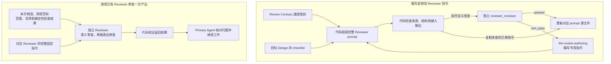

# 审核合同（Review Contract）

Review Contract 让独立 Reviewer 围绕用户要求的结果和职责边界判断问题。它规定共同的审核纪律、
完整 prompt 的组成、文稿与指令审核的共同结果，以及 Reviewer prompt 自身的审查要求。具体产物该审什么，由该产物的 Design 定义。

## 0. Intent Capsule

```yaml
layer: T0
```

本 T0 的输入是 Reviewer 的任务、所属 Design、专用 checklist 与待编写的 prompt；输出是可直接用于
独立执行的完整指令及其审查要求。它也向所有 Reviewer 提供同一份通用规则。
Runtime 负责执行，产物负责人决定如何使用审核结果。

## 1. Primary System Flow



两条路径分别说明 Reviewer 指令的写作与审查，以及一次审核中各方的职责。指令通过审查或源文件更新，
不证明已经投入运行；注册与部署由所属系统负责。
审核未通过时，具体问题返回该候选负责人修订；缺少必要依据时说明缺什么。Review Contract 不为这些
沟通结果另建运行接口或 error code，也不创建统一的审核结果数据库。

## 2. User Intent

让审核可靠地发现产出缺陷和职责越界，同时避免 Reviewer 为形式完整增加新需求。
Primary Agent 能据此改善本次产出，判断哪些问题现在必须改、哪些属于建议或后续工作，保持已确定的
目标与取舍，不因每轮审核而被要求补齐整个相关系统。

## 3. Reader Gain

- Primary Agent 能区分必须修复的问题、需要补充的信息和可选建议，并依据证据判断是否接受。
- 产物负责人能提供一次检查完整的专用标准，且继续拥有该产物的含义。
- Reviewer 作者能写出无需历史聊天即可运行的完整 prompt，明确输入、结果、证据和边界。
- Runtime 维护者能区分固定指令、本次材料和所需结果，而无需推断审核任务。

## 4. Owned System Object

Review Contract 拥有独立审核的共同规则和 Reviewer prompt 的写作要求，包括 `reviewer_reviewer`
对 prompt 本身的检查标准，以及第 6.4 节的共同结果结构。它不拥有其他产物的 checklist、业务决定或发布权。

## 5. Authority

Review Contract 统一规定：代码先完成适用的确定性检查；独立 Reviewer 判断语义，再检查表达保真；
finding 必须有证据且属于本次授权范围；固定指令必须完整且来源清楚。

本 T0 固定 `passed`、`non_pass`、`blocked` 和问题标签 `block`、`fix`、`note` 的共同含义。
每类产物的 Design 决定其审核目标、专用 checklist，以及哪些具体要求算满足或违反，不能重定义这些标签。
对应 Skill Package 保存 prompt、schema 与 fixtures。Primary Agent 组织工作，Runtime 以独立身份
执行 Reviewer。执行配置与实现过程由 Agent Runtime 定义，本 T0 不指定其内部入口或校验阶段。
这些职责区别不自动要求多份审批记录或生命周期。

## 6. Reviewer 指令

### 6.1 通用规则

<!-- universal-review-style:start -->
- 以本次用户授权目标、适用上游规则及已确定的计划为依据。已有计划时，使用当前步骤、完成条件、相关排除项与后续边界；所属方法无需正式计划时，使用明确授权请求，不追加计划或 Registry 前置。候选自行增加的承诺不自动成为必须补全的要求。
- 只审明确提供的候选及本次修改范围。可读取完整候选与必要背景；读取范围不等于修改范围，背景不因载入而成为新的修改目标。
- 先按目标 checklist 完成语义判断，语义通过后再检查同一份内容的表达。完整检查指在当前对象、层级和交付阶段内检查完整，不是补齐整个相关系统。只返回约定的结果对象。
- 每项必修问题说明实际适用的要求、候选证据、不修会使本步哪项结果失败或造成什么实际回归，以及为什么必须现在处理。合理留给下一层或后续步骤且不影响当前结果的选择，不是当前缺陷。
- 不为形式完整要求新增未被授权目标或适用规则需要的 object、field、workflow、state、lifecycle、policy 或 mechanism。宽泛的完整性、未来收益或最佳实践偏好本身不足以支持 fix 或 block；真正影响当前结果的多余机制仍可报告。
- 审计划时判断方案能否达到授权目标；审其下游产出时保持已确定的范围与取舍。真实依赖缺失、适用规则冲突、新证据或原处理失败，可以证明原决定需要重新判断。说明受影响结果与负责方；提出问题或挑战排除项不授予扩展工作的权限。本次修改造成的实际回归不因计划未逐字列出而获得豁免。
- 同一根因只报告一次，可以关联多个检查项。一次返回当前可判断的全部问题，不设置 finding 数量目标。
- 按下表区分具体缺陷、阻断判断的缺口和可选建议；不能用措辞强弱、个人偏好或凑数决定标签。
- 说明必须恢复的结果，不替作者指定唯一修法。其他负责人的问题说明影响并交回真实负责人，不能借本次审核扩大修改范围。
- 表达检查保持事实、数值、归因、职责、因果、不确定性、兼容性和停止条件；不能用润色改变设计或判断。审查修订后的候选时，结合受影响的完整段落、章节或接口说明，判断修改是否放在承载该职责或含义的位置，是否与上下文的术语、结构、逻辑及交接一致；检查局部修改造成的突兀插入、重复、前后矛盾或引用错位。
- 对文档、Skill、Reviewer prompt、代码注释和 docstring，按各自用途检查长期使用的正文是否混入本次讨论、修复或测试的过程信息；工作记录和变更日志可以保留相应过程。发现表达问题时，指出准确位置、上下文关系及对读者理解或操作的影响，交由作者修订。检查完整上下文不扩大本次修改范围；必修缺陷与可选润色仍按下表区分。
- 多轮审核沿用同一授权目标和完成标准。历史 finding 在当前候选上重新核对，不继承旧 verdict；允许提出此前漏掉的真实缺陷。重新打开已处理或已裁决问题时，说明新的证据、候选变化或原处理为何未解决问题。
- 审核不编辑候选，不增加用户授权。Primary Agent 先核对意见的依据、范围和实际后果，再修订成立的必修问题；note 默认不进入本轮实施。争议通过证据与范围理由交回独立 Reviewer 重判，作者不能自行把未通过结论改成通过。

审查的整体结论与单条问题标签分开使用：

| 整体结论 | 成立条件 |
| --- | --- |
| `passed` | 规定检查已经完成，产出达到本次授权目标，且没有 `block` 或 `fix`。可以包含 `note`。 |
| `non_pass` | 已有足够依据判断产出，但存在至少一项 `fix`，且没有阻断判断的 `block`。修订后重新审查。 |
| `blocked` | 至少一项必要判断因 `block` 无法成立。返回所缺依据或决定及其提供方；已经发现的 `fix` 仍可同时报告。 |

| 问题标签 | 使用条件 | 必须说明什么 |
| --- | --- | --- |
| `fix` | 有证据表明当前产出违反授权目标或实际适用的规则，影响本步完成条件或造成实际回归，且作者能在本次范围内修正 | 具体证据、实际适用的要求、当前后果、为什么必须本步处理及需要恢复的结果 |
| `block` | 缺少必要依据、存在无法自行裁决的规则冲突，或需要其他负责人先作决定，使当前必要判断无法成立 | 哪项当前判断无法完成、缺什么或冲突在哪里、为什么不能合理留给后续、为什么不能在当前范围内解决、谁能提供依据或决定 |
| `note` | 当前要求已经满足，意见只是可选改进；不采用也不会损害本次结果 | 可选改进带来的收益，并明确它不构成通过条件 |

已能确认的严重缺陷仍按 `fix` 处理；修复前不能通过。`block` 表示判断所需的前提不成立，不是
“更严重的 fix”。Reviewer 不能只因自己犹豫就写 `block`，也不能把必须修复的问题降为 `note`。
一句话不够顺但意思清楚，可以是 `note`；如果歧义会导致读者作出错误动作，则是有证据的 `fix`。
只是更喜欢另一种写法、额外机制或未授权功能，不能形成必须解决的问题。

代码校验结论与标签、检查覆盖和候选绑定是否一致；是否真正违反要求仍由 Reviewer 给出证据。
调用超时、认证失败或输出格式无效是执行或校验失败，没有有效 Reviewer verdict，不能伪装成
`passed`、`non_pass` 或 `blocked`。
<!-- universal-review-style:end -->

以上是唯一通用指令来源。代码把它原文注入最终 prompt 并验证一致性；每个 consumer 不维护改写版本。
机械检查能证明来源和内容一致，不能证明 Reviewer 的判断正确。

### 6.2 完整 prompt 布局

沿用以下五个编号章节，使执行者能直接找到任务、输入输出和边界。编号用于定位，不代表五次审核。

| 章节 | 来源 | 内容 |
| --- | --- | --- |
| `0. review_contract_universal` | 本 T0 §6.1，代码注入 | 共同审核规则 |
| `1. Review Task` | 目标 Design 与专用编写 | 目的、受审对象和读者需要得到的判断 |
| `2. Inputs, Decision, and Output` | 目标 Design 与专用编写 | 必要输入、可用背景、如何判断与返回什么 |
| `3. Boundaries and Failure Routing` | 目标 Design 与专用编写 | 修改范围、禁止越界的行为、信息不足时交给谁 |
| `4. Subject Review Checklist` | 目标 Design，代码注入 | 该类产物需要完整检查的结果 |

`the-review-authoring` 编写第 1 至 3 节。程序按来源组成第 0 和第 4 节；最终 prompt 连同本次任务输入
必须足以执行，不能要求 Reviewer 从聊天历史或未声明的仓库内容补齐任务。

本次候选、授权目标、允许使用的背景和历史问题属于本次任务材料，与固定指令分开。材料必须足以支持
本次判断，并明确候选、背景和允许范围；临时材料不写进固定指令。材料交付与执行配置由 Agent Runtime 定义。

### 6.3 Reviewer prompt 的审查

首次编写或实际改变 prompt 判断含义时，使用独立 `reviewer_reviewer`。只投影未改变的已审指令时，
运行来源与内容一致性检查即可。Containing Skill 的 Task、方法或交接改变时再审该 Skill；仅因物理
放在同一目录，不重复审核未变的 Skill 或其他 prompt。

<!-- reviewer-prompt-review-checklist:start -->
1. Prompt 清楚说明任务、读者需要的判断、受审对象、必要输入、输出和完成条件。
2. 专用指令保留目标 Design 的判断标准，并与注入的通用规则和 checklist 一致。
3. 模型只承担语义和表达判断，schema、hash、引用和投影等确定性检查交给代码。
4. Prompt 按授权结果、当前层级与计划步骤解释 checklist，要求必修意见说明当前必要性；不把形式完整、未授权机制或合理下层选择变成强制缺陷，也不豁免实际回归。
5. 冷启动 Reviewer 只读完整 prompt 和声明的输入即可工作，能区分候选与背景、缺陷与建议，知道信息不足和计划需要重新判断时交给谁，并保持多轮审核依据稳定。
6. 前五项通过后，检查表达清楚且保持任务、职责、证据要求、输出含义和停止条件。
<!-- reviewer-prompt-review-checklist:end -->

输入包括完整 prompt candidate、目标 Design、本次修改目标、实际 input/output schema 和注入来源。
这些背景只服务 prompt 判断。输出逐项覆盖本节检查，返回 `passed`、`non_pass` 或 `blocked`：分别
表示符合要求、存在可修订缺陷、缺少必要依据无法判断，具体使用 §6.1 的共同定义。语义检查未通过时，表达检查标记未执行。
代码验证输出结构、覆盖与受审内容绑定；审核结果不替代 Skill review、Runtime registration 或部署授权。

### 6.4 文稿与指令审核的共同结果

Design、Skill、SystemChangePlan 和 Reviewer prompt 的审核使用同一份结果结构。专用 checklist 决定
检查内容，不能因此重命名共同字段或另写一份判断正文。工程审核继续使用 Software Delivery 的工程
证据和输出合同，同时遵守第 6.1 节的共同结论含义。

| 字段 | 类型与必须表达的结果 |
| --- | --- |
| `verdict` | `passed`、`non_pass` 或 `blocked`，与全部检查和问题一致 |
| `check_results` | 检查项数组；每项包含 `check_id`、`disposition`、`assessment`、`finding_ids`，逐项说明判断与依据 |
| `findings` | 问题数组；每项有本次结果内唯一的 `finding_id`、问题标签、准确证据及其位置、相关要求、实际影响、处理负责人和需要恢复的结果 |
| `safe_next_step` | 说明依据本次结果能继续什么，或需要向谁补充什么；不增加用户授权 |

所需检查项由所属 Design 提供并由代码加载。共同表达审查使用 `prose_and_meaning_preservation`，
置于检查结果末项；专用 checklist 已包含它时不重复增加。其他判断直接写在相应 `assessment` 中，
不再通过专属 judgment 对象重复同一组说明。

当前必要性写在现有 finding 文本中：`requirement` 指明本次结果、计划条款或实际适用规则，
`impact` 说明不修对本步结果或实际回归的影响，`required_change` 说明本步需要恢复的结果及为何
不能合理留后。无需新增字段或结果类别；工程结果在其既有同义字段中表达这些依据。

检查项的 `disposition` 使用 `passed`、`finding`、`not_applicable`、`not_run`。
`not_applicable` 仅用于所属 Design 明确允许且本次满足条件的项目，说明不适用依据；
`not_run` 表示必要判断未完成，不能据此通过。语义未通过时，表达项标记 `not_run`，
仍返回本次已能判断的全部语义问题。

同一问题可以被多个检查项引用。`note` 可以关联已通过项目，不使项目变成失败；
`finding` 必须关联至少一项 `fix` 或 `block`。每项必修问题都能回到相关检查，引用不得悬空。
代码核对检查覆盖、已声明的适用条件、问题引用、整体结论，以及证据位置是否属于本次允许的候选或背景；
Reviewer 判断适用理由与证据是否真正成立。问题影响的候选和需要其他负责人处理的背景必须可区分，
不能借背景引用扩大本次修改范围。

共同输出格式及其机械校验由 Agent Runtime 提供，各 Skill Package 复用该格式，不另建一套共同
schema 或校验框架。所属产物的代码保留检查覆盖、适用条件、候选范围与结论一致性检查，专业判断
仍由所属产物负责。有效结果须满足完整输出约定，保持共同含义，并可核验其与本次受审内容、固定指令
和实际执行的对应关系；这些关联事实由代码提供，不由模型生成。历史结果仍表示原执行时的判断，
不改写成新格式的通过记录。

## 7. 审查与完成

DDM 固定本章的结构。本章定义共同含义；各产物负责人写入自己需要的检查和完成条件。
第 6.4 节适用的审核使用共同结果 schema，专用要求由各自 checklist 和适用条件表达。

### 7.1 确定性检查

代码检查实际受审内容、引用、schema 和指令组合的一致性，以及结果与受审内容的对应关系。
作为审核前提的检查失败时，报告具体原因，修复后再审；返回结果的检查失败时，不得将该输出作为
有效审核结论。执行环境的检查由 Agent Runtime 负责。程序不负责证明未知影响面完整、证据真实或设计合理。

### 7.2 语义审查

独立 Reviewer 使用产物所属 Design 的 checklist，判断结果能否实现用户授权目标、是否保持职责边界。
对一个现有对象的修改，不因背景存在其他问题就扩大本次范围；背景确实使当前结果无法成立时，说明
具体依赖及后果，由 Primary Agent 回到相应负责人处理。

### 7.3 表达审查

语义成立后，对同一候选判断目标读者能否准确理解。表达检查由同一个 Reviewer 完成，保持事实和
原有含义。语法或组织建议应与影响结果的歧义区分，不能把偏好升级为阻塞。

### 7.4 完成条件

Reviewer 使用本次明确候选、返回完整判断，并通过所属产物的输出验证，便形成可供使用的独立结果。
Primary Agent 核对问题的证据与实际影响，修正已接受的缺陷；涉及未授权取舍时返回用户或负责人。
可选建议和经核对不成立的意见不产生修订义务。对仍有争议的必修意见，保留原审核结果、说明证据与
范围理由并请求按同一依据重新判断；取得纠正后的有效独立结论前，不由作者自行宣布通过。
建议只有另行纳入授权范围后才成为工作，发现真实依赖也不自动授权改动其所属系统。
源内容改变后应按改变的语义重新审查，纯机械复制同一内容不产生第二轮语义审核。

## 8. System-wide Invariants

1. 审核围绕授权目标和适用规则，候选自行扩大的范围不能约束用户。
2. 专用 checklist 属于产物 Design，通用指令属于 Review Contract，Runtime 负责独立执行。
3. 代码检查事实与一致性，Reviewer 判断意义；两者都不凭流程完成声称结果正确。
4. Candidate、背景和固定指令明确区分，Reviewer 的读取与工具范围由 Runtime 落实。
5. 所有必修 finding 都有具体证据、当前后果和本步处理的必要性；同一问题不重复记账。
6. 审查结论、自检和用户授权可区分；Primary Agent 可以组织完整工作，但不代替独立判断。
7. 共同指令和专用 checklist 同源注入；实际改变哪个对象，就验证和审查那个对象。
8. 整体结论与问题标签遵守 §6.1；`note` 不能成为通过条件，`fix` 修复前不能通过，`block` 必须说明无法判断的原因和所需前提。

## 9. Peer Boundaries

| 交接方 | Review Contract 负责 | 对方负责 |
| --- | --- | --- |
| 产物所属 Design | 共同审核纪律、结论与问题标签、prompt 布局及第 6.4 节的结果结构 | 产物目标、专用 checklist、输入及适用条件，以及具体要求的满足或违反 |
| Design Doc Management | 通用审查含义 | Design 表达规则和独立 Design review |
| Skill Management | Reviewer prompt 的写作与独立审查要求 | Skill 的完整性、发现和使用方法；仅在 Skill 本身改变时审查 |
| System Change Governance | 计划 Reviewer 使用的通用规则 | 必要计划的范围、顺序与专用审查 |
| Software Delivery | 工程 Reviewer 使用的通用规则 | 实现、测试和交付要求 |
| Agent Runtime | 可独立执行的固定指令要求与共同结果含义 | 共同格式的机械实现、独立执行、资源边界与可核验的执行证据；具体过程由 Runtime 自身合同定义 |

## 10. References

- [Design Doc Management](the_design_doc_management.md)
- [Skill Management](the_skill_management.md)
- [System Change Governance](the_system_change_governance.md)
- [Software Delivery](the_software_delivery.md)
- [Agent Runtime](the_agent_runtime.md)
