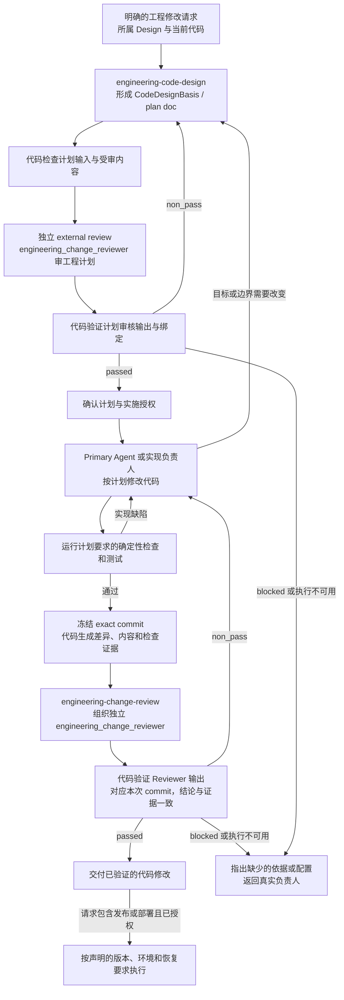

# 软件交付（Software Delivery）

Software Delivery 规定怎样把已明确的目标变成可靠的代码修改：先写工程计划并完成独立外审，再实施；
代码完成后再验证和独立审核。发布、部署和数据迁移需要各自的明确范围与授权；一次测试或审核通过
不自动允许这些操作。

## 0. Intent Capsule

```yaml
layer: T0
```

输入是授权目标、所属设计依据和当前代码。输出是按工程计划实现、经过验证和独立审核的修改；
请求还包含发布或部署时，再交付对应的实际结果。Git、构建工具和执行系统记录版本与事实，不要求
每个项目另外建设一套软件生命周期、Registry 或审批记录。

## 1. Primary System Flow



有现成、仍有效且已有对应独立外审结果的工程计划时可以复用。检查发现实现缺陷时按原计划修复；
需要改变目标、接口、职责、关键依赖或验证方案时，先修订计划并重新外审，再取得所需决定。
不能在代码已改完后倒推一份计划，声称它是实施前的依据。

`engineering-code-design` 负责写工程计划，`engineering-change-review` 负责组织计划和实现的独立审核。
两者属于本 T0。`engineering_change_reviewer` 分别判断工程计划和实际修改，结果必须绑定本次真实
受审对象；作者处理意见，不能用自检替代独立结果。

文档中的箭头表示职责与必要依赖，不要求把每个工作步骤定义成软件接口、error code 或独立记录。

## 2. User Intent

让人和 Agent 在改代码前对改什么、为什么改、怎么改、怎样证明完成有同一理解。实现应进入现有的
正确位置，必要的新设计有明确依据；交付应由可重复的验证和独立判断支持，而不是靠完成一串状态转换。

## 3. Reader Gain

- Primary Agent 能先取得通过独立外审的工程计划，再在授权范围内实现，不从失败测试或相邻代码猜目标。
- Engineering Lead 能确认方案是否保持原有设计、职责和接口，并知道本次哪些结果必须完成。
- Service Owner 能看到实际改了什么、测试证明了什么，以及仍未完成哪些明确的后续工作。
- Release Engineer 能区分代码审核通过与发布、部署许可，找到本次环境变更和恢复要求。
- Independent Engineering Reviewer 能分别判断计划能否实施、代码是否符合已审计划，不要求计划阶段提供未来实现。

## 4. Owned System Object

Software Delivery 拥有软件修改的工程要求及交付条件。`CodeDesignBasis` 是实现前的工程修改计划；
它提供理解和判断代码所需的依据，不是一个额外的生命周期对象。

产品和领域设计决定软件应该实现什么，代码及测试证明实际实现。本 T0 负责连接两者，不取得产品取舍、
数据库权限、Runtime 执行或领域产物接受标准的决定权。

## 5. Authority

本 T0 定义工程计划必须回答的问题、实现与验证的边界、`engineering_change_reviewer` 的判断标准，
以及发布部署需要哪些工程证据。各领域继续拥有自己的目标、接口含义和业务验收标准。

用户或其明确委派的负责人决定目标及允许的影响面。Primary Agent 在已有授权内组织方案、实现、验证
与修订；需要新的产品或架构取舍、外部写入或扩大环境影响时，先取得对应授权。

## 6. 先计划，再改代码

### 6.1 CodeDesignBasis / plan doc

进入交付结果的代码、schema、migration 和测试修改，在实施前必须有 `CodeDesignBasis`。
它就是本次工程修改计划，可以用一份 Markdown plan doc 或现有工作文档中的明确章节承载，不要求
另写一份重复 Plan，也不要求计划 Registry、状态、request ID 或审批 ID。
计划明确本批必须交付的结果、完成条件、相关排除项和后续边界，并在实现审核时一并提供。
完整性按该批结果及实际依赖判断，不以未来整合收益把后续工作提前变成前置。

计划完成作者自检与适用代码检查后，必须先接受独立 external review；修订到通过后，再确认实施授权。
已有明确授权已经覆盖通过外审的计划时，按既有授权推进，不重复申请。旧计划只有在内容未变、原外审
仍适用，且目标、范围、接口、依赖及验证要求仍覆盖本次修改时才可复用，并说明复用依据。
用户确认和独立外审是不同要求，不能相互替代；代码完成后的审核也不能替代实施前的计划外审。

计划让实现者和 Reviewer 能回答：

1. 要取得什么结果、为什么要改，依据哪个已明确的 Design 或用户决定。
2. 修改哪些代码、schema、测试或其他交付文件；什么不在本次范围内；由谁负责。
3. 怎样进入现有实现，主要调用或数据路径是什么，实际接口的输入、输出和影响如何变化。
4. 有哪些必要依赖、兼容性、数据或外部副作用；实际涉及的失败如何处理。
5. 按什么顺序实现，用哪些可重复的检查证明本次结果；涉及上线或持久数据时怎样恢复。

篇幅与问题相称。小修改可以是一段短计划和一个小流程图；不会因模板要求而引入数据库、状态机、
并行方案、未来能力清单或多层 Slice。调查当前代码、隔离实验和诊断不等于交付实现；实验结果要采用时
仍须进入明确计划及验证范围。

### 6.2 与 Design 和 System Change 的交接

工程计划说明如何实现已明确的设计。发现缺少产品目标、职责边界或关键接口决定时，返回所属 Design
负责人，使用 DDM 的写作和审核方法补齐；代码当前能运行，不代表它已经取得设计授权。

需要拆分跨职责工作、确定上游到下游依赖时使用 System Change。其工程步骤可以直接引用本工程计划；
单独的一次工程修改仍须先有 CodeDesignBasis，但不必另有机器化的 SystemChangePlan。
两份材料各自说明必要内容，不重复描述同一方案。

## 7. 实现与验证

### 7.1 进入现有设计

新增行为先放到已有的正确负责人和代码路径。只有职责确实独立、不能合理并入时才引入新抽象；
不能为了少改原代码而增加平行 wrapper、adapter、Registry 或隐藏入口。

最终代码、测试、注释和文档描述当前方案。被否定方案的讨论留在必要的设计记录中，不成为命名或注释
负担。确需兼容旧行为时说明真实的消费者和处理范围；删除旧路径前验证其引用及使用方。

逻辑职责与物理文件可以分别说明，不要求每个职责注册一个 Module，也不要求每个文件对应一个 Slice。
需要分批交付时，每批有可独立验证的结果，明确依赖已完成部分；未来整合不能成为本批额外的通过条件。

### 7.2 Flowmap、接口与失败

工程计划先展示最小有用的流程图，再说明发生变化的接口输入、输出和可观察影响。复杂关系先分清
职责、数据流与实际实现位置；图不要求为每条边新注册一个 interface ID。

程序需要根据不同失败采取动作时，沿用或定义该接口的稳定错误合同。已有 error code、结构化错误或
明确的异常合同可以按实际接口使用；不因画了失败分支就新增错误码。拥有接口的一方定义含义，调用方
引用它，日志只作为诊断，不能代替必要的失败判断。

<!-- engineering-authority-input-guard:start -->
Code Design 或 implementation 只有在实际触及对应 machine-facing meaning 时才增加下列 authority input：
新增或修改 time-bearing field、clock、calendar、freshness 或 time comparison 时，先读取
`designDoc/the_timestamp_semantic.md`；新增或修改 schema 或 machine boundary 中的 Identifier、Reference、
version、content hash、pointer 或 locator 时，先读取
`designDoc/the_identifier_and_reference_semantics.md`。只是在局部变量、普通 prose、路径或未改变的既有
字段中出现 date、ID、ref 等词，不构成适用条件。未触及这些语义时不加载对应 T0，也不增加字段、占位
章节或空引用；触及时只绑定适用规则，不复制 peer contract，也不由 Code Design 或 Reviewer 重新定义。
<!-- engineering-authority-input-guard:end -->

### 7.3 测试证明本次结果

计划按实际风险选择检查，包括接口行为、负例、兼容性、依赖、数据迁移、权限、恢复和生成内容一致性。
适用检查用现成代码运行并记录命令、环境、范围和实际结果；不要求先注册一套通用 risk policy 才能测试。

测试应能发现它声称覆盖的缺陷。哈希绑定要解析并比较真实内容，边界检查同时证明允许和拒绝的情况，
恢复检查要证明实际可恢复。仅检查字段存在或调用成功，不足以证明更强的结论。

单元测试可以使用固定数据和 in-memory 实现。只有本次结果涉及数据库、网络、模型或跨包集成时，
才要求验证对应真实接口；不能为显得完整而引入未涉及的基础设施。局部测试通过不等于全仓通过，
已有失败与本次新增失败分开核对，不用未复现的“基线问题”免除缺陷。

## 8. 发布、部署与恢复

代码交付与部署是两个结果。发布时确定源 commit、构建产物和适用兼容要求；部署时确定版本、目标
环境、允许的影响和观察方式。实际涉及数据库或不可逆副作用时，先确认迁移顺序、数据保全和恢复办法。

已有构建工具、CI、包管理和部署系统可以提供这些记录，不要求为每种操作新建一类 Registry 或状态机。
Canary、分批切换和回滚演练按实际风险使用，不是所有修改的统一步骤。

移除软件或停止服务前检查仍在使用的入口、消费者、运行中任务和数据义务；需要跨职责处理时先规划。
变更历史和已发布版本按实际恢复、审计或兼容需要保留，不能把“停止使用”解释为随意销毁必要数据。

## 9. 审查与完成

### 9.1 确定性检查

审工程计划时，代码固定计划正文、授权目标和必要的 Design/code context。此时不要求尚未产生的实现
commit 或未来测试结果。审实现时，代码从有唯一 parent 的 exact commit 生成准确的 changed paths、
内容、diff 与 subject hash，绑定已经外审的工程计划、必要背景、检查命令和实际测试证据。
没有第二份手工 ChangeSetManifest；另有 SystemChangePlan 时提供相关步骤，没有时不伪造。

确定性校验负责真实引用、schema、hash、投影、允许的工具范围及结果绑定。未声明的补充文件仍须
先进入准确的审核材料，不能把整个脏工作树交给 Reviewer 自由读取。Reviewer 消费检查结果，不重新
用文字计算 hash 或证明 schema 合法。

### 9.2 语义审查

工程计划必须先由独立 `engineering_change_reviewer` 判断其目标、方案、边界和验证安排是否足以实施。
代码完成后，有实际行为、接口、依赖、安全或数据影响的修改再由该 Reviewer 判断实现。
纯格式修复或未改含义的机械重生成，在实现完成后运行适用代码检查和保真自检即可；本次明确要求
独立实现审核时仍须完成。这只说明实施后是否再审代码，不豁免第 6.1 节的工程计划和实施前外审。
格式化或生成动作已被有效的已审工程计划覆盖时复用该计划，不为同一动作重复建立计划。
固定 prompt、schema、fixtures 存放在 `engineering-change-review` Skill Package；通用指令来自
Review Contract，下面的 checklist 由本 T0 拥有并由代码机械注入。

<!-- engineering-change-review-checklist:start -->
`engineering_change_reviewer` 在一次审核中完整判断以下结果：

1. 使用代码已校验的真实受审对象和证据：计划审核针对完整 CodeDesignBasis，实施审核针对 exact commit 及其已外审计划；目标和范围明确，背景未变成额外 subject；另有 SystemChangePlan 时核对相关步骤、完成条件、排除项和后续边界，不把其缺失当作统一前置失败；
2. 实现依据足以说明预期结果与职责边界；缺少应由上游决定的 Design meaning 时返回对应负责人，不从代码反推新需求，也不重新审查未改变的有效设计；真实依赖缺失、规则冲突、新证据或原处理失败使既定方案不能成立时，说明影响并交原负责人重新判断，不自行扩展范围；涉及时间或机器引用含义时使用对应 T0 的适用规则；
3. 计划的方案、范围、依赖、顺序和本次结果完整一致；审实现时再确认代码实现了这些要求。分批交付不把明确留给后续且不影响本批的结果变成当前要求，也不接受未授权副作用；本次修改造成的实际回归即使计划未逐字列出，仍属于需报告的缺陷；
4. 计划说明需要变化的输入、输出、影响和失败处理；审实现时确认实际代码与计划及所属接口一致。已有错误合同被正确消费，不为无需要的路径要求新编号或机制；
5. 计划清楚区分最终方案与必要的取舍讨论；审实现时确认代码、测试和交付文档不保留只为解释已否定方案而留下的命名、包装或兼容路径，真实兼容义务仍得到保留；
6. 计划把新行为安排到正确的既有负责人和代码位置，必要的新抽象有职责依据；审实现时确认它未增加未声明的平行实现或隐藏依赖；
7. 计划的测试与验证安排足以证明声明结果，覆盖适用的行为、负例、兼容与恢复，不要求先运行尚未实现的代码。审实现时核对实际测试证据，区分本次缺陷、既有问题和环境缺口，不把局部通过说成整体通过，也不豁免真实失败；
8. 语义判断成立后检查本次修改中供人阅读的文档、注释、错误信息与发布说明，保持事实、职责、因果、不确定性和停止条件；不把代码风格偏好当作表达缺陷；
9. 整体结论、检查结果、findings 和下一步相符；每个必须修改的问题有具体证据、适用要求、当前后果及本批处理的必要性，可选建议和未来收益不成为通过条件。
<!-- engineering-change-review-checklist:end -->

实现审核需要读取准确代码和复现必要测试；计划审核按判断方案所需读取现有代码与设计，不要求未来
实现已经存在。执行环境应提供现成、受限的读取与命令工具，允许的草稿
和补充测试留在隔离目录；不得修改被审代码或访问未授权资源。没有工具的文字审核不能代替这些验证。
同一个 `engineering_change_reviewer` 默认配置可使用读文件、搜索和执行授权测试的工具，按任务需要
调用；不因审计划或审实现拆分 Reviewer，也不要求每次调用全部工具。
优先使用已配置的 Runtime Reviewer；采用明确授权的等价独立外审入口时，仍使用同一固定指令、
受审内容、工具边界和输出校验，并如实标明执行方式。

### 9.3 表达审查

同一个 Reviewer 在语义判断后完成表达检查。改写建议不能改变设计、数字、接口行为或授权范围。
Primary Agent 逐条核对证据、范围和当前后果，修正成立的实际缺陷；note 默认不实施。意见错误或越界
时说明依据并交回独立 Reviewer 重判，不能由作者自行改写 non_pass。多轮使用同一授权目标与完成标准；
重新打开已处理问题需说明新证据、候选变化或原处理失败，仍允许发现此前遗漏的真实缺陷。

### 9.4 完成条件

工程计划通过绑定当前计划正文的独立外审，并取得实施授权后，才能开始交付代码修改。实际代码实现
该计划、所需检查通过，且适用的独立实现审核绑定当前 commit 后，才可交付代码结果。
修改候选后重新验证并审查，不能用旧计划或旧 commit 的通过结论覆盖新内容，也不能互换计划与实现
审核结果。发布或部署还要满足第 8 节的要求。

工程审核使用 Runtime `ModuleReviewer` 的共同结果格式，Software Delivery 保留专业检查和结果接受标准：

| 字段 | 工程审核必须表达的结果 |
| --- | --- |
| `verdict` | passed 表示当前对象满足要求；non_pass 表示有需要修复的缺陷；blocked 表示缺少必要判断条件 |
| `check_results` | 覆盖第 9.2 节已有九项检查，说明判断与依据；第 8 项承担表达审查，不重复增加表达项目 |
| `findings` | 指明准确证据、被违反的要求、实际影响、处理负责人和必须恢复的结果 |
| `safe_next_step` | 说明本次结果允许继续什么，不增加实施、注册或部署授权 |

准确计划或 commit、执行身份及真实命令结果由代码绑定，不由模型重复生成。工程消费者核对 Runtime
工具证据中的实际命令、结果与本次调用是否一致，再接受 Reviewer 结论。必需测试失败不能通过；
必需验证条件不可用时说明缺口并返回 blocked。未执行、未知命令或伪造证据不能当作完成；可选探针
未运行不增加通过条件。命令非零退出的原因按实际证据区分，不能自动把环境故障归为代码缺陷。
历史结果保留其原格式和原含义，不改写成新格式的通过记录。

`fix` 是已有证据的缺陷，严重缺陷也属于 fix；`block` 是无法完成必要判断的缺口；`note` 是不影响
当前要求的建议。真实代码导致的测试失败属于缺陷；测试无法运行而原因尚不能归于代码时说明条件
缺口。执行超时、认证或输出格式失败不是 Reviewer verdict，不伪装成上述结论。

## 10. System-wide Invariants

1. 交付代码修改先有 CodeDesignBasis/plan doc，完成独立外审并确认实施授权后再实施；代码结果不能倒推实施前依据。
2. 产品与领域设计决定目标；工程计划说明实现方案；代码和测试证明实际结果。
3. 方案进入正确的既有职责和代码位置，新增抽象必须有实际需要。
4. 只要求实际适用的接口、失败、兼容和恢复说明，不为了模板完整增加机制。
5. 确定性事实由代码验证，语义与边界由独立 Reviewer 判断；两者不能互相替代。
6. 计划审核绑定准确计划正文，实施审核绑定 exact commit；两种结果不能互相替代，背景和后续修改不能冒充已审内容。
7. 未解决的真实缺陷不能通过；可选建议不增加范围或新的通过要求。
8. 交付、发布和部署的结果与授权分开，相关记录由实际工具提供。

## 11. Peer Boundaries

| 对方 | Software Delivery 使用的内容 | 对方保留的职责 |
| --- | --- | --- |
| Project Charter 与所属 Design owner | 产品范围、授权和已明确设计 | 产品取舍、人类决策权及领域结果 |
| Task Routing 与 System Change | 工作入口，需要时的跨职责计划 | 意图导航、范围拆分与依赖顺序 |
| Design Doc Management | 文档结构、层级和独立 Design review | Design 写作与审核规则；不判断代码已经正确实现 |
| Skill Management | Engineering Skill 的结构、可发现性和 Skill review | 完整 Skill artifact 的要求，不拥有工程语义 |
| Review Contract | 通用审核规则、prompt 布局与 prompt review | 共用纪律，不拥有 Engineering checklist 或实现判断 |
| Agent Runtime | 独立 Reviewer 的执行、工具权限和证据 | Module、Profile 与执行机制，不决定代码交付结果 |
| Data Governance 与 Product Authorization | 实际数据变更及受保护操作要求 | 数据归属、访问权限和写入规则 |

## 12. References

- [Design Doc Management](the_design_doc_management.md)
- [Task Routing](the_task_routing.md)
- [System Change Governance](the_system_change_governance.md)
- [Skill Management](the_skill_management.md)
- [Review Contract](the_review_contract.md)
- [Agent Runtime](the_agent_runtime.md)
- [Data Governance](the_data_governance.md)
- [Product Authorization](the_product_authorization.md)
- [Timestamp and Clock Semantics](the_timestamp_semantic.md)
- [Identifier and Reference Semantics](the_identifier_and_reference_semantics.md)
