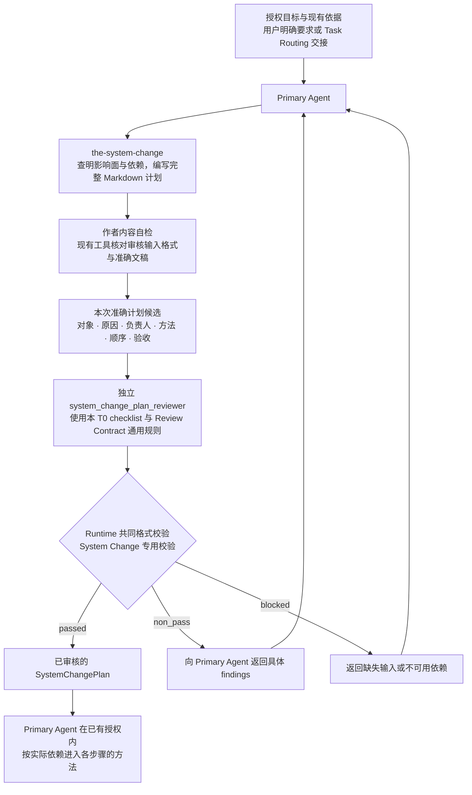

# 系统变更治理（System Change Governance）

本 T0 把授权修改目标和现有依据变成完整、顺序正确、可执行的统一变更计划。计划使用普通
Markdown，名称沿用 `SystemChangePlan`；它是本方法的产出，不是需要预先注册的机器对象。
本 T0 不执行计划，也不接管下游 Design、Skill、Code、Runtime 或 Release 的编写、审核和生命周期。

用户明确要求统一规划，或未指定起点且修改需要跨层统筹范围、职责和依赖时进入本 T0。
用户指定从文档、Skill 或代码开始时，直接进入相应方法，不追加 SystemChangePlan 前置。
所属方法自己的输入、授权、检查与独立审核继续适用。

## 0. Intent Capsule

```yaml
layer: T0
t0_layer_id: the_system_change_governance
canonical_owner: designDoc/the_system_change_governance.md
owned_system_object: SystemChangePlan
scope:
  - 为一次受治理的系统变更完整盘点受影响面
  - 解析层级、负责人、编写路径、审核门和依赖顺序
  - 编写并独立审核一份完整 Markdown 变更计划；必要的范围变化形成完整修订稿
  - 对已授权的 Skill retirement 或整体删除请求定义完整 deletion disposition、受影响面、依赖顺序和 surface owner routing
non_goals:
  - 执行或监督下游工作
  - 拥有候选产物、审核、批准、准入、发布、部署或回滚状态
  - 拥有 SystemChangeCase、ScopeAssessment、WorkPackage、CandidateSet、ClosureRecord 或生命周期记录
  - 定义受影响 Charter、T0、T1、T2、Skill、Module、代码、结构定义、Runtime 或 Release 对象的含义
  - 选择模型提供方、模型、数据库、工作流引擎、仓库布局或用户界面
inputs:
  - 对一个或多个受治理面的授权修改请求
  - 现有文档、代码、索引、工具说明和其他与本次目标相关的依据
outputs:
  - 一份经过审核并交给 Primary Agent 的 SystemChangePlan
truth_surfaces:
  - designDoc/the_system_change_governance.md
runtime_triggers:
  - 明确要求统一规划，或未指定起点且需要跨层统筹的授权修改请求
downstream_consumers:
  - Primary Agent
  - SystemChangePlan 指定的每个编写负责人和审核负责人
open_decisions: []
review_gate: 本 T0 Design 由独立 design_contract_reviewer 审核；具体 SystemChangePlan 实例由 system_change_plan_reviewer 审核
runtime_surface_ledger: 本 T0 不要求计划 Registry、运行账本或执行进度
verification_hooks:
  - 受影响面闭包
  - 精确负责人和受审对象类型路由
  - 实际依赖完整、可满足且无循环，所属方法的必要检查和授权未被跳过
  - system_change_plan_reviewer checklist 覆盖和 output schema / semantic validator 结果
  - 实际送审文稿与审核输入、结果的对应关系
```

## 1. Primary System Flow



`the-system-change` 是 Primary Agent 使用的编写 Skill，不注册为 Runtime Module。作者从目标、
授权与现有依据查明实际影响，写出第 4 节规定的计划内容，再自检并组织独立审核。起草不要求另一份
计划、项目专用计划 Schema、构建器或 Registry。送审时固定本次完整文稿；这里的“冻结”表示审核
输入中的内容准确且不变，不要求给计划建立另一套 ID、版本、时间字段或存储服务。

本 T0 要求使用固定的 `system_change_plan_reviewer`，并只消费绑定精确冻结计划、通过 Runtime
共同格式校验和本 T0 专用校验的 Reviewer output。结果含义遵守 Review Contract；
`passed` 把精确冻结的计划交给 Primary Agent；
`non_pass` 携带可执行的 findings，由 Primary Agent 重新进入同一 Skill 修订完整计划；`blocked`
表示缺少审核所需输入或依赖不可用，由 Primary Agent 补齐后重新进入，而不是把它伪装成计划内容错误。

`system_change_plan_reviewer` 的目标特定判断标准由本 Design Intent 第 7 节完整定义；其
prompt、schema、fixtures 和 registration source 保存在 `the-system-change` Skill Package。
Review Contract 提供通用审核阶段、exact-subject boundary、共同结果结构和 universal instruction source；Skill
Management 管理 Skill definition、candidate 与 Skill review；Skill retirement 或整体删除由本 T0 形成
完整 disposition 与 owner routing；按 Review Contract registered binding
执行的代码把通用规则机械注入 Reviewer Module source；Agent Runtime 只执行已注册 Module。
本 T0 拥有 `system_change_plan_reviewer` 的目标特定 checklist、专用校验和计划交接完成条件；
共同输出结构使用 Review Contract §6.4，不定义 Skill 编译、Runtime 注册或执行过程。

计划准备和交接是这里的工作阶段，不要求项目预先实现同名软件接口。操作工具返回的格式错误、
执行失败和专业审核结论分开处理：

| 实际结果 | Primary Agent 下一步 |
| --- | --- |
| 作者自检发现范围、负责人、方法或依赖缺口 | 修订计划，真实产品决定交给有权决定的人；保留已形成的文稿 |
| 输入格式错误、Reviewer 不可用或执行失败 | 保存实际错误及文稿，交给对应接口或执行负责人；没有有效审核结论 |
| 输出格式、覆盖或候选对应关系校验失败 | 保留原输出并报告校验失败，不把它当成专业判断 |
| 有效 `non_pass` | 按具体 findings 修订完整候选，再独立审核 |
| 有效 `blocked` | 把当前必要判断缺少的依据或决定交给其提供方 |
| 有效 `passed` | 在既有授权范围内把准确计划交给 Primary Agent；各步骤保留自己的检查和审核 |

具体 CLI 参数和执行错误由实际工具说明，不在本 T0 另造一套计划服务或错误码。

## 2. User Intent

系统修改经常同时触及 Design、Skill、Code、Runtime 和 Release。System Change
Governance 先判断本次请求具体改变哪些层，再把每个受影响文件或受治理面拆进
对应层级的计划步骤。分类决定编写路径和候选产物类型；依赖关系决定执行顺序；受审对象
类型决定所需的审核类型。

Primary Agent 需要一份覆盖本次有限授权结果的完整计划，而不是从文件名、当前工作树、对话历史或
附近 Skill 猜测影响面、层级和顺序。完整性以该结果成立所需的修改和依赖为界，不是整理全部相关系统。
排除或留给后续的工作说明边界；只有它确实影响本次结果成立时，才需要重新判断该安排。

Design、Skill、Code、Runtime 和 Release 用于确定修改对象、负责人和方法，不是一组所有任务都要
依次完成的阶段。计划先明确每项工作真正需要哪些输入与决定，再按这些依赖安排可执行的顺序。
没有依赖关系的工作不必互相等待；计划可以按用户要求逐项执行，不因此默认获得并行操作权限。

实现所依据的目标、职责和接口含义必须先明确，所属方法要求的检查、独立审核与授权仍须满足。
例如根据已审 Design 准备一个工具的 schema 和 validator，不必先完成随后才会使用它的 Skill
或 prompt；实际调用该工具的工作则必须取得适用、已验证的接口。依赖来自具体要求，不能仅从
文件类型或类别名称推导。

复用的现有依据准确引用，不需要修改的对象不制造空候选。出现互相等待时，先区分必须明确的语义、
本步使用的接口材料和投入执行所需的实现，回到实际前置要求消除循环；不能用占位文件或未审核结果
冒充已满足的依赖。

## 3. Reader Gain

读完本 Design Intent 和一份符合它的 `SystemChangePlan` 后，Primary Agent 能直接判断：

- 哪些文件或受治理面要改，以及为什么要改；
- 每个修改属于 Design、Skill、Code、Runtime 还是 Release；
- 每项工作的真实前置是什么，哪些工作需要等待，以及按什么顺序处理；
- 每一步归哪个最终问责负责人；
- 使用哪个编写方法；
- 产出什么候选产物或确定性结果；以及
- 由哪一种独立审核或确定性审核门判断该步完成。

Primary Agent 无需重新扫描仓库、回读对话或推断相邻 Skill，就能从第一步开始执行。
Principal Manager 和 System Owner 能判断计划是否完整覆盖授权结果、真实 owner 和依赖顺序；
Independent Reviewer 能判断计划是否达到第 4、6 和 7 节定义的审查结果。

## 4. Owned System Object

System Change Governance 只拥有统一变更计划的内容要求、形成方法和审核完成条件。
`SystemChangePlan` 是该文稿的名称，不要求专用机器对象、固定章节名或逐字段序列化。

`system_change_plan_reviewer` 的目标特定 checklist、专用校验和完成语义，用于判断一份
`SystemChangePlan` 是否达到本 T0 要求。Reviewer output 使用共同格式，仍只判断本次 exact plan；
共享格式不转移计划、批准、Runtime 或发布权。

一份普通 Markdown 计划至少写清以下内容。括号内保留既有语义名称，方便读懂旧文档和审核接口，
不是要求作者填写的 JSON 字段：

1. 目标与授权（`requested_result`）：Primary Agent 最终必须交付的有限范围结果，以及已有依据；
2. 修改范围（`affected_surfaces`）：纳入或明确排除的文件与受治理面，以及各自的受审对象类型、
   层级、负责人和所需修改；
3. 执行步骤（`ordered_steps`）：每步的对象、唯一最终负责人、所需输入、编写或实施方法、产出、检查或审核与完成条件；说明实际依赖及其提供路径，并连同该步目标、排除项和后续边界交接；排列满足依赖，不使相邻步骤自动互为前置；
4. 排除项（`excluded_surfaces`）：容易被误纳入、但不属于本次结果的邻近面；
5. 验收：怎样判断整个授权结果成立，包括适用的检查、独立审核和真实操作验证；
6. 待决事项（`unresolved_decisions`）：使计划暂时无法执行的真实决定及有权决定的负责人，没有时明确说明。

这些内容可以用自然段或表格表达。作者与 Reviewer 判断范围、负责人和依赖是否正确，工具提供
实际文件、接口与校验事实。审核接口仍使用 `document_id`、`owner_ref`、`title`、`body` 包装文稿；
接口对请求的标识或内容校验不把计划变成必须预先构建、注册的对象。

Skill retirement 或整体删除不是一个缺少 authoring method 的通用 deletion step。`SystemChangePlan` 先把
它分解为 Design reference、Skill source、Runtime registration、host projection、routing/code 等受影响
surface；每个 surface step 使用其真实 owner 已登记的 authoring 或 implementation method、既有 output
type、review gate 与 completion condition。继续存在的 Skill definition 才进入 `the-skill-authoring`；实际
删除步骤不调用该 method，也不发明 deletion-specific method 或 candidate type。

范围是 `affected_surfaces` 的闭包；路由是 `ordered_steps` 的顺序。它们都是 `SystemChangePlan` 内部
内容，不是独立的逻辑记录。执行中有证据表明真实依赖缺失、负责人错误、适用规则冲突，或新证据、
原处理失败使计划无法实现目标时，Primary Agent 返回真实负责人重新判断，并在需要改变计划时冻结
一份完整的新 `SystemChangePlan`。可选收益或偏好不同不使计划失效；发现问题也不自动授权扩展工作。
本 T0 不维护前序关系、进度或状态转换。

## 5. Authority

本 T0 可以决定：

- 一个修改请求需要覆盖哪些受治理面；
- 每个受影响面属于 Design、Skill、Code、Runtime 或 Release 哪一层；
- 每个受影响面的层级、语义所有者和编写路径；
- 各项工作需要哪些前置结果，以及满足这些依赖的执行顺序；
- 每一步产出什么受审对象类型，并要求哪一种独立审核或确定性审核门；
- 哪些邻近面明确不属于本次结果。

本 T0 同时可以定义 `system_change_plan_reviewer` 对 `SystemChangePlan` 必须判断的目标特定 checklist、
专用校验和达到 handoff 所需的完成语义；共同结果结构与标签含义由 Review Contract 定义。这些决定只解释
什么样的独立判断足以支持 `SystemChangePlan` handoff；Reviewer 自己形成判断，Agent Runtime 执行
Module，Skill Management 管理 Skill artifact，Primary Agent 消费通过审核的计划。

受影响面的所有者决定对应内容应该写什么。结构、产品、Reviewer 独立判断、Design/Skill/Runtime
准入和发布决定分别留在各自的权责主体；本 T0 只定义计划审核必须判断什么以及什么结果足以完成
`SystemChangePlan` handoff。结构改变由 `SystemChangePlan` 路由给适用的上级权责主体；本 T0 不定义
结构决策对象或结构审查方法。

System Change Governance 的工作在 `SystemChangePlan` 通过独立审查并交给 Primary Agent 后结束。
Primary Agent 按计划执行。只有计划本身失效时，工作才重新进入本 T0。

## 6. 内容判断与代码检查

计划的内容规范和形成方法由 System Change 提供，不委派给每个项目先实现一套计划 Schema、
构建器或 Registry。现有目录、索引、代码和工具可以帮助查依据；没有项目专用计划基础设施时仍能起草。
所需产品规则或真实输入缺失时，说明具体缺件，不把它与缺少计划工具混为一谈。

作者先按第 7 节 checklist 自检，Reviewer 再独立判断范围是否完整、负责人是否正确、依赖是否可满足。
代码检查第 7.1 节的机器约定。格式通过不证明计划内容充分，成功调用也不证明做过范围、负责人或依赖检查。

项目若已有可用的计划辅助检查，可以使用并报告真实结果；没有执行的检查不能声明通过。
辅助检查不改变普通 Markdown 计划的输入输出约定，也不成为进入 System Change 的前置。
本 T0 不要求创建计划状态机、执行监督器、批准汇总或另一套记录机制。

## 7. 审核与完成

### 7.1 确定性检查

现有工具检查审核输入与输出格式、明确引用、check_id 覆盖和顺序、finding 与 verdict 一致性，
并核对结果与本次准确文稿的对应关系。输入 Schema 与输出 validator 由 the-system-change Skill
Package 提供，不定义计划内部机器结构。检查失败保留实际错误，不产生有效专业审核结论。

### 7.2 语义审查

固定的 `system_change_plan_reviewer` 只审核一份冻结的
`SystemChangePlan`。其 Reader Gain 是明确的：审核后，Primary Agent 可以直接执行更新，
无需重新梳理受影响文件、负责人、顺序、编写路径或审核门。

<!-- system-change-plan-review-checklist:start -->
目标特定 checklist 按以下顺序且完整包含八项：

1. 本次有限授权结果实际需要的受影响文件或受治理面都已纳入或被明确排除；排除项不会使当前结果无法成立，且不存在会让计划暂时无法执行的 `unresolved_decisions`；
2. 每个受影响面都被正确归入 Design、Skill、Code、Runtime 或 Release；
3. 每项修改的目标结果、原因和本次必要性清楚，不把邻接改进或未来收益自动纳入当前工作；
4. 每一步的实际依赖与提供路径明确，顺序能够满足依赖且没有循环；所属方法要求的检查与授权保留，不按 Design、Skill、Code、Runtime 或 Release 类别强制排队；
5. 每个步骤都有一个最终问责负责人、一个编写方法、一个产出对象类型、一个审核门和一个完成条件，并能连同相关排除项与后续边界交给下游；
6. 实际复用的既有依据准确引用且仍然适用，不为无需修改的对象制造空候选；
7. Reviewer 路由由产出对象类型决定，不能由文件名、所属 T0 名称、模型、provider 或附近 Skill 决定；
8. 计划在规划和路由处结束，不包含执行状态、生命周期、`CandidateSet`、闭包、批准或准入汇总。
<!-- system-change-plan-review-checklist:end -->

### 7.3 表达审查

共同 output schema 的 `check_results` 逐项记录以上八项语义检查，并在末项记录
`prose_and_meaning_preservation`。本 T0 的专用校验检查完整覆盖、exact-plan binding、逐项判断与
findings 的对应关系。八项语义检查全部通过后才做同一份计划的表达检查；此前表达项使用 `not_run`。
整体 `verdict` 与问题标签遵守 Review Contract 的共同定义。表达检查不改变或替代上述八项要求。

### 7.4 完成条件

计划作者按 Review Contract 核对问题的依据、范围和当前必要性，修订成立的必修问题；note 默认不实施。
证据错误或越界意见交回独立 Reviewer 重判，未取得有效通过结论前不自行交接计划。多轮沿用同一目标与
完成标准；重开已处理决定须说明新证据、候选变化或原处理失败，真实遗漏和本次回归仍须报告。

定义本 T0 的 Design Doc 本身属于 `t0_design` 对象，由
`design_contract_reviewer` 审核。修改所属 T0 不会改变 Design 审核器。

只有 `system_change_plan_reviewer` 的已注册执行结果绑定精确冻结的 `SystemChangePlan`、覆盖本 T0
完整 checklist，并通过共同 output schema 和本 T0 专用校验且 `verdict` 为 `passed` 时，
该计划才算完成。
`non_pass` 和 `blocked` 均不产生 Primary Agent 交接。`passed` 只授权 Primary Agent
使用该计划；它不批准任何下游候选产物，也不产生持续的 System Change Governance 监督义务。

## 8. System-wide Invariants

1. System Change 从目标、授权和现有依据产生计划，不要求前置计划；选择该方法时，计划通过审核
   再交给执行者。用户指定文档、Skill 或代码起点时直接进入相应方法，不额外增加 SystemChangePlan。
2. `SystemChangePlan` 覆盖每个受影响面，或明确记录其排除理由。
3. 每个步骤只有一个最终问责负责人、一个编写方法、一个产出对象类型、一个审核门和
   一个完成条件。
4. `SystemChangePlan` 只使用已注册的 `system_change_plan_reviewer`。文件名、模型、模型提供方和
   附近 Skill 均不参与 Reviewer Module 选择。
5. 工作按实际依赖推进，产物分类不构成统一时间顺序。发现依赖依据有误时，返回其真实负责人；
   受影响产物由各自负责人处理。本 T0 不维护这些产物的状态，也不取消所属方法的审核和授权要求。
6. `SystemChangePlan` 只保存意图和路由。候选产物、审核结果、批准、准入、执行、发布和部署记录
   留在各自所有者。
7. Primary Agent 直接消费同一份 Markdown 计划；展示页面如有需要，可以投影该文稿，不另行维护第二份计划。
8. 结果正确性优先于按旧计划完成流程。真实依赖、规则冲突或新证据证明范围或顺序需要改变时，
   重新生成并审核完整的 `SystemChangePlan`；建议本身不增加范围或授权。

## 9. Peer Boundaries

Project Charter 是本 T0 的 constitutional parent，不是 same-level peer。计划会改变产品宪制或
所需 T0 authority class 时，Charter 提供 constitutional decision；它继续拥有产品宪章和人类决策权，
不维护当前 T0 inventory。

| 对等权责主体 | 向 `SystemChangePlan` 提供的内容 | 继续独立拥有的内容 |
| --- | --- | --- |
| Agency Platform | 受影响面所需的宿主组合事实或 Workflow Control Plane 变更事实 | 企业产品宿主、执行宿主绑定和 Workflow Control Plane 决策 |
| Product Authorization | 计划动作执行前所需的资格决定或受保护操作决定 | Principal、Entitlement 和 Authorization Decision |
| Task Routing | 已确定需要规划的授权修改请求 | 意图导航及按所属 authority 的进入条件选择入口 |
| 项目文档、索引与实际代码接口 | 当前对象、负责人、层级、文件及依赖依据；项目已有 Registry 时使用其事实 | 项目对象含义、代码能力和本地索引，不要求另建计划 Registry |
| Design Doc Management | 适用的 Design 编写方法和 Design 审核边界 | Design Intent、批准和生命周期 |
| Skill Management | 适用的 Skill 编写方法和 Skill 审核边界 | Skill definition、candidate 与 Skill review；Skill retirement/整体删除 disposition 和 owner routing 由本 T0 拥有，各 surface owner 执行实际删除 |
| Review Contract | 共同审核阶段、exact-subject boundary、通用指令及结果结构 | 不拥有 `SystemChangePlan`、目标特定 checklist 或 handoff decision |
| Agent Runtime | 已注册 `system_change_plan_reviewer` 的 Module execution result | Reviewer 共同格式及机械校验、Module execution、ExecutionProfile、Attempt 和 Ledger 证据 |
| Data Governance | 计划步骤所需的数据、写入器、放置、迁移和保留决策 | Managed Data Asset 和物理 Data Binding |
| Timestamp and Clock Semantics | 时间字段和顺序要求 | 时间数据语义 |
| Software Delivery | Code Design、实现、工程审核、发布和恢复方法 | 软件变更、发布、部署和回滚准入 |
| Primary Agent | 逐步执行已审核的 `SystemChangePlan`，并在计划失效时请求一份新计划 | 任务执行判断和当前工作上下文 |

`SystemChangePlan` 引用类型明确的对等输入和所需输出。它不复制对等主体的内部工作流、错误表、数据库
状态或批准记录。

## 10. References

- [Project Charter](the_charter.md)
- [Task Routing](the_task_routing.md)
- [Design Doc Management](the_design_doc_management.md)
- [Skill Management](the_skill_management.md)
- [Review Contract](the_review_contract.md)
- [Agent Runtime](the_agent_runtime.md)
- [Data Governance](the_data_governance.md)
- [Timestamp and Clock Semantics](the_timestamp_semantic.md)
- [Software Delivery](the_software_delivery.md)
